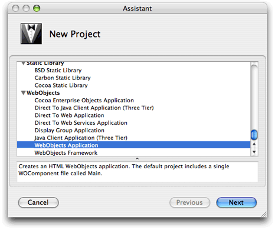
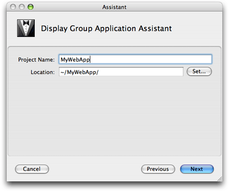
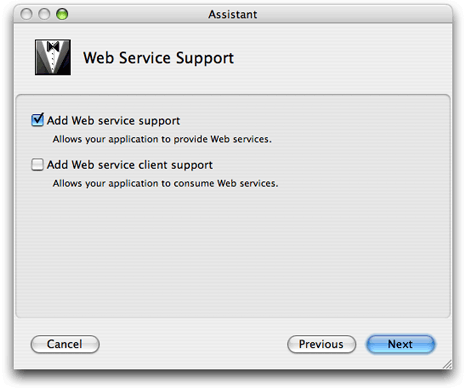
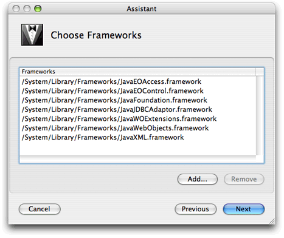
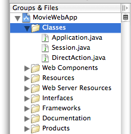
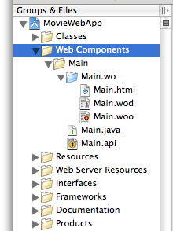

> 导航：[总目录](../../../README.md) · [documentation](../../../_indexes/documentation.md) · [WebObjects Web Applications Programming Guide](Introduction%20to%20WebObjects%20Web%20Applications%20Programming%20Guide.md)

[Next](Creating%20Enterprise%20Objects.md)[Previous](How%20Web%20Applications%20Work.md)

# Creating Projects

A WebObjects project contains all the files you need to build and run your application. You use Xcode to create a new WebObjects project. In Xcode, you select the appropriate WebObjects project template and an assistant guides you through the process of creating the project. The types of files added to your Xcode project and their organization depends on the Xcode template you choose. The organization of web applications—applications that generate dynamic HTML content—are very similar although the frameworks, targets, settings, and build configurations may differ slightly.

This article explains how to use Xcode to create web applications. This article describes the different templates, provides step-by-step instructions to create your project, explains the organization of files in the project, explains web application specific targets, and contains tips on building and installing your application. Read _Xcode 2.2 User Guide_ for complete instructions on how to use Xcode.

When you create a project in Xcode, you need to select the appropriate WebObjects template in the assistant. The templates that create a web application are Direct To Web Application, Display Group Application, and WebObjects Application. You can also select WebObjects Framework.

- Choose Direct To Web Application if you have an EO model you created earlier with either EOModeler or Xcode and want to build a quick prototype. This is a good choice for developers new to WebObjects.
- Choose Display Group Application if you have an EO model or intend to create one—that is, you want to populate your webpages with content from a back-end database—and you want to build custom web components.
- Choose WebObjects Application if you don't want to use Enterprise Objects.
- Choose WebObjects Framework if you want to create a framework. Typically, you select this template to create a framework containing your business logic—your enterprise objects and EO model—which can be reused in other types of applications such as Web Services. You can also create a framework of reusable web components.

If you want to create a Direct to Web or display group application, read [Creating Enterprise Objects](Creating%20Enterprise%20Objects.md#apple-f4xwc4dqnrsv64tfmyxwi33df52wszbpkridimbqgaztenzqfvjvomi) for how to create your EO model.

When you create a project from a template, the Xcode Assistant will guide you through the process by displaying a number of panes. The first few panes are the same for all types of web applications. The later panes may differ depending on the template you select. The default settings in the assistant will work for most applications. Typically, you just need to enter a project name and click the Next button and on the final pane, click Finish. Follow these general steps to create a web application. Read _[WebObjects Direct to Web Guide](../WebObjects%20Direct%20to%20Web%20Guide/Introduction%20to%20WebObjects%20Direct%20to%20Web%20Guide.md#apple-f4xwc4dqnrsv64tfmyxwi33df52wszbpkridgmbqgaytamjv)_ for details on using the Direct to Web Application template.

1. Launch Xcode located in `/Developer/Applications`.
2. Choose File > New Project.

   The Assistant panel appears displaying a list of templates.
3. Select one of the WebObjects templates and click Next as shown in Figure 1.

   Read [Choosing a Template](#apple-f4xwc4dqnrsv64tfmyxwi33df52wszbpkridimbqgaztenrzfvjvona) if you are not sure what template to use.

   __Figure 1__  Selecting a WebObjects template

   
4. Enter a project name and location and click Next as shown in [Figure 2](#apple-f4xwc4dqnrsv64tfmyxwi33df52wszbpkridimbqgaztenrzfvjvony). If you selected the WebObjects Framework template, click Finish and skip the remaining steps.

   __Figure 2__  Entering a project name

   
5. If you want to deploy your web application in a J2EE servlet container, select the "Deploy in a servlet container" option on the J2EE Integration pane and then click Next.

   J2EE integration is optional. Just click Next if you don't want to use this feature.
6. If your application is a web service, select "Add Web service support" on the Web Service Support pane. If your application uses a web service, click "Add Web services client support." Then click Next as shown in Figure 3.

   Using web services is optional. Just click Next if you don't want to use this feature.

   __Figure 3__  Adding web service support

   
7. If you use the JDBC adaptor, select `JavaJDBCAdaptor.framework` on the Choose EOAdaptors pane. If you use the JNDI adaptor, select `JavaJNDIAdaptor.framework`.

   The default database adaptor is JDBC since most modern databases support JDBC. Just click Next if you are unsure about which database you will use.
8. Click Add on the Choose Frameworks pane if you need to add additional frameworks to your project—for example, third-party database frameworks—as shown in Figure 4. Otherwise, click Next to continue.

   The assistant adds the appropriate Java and WebObjects frameworks to your project depending on the template you selected. Just click Next if you don't need to add any more frameworks.

   __Figure 4__  Choosing frameworks

   
9. Next you add an EO model by clicking Add on the Choose EOModels pane.

   If you have an existing EO model that you created using either EOModeler or Xcode, you can add it to your project now. If you selected the Direct to Web Application or Display Group Application template, then selecting an EO model is mandatory.
10. If you selected the Web Application template, click Finish and skip the remaining steps.
11. If you selected the Direct to Web Application template, then a few panes specific to Direct to Web appear. Read _[WebObjects Direct to Web Guide](../WebObjects%20Direct%20to%20Web%20Guide/Introduction%20to%20WebObjects%20Direct%20to%20Web%20Guide.md#apple-f4xwc4dqnrsv64tfmyxwi33df52wszbpkridgmbqgaytamjv)_ for how to create a Direct to Web application.
12. If you selected the Display Group Application template, then a few panes specific to configuring a display group appear.
13. Choose the main entity on the Choose the Main EOEntity pane. Select the entity that represents the root objects and click Next.
14. Choose a layout for the page on the Choose a Layout pane and click Next.
15. Choose the properties to display on the page similar to configuring a Direct to Web application on the Choose Attributes to Display pane. Click Finish when done.

When you click the Finish button, the Assistant panel closes and a project window opens containing all your application files. Read [Project Groups and Files](#apple-f4xwc4dqnrsv64tfmyxwi33df52wszbpkridimbqgaztenrzfvjvoni) for a description of your project files.

The groups and files displayed in Xcode are different depending on which WebObjects template you choose when creating a Xcode project. This section describes some of the groups that appear when you create a web application.

The Classes group contains Java classes that do not correspond to web components as shown in [Figure 5](#apple-f4xwc4dqnrsv64tfmyxwi33df52wszbpkridimbqgaztenrzfvjvomjq). Typically, this group contains `Application.java` , `Session.java` , and `DirectAction.java` . Classes that corresponding to web components are located in the Web Component group. For example, `Main.java` is located in `Web Components/Main`.

__Figure 5__  Classes group

The default classes in a WebObjects project are:

- `Application.java` is a subclass of WOApplication. The application object is automatically created when your application launches and corresponds to the application instance.
- `Session.java` is a subclass of WOSession. A session object is automatically created when a user makes a connection to your web application.
- `DirectAction.java` is a subclass of WODirectAction.

The Web Components group contains all the files pertaining to web components as shown in Figure 6. A web component represents a page, or part of a page, in your application. An application can have one or more web components. For example, every WebObjects application has at least one component called `Main` which appears in the Web Components group. The `Main` component implements the first page displayed by your web application.

__Figure 6__  Web components group

There's a folder for each web component in the Web Components group. A web component folder contains several files that specify the component's look and behavior. Each file has the same prefix but with different extensions. These are the files contained in a web component folder:

- A web component with a `.wo` extension that stores the layout of HTML elements and bindings to dynamic elements.
- A class file with a `.java` extension that implements the component's behavior. Each component is a subclass of WOComponent. Your class typically implements variables and methods that are bound to dynamic elements.
- An API file with a `.api` extension that contains the keys defined by a component that other components can bind to and the rules for binding the keys. WebObjects Builder uses these files to check if a reusable component is used correctly.

Typically, you edit a component using WebObjects Builder—just double-click a folder with a `.wo` extension to edit it in WebObjects Builder. However, you can sometimes edit these files directly if you understand the format. For example, these are the files in the `Main.wo` folder:

- `Main.html` is the HTML template for the component. This file contains HTML tags, just like any webpage; in addition, it can contain tags for dynamic elements.
- `Main.wod` is the declarations file that specifies bindings between the dynamic elements and variables or methods in your Java file.
- `Main.woo` is used to store information about display groups—for example, if your project accesses a database—and encodings for HTML templates. You rarely edit this file directly.

The Resources group contains files that are needed by your application at runtime, but which do not need to be in the web server's document root and hence will not be accessible to users. Resource files may include miscellaneous configuration files, EO model files, and icons.

The Web Server Resources group contains files, such as images and sounds, that must be under the web server's document root at runtime. When developing your application, you place these files in your project directory and add them to the project in the Web Server Resources group. When you build your project, Xcode copies the files in this group into the `WebServerResources` folder of your application wrapper.

The Frameworks group contains the frameworks you selected in the assistant when creating your WebObjects project, as well as the frameworks that Xcode adds to your project automatically.

A framework is a collection of classes and resources that multiple applications can use. By storing items such as components and images in frameworks, you can reuse them in multiple projects without having to create multiple copies.

Every WebObjects project includes several frameworks by default depending on the template you select in Xcode. A WebObjects application that uses Enterprise Objects contains these frameworks:

- `JavaEOControl.framework` corresponds to the _control layer_ in Enterprise Objects, which provides infrastructure for creating and managing enterprise objects.
- `JavaEOAccess.framework` corresponds to the _access layer_ in Enterprise Objects which, provides the data access mechanisms for the Enterprise Objects technology.

Read _[WebObjects Enterprise Objects Programming Guide](../WebObjects%20Enterprise%20Objects%20Programming%20Guide.md#apple-f4xwc4dqnrsv64tfmyxwi33df52wszbpkridgmbqgaytamjr)_ for more information about Enterprise Objects.

If you selected the JDBC adaptor to access your database, your project contains this framework:

- `JavaJDBCAdaptor.framework` provides an implementation of an Enterprise Objects adaptor for JDBC data sources.

A web application contains these frameworks:

- `JavaFoundation.framework` provides a set of robust and mature core classes, including utility, collection, key-value coding, time and date, notification, and debug logging classes.
- `JavaWebObjects.framework` contains the core web application server, session management, web component, and request-response loop classes.
- `JavaWOExtensions.framework` contains additional reusable web components.
- `JavaXML.framework` contains support for XML content—for example, contains Apache XML parsers.

A Direct to Web application contains these frameworks:

- `JavaDTWGeneration.framework` provides support for generating Direct to Web pages.
- `JavaDirectToWeb.framework` provides classes for rapid development of HTML-based web applications.
- `JavaEOProject.framework` provides services for WebObjects Builder—for example, returns the keys and actions from a web component Java file.

After you build your application, the Products group contains the application wrapper, which is a folder whose name is the project name with a `.woa` extension—for example, `MyWebApp.woa` if the project name is MyWebApp. The application wrapper has a structure similar to that of a framework. It contains the following:

- The executable application—for example, `MyWebApp`.
- The application's resources in the Contents group.

  The Resources group includes the application's web components as well as other files that are needed by your application at runtime.
- The application's web server resources in the Contents group. If your application has no web server resources, then the Web Server Resources group does not appear in the Contents group.

When you build and install your application, Xcode copies all the files from your Web Server Resources group to a folder called `WebServerResources` inside the application wrapper. If you have client-side Java components in your project, these are also copied to the `WebServerResources` folder.

The targets of a web application are:

- The application—for example, `MyWebApp`.
- `Application Server` builds the part of your application that creates web components and enterprise objects.
- `Web Server` sets up the resources that can be used by the HTTP server, such as images and QuickTime movies not stored in the database.

Building and running your web application is simple. Just select the application target and click the Build and Go button in Xcode. You use a web browser to run and test your application. For example, if you selected the Direct to Web template, your direct to web application is built and launched. Safari will also launch and connect to your application via the WebObjects application URL.

You may wish to install your application on your development machine for testing. Before installing or deploying your application, you should understand how a web server works and where files need to be installed.

Some files in a web application—for example, images and sound files—must be stored under the web server's document root in order for the server to access them. This is because the files are part of the dynamic HTML that the web server sends to web clients. The remaining files—for example, your components and source code—must be accessible by your application but not necessarily by the web server itself. Therefore, when you install or deploy a web application, your product files are split—those files needed by the web server are placed in the document root, and all other files are stored elsewhere. This type of installation is referred to as a _split install_.

[Next](Creating%20Enterprise%20Objects.md)[Previous](How%20Web%20Applications%20Work.md)

