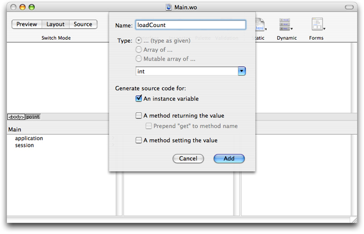
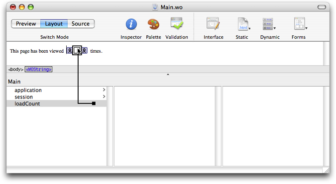
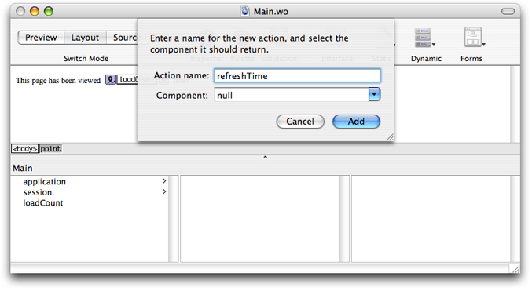

> 导航：[总目录](../../../README.md) · [documentation](../../../_indexes/documentation.md) · [WebObjects Web Applications Programming Guide](Introduction%20to%20WebObjects%20Web%20Applications%20Programming%20Guide.md)


[Next](Using%20the%20Application%20and%20Session%20Objects.md)[Previous](Creating%20Enterprise%20Objects.md)

# Creating Web Components

Web components are fundamental to how dynamic content works in WebObjects. Typically, you choose WebObjects if the information on your website changes frequently or varies based on some conditions. Examples of dynamic websites include online news, stores, polls and statistics. WebObjects is also ideal for any website that tracks user sessions and offers personal services such as authoring content and custom pages. Dynamic content can be tuned to user preferences and search criteria.

You use web components to represent webpages or partial webpages generated by your website. Web components are actually templates for generating HTML pages. Web components are constructed from static and dynamic elements. You use dynamic elements to bind HTML counterparts to variables and methods in your web component class. Some elements are abstract and are used just to control the generation of HTML—for example, conditionals and repetitions.

Although you can create a web application without using Enterprise Objects, typically, your website renders HTML pages that are populated with data obtained from your enterprise objects stored in a back-end database. Hence, web components behave similarly to controllers in the MVC design pattern by being the intermediary between the views (dynamic elements) and your models (enterprise objects). You can also use abstract elements and display groups—controllers that manipulate many enterprise objects—in interesting ways to create smart webpages.

Web components benefit from all the advantages of object-oriented systems. Web components are reusable, extensible, and maintainable. Web components can contain other web components–those that represent partial pages—as well as dynamic elements, static elements, and plain text. Any HTML tag can be added to a web component's HTML template.

Web components are folders you add to your Xcode project. Each folder contains an HTML, WOD, API and Java file. The HTML file represents the template, the WOD file contains the dynamic element bindings, the API file contains any bindings that your component exports, and the Java file is the class that implements controller logic. You add your controller logic—variables and methods—to the Java class using Xcode. You can edit the other files directly but typically, you use WebObjects Builder, a graphical editor, to design your web components. WebObjects Builder creates the files located in the web component folder.

This section describes how to reuse and extend web components from a Java programmer's perspective. For a complete guide on how to create web components graphically, read _[WebObjects Builder User Guide](../WebObjects%20Builder%20User%20Guide/Introduction%20to%20WebObjects%20Builder.md#apple-f4xwc4dqnrsv64tfmyxwi33df52wszbpkridimbqgazdgnbq)_.

If you use a back-end database to store your enterprise objects, you should create your EO Model first and then your Xcode project before you create web components. Read [Creating Enterprise Objects](Creating%20Enterprise%20Objects.md#apple-f4xwc4dqnrsv64tfmyxwi33df52wszbpkridimbqgaztenzqfvjvomi) to create an EO model and custom enterprise objects. Read [Creating Projects](Creating%20Projects.md#apple-f4xwc4dqnrsv64tfmyxwi33df52wszbpkridimbqgaztenrzfvjvomy) for how to create an Xcode project.

By default, every WebObjects application includes a Main component. This component, initially empty, is the first page displayed to users unless you specify otherwise. It is the tunnel or login page for the rest of your application.

For example, if you select the Web Applications template when creating your Xcode project, `Main.wo` appears in the Web Components group as shown in Figure 1. Double-click `Main.wo` to open the Main component in WebObjects Builder.

__Figure 1__  Web component files


Every web component contains a Java file that you use to add controller and business logic.

For example, if your Main component is a login page, it might contain a user and password field to allow the user to log in to your website, then you might have `username` and `password` variables to store the text that the user enters. You also need an action method when the user enters Return or clicks the Login button. You add these variables and methods to `Main.java` which is in the Web Components group, as shown in [Figure 1](#apple-f4xwc4dqnrsv64tfmyxwi33df52wszbpkridimbqgaztenzrfvjvomjq). Then you bind the dynamic elements, the WOTextField, WOPasswordField, and WOSubmitButton elements, to your variables and methods using WebObjects Builder.

Alternatively, you can add variables and methods to your component using WebObjects Builder which will edit the Java file for you.

Occasionally, you might need to edit one of the web component files directly. However, since these files are created by WebObjects Builder, you should be aware of their file formats before doing so. If you change the format of these files, the component may not validate or open in WebObjects Builder.

For example, suppose you create a main component using WebObjects Builder that contains a text string, "The current time is", followed by a WOString element that displays the current time. In addition, you bind the WOString element to the `currentTime` method in your main component that returns the current time. This information is stored in the web component's HTML and WOD files that you can view in Xcode.

The HTML file shown in Listing 1, contains a `WEBOBJECT` element that represents the location where the WOString inserts the value returned by the `currentTime` method. Notice that the element is defined as `<WEBOBJECT NAME=String1></WEBOBJECT>`. There's a corresponding entry in the WOD file that uses the same name, `String1`.

__Listing 1__  Sample HTML file

```
<BODY>
    The current time is <WEBOBJECT NAME=String1></WEBOBJECT>
</BODY>
```

The connection between the WOString element and the `currentTime` method is declared in the WOD file shown in Listing 2. The entry has only one binding listed, the connection between the `value` attribute and the `currentTime` method. This method is called whenever the WOString element needs to display its value. The WOD file can contain other element settings that do not appear in WebObjects Builder.

__Listing 2__  Sample WOD file

```
String1: WOString {
    value = currentTime;
}
```


When programming with web components, it helps to understand how dynamic elements work in the context of the request-response loop.

When you run a simple application that displays the current time on the main page as described in [HTML and WOD Files](#apple-f4xwc4dqnrsv64tfmyxwi33df52wszbpkridimbqgaztenzrfvjvony), the page displayed by the web browser replaces the WOString element you added to the Main component with the current time. If you reload the page, the time gets updated. WebObjects assembles the page dynamically during the request-response loop.

When you access the URL corresponding to your application in a web browser, the web server hands control to the _WebObjects adaptor_—a process that connects WebObjects application instances to web servers. This program goes through a couple of steps in generating the response:

1. Read the HTML file

   Much like a regular web server, WebObjects first reads an HTML file.
2. Render WebObjects elements

   Unlike a regular web server, WebObjects parses `WEBOBJECT` elements before handing the file to the web server.

   When WebObjects encounters a `WEBOBJECT` element, it consults the WOD file for the corresponding web component. All the `WEBOBJECT` elements in the HTML file of a web component template are named, and each one is listed by its name in the WOD file as shown in [Listing 2](#apple-f4xwc4dqnrsv64tfmyxwi33df52wszbpkridimbqgaztenzrfvjvona).

   Each type of WebObjects element has special logic for constructing the HTML code to return to the web server. Customization of this process is done with attributes defined by the web component’s developer. Each binding in a WOD file can be either static or dynamic. If a binding is static, the value supplied is used directly.

   If a binding is dynamic—that is, an attribute is bound to a method or instance variable—WebObjects invokes the method or accesses the instance variable to obtain the value at runtime. For example, when the WOString element is evaluated, it invokes the method named in its `value` binding, `currentTime`, to get the value to display. The implementation of WOString turns the NSTimestamp object into text that’s incorporated into the webpage returned to the web browser. Before returning the webpage to the browser, WebObjects converts the component’s HTML code shown in Listing 3 to a markup similar to the one shown in Listing 4.

   __Listing 3__  HTML code interpreted by WebObjects

```
<!DOCTYPE HTML PUBLIC "-//W3C//DTD HTML 3.2//EN">
<HTML>
    <HEAD>
        <META NAME="generator" CONTENT="WebObjects 5">
        <TITLE>Untitled</TITLE>
    </HEAD>
    <BODY>
        The current time is <WEBOBJECT NAME=String1></WEBOBJECT>
    </BODY>
</HTML>
```


   __Listing 4__  HTML code WebObjects sends to web browser

```
<!DOCTYPE HTML PUBLIC "-//W3C//DTD HTML 3.2//EN">
<HTML>
    <HEAD>
        <META NAME="generator" CONTENT="WebObjects 5">
        <TITLE>Untitled</TITLE>
    </HEAD>
    <BODY>
        The current time is 01:19:47 PM
    </BODY>
</HTML>
```

This process takes place each time a web browser requests the Main page. If you reload the page, the method is invoked again and a new time value is displayed.

For more information on the request-response loop, read [Request-Response Loop](How%20Web%20Applications%20Work.md#apple-f4xwc4dqnrsv64tfmyxwi33df52wszbpkridimbqgaztenryfvjvomjq).

Understanding the connection between a web component’s HTML, WOD, and Java files is an important part of WebObjects development. Not only do you add variables and methods to your component to bind dynamic elements, but you can also add variables and methods to maintain state of a component.

When you add methods to a component in WebObjects Builder, you are actually editing the component’s Java source file. When you modify how the component looks by adding elements, you modify its HTML file. When you bind dynamic elements to your component variables, you modify its WOD file.

Typically, after using WebObjects Builder to define the major parts of a web component, you can add details by editing the HTML and Java files directly (you rarely need to edit a WOD file). To edit the HTML file of a web component in WebObjects Builder, simply use the Source mode—click the Source button on the toolbar to use the HTML editor. You can edit the Java file using Xcode.

When you deploy your application and users connect to your website via a web browser, webpages are created from web components as needed. In programming terms, web components are all subclasses of WOComponent and instantiated as needed. For example, when the user requests the main component described in [HTML and WOD Files](#apple-f4xwc4dqnrsv64tfmyxwi33df52wszbpkridimbqgaztenzrfvjvony), a Main instance is created. When it’s time for WebObjects to add the content for the WOString, it looks up the element’s `value` binding in the WOD file. The `value` binding is set to the `currentTime` method. Therefore, WebObjects sends `currentTime` to the web component instance, which returns the current time.

An instance of a web component lives for at least two cycles of the request-response loop: In the first cycle the webpage is rendered, and in the second cycle the component determines which page to display next. If the page is not the same as the previous page, WebObjects creates an instance of the new component. The old component is then discarded or stored in a server cache to allow users to backtrack to previous pages. However, if the component to display is the same, the instance lives on. In this case, the previous version of the component is stored in the backtracking cache. Read [Backtracking and Cache Management](Backtracking%20and%20Cache%20Management.md#apple-f4xwc4dqnrsv64tfmyxwi33df52wszbpkridimbqgaztenztfvjvomi) for more information on backtracking.

Another way to use variables and methods in your Java source file is to maintain other state—for example, tracking user actions as they interact with your application.

The following sections show how to maintain state in your web component by implementing a simple web application that counts the number of times the main component is displayed by a single user. This example adds a counter and page refresh hyperlink to the main component. It uses the web component to maintain the state of the counter for the duration of the session.

Create a simple web application as follows:

1. Launch Xcode and choose File > New Project.
2. Select the WebObjects Application template and click Next.
3. Click Next on all the remaining assistant panes to select all the default values.
4. Click Finish on the final pane to create the project.

First you add a variable and code to the Main component to increment a counter each time the page is displayed.

1. Open `Main.wo` in WebObjects Builder by double-clicking it in Xcode.
2. Choose Add Key from the Interface menu on the toolbar of the `Main.wo` window.
3. Add a key of type `int` named `loadCount` and click the Add button as shown in Figure 2.

   __Figure 2__  Adding a key

   
4. Examine the `Main.java` file in Xcode to confirm that the variable was added. Modify the code to initialize `loadCount` to `1` as shown in Listing 5:

   __Listing 5__  Adding a variable

```
public class Main extends WOComponent {
        public int loadCount = 1;

    public Main(WOContext context) {
        super(context);
    }
}
```


Next you use the variable to display the number of times the page is loaded. To display the load count in the webpage, you need to add a WOString element to the Main component using WebObjects Builder.

1. Add a label and a WOString element to `Main.wo`.

   1. Enter `This page has been viewed`.
   2. Add a space and a WOString element to the right of the label.
   3. Add a space and `times.` to the right of the WOString element.
2. Drag from `loadCount` in the object browser to the WOString element to bind it to the `value` attribute of the WOString element as shown in Figure 3.

   __Figure 3__  Binding a WOString

   

Now, you need to add a way to reload the page using a hyperlink.

In WebObjects, regular hyperlinks, WOHyperlink elements, can call web component methods—methods defined in the component’s Java source file. These methods are called _action methods_. All action methods return a web component representing the next page. If an action method returns `null`, then the same page is redisplayed. Action methods are covered in greater detail in [Processing the Request](How%20Web%20Applications%20Work.md#apple-f4xwc4dqnrsv64tfmyxwi33df52wszbpkridimbqgaztenryfvjvonq).

Follow these steps to add a `refreshTime` action method:

1. Add the action method.

   Open the Main component template in WebObjects Builder and choose Add Action from the Interface menu on the toolbar.

   1. Name the action `refreshTime`.
   2. Select `null` from the Component pop-up menu as shown in Figure 4.

      The value returned by an action method represents the next page (web component) to be displayed. When you return `null`, the current page is redrawn.

      __Figure 4__  Adding an action

      
   3. Click Add.
2. Add a hyperlink.

   Position the cursor below the line where the load count is displayed.

   Choose Dynamic > WOHyperlink.

   By default, the text for a new link is `Hyperlink`. You can replace this by selecting the text and typing something more appropriate over it, such as `Refresh Time`.
3. Connect the `refreshTime` method to the WOHyperlink element.

   Much like a WOString element, a WOHyperlink element has several attributes. Bind the `refreshTime` method to the `action` attribute of WOHyperlink.

   Drag from the `refreshTime` method in the Main list to the WOHyperlink element. When you release the mouse button, a pop-up list of attributes appears. Choose the `action` attribute to indicate that you want the `refreshTime` method called when the link is clicked.
4. Save `Main.wo`.

Finally, modify the `refreshTime` method using Xcode so that it increments the `loadCount` variable each time it is invoked as shown in Listing 6.

__Listing 6__  Implementing an action method

```
public WOComponent refreshTime() {
    loadCount++;
    return null;
}
```


If you build and run the application created in [Example: Displaying the Page Count](#apple-f4xwc4dqnrsv64tfmyxwi33df52wszbpkridimbqgaztenzrfvjvomjs), and click Refresh Time, the time and the load count are updated. The load count increments every time a specific user displays the page. This is accomplished using the Session object, an object that represents a connection between an application and a particular client.

Each time the user clicks the hyperlink WebObjects creates a Main object and associates it with your web browser window through a session object. Each time you interact with the application, by clicking Refresh Time, the same Main object is used. If you open another browser window and connect to the application again using the URL shown in Xcode’s Run pane, a separate instance of Main is created and associated with that window. From then on, you can work with both windows individually. As a matter of fact, not only is a new instance of Main created, a new Session object is created as well.

WebObjects determines that a new session needs to be created when the incoming URL does not contain a session ID. The first time you connect to the application using a URL like the one in Listing 7, WebObjects creates a session and assigns it a session ID and other information. That information is added to the URL returned to your browser together with the webpage to be displayed (see Listing 8). When you send another request from your browser—for example, by clicking Refresh Time—WebObjects uses the session ID encoded in the URL to locate the session that will process the request. This is the default mechanism WebObjects uses to keep track of the state of each user.

For more on managing state using application and session objects, read [Using the Application and Session Objects](Using%20the%20Application%20and%20Session%20Objects.md#apple-f4xwc4dqnrsv64tfmyxwi33df52wszbpkridimbqgaztenzsfvjvomq).

__Listing 7__  URL that causes the instantiation of a Session object

```
http://foo.com:49361/cgi-bin/WebObjects/WebApp
```


__Listing 8__  URL with session ID

```
http://foo.com:49361/cgi-bin/WebObjects/WebApp.woa/wo/whcV5sauLNtG8Tfh6xCuvM/0.1
```

[Next](Using%20the%20Application%20and%20Session%20Objects.md)[Previous](Creating%20Enterprise%20Objects.md)

