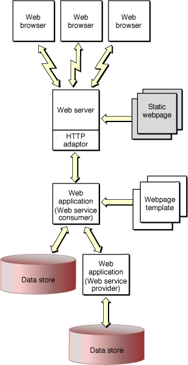
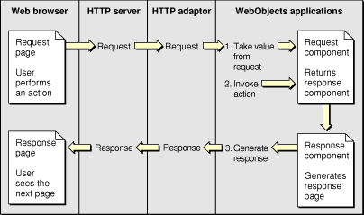

> 导航：[总目录](../../../README.md) · [documentation](../../../_indexes/documentation.md) · [WebObjects Web Applications Programming Guide](Introduction%20to%20WebObjects%20Web%20Applications%20Programming%20Guide.md)


[Next](Creating%20Projects.md)[Previous](Introduction%20to%20WebObjects%20Web%20Applications%20Programming%20Guide.md)

# How Web Applications Work

_Web applications_ generate dynamic HTML-based webpages accessed through a web browser. Since WebObjects applications are object-oriented and written in Java, your application generates webpages by creating instances of objects called web components.

A _web component_ is a combination of a Java subclass of WOComponent and an HTML template. Web components can contain any standard HTML elements and components including Flash animations, QuickTime movies, JavaScript programs, and Java applets. Web components also support Cascading Style Sheets (CSS).

You add dynamic content to your webpages by adding special WebObjects elements with HTML counterparts—called _dynamic elements_—to your web components. Some dynamic elements don't have HTML counterparts and are just used to control the generation of content—for example, content that is conditional or iterative. Dynamic elements are translated into static HTML when responding to client browser requests.

You can use either WebObjects Builder or Direct to Web to construct web components. _WebObjects Builder_ is a graphical tool for creating web components and binding dynamic elements to variables and methods in your application.

_Direct to Web_ is a rapid prototyping tool that creates a working web application from a given EO model. You use the Web Assistant to change the content of Direct to Web components. You can also freeze pages—create and add web components to your project—and modify them using WebObjects Builder.

You should have a basic understanding of the architecture of a web application before customizing your web application. This section describes the architecture of web applications and explains how dynamic elements work within the context of the application's request-response loop. It contains a brief description of the sequence of methods invoked when processing a request and generating a response page. This section also explains how backtracking works in WebObjects.

This document does not explain how to use the various WebObjects tools. Read _[WebObjects Builder User Guide](../WebObjects%20Builder%20User%20Guide/Introduction%20to%20WebObjects%20Builder.md#apple-f4xwc4dqnrsv64tfmyxwi33df52wszbpkridimbqgazdgnbq)_ for the steps involved in creating forms and binding dynamic elements. Read _[WebObjects Direct to Web Guide](../WebObjects%20Direct%20to%20Web%20Guide/Introduction%20to%20WebObjects%20Direct%20to%20Web%20Guide.md#apple-f4xwc4dqnrsv64tfmyxwi33df52wszbpkridgmbqgaytamjv)_ for how to use Direct to Web.

Not only can your web application generate dynamic content but you can present forms to the user allowing them to author content. You obtain input from users using HTML-based forms, buttons, and other dynamic elements. Connecting form elements to variables and methods in your web component is similar to binding other dynamic elements that just display content.

You create forms by placing dynamic elements into a standard form element in your web component. The web component generates HTML that web browsers can interpret and display. This process includes translating user-entered data or selections back into variables in your application. If you are programming web components, it helps to understand how web applications process user input.

WebObjects applications are event driven, but instead of responding to mouse and keyboard events, they respond to HTTP (Hypertext Transfer Protocol) requests. The application receives an HTTP request for an action, responds to it, and then waits for the next request. The application continues to respond to requests until it terminates. The main loop that handles these requests is called the _request-response loop_.

Inside the request-response loop, WebObjects fills in the content of dynamic elements when the page needs to be generated in response to a request. The information your applications publish can reside in a database or other data-storage medium or it can be generated at the time a page is accessed. The pages are also highly interactive—you can fully specify the way the user navigates through them and what data they can view and modify.

Figure 1 shows a WebObjects-based website. Again, the request (in the form of a URL) originates from a web browser. The web server detects that the request should be handled by a WebObjects application and passes the request to an HTTP adaptor. The adaptor packages the incoming request in a form the WebObjects application can understand and forwards it to the application. Based upon web components you define and the relevant data from the data store, the application generates a webpage that it passes back through the adaptor to the web server. The web server sends the page to the web browser, which renders it.

This type of WebObjects application is referred to as a _web application_, since the result is a series of dynamically generated HTML webpages.

__Figure 1__  A dynamic publishing website



Each action taken by a user is communicated to your application via the web server and the WebObjects adaptor. All the pertinent details of the user’s action—the contents of text fields, the state of radio buttons and checkboxes, and the selections in pop-up menus—as well as information about the session and the button or link activated is encoded in the HTTP request.

The request is decoded by the action of the WebObjects adaptor and default application behavior. This decoding process, which culminates in the generation of a response page to be returned to the web browser, constitutes the request-response loop. Figure 2 shows the sequence of messages invoked when processing a request.

__Figure 2__  The request-response loop



WebObjects has two request-processing models: component actions and direct actions.

- The __component actions__ model allows you to maintain state in applications; therefore, it requires and uses session objects. By default, web applications use this model.
- The __direct actions__ model is used by applications that don’t require state management—for example, search engines, product catalogs, document libraries, and dynamic publishing. Applications that use this model don’t have session objects by default.

When developing an application, you are not restricted to one request-processing model. Applications can use the model most appropriate to implement specific features. Component actions are generally useful in web applications with interconnected components; however, they do not give the user a great deal of control over an application’s flow. For example, a user cannot directly execute a method defined in the Java source file of a web component. Direct actions, on the other hand, are better suited at providing users such access. For example, using the appropriate URL, users can execute specific methods of an application.

Refer to the API documentation for the WODirectAction class in _WebObjects 5.3 Reference_. This article explains component actions in more detail.

When you deploy a web application and access it from a web browser, the URL displayed by the browser has a specific format that identifies the web application, page, session, context, and even the element. Figure 3 shows the parts of the URL. The URL contains all the information necessary for an application to reconstruct the state of the session and web components that were last generated for a given client. Listing 1 shows an example of a component action URL.

__Figure 3__  Structure of a component action URL


__Listing 1__  Example of a component action URL

```
http://foo.com:49663/cgi-bin/WebObjects/TimeDisplay.woa/wo/NDdW3uF2xRVjvbXUgRCVM/0.5
```


Table 1 lists the phases of the request-response process. Table 2 shows the order in which the methods involved are invoked. The process is explained in detail in [Processing the Request](#apple-f4xwc4dqnrsv64tfmyxwi33df52wszbpkridimbqgaztenryfvjvonq) and [Generating the Response](#apple-f4xwc4dqnrsv64tfmyxwi33df52wszbpkridimbqgaztenryfvjvony). The primary objects that receive messages from the request-response loop are the application, session, and web component objects.

The _application object_ is an instance of Application where Application is a subclass of WOApplication. A _session object_ is an instance of Session where Session is a subclass of WOSession. An instance of Application is created when your application launches, and an instance of Session is created for each initial user. Note that sessions may time out. You can configure the time out duration when deploying an application.

If you select one of the web applications templates in Xcode when creating a project, Application and Session classes are automatically added to your project. Read [Creating Projects](Creating%20Projects.md#apple-f4xwc4dqnrsv64tfmyxwi33df52wszbpkridimbqgaztenrzfvjvomy) for how to create a WebObjects Xcode project.

__Table 1__  Request-response processing phases

| Phase | Method | Description |
| Awake | `public void awake()` | The application, session, and component objects are awakened. Custom initialization logic can be added in this phase. |
| Sync | `public void takeValuesFromRequest (WORequest, WOContext)` | Form data is read into the instance variables the WebObjects elements are bound to. Key-value coding set methods are invoked. |
| Action | `public WOActionResults invokeAction (WORequest, WOContext)` | The action the user triggered—with a link or a submit button—is performed. The action could create a new page. |
| Response | `public void appendToResponse (WOResponse, WOContext)` | The response page is generated. The form elements’ contents are set to the values stored in the instance variables the WebObjects elements are bound to. Key-value coding accessor methods are invoked. |
| Sleep | `public void sleep()` | The application, session, and component objects are put to sleep. Custom deactivation logic can be added in this phase. |

__Table 2__  Request-response processing timeline

| Application | Session | Component |
| `awake` |  |  |
|  | `awake` |  |
|  |  | `awake` |
| `takeValuesFromRequest` |  |  |
|  | `takeValuesFromRequest` |  |
|  |  | `takeValuesFromRequest` |
|  |  | Set methods invoked. |
| `invokeAction` |  |  |
|  | `invokeAction` |  |
|  |  | `invokeAction` |
| `appendToResponse` |  |  |
|  | `appendToResponse` |  |
|  |  | `appendToResponse` |
|  |  | Accessor methods invoked.  Response page generated. |
|  |  | `sleep` |
|  | `sleep` |  |
| `sleep` |  |  |

Request processing takes place in three stages: awake, sync, and action.

- __Awake__. This stage is carried out when WebObjects sends `awake` messages to several objects.

  In a multi-user system, limited resources need to be used as efficiently as possible. To this end, applications are active only while they perform a task. A single server can be running several applications or many instances of the same application. Application instances are active only while processing requests. See [Generating the Response](#apple-f4xwc4dqnrsv64tfmyxwi33df52wszbpkridimbqgaztenryfvjvony) for more information.

  The application object’s `awake` method is invoked first, then the session object’s `awake` method, and, for component action–based requests, the web component’s `awake` method. You can customize the method in each of the corresponding classes to add logic that needs to be performed before processing the request. Even though the default implementations of these `awake` methods do nothing, you should invoke the superclass implementation before executing custom logic, as here:


```
public void awake() {
    super.awake();

    /* Custom logic goes here. */
}
```
- __Sync__. During this stage, the `takeValuesFromRequest` method is invoked, which causes the values entered in form elements by the user to be copied into the corresponding instance variables. This stage is skipped if the component contains no form elements or if the values of the form elements are not changed.

  WebObjects invokes the application object’s `takeValuesFromRequest` method. The application then invokes the session object’s corresponding method, which in turn invokes the web component’s method (for component action–based requests). The component invokes each dynamic element’s `takeValuesFromRequest` method, which causes form elements to copy the values from the request into the appropriate component bindings. WebObjects uses key-value coding—implemented by the NSKeyValueCoding interface in (`com.webobjects.foundation`—to determine how to set the value of the binding.

  To set the value of a key named `key`, key-value coding looks for an available set method or an instance variable in the following order:

  1. `public void setKey()`
  2. `private _setKey()`
  3. `_key`
  4. `key`
- __Action__. During this stage, the action the user chose is executed by invoking the `invokeAction` method.

  Like the `takeValuesFromRequest` method, WebObjects invokes the application’s `invokeAction` method. The application then invokes the session’s method, which in turn invokes the web component’s method (for component action–based requests). The component then sends `invokeAction` to each of its dynamic elements.

  When the `invokeAction` method of the dynamic element that triggered the request is invoked—for example, a submit button—the dynamic element sends the message bound to its `action` attribute.

After the form values are gathered and the action method is invoked, the application creates a response page. This is the web component returned by the action method. The response-generation process has two phases: response and sleep.

- __Response__. The response page is generated during this phase. Each dynamic element’s `appendToResponse` method is invoked, so that it can add its content to the rendered webpage.

  WebObjects invokes the application’s `appendToResponse` method. Then the application invokes the session’s method, which in turn invokes the web component’s method. The component goes through its HTML code creating the page’s content. When it finds a `WEBOBJECT` element, it invokes its `appendToResponse` method, so that it can get the values of its bindings and add the resulting content to the page. The process continues recursively until the entire response page is generated.

  Again, WebObjects uses key-value coding when a variable needs to be accessed or set. When the value of a key named `key` is requested, key-value coding first looks for an accessor method. If one is not found, it accesses the instance variable itself. The order in which key-value coding tries to obtain the value for `key` is as follows:

  1. `public [...] getKey()`
  2. `public [...] key()`
  3. `private [...] _getKey()`
  4. `private [...] key()`
  5. `[...] _key`
  6. `[...] key`
- __Sleep__. When the response process is completed, the `sleep` methods of the web component, session, and application objects are invoked. (The order in which the objects’ `sleep` method is called is the opposite of the order in which the `awake` methods are invoked in the awake phase.) When overriding the `sleep` method, you should incorporate the superclass implementation at the end of the method as shown in Listing 2. After all the objects involved in the request-response process are put to sleep, the new page is sent to the WebObjects adaptor.

  __Listing 2__  Overriding the `sleep` method

```
public void sleep() {
    /* Custom logic goes here. */

    super.sleep();
}
```


WebObjects supports the use of a web browser’s Back button by keeping a cache of recently viewed pages on the server. This process is called _backtracking_. By default, a cache is configured to hold 30 pages per session, but you can customize it to meet your needs. To change the default size of the cache, add code to the Application class’s constructor. For example, to change the page cache size to 45 pages, you add this code line:

```
setPageCacheSize(45);
```

When a response page is generated, it and its state information are added to the cache. That way, when the user clicks the browser’s Back button, WebObjects can retrieve the correct web component and its state.

For backtracking to work properly with dynamic data, a web browser’s own cache must be disabled, so that all page requests go to the web server and, therefore, your application. You can do this by adding this code to the Application class’s constructor method:

```
setPageRefreshOnBacktrackEnabled(true);
```

When the cache becomes full, the oldest page in it is discarded to make room to store a new page. When the user backtracks past the oldest page in the cache, WebObjects alerts the user with a special webpage.

For more information on backtracking, read [Backtracking and Cache Management](Backtracking%20and%20Cache%20Management.md#apple-f4xwc4dqnrsv64tfmyxwi33df52wszbpkridimbqgaztenztfvjvomi).

[Next](Creating%20Projects.md)[Previous](Introduction%20to%20WebObjects%20Web%20Applications%20Programming%20Guide.md)

