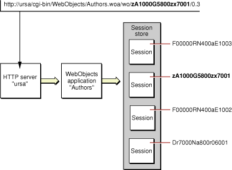

> 导航：[总目录](../../../README.md) · [documentation](../../../_indexes/documentation.md) · [WebObjects Web Applications Programming Guide](Introduction%20to%20WebObjects%20Web%20Applications%20Programming%20Guide.md)


[Next](Backtracking%20and%20Cache%20Management.md)[Previous](Creating%20Web%20Components.md)

# Using the Application and Session Objects

The web—by its nature—is a stateless medium. A web server receives a request, produces a response, and returns it to the requesting web browser—without any knowledge of previous requests from the same user.

A web application, however, can maintain state between requests from the same user to provide an acceptable user experience. For example, many websites allow you to purchase items using a shopping cart. Such applications have to remember the contents of your shopping cart as you navigate the website. WebObjects encodes a unique identifier with each incoming request. This identifier is used to maintain state over an otherwise stateless medium. Read [How Web Applications Work](How%20Web%20Applications%20Work.md#apple-f4xwc4dqnrsv64tfmyxwi33df52wszbpkridimbqgaztenryfvjvomi) for more information on responding to requests.

While you can pass information back and forth between web components, you frequently need to maintain state that is shared between web components. Rather than pass this information from web component to component, you can store it at a higher level per application or per session.

When you create your application using one of the web application Xcode templates, `Application.java` is added to your project. Application is a subclass of WOApplication. WebObjects instantiates an Application object at startup. Every web component in your application has a relationship to this Application object—send `application()` to a web component to get the Application object programmatically. The application and session objects also appear in the object browser in WebObjects Builder so that you can bind dynamic elements directly to their properties.

You can override methods inherited from WOApplication to customize the behavior of your web application. For example, you can invoke WOApplication methods from the initializer to change the default behavior of backtracking (read [Backtracking and Cache Management](Backtracking%20and%20Cache%20Management.md#apple-f4xwc4dqnrsv64tfmyxwi33df52wszbpkridimbqgaztenztfvjvomi) for details).

You can also add variables and methods to the Application class to store objects and add business logic that you want to share between sessions and web components. For example, any objects that are read-only and shared by sessions, can be stored in the Application object to improve performance.

However, use the EOSharedEditingContext, not the Application class, if you want to share enterprise objects. See _[WebObjects Enterprise Objects Programming Guide](../WebObjects%20Enterprise%20Objects%20Programming%20Guide.md#apple-f4xwc4dqnrsv64tfmyxwi33df52wszbpkridgmbqgaytamjr)_ and _[EOModeler User Guide](../EOModeler%20User%20Guide/Introduction%20to%20EOModeler%20User%20Guide.md#apple-f4xwc4dqnrsv64tfmyxwi33df52wszbpkridgmbqgaytamjy)_ for how to configure a fetch specification in your model that places enterprise objects in the shared editing context.

A _session_ is a period of time in which one user interacts with your application. Since each application can have multiple users simultaneously, it may have multiple open sessions. Each session has its own data and its own cached copies of the components that the user requests, as shown in Figure 1.

__Figure 1__  Relationship between application and session



The session is represented as an instance of the Session class (`Session.java` in a WebObjects application project). Session is a subclass of WOSession. Initially, Session has only inherited behavior, but you can add custom methods and variables. For example, if you are building an online shopping application, the session would be an appropriate place to store a user’s shopping cart, because the session is tied to one particular user and persists as long as the user utilizes the application.

When an incoming request is processed, WebObjects automatically activates the Session object associated with the user who originated the request, as described in [Request-Response Loop](How%20Web%20Applications%20Work.md#apple-f4xwc4dqnrsv64tfmyxwi33df52wszbpkridimbqgaztenryfvjvomjq).

The WOComponent class includes a method for accessing the currently active session. The Java classes of web components are subclasses of WOComponent and WebObjects automatically activates the correct session when a request is processed. Sending the `session()` message to a WOComponent object returns the Session object for the current user.

If you are implementing an online store then your users need a shopping cart to store their purchases before they checkout. Since a shopping cart belongs to a single user and is only valid during the lifetime of a session, it is reasonable to store the shopping cart in the Session object. For example, the Pet Store example located in `/Developer/Examples/JavaWebObjects/PetStoreWOJava` adds `currentAccount` and `cart` attributes to the Session class as shown in [Listing 1](#apple-f4xwc4dqnrsv64tfmyxwi33df52wszbpkridimbqgaztenzsfvjvomy).

__Listing 1__  Pet Store Session Class

```
public class Session extends WOSession {

    Account account;
    Cart cart;

    public Session() {
        super();
        cart = new Cart();
    }

   public Account currentAccount() {
       return account;
   }

   public void setCurrentAccount(Account newAccount) {
       account = newAccount;
   }

    public Cart cart() {
        return cart;
    }
}
```

[Next](Backtracking%20and%20Cache%20Management.md)[Previous](Creating%20Web%20Components.md)

