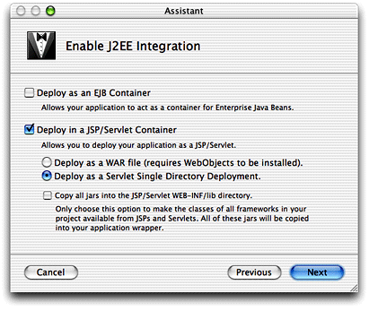

> 导航：[总目录](../../README.md) · [documentation](../../_indexes/documentation.md)


# What’s New in WebObjects 5.2

This document describes the major new features of WebObjects 5.2 and describes the most significant bug fixes and enhancements to the product.

This release includes significant changes and enhancements to Enterprise Objects and Java Client, includes enhancements to application deployment, adds support for streaming HTTP requests and responses, and adds custom bootstrap classes to help with long command path problems on Windows.

It is divided into these sections:

- [Web Services](#apple-f4xwc4dqnrsv64tfmyxwi33df52wszbpkridimbqgaydsnrwfuys2qscindeussfii)
- [Servlet Single Directory Deployment](#apple-f4xwc4dqnrsv64tfmyxwi33df52wszbpkridimbqgaydsnrwfuys2q2iirfeercfie)
- [Launch Architecture](#apple-f4xwc4dqnrsv64tfmyxwi33df52wszbpkridimbqgaydsnrwfuys2q2iircuiqsdiy)
- [Streaming File Uploads](#apple-f4xwc4dqnrsv64tfmyxwi33df52wszbpkridimbqgaydsnrwfuys2q2iirceer2bje)
- [Enterprise Objects](#apple-f4xwc4dqnrsv64tfmyxwi33df52wszbpkridimbqgaydsnrwfuys2q2iircucschiy)
- [Database Support](#apple-f4xwc4dqnrsv64tfmyxwi33df52wszbpkridimbqgaydsnrwfuys2qscinduqrsiiy)
- [Java Client](#apple-f4xwc4dqnrsv64tfmyxwi33df52wszbpkridimbqgaydsnrwfuys2q2iircuir2hji)

WebObjects allows you to provide and consume Web services, which simplify the development of distributed applications. Web services provide an implementation-independent way for applications to communicate with each other. Based on Simple Object Access Protocol (SOAP), Web services can be used across multiple platforms, including Microsoft’s .NET environment. A Web service is composed of operations, which are similar to the methods of a Java class (in WebObjects, that’s exactly what they are). For example, a company could develop a Web service that provides the current stock price for a specific stock symbol.

WebObjects also includes a rapid development approach to Web service development called Direct to Web Services, which allows you to create a Web service that lets its clients access data in your data store by invoking Web service operations.

For more information on Web services in WebObjects, see _Inside WebObjects: Web Services_ at [http://developer.apple.com/documentation/WebObjects](https://developer.apple.com/documentation/WebObjects).

WebObjects 5.1 added support for deploying WebObjects applications in J2EE servlet containers. However, this support still required the presence of the WebObjects deployment runtime on the J2EE server. The new Servlet Single Directory Deployment (SSDD) feature of WebObjects 5.2 removes this requirement.

Now, you can deploy a WebObjects application into a single, self-contained directory in a supported J2EE servlet container. The self-contained directory contains the application’s `.woa` and all the frameworks the application requires. This feature does not affect WebObjects applications that are deployed with the WebObjects application server (Monitor and wotaskd). That is, this feature doesn’t provide a facility to the WebObjects application server to deploy applications in a single, self-contained directory.

Many J2EE containers support the deployment of servlet applications in a directory rather than in a `.war` file. The directory is an expanded `.war` file and has the same name as the `.war` file minus the extension.

When you build an application for deployment in a servlet container, you can choose to build it as a SSDD. When you choose this option, rather than build a `.woa` directory and a separate `.war` file, the build script creates a new directory with the same name as the application and copies the application’s `.woa` and any frameworks on which it depends inside the directory.

When the application runs in the container, a custom class loader loads the WebObjects classes from the `.woa` and the frameworks that are inside the SSDD directory. This removes the requirement of the WebObjects runtime to be installed on the J2EE application server.

The Project Builder and ProjectBuilderWO setup assistants for all types of WebObjects applications now allow you to choose SSDD deployment when creating a new project. Simply choose Deploy as a Servlet Single Directory Deployment in the Enable J2EE Integration window in the assistant, as shown in Figure 1-1.

__Figure 1-1__  Choose SSDD when creating a project



To enable SSDD for existing projects, add a build setting or makefile variable named `SERVLET_SINGLE_DIR_DEPLOY` with the value of `YES`. You must also add a build setting or makefile variable named `SERVLET_SINGLE_DIR_DEPLOY_LICENSE` with a value that is a valid WebObjects deployment key.

A servlet single directory deployment directory is organized like this:

- `MyApp/`

  - `Extensions/`
  - `LICENSE` (the deployment license agreement)
  - `Library/`

    - `Frameworks/` (copies of all the required frameworks)
  - `classes/`
  - `lib/`
  - `MyApp.woa/` (copy of the `.woa`)
  - `tlds/`
  - `web.xml`

The content requirements of the `web.xml` file are different for an application deployed with SSDD. The variables `WOROOT`, `LOCALROOT`, and `WOAINSTALLROOT` are not necessary. In their place, the classpath is specified by `WEBINFROOT`, which is calculated at runtime to be the directory from which the WebObjects application is running.

SSDD has been tested with Tomcat 3.x and Tomcat 4.0.x on Mac OS X and with WebLogic 7.x on Windows and Solaris. While WebSphere is now supported as a deployment platform on Windows, SSDD does not work with WebSphere, so you must deploy the `.war` file and install the WebObjects runtime manually.

The class WOBootstrap has been added to help WebObjects applications launch. It uses a custom class loader to dynamically load `.jar` files into WebObjects applications. It was primarily implemented to solve the long command path problem on Windows. It loads `.jar` files from a new WebObjects Extensions directory.

The new bootstrap class enables a new WebObjects Extensions directory. On Windows and Solaris, its path is `$NEXT_ROOT/Local/Library/WebObjects/Extensions/`. On Mac OS X, its path is `/Library/WebObjects/Extensions/`. Any `.jar` files in this directory will be loaded dynamically by the WOBootstrap class at runtime. Classes in those `.jar` files are loaded by the same class loader that loads the WebObjects classes (all the WebObjects frameworks as well as the application’s classes and frameworks). This solves a lot of class loader–related issues in WebObjects applications.

It is recommended that WebObjects-specific `.jar` files from the ThirdPartyJars directory that were previously placed in the Java extensions directory (`/Library/Java/Extensions/` on Mac OS X) be placed instead in the WebObjects Extensions directory. There are two exceptions to this recommendation.

If you installed WebObjects Developer on Mac OS X, the JDBC and JTA drivers should still be placed in `/Library/Java/Extensions/`. If you have WebObjects Developer installed on Windows, the JDBC driver needs to be installed in a location specified in `JavaConfig.plist`. Note that the Windows JDBC driver for WebObjects Development must be the Java 1.1.8 version, not the 2.0 version.

One benefit of the launch architecture changes is that launch scripts are greatly simplified. Since the classpath is now generated at runtime and passed to the custom class loader, the classpath for the launch script is minimal. In most cases, the `-classpath` flag in the launch script is

```
-classpath WOBootstrap.jar
```

This should alleviate problems relating to argument length restrictions when launching WebObjects applications on Windows.

WebObjects applications deployed in J2EE servlet containers also take advantage of the new launch architecture. The servlet adaptor dynamically loads classes in the WebObjects Extensions directory at runtime.

If deployed as a Servlet Single Deployment Directory, the WebObjects application includes an Extensions directory in the `WEB-INF` directory that has a copy of all the `.jar` files in the WebObjects Extensions directory at compile time. SSDD uses `.jar` files in the application-specific Extensions directory (the one in the `WEB-INF` directory in the application’s directory) in preference to `.jar` files in the global Extensions directory (in `/Library/WebObjects/Extensions/`).

Note that the WebObjects Extensions directory exhibits a loading behavior different from that of the `WEB-INF/lib` and `WEB-INF/classes` directories. Classes in those directories are loaded in a parent of the class loader that loads all the WebObjects classes. Classes in either WebObjects Extensions directory are loaded by the same class loader that loads all of the WebObjects classes.

Existing Project Builder applications can take advantage of the new launch architecture by simply adding a compiler setting and rebuilding. First choose Edit Active Target from the Project menu. Look for the Java Compiler Settings item and add this flag to the Other Java Compiler Settings text area:

```
-extdirs /Library/WebObjects/Extensions:/Library/Java/Extensions:/System/Library/Java/Extensions:/System/Library/Frameworks/JavaVM.framework/Home/lib/ext
```

Existing ProjectBuilderWO applications need only be rebuilt to take advantage of the new launch architecture.

A long-requested feature of WebObjects is the ability to stream HTTP request and response content. This is a useful feature for applications in which users upload or download megabytes of data in a single request or response. Other benefits of this feature include a greatly reduced memory footprint for all sizes of file uploads.

This feature allows you to get the raw content of an HTTP request as a `java.io.InputStream` object. You can also easily stream raw data back to the client. The HTTP adaptors support this feature as do applications that run in servlet containers.

This feature required new API and new bindings on some of the dynamic elements. This means that parts of existing applications must be rewritten to take advantage of this feature.

WORequest objects are now backed by a `java.io.InputStream` object that represents their content. However, because of the design of the WebObjects frameworks, in most cases all of the content of a stream is read into memory before it is parsed. It is possible to get the raw data of a request as an InputStream (thus avoiding the memory overhead), however, but this requires using the StreamActionRequestHandler (`wis`) with a direct action.

WOResponse content can also be backed by an InputStream object representing their content. However, when you use an InputStream, you must not use the regular content-managing methods. The reverse is also true. If you use an InputStream, only the contents of the InputStream are returned to the client. The WebObjects frameworks do not use an InputStream to return content to the client because of their design. See the revised FileUpload example for an example of streaming a potentially large file to the client.

The behavior of the `formValues` method depends on the content being transmitted. For nonstreaming content, its behavior is unchanged from previous versions of WebObjects. However, in the case where the content is `multipart/form-data`, its behavior is as follows.

On each call to the `formValues` method (implicit or explicit), the `multipart/form-data` is parsed until the first unfinished file upload. An unfinished file upload is one in which the NSData representing the file contents have not been used or looked at. As soon as the NSData is touched, the file is read into memory and the upload is considered finished.

Once an unfinished upload is reached, it places the information related to that file upload in the `formValues` dictionary and stops. Subsequent calls to the `formValues` method follow the same pattern. (Typically, a WebObjects dynamic element calls `formValues`, looks for and uses the information it requires so that the next call to `formValues` advances farther in the `multipart/form-data` content).

In the case where there is no file upload, the first call to the `formValues` method causes all the content to be completely parsed.

To do true streaming, you need to use the new bindings on the WOFileUpload dynamic element, as described in [WOFileUpload](#apple-f4xwc4dqnrsv64tfmyxwi33df52wszbpkridimbqgaydsnrwfuys2vcqlbjekrrvhe), or the new WOMultipartIterator class, as described in [WOMultipartIterator Class](#apple-f4xwc4dqnrsv64tfmyxwi33df52wszbpkridimbqgaydsnrwfuys2vcqlbjekrrwga).

The WOFileUpload dynamic element has several new attributes to support streaming. The `data`, `filePath`, `mimeType`, and `copyData` attribute’s behavior is unchanged.

These are the new bindings:

- __inputStream__: WebObjects sets this attribute to an InputStream representing the contents of the file upload. This binding can be used only when it is the only WOFileUpload element on the page.

  Also, within a form with other input elements, it has to be the last element. This implies that the form’s `multipleSubmit` attribute must not be set to `true` when it contains a WOFileUpload with the InputStream attribute. Otherwise, the WOFileUpload element raises an exception. This attribute is bound by the end of the file content data.
- __bufferSize__: Sets the size (in bytes) of the buffer used by the `outputStream` and `streamToFilePath` attributes. The default buffer size is 512 KB. There is no reasonable restriction on the buffer size.
- __outputStream__: WebObjects copies the file upload data from the content to the `outputStream` specified by this attribute.
- __streamToFilePath__: WebObjects writes the file upload data from the content directly to the file path specified in this attribute. This is an atomic operation—the data is written to a temporary file, which is renamed when the process is complete.
- __overwrite__: When `streamToFilePath` is specified, this binding determines whether WebObjects should overwrite an existing file. Defaults to `false`.
- __finalFilePath__: When `streamToFilePath` is specified, its value is set to the actual file location (it may differ from the `streamToFilePath` value if there is a problem renaming the file).

The new bindings are demonstrated in the revised FileUpload example.

WOMultipartIterator is a new class whose reference can be retrieved from a WORequest object. It represents the content of a `multipart/form-data` request as a series of WOMultipartIterator.WOFormData objects (retrieved by calling the `nextFormData` method). Each WOMultipartIterator.WOFormData object has headers and content. The content can be retrieved as an NSData, as an NSDictionary of `formValues` (both of which read all the content into memory), or as an InputStream. For file uploads, it is convenient to use the InputStream API as it does not read all the data into memory.

The WOMultipartIterator is intended for use in direct actions or custom dynamic elements. See the revised FileUpload example for to see how WOMultipartIterator is used in a direct action.

The JavaWOJSPServlet framework has been updated to stream requests and responses as well. Running a WebObjects application in a servlet container should no longer automatically cause all the content to be buffered in memory.

When the Web server adaptor receives a new request from the client (browser), it looks at the content length header to decide whether to stream or buffer the content. A large chunk of content data is read immediately before the application instance is contacted. The size of this chunk is an adaptor compile-time setting in `config.h`, `REQUEST_STREAMED_THRESHOLD`, which defaults to one megabyte).

If the content data size is less than this, the entire content is buffered and the rest of the request processing behaves as in previous versions of WebObjects. However, if there is more than one megabyte of content data, then the application instance is contacted, the initial one megabyte is sent, then the rest of the content is streamed.

In addition, the response from the application instance is now unconditionally streamed back to the client. There is another compile-time setting (`RESPONSE_STREAMED_SIZE`) that controls the size of the data chunks. The default value is the smaller of the TCP read or write socket buffer size of the adaptor, which is 32 KB. It is possible to effectively revert to not streaming any data by setting these buffers to large values and recompiling the adaptor.

WebObjects 5.2 adds support for the Sybase Adaptive Server Enterprise database in the form of a JDBC adaptor plug-in. See the KBase article [72598](http://kbase.info.apple.com/cgi-bin/WebObjects/kbase.woa/wa/query?searchMode=Assisted&type=id&val=KC.72598) for a detailed listing of all the databases that were tested with WebObjects 5.2.

Significant architectural changes have been made to Enterprise Objects in WebObjects 5.2, especially with regard to memory management and concurrency (multithreading, with particular attention to locking).

Unfortunately several of the changes that were implemented required API changes and so _WebObjects 5.2 is not binary compatible with previous versions_, including 5.1. For most developers, the Enterprise Object classes remain source compatible, although a few advanced users may need to implement a couple of additional methods.

The most notable change is that EOObjectStore and EOObjectStoreCoordinator now implement the NSLocking interface. The API documentation has been updated for these and other changes in Enterprise Objects and includes more specific details.

In previous releases of WebObjects, EOEditingContext objects held strong references to the EOEnterpriseObjects registered with them. The EOEnterpriseObjects themselves did not maintain any direct reference to their EOEditingContext. Rather, the EOObserverCenter mediated between the two groups.

Additional memory relating to each EOEnterpriseObject was held in the row-level snapshots by the EODatabase object, which is typically accessed indirectly through an EODatabaseContext object. Finally, the NSUndoManager, which most EOEditingContext objects possess, could also consume a significant amount of memory to facilitate the undo and redo capabilities of Enterprise Objects.

In WebObjects 5.2, EOEditingContext objects now hold weak references to the EOEnterpriseObjects registered with them. These EOEnterpriseObjects in turn each hold a strong reference to the EOEditingContext in which they are registered. (Remember, a single EOEnterpriseObject can be registered in exactly one EOEditingContext at any one time). Several exceptions exist.

First, EOEditingContext objects hold all inserted, deleted, or modified objects by strong references. These strong references are cleared by the methods `saveChanges`, `revert`, `invalidateAllObjects`, and `reset`. They may also be cleared by the methods `invalidateObjectsWithGlobalIDs`, `refaultObject`, `refreshObject`, `undo`, and `redo`, depending on the specifics of the scenario (that is, whether the changed state is forcefully discarded or not).

Second, EOSharedEditingContext objects always hold their registered objects with strong references.

Third, the methods `setInstancesRetainRegisteredObjects` and `setRetainsRegisteredObjects` can programmatically force an EOEditingContext to hold strong references to all the EOEnterpriseObjects registered with it. However, this can be done only on an EOEditingContext with which nothing is currently registered (no EOEnterpriseObjects have been fetched into it).

Although Enterprise Objects now uses weak references more extensively, the Java garbage collector exhibits some degree of nondeterminism. As a consequence, you cannot use the `registeredObjects` array as a permanent repository of EOEnterpriseObjects. The contents of the array can change at any time since the garbage collector runs independently in a separate thread (in most Java implementations).

In addition, objects fetched from a data store and then discarded eventually disappear from the EOEditingContext. You can work around this by maintaining your own strong reference to the EOEnterpriseObjects in question. It should be sufficient to put the EOEnterpriseObjects in an array, a set, or in some other data structure. You can also use `setRetainsRegisteredObjects`.

The memory allocated for the database row-level snapshots that corresponds to garbage-collected EOEnterpriseObjects is released some time after the EOEnterpriseObjects have been garbage collected. Although generally unnecessary, you can use `processRecentChanges` to force an EOEditingContext to decrement the snapshot reference count on those snapshots that are no longer needed. EODatabase still holds strong references to row-level snapshots and maintains a reference count for each row and its associated EOGlobalID object.

Each EOEditingContext has an NSUndoManger. By default, that undo manager can perform an unlimited number of undo and redo operations. You should consider using `removeAllActions` at checkpoints beyond which you have no intention of undoing (such at the end of a request).

Alternatively, you can limit the size of the undo stack using `setLevelsOfUndo`. If your application is not going to use the undo manager (say for batch operations), you can disable it entirely by invoking `setUndoManger(null)` on an EOEditingContext.

Currently, an NSUndoManager maintains a strong reference to the target and to the arguments of every action. This differs from the Cocoa undo manager, which only retains the arguments.

Generally, you do not need to be concerned with garbage collecting NSUndoManager objects as they are typically collected with their associated EOEditingContext. However, the NSDelayedCallbackCenter maintains a strong reference to NSUndoManager objects until the current event is over. The NSUndoManger in turn holds onto the EOEnterpriseObject arguments to the undo operation, which in turn hold on to their EOEditingContexts).

This should not affect most WebObjects applications since the WebObjects framework ends the event. However, some pure Enterprise Objects applications may have need to explicitly invoke `eventEnded` on the NSDelayedCallbackCenter. There is one such callback per thread that manipulates Enterprise Objects or NSUndoManger code.

New in WebObjects 5.2, the default session editing context for WOSession strictly limits undo operations by default. You can adjust this by invoking

```
 defaultEditingContext().undoManager().setLevelsOfUndo(<integer>);
```

You can also adjust this by setting the WebObjects property `WODefaultUndoStackLimit`. This property affects only the default editing context for WOSession objects. Its default value is 10. As with Enterprise Objects applications, you can disable the undo manager by setting it to `null`. Remember that sessions do not create the default editing context until the first invocation of `defaultEditingContext`.

Finally, the component page cache and the session timeout are good starting points for controlling memory use in WebObjects. See the WOApplication methods `setPageCacheSize` and `setSessionTimeOut`.

This section discusses general locking requirements in Enterprise Objects, changes made in WebObjects 5.2, and concurrency within Enterprise Objects. It provides information on achieving concurrent database access with Enterprise Objects.

WebObjects first supported multithreading operations in version 4.0. EOSharedEditingContexts were introduced in version 4.5. A significant amount of API predates both these features. You can see the Apple references 2861512 and 2948731 in the release notes for more details on specific deadlocks.

In previous versions of Enterprise Objects, developers were expected to explicitly lock and unlock EOEditingContexts, but most other objects locked themselves in any methods that changed state (most of them) or did not support locking.

However these objects, mostly EOObjectStores and fault handlers confined in the EOAccess layer, had no way of knowing the context of their usage. The breadth of the Enterprise Object API allowed them to be used in many different ways at many different times. Faults can be fired in many different scenarios. Consequently, these objects needed to lock and unlock frequently. This has undesirable performance characteristics.

Imagine an EOEditingContext fetches a thousand rows from a database. The EODatabaseContext `initializeObject` method is invoked once per row to create a corresponding EOEnterpriseObject. Since the EODatabaseContext can only service one EOEditingContext at a time, nearly all of those locking operations are redundant.

Worse, if another thread were to seize the lock while the first was still initializing EOEnterpriseObjects, each thread could end up with some but not all of the Enterprise Objects locks and all threads would be unable to continue. The possibility of this deadlock occurring was alleviated in WebObjects 4.0 by simply having one global lock for the entire EOAccess layer.

However, the introduction of EOSharedEditingContexts added an additional lock to the scenario. EOSharedEditingContexts have a multireader, single-writer lock. The writer lock behaves similarly to a plain EOEditingContext’s lock, but the EODatabaseContext in the example above must also prevent other threads from acquiring the read lock while it has the global EOAccess lock. This was temporarily remedied in WebObjects 5.1.3 by replacing all EOSharedEditingContexts reader-writer locks with the global EOAccess lock.

The entire concurrency architecture has been updated in WebObjects 5.2 within the constraints of the existing Enterprise Objects API. In this paradigm, each lock is treated as a shared resource. _To ensure safe concurrent access to Enterprise Objects, it is your fundamental responsibility is to lock the Enterprise Objects you use directly._ The Enterprise Objects will then lock any additional resources they use directly as needed. You should assume that instances of classes that do not implement NSLocking are not suitable for concurrent access without additional steps being taken.

For example, EOEnterpriseObjects do not implement NSLocking and Enterprise Objects assumes they will be used only by the thread that has locked their EOEditingContext. Since it very rarely makes any sense to provide concurrent access to EOEnterpriseObjects separately from their EOEditingContexts, it shouldn’t be a problem that EOEnterpriseObjects do not implement NSLocking.

The only exception is that you do not need to lock EOSharedEditingContexts. Enterprise Objects will always ensure safe access to shared editing contexts. In fact, explicitly locking EOSharedEditingContexts is discouraged, as it is difficult to perform correctly. Similarly, overriding the provided implementations of lock and unlock on concrete Enterprise Objects classes should be approached with extreme caution.

Now, EOEditingContexts automatically lock their parent object stores when they perform operations requiring access to those object stores. In the example above, the editing context locks its parent object store once for the fetch, rendering it unnecessary to lock and unlock in each `initializeObject` method call.

EOObjectStore and EOObjectStoreCoordinator now implement NSLocking and require the implementation of the `lock` and `unlock` methods. The global EOAccess lock has been eliminated. EOAccess objects can only be used by the thread that has locked the EOObjectStoreCoordinator containing the corresponding EODatabaseContext. Essentially, the EOObjectStoreCoordinator now replaces the global EOAccess lock.

In previous versions of WebObjects, EOAccess objects, like EODatabaseContext, locked themselves in response to any method invocation. This is no longer true, and if you directly manipulate EOAccess-level objects, you should first secure the lock for the associated EOObjectStoreCoordinator.

When an EOEditingContext locks its parent object store, it first obtains the writer lock for its EOSharedEditingContext, if one exists. It does not release the writer lock until it is finished using the EOObjectStore. Obtaining the lock for an EOObjectStoreCoordinator causes that coordinator to first lock all of its registered cooperating object stores.

You usually interact only with the EOEditingContext lock. It is vital to properly lock and unlock EOEditingContexts because no Java application is truly single threaded. The garbage collector runs in a separate system thread, which is responsible for cleaning up weak references to EOEnterpriseObjects. And the code for `finalize` methods runs in yet another system thread on most platforms.

An `invalidateAllObjects` message propagates to every EOEditingContext in the application. If you use an unlocked EOEditingContext when another thread invalidates something, your EOEnterpriseObjects will be forcefully turned into empty faults in the EOEditingContext you are working with during your operation. The most favorable outcome of this scenario is that your application loses your outstanding changes.

Because of its performance impact, `invalidateAllObjects` should be used only when absolutely necessary. If you use `invalidateAllObjects` to ensure the freshness of enterprise objects, you should instead consider using the method `setFetchTimestamp` on EOEditingContext. Using this method along with `refaultAllObjects` or `refreshAllObjects` is the recommended way to update the enterprise object instances in a particular editing context.

You must unlock any locks you take regardless of the circumstances (except total virtual machine failure). Leaving locks in place after a nonfatal exception will eventually deadlock the application. You can use `finally` blocks to achieve this requirement. Locked EOEditingContexts can still be garbage collected, so removing references to EOEditingContexts can also be used.

In general, code should first secure the appropriate EOObjectStoreCoordinators’ locks before posting notifications that Enterprise Objects objects register to receive. Delegates do not need to worry about locking unless they attempt to access additional resources.

Enterprise Objects uses more sophisticated locking objects than those built in to Java to provide both itself and you more control over the scope of a critical region. This reduces contention and the possible scenarios that can generate deadlock.

Notable locks in Enterprise Objects include the EOEditingContext’s lock. Child or nested EOEditingContexts use their parent’s lock. EOSharedEditingContexts have a multireader, single-writer lock. Each EOObjectStore may have its own lock, as does each EOObjectStoreCoordinator. There is also a global lock for loading EOModels.

Problems with locking can be addressed by using NSLog. Set the debug level to at least `DebugLevelInformational` and the debug groups to include `DebugGroupMultithreading`. In the event of apparent deadlock, you can obtain a complete stack trace of all the threads within the Java Virtual Machine by sending the `java` process the `QUIT` signal. You can do this on the command line with `kill -3`_pid_ or Control \, although these commands vary by Java platform.

The changes to the locking and synchronization architecture in Enterprise Objects now permit concurrent database access from within Enterprise Objects. In practical terms, each EOObjectStoreCoordinator represents a single database connection to each of the registered EOCooperatingObjectStores. EOEditingContexts that share an EOObjectStoreCoordinator share a single database connection. EOEditingContexts with different EOObjectStoreCoordinators can perform concurrent operations, such as fetching from the database. To configure each editing context to use a different object store coordinator, use this code:

```

EOObjectStoreCoordinator parent = new EOObjectStoreCoordinator();
EOEditingContext ec = new EOEditingContext(parent);
```

The different EOObjectStoreCoordinators will have different EODatabaseContexts, and entirely separate row level snapshots. This can impact an application’s memory footprint, as well as have optimistic locking consequences. Since the results of raw row operations are not cached, either raw row fetches or raw SQL operations are well suited to concurrent database access. The EOUtilities class in the access layer provides a variety of convenience methods for executing these tasks. EOFetchSpecification also supports `setFetchesRawRows` on fetch specifications.

Nothing prevents different WOSessions from having concurrent database access. It is simply easier to balance the attendant resource costs with raw row work. Customers can use the `setDefaultEditingContext` method on WOSession to establish an EOEditingContext with a particular EOObjectStoreCoordinator. The `setDefaultEditingContext` method must be invoked before a session ever refers to its `defaultEditingContext`. For example, one could create a pool of EOObjectStoreCoordinators, and in the session’s constructor grab one in a round robin order. Applications with few simultaneous users may be able to afford to simply create a new EOObjectStoreCoordinator for each session.

EOCustomObject includes new methods for handling relationships. They are intended to clean up the code for manipulating to-many relationships. Before these new methods, enterprise object classes had to declare instance variables and method arguments for to-many relationships as NSMutableArray objects. However, an immutable NSArray is more appropriate.

The new methods are

```
includeObjectIntoPropertyWithKey(Object, String)
excludeObjectFromPropertyWithKey(Object, String)
```

You use these methods within the `addTo`_Key_ and the `removeFrom`_Key_ methods. EOModeler now uses these methods when it generates Java class files for enterprise objects that have to-many relationships.

The Java Client technologies in WebObjects 5.2 have received many enhancements and new features, as well as important bug fixes. Many common customer requests have been integrated into this release, the architecture was cleaned up to be more flexible, and performance was tuned in several areas.

Unfortunately several of the changes that were implemented required API changes and thus _Java Client in WebObjects 5.2 is not binary or source compatible with earlier versions_ (including WebObjects 5.1). Existing Java Client applications will have to be converted manually when moving to WebObjects 5.2. Depending on the complexity of your applications, conversion should take between a few hours and 2 or 3 engineering days. Most conversion steps are text replacements in your source code and should be very straightforward; the vast majority of applications can be converted in less than a day.

See [Conversion Guide](#apple-f4xwc4dqnrsv64tfmyxwi33df52wszbpkridimbqgaydsnrwfuys2q2ki5cekrsbi4) to learn how to convert existing projects. Many changes have been made to the XML controller tags. The appendix in _Inside WebObjects: Java Client Desktop Applications_ reflects these changes.

As of WebObjects 5.2, applet support in Java Client is deprecated and replaced with support for Web Start. Web Start is a much better fit for Java Client and avoids the problems created by applets running in browsers. The JNLP information for your applications is generated dynamically by WebObjects, so you don't have to write a JNLP file by hand. In addition to Web Start, you can still generate complete applications to be installed on client computers in the traditional way (see the JavaClientLauncher example for more details).

Instead of a single component with a WOJavaClientApplet (typically the Main component), you now use two components in your applications: an entry page (typically the Main component), which contains the JNLP link to start the application, and a configuration page (typically called JavaClient) with the new WOJavaClientComponent to specify the details of the client application (application class, Web Start parameters, and so forth). The JNLP link actually points to a special URL that returns the JNLP dynamically, based on the information in your WOJavaClientComponent.

WOJavaClientComponent has many bindings you already know from WOJavaClientApplet, but also some new bindings related to Web Start (to specify the application name, vendor, etc.). See the API reference for WOJavaClientComponent for details.

Because of Web Start, the `wojavaclient.jar` file usually used to distribute the Java Client client classes is now signed. That means that if you have existing applications that repackage the `wojavaclient.jar` into another JAR file, you will get exceptions. Instead, use the individual JAR files in `WebServerResources/Java` of the following frameworks (`wojavaclient.jar` simply merges all these JAR files together): JavaEOApplication, JavaEOControl, JavaEODistribution, JavaEOGeneration, JavaEOInterface, JavaEOInterfaceSwing, JavaEORuleSystem, JavaFoundation, and JavaXML.

Before WebObjects 5.2, the desktop application side of the Java Client architecture was strictly dependent on the distribution layer. In this release, you have a lot more flexibility in how you start the application and how you connect to the server application. You can now use the interface, application, and generation layers in a more flexible way–for example in two-tier and three-tier architectures.

The rule system was separated from the generation layer and moved out of the JavaEOGeneration framework into a standalone framework, JavaEORuleSystem. Distribution layer–dependent functionality in the application and generation layer was made extensible. In greater detail:

- ApplicationSupport is a new inner class in EOApplication. An application support object is used by the EOApplication instance to handle architecture-specific tasks (like connecting to a server in a three-tier environment). Depending on your needs, you can choose from different subclasses of EOApplication.ApplicationSupport. The `main` method has been removed from EOApplication and instead you now use a `main` method on the application support class you wish to use.

  With three-tier Java Client applications you use the `com.webobjects.eoapplication.client.EOClientApplicationSupport` class, with two-tier applications you use the `com.webobjects.eoapplication.EOApplicationSupport` class. The method signature for `EOApplication.startApplication()` has changed to reflect these changes.
- The application and generation layers now use the EODataSourceFactory class to create data sources. It's the task of the application support object to set the default data source factory according to their needs.
- The `com.webobjects.eoapplication.EODefaultResourceBundle` class was renamed to `com.webobjects.eoapplication.client.EOClientResourceBundle` (and is still used in three-tier architectures on the client side). In two-tier architectures you can use the new class `com.webobjects.eoapplication.EOResourceBundle`.
- The class `com.webobjects.eoapplication.EODefaults` was redesigned to be an abstract class with concrete subclasses `com.webobjects.eoappliation.client.EORemoteStoreageDefaults` for the client side in three-tier applications (former EODefaults) and `com.webobjects.eoapplication.EOUserFileDefaults` for two-tier applications. The method signatures for `loadPersistentValues` and `savePersistentValues` on EODefaults changed and these methods are abstract now. A method `allValues` was added to EODefaults. The notification names `LoadUserDefaultsNotification` and `SaveUserDefaultsNotification` and the key `DefaultsKey` were moved from `com.webobjects.eodistribution.EODistributionContext` to `com.webobjects.eoapplication.EODefaults`.
- The method `sessionDidTimeOut` on EOApplication has been removed, as this kind of functionality is now handled internally by EOClientApplicationSupport. EOApplication has a new method, `quitWithMessage` , which is used by the support implementation.

To configure different architectural needs you use the application support class and so-called principal classes. Principal classes can be specified per bundle (application or framework). For the second tier (typically a WebObjects application), you use the NSPrincipalClass setting; for the third tier (client side in Java Client) there is a new an NSClientPrincipalClass setting, which you simply add in Project Builder's Expert View for the `Info.plist` Entries of your project (`CustomInfo.plist` on Windows).

All frameworks now provide classes for the server side (or two-tier applications) and client side (three-tier applications). The classes for two-tier applications are found in the `Resources/Java` directory of the frameworks; the classes for the client side of three-tier applications are found in the `WebServerResources/Java` directory of the frameworks.

We renamed the packages for most Java Client classes: Classes that are useful in both two-tier and three-tier architectures are now in the packages `com.webobjects.eoapplication` and `com.webobjects.eogeneration`. Some additional classes that are specific to the client side of Java Client applications are available in the `com.webobjects.eoapplication.client` package (and are only part of `JavaEOApplication.framework/WebServerResources/Java`). The rule system–specific classes (formerly `com.webobjects.eogeneration`) are now in the package `com.webobjects.eogeneration.rules`.

There are a few new controller/association classes to complete the functionality offered by Java Client:

- EOTreeController/EOTreeAssociation: These classes add support for JTree. There is a new association class in the interface layer (which you can set up programmatically) and a new controller in the generation layer if you want to use tree views with Direct to Java Client.
- EOSplitController: A new user interface controller to generate and control horizontal and vertical split views. Split controllers need exactly two subcontrollers (since JSplitPane works only with exactly two components). It will throw an exception if you add more.
- EODisplayStatisticsController: A new simple controller to display the number of visible and selected objects in lists, used typically in query windows and to-many relationship editors.
- EODetailSelectionController: A controller using the EODetailSelectionAssociation to allow modifying and displaying relationships directly with the selection in a table view.
- EOActionTrigger: A new controller generating buttons for actions (typically invoked on a supercontroller).

EOTreeController and EODetailSelectionController are accessible in the Assistant (widget-type pop-up in the Widgets view if you select the form task), EOSplitControllers can be chosen through the layout hints, and EODisplayStatisticsControllers will be automatically inserted by the rule system when it makes sense. For EOActionTriggers, you need to specify the actions to be displayed. Typically you use them to invoke actions on supercontrollers. Since those can't be configured in the Assistant, you usually insert them manually in frozen XML.

The dynamic user-interface generation with Direct to Java Client was fairly limited in the past. WebObjects 5.2 includes a variety of enhancements that should make the generated user interfaces more useful and easier to customize, thereby reducing the need to freeze XML for controller hierarchies.

Most importantly, the rule system now offers a way to specify layout hints and levels to change the layout of widgets. These can be specified in the Widgets view of the Assistant. These are the layout hints you can specify:

- Columns: Components are placed underneath each other (top to bottom), in multiple columns if there are many.
- Row: Components are placed side by side (left to right).
- FullWidth: Components are placed underneath each other, each of them covering the full width of the window.
- Box: Components are placed in a (titled) box.
- Switch: Components are placed in a switch view (typically a tab view).
- Subwindow: Components are placed in a subwindow, with an activation button in the main window.
- Inspector: Components are placed in an inspector window (shared by windows of the same type), with an activation button in the main window.
- VerticalSplit: Components are placed in a vertical split view.
- HorizontalSplit: Components are placed in a horizontal split view.

The layout level is a number from 1 through 9. The rule system generates the layout level after level and with the order of the layout hints as listed above. So at the top of the window you will see the properties for which you specified a layout level 1 and a layout hint Columns, then the properties with the level 1 and hint Row, then level 1/hint FullWidth, ..., level 1/hint HorizontalSplit, level 2/hint Columns, level 2/hint Row, ..., level 2/hint HorizontalSplit, level 3/hint Columns, and so on.

In addition to the new layout hints and levels in the rule system, there are several bug fixes in the dynamic view layout (especially related to label alignment). You can now set the resizing behavior for individual components within a window; the components in a particular window can now have a different resizing behavior than the window or than other components in that window. So for example if you add two text areas to the same window, they both resize now (while before only the first one resized).

Large widgets (text areas, QuickTime views, and so forth) are now placed in switch views by default.

To create nicer modal dialogs, the Center option of the `widgetPosition` attribute has a different effect: With that option, the Cancel and OK buttons don't appear as large toolbar buttons at the top of the window, but as small text buttons at the bottom right.

And to integrate better with the Aqua human interface of Mac OS X, we now track more layout parameters in EOUserInterfaceParameters. You can even request the user interface to be optimized for Mac OS X by invoking `EOUserInterfaceParameters.optimizeForMac` (which only has an effect if actually running on Mac OS X). In that mode the generated user interface will be significantly larger and might not be useful for applications with complex models.

The method `activatePreviousWindow` on EOApplication was removed (use the identical EOWindowObserver method instead). The method `standardActivatePreviousWindowActionForApplication` on EOAction was renamed to `standardActivatePreviousWindowActionForWindowObserver`. This action is now dispatched directly to the window observer, not to the application object.

We added a new dispatching mechanism: The new method `actionForSupercontrollers` on EOAction sends actions to the first controller implementing the corresponding action method it finds going up the controller hierarchy. The `SUPERCONTROLLERSACTION` tag can be used to specify these kind of actions in XML. These kind of actions are very useful with EOActionTrigger controllers.

Also, we added a way to specify additional actions for all controllers in XML (methods `setAdditionalActions`/`additionalActions` on EOController, XML attribute `actions`). Example:

```
<ACTIONTRIGGER>
    <ARRAY name="actions">
        <SUPERCONTROLLERSACTION actionName="invokeSomething"
            descriptionPath="Edit/Do Something"
            categoryPriority="110" actionPriority="1000"/>
    </ARRAY>
</ACTIONTRIGGER>
```


We implemented significant enhancements to the EOTitlesController and EOMultipleValueEnumerationController classes to give you much more control over which values are displayed and which values can be selected. On EOTitlesController:

- Usually titles controllers fetch all objects of the destination entity and display them as available choices. Instead of fetching them explicitly, you can ask the controllers now to look for objects in the editing context (methods `setSearchesTitlesObjectsInEditingContext`/`searchesTitlesObjectsInEditingContext`, XML attribute `searchesTitlesObjectsInEditingContext`). So instead of fetching objects, they search for all objects of the destination entity currently registered in the editing context and display only the ones they found. You usually take care of fetching these objects in a supercontroller of your own custom class.
- Alternatively you can specify an `availableTitlesKey` (methods `setAvailableTitlesKey`/`availableTitlesKey`, XML attribute `availableTitlesKey`). This key represents a key path relative to the master object and has to return the array of available objects the user can choose from. This way the business objects themselves can provide the information about available choices.

On EOMultipleValueEnumerationController:

- You can now specify whether the user can remove all choices or whether at least one object should be chosen all the time (methods `setAllowsRemoveAll`)/`allowsRemoveAll`, XML attribute `allowsRemoveAll`).
- You can now specify whether the user can add duplicates or not (choose the same object twice, methods `setAllowsDuplicates`/`allowsDuplicates`, XML attribute `allowsDuplicates`).
- To support sorting of the chosen objects, you can now specify an index key (methods `setIndexKey`/`indexKey`, XML attribute `indexKey`). If you specify an index key, the user will be presented with buttons to move objects up and down and the index key attribute of all selected objects will be modified to represent that order (starting with 0).
- You can also specify separate display keys for selected and available objects (methods `setDetailKeys`/`detailKeys`/`addDetailKey`/`removeDetailKey`, XML attribute `detailKeys`) in addition to the usual title keys. That way you can display different information in the tables for chosen and available objects).
- And you can now specify a detail relationship path (methods `setDetailRelationshipPath`/`detailRelationshipPath`, XML attribute `detailRelationshipPath`). If you do, the selected objects are considered to be in a master-detail relationship and the normal relationship path is considered relative to the detail objects.

All of these keys need to be specified in rules written in Rule Editor or frozen XML; they are not configurable from the Assistant.

We cleaned up the way localization and platform-specific customization is handled: While the method `EOApplication.languages()` still exists, we introduced the new methods `locales` and `localeIndicators` to handle localization in a more detailed way. We also added a method `platformIndicators` to identify the platform the application is executed on.

The key `LanguagesSpecification` on EOControllerFactory was renamed to `LocalesSpecification` and can be used to access the client's locale indicators (not just languages) in the rule system of Direct to Java Client (which runs on the server side).

Without specific order, here is a list of smaller enhancements and changes we implemented in addition to the ones already listed:

- We redesigned the EODocument functionality a little bit: EODocuments were a little inflexible and had to deal with editing contexts and display groups. We renamed the `com.webobjects.eoapplication.EODocument` interface to `com.webobjects.eoapplication.EOObjectDisplayDocument`. The `com.webobjects.eoapplication.EODocument` interface still exists but is not dependent on EOObjectDisplay any more (EOObjectDisplayDocument is, it's an interface that combines EODocument and EOObjectDisplay). EOApplication’s document API works with EODocument, not with EOObjectDisplayDocument.
- EOEntityController was split into two classes: EOArchiveController and EOEntityController. EOArchiveController is a subset of the previous EOEntityController class. It is used to load interface files and to handle controller display groups and might provide a better subclassing point for your own customizations.
- The methods `setAlignmentWidth` and `alignmentWidth` were moved from EOComponentController down the class hierarchy to EOWidgetController and renamed to `setLabelComponentWidth` and `labelComponentWidth`. The XML attribute `alignmentWidth` was renamed to `labelComponentWidth`. These methods did not make sense in a high-level class such as EOComponentController.
- We added a way to directly affect the size of widgets from EOWidgetControllers (methods `setMinimumWidgetSize`/`minimumWidgetSize`, XML attributes `minimumWidgetWidth` and `minimumWidgetHeight`). Previously, you could affect the size of only the complete component generated (which contains other components); now you have more control over widget sizes.
- Windows menu: EOWindowObserver now maintains menu items for all open windows and adds more standard menu items in the Windows menu.
- We removed the method `collectChangesFromServer` from EOInterfaceController (it was already deprecated in WebObjects 5.1) and renamed `collectChangesFromServer` on EOApplication to `refreshData`.
- We removed the method `loadArchiveNamed`_(String, Object, String)_ from EOArchive (it was already deprecated in WebObjects 5.1).
- Provider method names (for display groups, editing contexts, etc.) can now be specified in three different ways:

  - _className_:_staticMethodName_ (a static method on a class)
  - _keyPath_ (a key path on the controller for which the provider method name is specified)
  - ^_keyPath_ (a key path on the controller for which the provider method name is specified or the closest supercontroller)
- EOTextFieldController has a new option to use a JPasswordField instead of the regular text field (methods `setUsesPasswordField`/`usesPasswordField`, XML attribute `usesPasswordField`).
- We added support for help tags (tool tips) on all EOComponentControllers and EOActions (methods `setToolTip`/`toolTip`, XML attribute `toolTip`).
- Notifications sent by EOApplication: We cleaned up the notification names (`ApplicationDidStart` is now `ApplicationDidStartNotification` and `ApplicationWillQuit` is now `ApplicationWillQuitNotification`) and introduced two new notifications to give you finer grained control over the start sequence:

  - `ApplicationWillStartNotification` (sent before the main launch sequence is executed, but after principal classes are warmed up, so principal classes can register for this notification)
  - `ApplicationWillFinishInitializationNotification` (sent right at the beginning of the `finishInitialization` method on EOApplication).
- The rule system now identifies abstract entities and no longer considers them main entities.
- The default rule system now provides list windows for all main entities (no actions that activate them are generated by default, but the `LISTACTION` XML tag and the `com.webobjects.eogeneration.rules.EOListAction` class (with `EOListAction.wo`) component can be used to create some). Several new methods on EOControllerFactory support this new functionality (`canListWithEntityName`, `listWithEntityName`, `listFetchSpecificationWithEntityName`, `listGlobalIDsWithEntityName`). Also, the method `setObjectsWithGlobalIDs` was added to EOEntityController.
- The interface layer does not expect an EOEnterpriseObject any more for most common operations (only associations performing relationship manipulations still expect EOEnterpriseObject). This way you can place nearly arbitrary objects in display groups and they are simply accessed through NSKeyValueCodingAdditions (or NSKeyValueCodingAdditions.DefaultImplementation). Some method signatures have changed to fix this issue (for example `valueForObject` on EODisplayGroup).
- We added, renamed, or removed constants on EOXMLUnarchiver (too many to list here in a detailed form). It should be trivial for you to find a replacement (or create your own constant if necessary).
- Changes to EOUserInterfaceParameters:

  - Methods `setLabelDistance` and `labelDistance` were added. The value is used to determine the distance in points between label components and widgets.
  - Method `setBorders`, which took three arguments, was replaced with the three methods `setSmallBorder`, `setMediumBorder`, and `setLargeBorder`, each taking one single argument.
  - Methods `setAllowIcons` and `allowIcons` were removed (they were already deprecated in WebObjects 5.1).
- We added an XML attribute, `transient` , that can be used to prevent any controller from becoming transient if set to `false` (but if set to `true` it will not force the controller to become transient).
- We added support for continuous change notification on EOAssociationController (methods `setPrefersContinuousChangeNotification`/`prefersContinuousChangeNotification`, XML attribute `prefersContinuousChangeNotification`), which results in edited business objects changing immediately when the user enters values (as long as the association class used by the controller supports continuous change notification). Note that continuous change notification can be problematic if you use validation methods on your business objects.
- Sometimes you want to create user interfaces with the help of widget and association controllers, but the data to be displayed or entered is not stored in your database and thus is not represented in your EOModel (for example a name and password field in a log-in window). Up to WebObjects 5.1, you were not able to use the regular generation-layer controllers for that since they always tried to create an association and actually raised an explicit exception if they could not establish one. In WebObjects 5.2, you can control this behavior a little better with the methods `setSuppressesAssociation`/`suppressesAssociation` (XML attribute `suppressesAssociation`), which were added to EOAssociationController. You can access the `widget` of the controllers directly to set and get values.

To convert Java Client and Direct to Java Client projects from WebObjects 5.1 to WebObjects 5.2, follow these steps:

1. Add `JavaEORuleSystem.framework` to all Direct to Java Client projects.
2. Rename packages (replace text in this order searching on whole orders; otherwise you will not be able to distinguish between the generation and rule system layer packages any more):

   - `com.webobjects.eogeneration` -> `com.webobjects.eogeneration.rules`
   - `com.webobjects.eogeneration.client` -> `com.webobjects.eogeneration`
3. Add import statement to all source files importing `com.webobjects.eoapplication`:

```
import com.webobjects.eoapplication.client.*;
```
4. Update user interface files in Interface Builder:

   - Update the File’s Owner classes of all frozen interface files for Direct to Java Client applications (which do not use an interface controller class but one of the former `com.webobjects.eogeneration.client` classes as File’s Owner) to use a class from the new `com.webobjects.eogeneration` package.
   - Save all interface files explicitly in Interface Builder to update the archive information (on both Mac OS X and Windows), independent of whether they are used in a Direct to Java Client or a traditional Java Client application with interface controllers.
5. Update WebObjects components:

   - Recommended: Update all pages using WOJavaClientApplet to use the new Web Start mechanism (WOJavaClientComponent). You will need to split up your components in two parts, one that represents an HTML entry page with a JNLP link and one with the WOJavaClientComponent. To see how this is done, simply create a new Java Client or Direct to Java Client project in Project Builder (and note that there is a method on the `Main.java` class that you need).
   - If applet support is still needed and the code binding was used to specify an applet class explicitly and that applet class was `com.webobjects.eoapplication.EOApplet`, change the value of the binding to `com.webobjects.eoapplication.client.EOApplet`.
6. Update string constants (if you used the former EODistributionContext constants, you will probably have to add an import statement for `com.webobjects.eoapplication.*` to your source code):

   - `EOApplication.ApplicationDidStart` -> `EOApplication.ApplicationDidStartNotification`
   - `EOApplication.ApplicationWillQuit` -> `EOApplication.ApplicationWillQuitNotification`
   - `EOControllerFactory.LanguagesSpecification` -> `EOControllerFactory.LocalesSpecification`
   - `EODistributionContext.LoadUserDefaultsNotification` -> `EODefaults.LoadUserDefaultsNotification`
   - `EODistributionContext.SaveUserDefaultsNotification` -> `EODefaults.SaveUserDefaultsNotification`
   - `EODistributionContext.DefaultsKey` -> `EODefaults.DefaultsKey`
7. Update class names:

   - EODefaults -> EORemoteStorageDefaults
   - EODefaultResourceBundle -> EOClientResourceBundle
   - EODocument -> EOObjectDisplayDocument
8. Update method names:

   - `standardActivatePreviousWindowActionForApplication` -> `standardActivatePreviousWindowActionForWindowObserver` ( EOAction)
   - `collectChangesFromServer` -> `refreshData` ( EOApplication)
   - `setAlignmentWidth` -> `setLabelComponentWidth` ( EOWidgetController)
   - `alignmentWidth` -> `labelComponentWidth` ( EOWidgetController)
   - `setBorders` -> `setSmallBorder`/`setMediumBorder`/`setLargeBorders` ( EOUserInterfaceParameters)
9. Remove method invocations:

   - The methods `setAlignmentWidth` and `alignmentWidth` were moved from EOComponentController down the class hierarchy to EOWidgetController (and renamed to `setLabelComponentWidth` and `labelComponentWidth`). You can safely remove invocations of these methods to nonwidget controllers (they had no effect when invoked on nonwidget controllers anyway).
   - The methods `setAllowIcons` and `allowIcons` were removed from EOUserInterfaceParameters. You can safely remove invocations of these methods (they had no effect anyway).
10. Find alternative method invocations for methods that were removed:

    - The method `activatePreviousWindow` on EOApplication was removed. Invoke the identical method on the application's window observer instead.
    - The method `collectChangesFromServer` on EOInterfaceController was removed. Replace it with an invocation to `refreshData` on EOApplication. Alternatively you can re-create the method on your EOInterfaceController subclasses and invoke `refreshData` from inside.
    - The method `loadArchiveNamed`(_String_, _Object_, _String_) on EOArchive was removed. Replace it with an invocation to `loadArchiveNamed`(_String_, _Object_, _String_, _NSDisposableRegistry_) and catch exceptions thrown by this method to find out whether loading the archive was successful.
    - The method `sessionDidTimeOut` on EOApplication was removed. The functionality is now handled by EOClientApplicationSupport, which invokes EOApplication's `quitWithMessage` in case of a session timeout.
11. Update rule system for Direct to Java Client applications:

    - If you wrote rules using the `languages` key to get localization information from the D2WContext, update them to use the `locales` key instead.
    - By default, abstract entities will not show up as main entities any more. Check the main entities in the Assistant to see whether the desired entities are still selected.
    - By default, EOActionButtonControllers in modal dialogs will now use the Center option for `widgetPosition`. If this is not desired, create a rule to use the Top option instead (or edit your frozen XML).
    - By default, the rule system now integrates EODisplayStatisticsControllers in most windows. If this is not desired, create a rule with the key `displayStatistics` and the value `false`.
    - By default, large views like text areas and QuickTime views are now placed in switch views. If this is not desired, bring up the affected entities and properties in the Widget editor of the Assistant and change the layout hint (probably to FullWidth or Columns).
    - With the changes to the dynamic widget layout mechanisms, more components end up (partially) resizable. If this is not desired, bring up the affected entities and properties in the Widget editor of the Assistant and set the `horizontally` or `vertically` resizable flags (or both) to `false` (or edit your frozen XML).
    - By default, more controllers now become transient (especially query widget controllers in the query window). If you need to access these controllers explicitly, create a rule to set transient to `false` for these controllers (or edit your frozen XML and add an attribute `transient="false"` to the controllers you need).
    - The XML attribute `alignmentWidth` for widget controllers was renamed to `labelComponentWidth`. If you used that key in a rule or in frozen XML, change it.
12. Update defaults manager: If you use your own EODefaults subclass, note that the method signatures of `loadPersistentValues` and `savePersistentValues` have changed and update your subclass accordingly. See the API reference for EODefaults for more details.
13. The launch sequence of applications has changed significantly. A lot of functionality (and the `main` method) is now placed in the `com.webobjects.eoapplication.client.EOClientApplicationSupport` class.

    Applications that customized the launch sequence or dealt explicitly with session timeouts or other three-tier related issues might have to be redesigned to use a subclass of EOClientApplicationSupport.
14. If you have built applications that repackage the contents of the `wojavaclient.jar` file into a different `.jar` file, use the individual `.jar` files in the `WebServerResources/Java` directory of these frameworks: JavaEOApplication, JavaEOControl, JavaEODistribution, JavaEOGeneration, JavaEOInterface, JavaEOInterfaceSwing, JavaEORuleSystem, JavaFoundation, and JavaXML instead.

