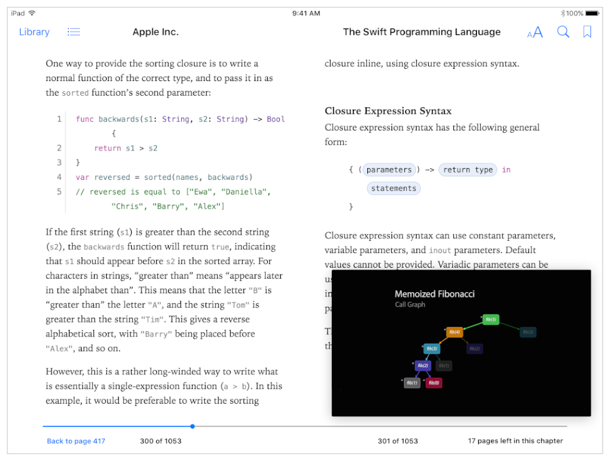

> 导航：[总目录](../../../README.md) · [documentation](../../../_indexes/documentation.md) · [在 iPad 上采用多任务增强](index.md)

## Picture in Picture 快速上手

遵循本章指引，在符合条件的 iPad 机型上支持 Picture in Picture (PiP)。

要让你的视频播放具备 PiP 资格，请确保你的 Xcode 项目和 app 按如下方式配置：

- 将 Base SDK 设置为「Latest iOS」，如 _App Distribution Guide_ 中 Setting the Base SDK 一节所述。
- 在项目 target 的 Capabilities 视图中，于 Background Modes 部分勾选「Audio, AirPlay and Picture in Picture」。
- 确保你的 app 的音频会话使用了合适的类别（category），例如 [AVAudioSessionCategoryPlayback](https://developer.apple.com/documentation/avfoundation/avaudiosessioncategoryplayback)。

接下来，为你的视频播放选择合适的 AVKit、AV Foundation 或 WebKit 类。选择取决于你的 app 的性质以及你想要提供的用户体验。

- AVKit 框架提供 [AVPlayerViewController](https://developer.apple.com/documentation/avkit/avplayerviewcontroller) 类，它会自动为你的用户显示一个 PiP 按钮。

  如果你使用 AVKit 支持 PiP，但想让某个特定视频退出 PiP，可以将该 player view controller 的 [allowsPictureInPicturePlayback](https://developer.apple.com/documentation/avkit/avplayerviewcontroller/1615821-allowspictureinpictureplayback) 属性赋值为 `NO``false`。
- AVKit 还提供 [AVPictureInPictureController](https://developer.apple.com/documentation/avkit/avpictureinpicturecontroller) 类，你可以将它与 AV Foundation 中的 [AVPlayerLayer](https://developer.apple.com/documentation/avfoundation/avplayerlayer) 类搭配使用。如果你想为视频播放提供自己的 view controller 和自定义用户界面，请采用这种方式。

  如果你以这种方式支持 PiP，但想让某个特定视频退出 PiP，就不要把该视频的 `AVPlayerLayer` 与 `AVPictureInPictureController` 对象关联。一旦你用某个 player layer 实例化了 Picture in Picture 控制器，该 player layer 的视频就具备了 PiP 资格；要退出 PiP，就不要执行该实例化。
- WebKit 框架提供 [WKWebView](https://developer.apple.com/documentation/webkit/wkwebview) 类，它在 iOS 9 中支持 Picture in Picture。

  如果你使用 WebKit 支持 PiP，但想让某个特定视频退出 PiP，可以将相应 web view 实例的 [allowsPictureInPictureMediaPlayback](https://developer.apple.com/documentation/webkit/wkwebviewconfiguration/1614792-allowspictureinpicturemediaplayb) 属性设为 `NO``false`。

> [!NOTE]
> 

除非响应用户的请求，否则绝不要以编程方式调出 Picture in Picture。

> [!IMPORTANT]
> 

如果用户按下 Home 按钮，或轻点了会将其带入另一个 app 的通知，iOS 9 会自动把正在全屏播放的视频转为 PiP 播放。你的视频播放要具备此功能的资格，需满足以下要求：

- 让你的 app 具备 Picture in Picture 资格，如本节前文所述。
- 将视频配置为全屏播放，即指定视频的 view 填满 app 窗口的全部 bounds。

> [!TIP]
> 

请谨慎管理 app 的资源。当你的 app 播放的视频转为 Picture in Picture 播放时，系统会代你呈现视频内容，而你的 app 将继续运行——可能在后台运行。当 app 在后台运行时，丢弃不再需要的资源，例如 app 在屏幕外用不到的 view controller、view、图像和数据缓存。继续执行适当且必要的操作——例如视频合成、音频处理和下载下一段待播内容——但注意尽可能少地消耗资源。如果你的 app 在为 PiP 运行于后台时消耗了过多资源，系统会将其终止。

[Slide Over 和 Split View 快速上手](QuickStartForSlideOverAndSplitView.md#apple-f4xwc4dqnrsv64tfmyxwi33df52wszbpkridimbqge2tcnbvfvbuqmjtfvjvomi)
