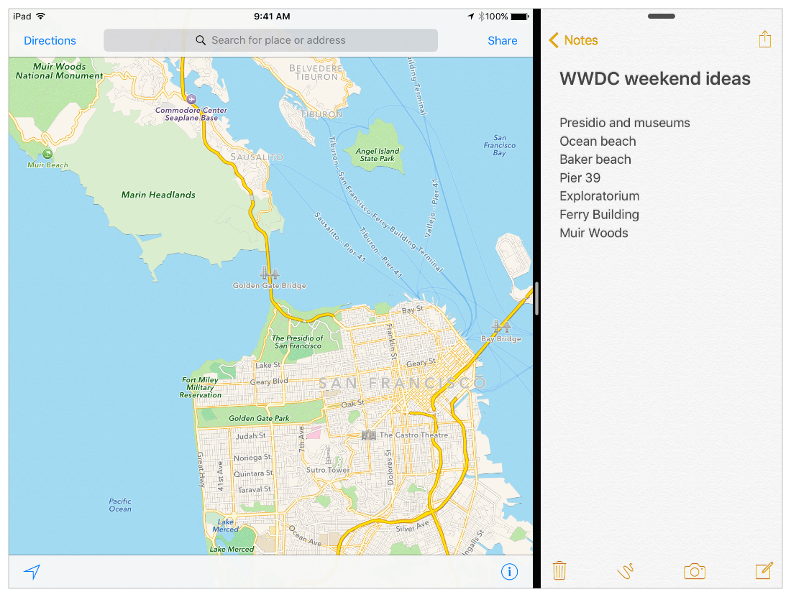
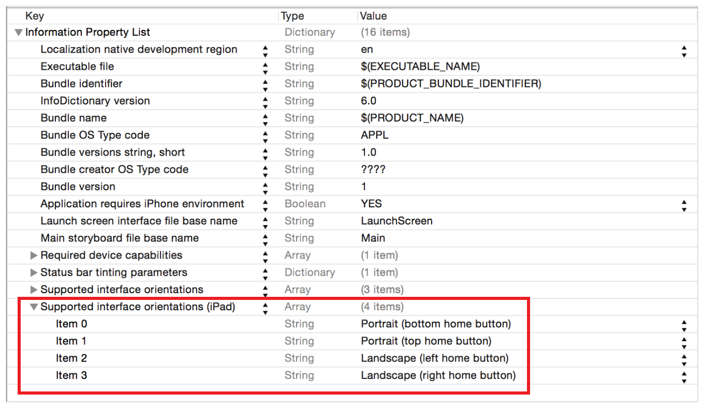
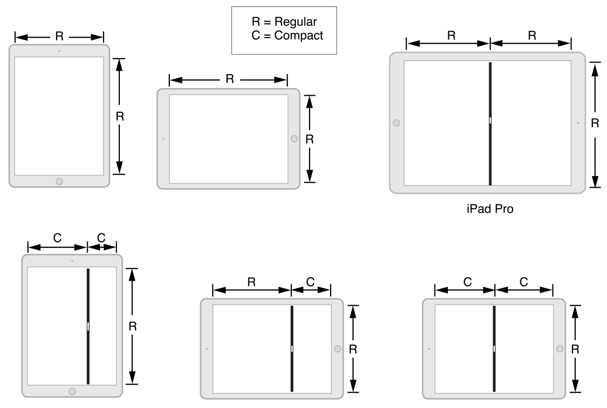

> 导航：[总目录](../../../README.md) · [documentation](../../../_indexes/documentation.md) · [在 iPad 上采用多任务增强](index.md)

## Slide Over 和 Split View 快速上手

遵循本章指引，让你的 app 在符合条件的 iPad 机型上运行 iOS 9 的多任务功能。

当你在 Xcode 7 中基于模板创建新项目时，Slide Over 和 Split View 默认已启用。如果你把旧项目迁移到 iOS 9，请确保你的 Xcode 项目按如下方式配置，使你的 app 具备 Slide Over 和 Split View 资格：

- 将 Base SDK 设置为「Latest iOS」，如 _App Distribution Guide_ 中 Setting the Base SDK 一节所述。
- 提供一个 `LaunchScreen.storyboard` 文件（而不是像 iOS 7 及更早版本那样使用 `.png` 图像文件），如 _App Distribution Guide_ 中 Creating a Launch Screen File 一节所述。
- 在项目的 `Info.plist` 文件中，于「Supported interface orientations (iPad)」数组中声明支持全部四种设备取向，如图所示：

> [!NOTE]
> 

> [!TIP]
> 

在 Slide Over 和 Split View 中，主 app 和辅助 app 都在前台运行，并且在系统看来二者在大多数方面地位平等。只有主 app 才：

- 拥有状态栏
- 有资格与第二块物理屏幕配合工作
- 可以参与 Picture in Picture 的自动调出
- 在横排取向下可以占据屏幕的三分之二，从而在 iPad 和 iPad mini 上的 Split View 中获得常规（regular）水平尺寸类型（辅助 app 在横排 Split View 中最多只能占据屏幕的一半，在 iPad 和 iPad mini 上始终保持紧凑（compact）水平尺寸类型）

在横排取向的 iPad Pro 上，主 app 和辅助 app 在半对半的 Split View 配置中各自获得常规水平尺寸类型。你的 app 在 iPad 上可能遇到的所有尺寸类型如 [图 2-1](#apple-f4xwc4dqnrsv64tfmyxwi33df52wszbpkridimbqge2tcnbvfvbuqmjtfvjvomy) 所示。

在 Split View 中，由用户控制你的 app 窗口的尺寸。用户可以通过旋转设备（与之前版本的 iOS 相同），或水平拖动分隔主 app 与辅助 app 的竖直分隔条来实现。系统以同样的方式把这两种变化传达给你的 app：作为你窗口的 bounds 变化，并伴随根 view controller 尺寸类型的相应变化。（用户对分隔条的拖动在 app 状态转换中也扮演着重要角色，如本节后文所述。）

在 iOS 9 之前，iPad 的水平和垂直尺寸类型始终是「regular」。有了 Slide Over 和 Split View，情况发生了巨大变化。图 2-1 展示了当用户在 iPad 屏幕上配置各个 app 时，你的 app 可能遇到的各种尺寸类型。

__图 2-1__　各种 iPad 机型、取向和 Split View 配置下的尺寸类型

在 iPad 和 iPad mini 上，Slide Over 和 Split View 中两个 app 的水平尺寸类型都是紧凑（compact）——唯一的例外是主 app 在横排 2/3–1/3 布局中获得常规（regular）水平尺寸类型（图 2-1 的中下位置）。在 iPad Pro 上，还有一种情况水平尺寸类型是常规（图 2-1 的右上位置）：iPad Pro 上处于横排 50/50 布局的_两个_ app 都获得常规水平尺寸类型。

要在此环境中良好运行，你的 app 必须具有自适应性。设计你的 app 时应：

- 使用 Auto Layout 和尺寸类型，如 _[Auto Layout Guide](https://developer.apple.com/library/archive/documentation/UserExperience/Conceptual/AutolayoutPG/index.html#//apple_ref/doc/uid/TP40010853)_、Size Classes Design Help 和 Simulating Screen Size and Orientation 中所述。

  你的 app 必需的 `LaunchScreen.storyboard` 文件必须使用 Auto Layout。使用 Xcode 7 中的 app 模板创建的新项目会自动获得 `LaunchScreen.storyboard` 文件。要了解如何为项目添加该文件，请阅读 _App Distribution Guide_ 中的 Creating a Launch Screen File 一节。
- 通过实现 [UITraitEnvironment](https://developer.apple.com/documentation/uikit/uitraitenvironment) 和 [UIContentContainer](https://developer.apple.com/documentation/uikit/uicontentcontainer) 协议中的方法，响应 trait collection 和尺寸的变化。
- 响应 app 状态转换的委托方法调用，如 _[App Programming Guide for iOS](https://developer.apple.com/library/archive/documentation/iPhone/Conceptual/iPhoneOSProgrammingGuide/Introduction/Introduction.html#//apple_ref/doc/uid/TP40007072)_ 中的 [Execution States for Apps](https://developer.apple.com/library/archive/documentation/iPhone/Conceptual/iPhoneOSProgrammingGuide/TheAppLifeCycle/TheAppLifeCycle.html#//apple_ref/doc/uid/TP40007072-CH2-SW3) 所述。

在 iOS 9 中，正确处理 app 的状态转换更为重要。在 Split View 上下文中，每当用户移动 Split View 分隔条时，屏幕上的两个 app 都会暂时离屏。即使用户中途改变主意、把分隔条拖回原位，情况也是如此。

当用户移动分隔条时，系统会通过 [applicationWillResignActive:](https://developer.apple.com/documentation/uikit/uiapplicationdelegate/1622950-applicationwillresignactive) 协议方法调用你的 app delegate 对象。然后系统会（在离屏状态下）调整你的 app 的尺寸，以捕获一张或多张快照，从而在用户最终松开分隔条时提供流畅的用户体验。这是因为在用户松开分隔条的那一刻，你的 app 窗口的最终 bounds 是无法预测的。让情况更复杂的是，用户在移动分隔条的同时还可能旋转设备。

编写 app 时要确保这个调整尺寸/捕获快照的过程不会为用户丢失数据模型状态或导航状态。也就是说，当用户调整了 app 尺寸——或移动了分隔条又回到先前位置——并最终松开分隔条时，用户期望你的 app 的状态及其导航位置（包括视图、选中项、滚动位置等等）与最初触碰分隔条时完全一致。要利用 [applicationWillResignActive:](https://developer.apple.com/documentation/uikit/uiapplicationdelegate/1622950-applicationwillresignactive) 调用来完成保存用户状态所需的工作。相关指导请阅读 _[App Programming Guide for iOS](https://developer.apple.com/library/archive/documentation/iPhone/Conceptual/iPhoneOSProgrammingGuide/Introduction/Introduction.html#//apple_ref/doc/uid/TP40007072)_ 中的 [What to Do When Your App Is Interrupted Temporarily](https://developer.apple.com/library/archive/documentation/iPhone/Conceptual/iPhoneOSProgrammingGuide/StrategiesforHandlingAppStateTransitions/StrategiesforHandlingAppStateTransitions.html#//apple_ref/doc/uid/TP40007072-CH8-SW10)。

如果用户把分隔条一直拖到屏幕边缘以关闭你的 app，系统会调用你的 [applicationDidEnterBackground:](https://developer.apple.com/documentation/uikit/uiapplicationdelegate/1622997-applicationdidenterbackground) 协议方法。

有关优雅处理 app 状态转换的指导，请阅读 _[App Programming Guide for iOS](https://developer.apple.com/library/archive/documentation/iPhone/Conceptual/iPhoneOSProgrammingGuide/Introduction/Introduction.html#//apple_ref/doc/uid/TP40007072)_ 中的 [Strategies for Handling App State Transitions](https://developer.apple.com/library/archive/documentation/iPhone/Conceptual/iPhoneOSProgrammingGuide/StrategiesforHandlingAppStateTransitions/StrategiesforHandlingAppStateTransitions.html#//apple_ref/doc/uid/TP40007072-CH8)。有关快照过程的信息，请阅读 [Prepare for the App Snapshot](https://developer.apple.com/library/archive/documentation/iPhone/Conceptual/iPhoneOSProgrammingGuide/StrategiesforHandlingAppStateTransitions/StrategiesforHandlingAppStateTransitions.html#//apple_ref/doc/uid/TP40007072-CH8-SW27)，并参阅 _[UIView 类参考](https://developer.apple.com/documentation/uikit/uiview)_ 中的 Capturing a View Snapshot。

[入门指引](index.md#apple-f4xwc4dqnrsv64tfmyxwi33df52wszbpkridimbqge2tcnbvfvbuqmznknltc)

[Picture in Picture 快速上手](QuickStartForPictureInPicture.md#apple-f4xwc4dqnrsv64tfmyxwi33df52wszbpkridimbqge2tcnbvfvbuqmjufvjvomi)
