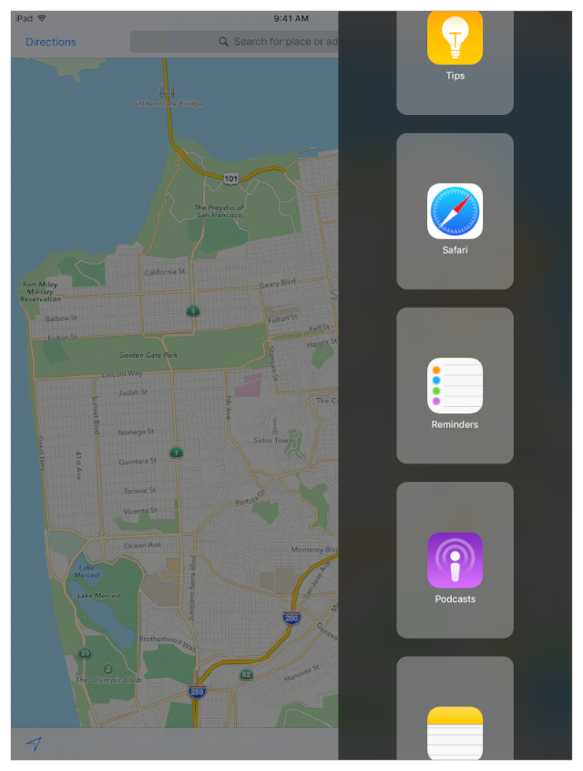
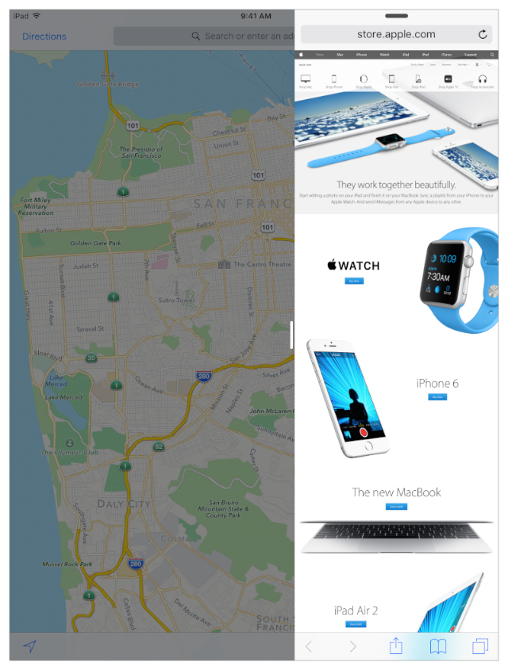
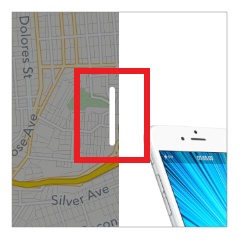
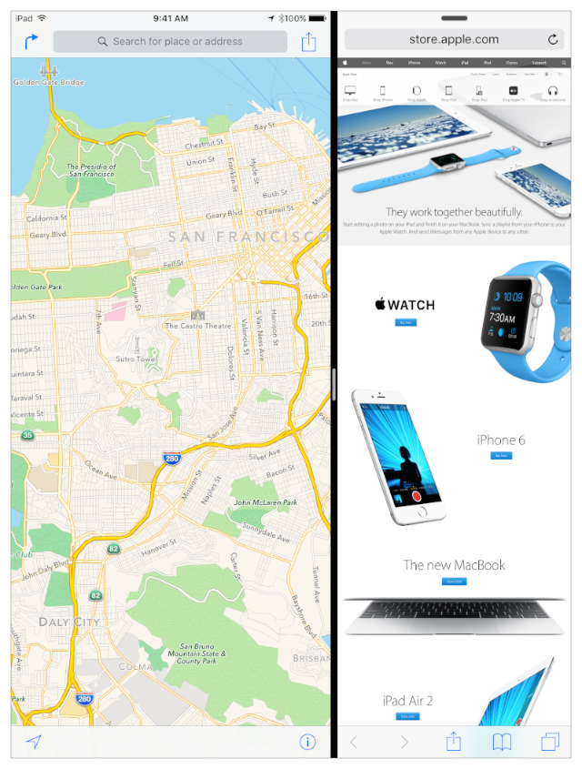
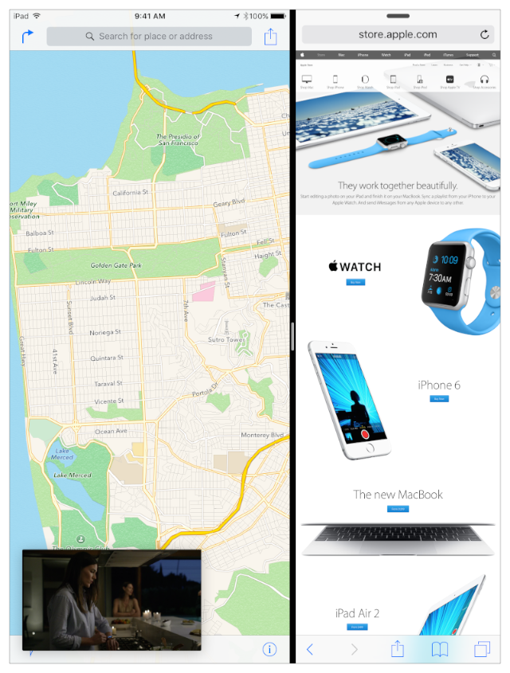
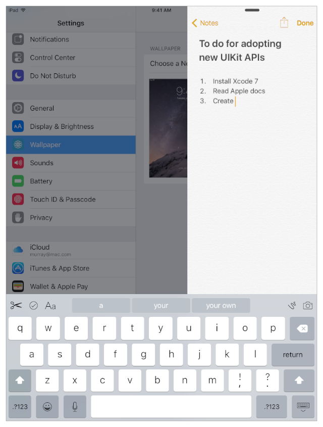
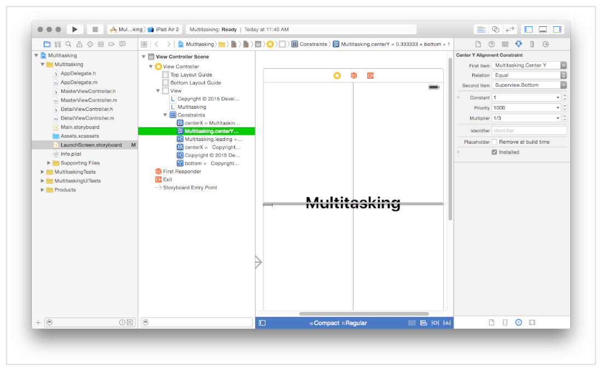

> 导航：[总目录](../../../README.md) · [documentation](../../../_indexes/documentation.md)

## 入门指引

iOS 9 中的多任务增强为用户提供了更多享受 iPad 的方式，也为用户使用你的 app 提供了更多途径。

- __Slide Over__ 提供一个由用户调出的覆盖视图，位于屏幕右侧（在从右到左语言版本的 iOS 中位于左侧），让用户可以挑选一个辅助 app 来查看并与之交互。
- __Split View__ 并排显示两个 app，用户可以同时查看、调整尺寸并与二者交互。
- __Picture in Picture__ 让用户在一个可移动、可调整大小、悬浮于屏幕其他 app 之上的窗口中播放视频。

如果你想直接采用最简步骤来接入 iOS 9 的多任务增强，可以跳转到 [Slide Over 和 Split View 快速上手](QuickStartForSlideOverAndSplitView.md#apple-f4xwc4dqnrsv64tfmyxwi33df52wszbpkridimbqge2tcnbvfvbuqmjtfvjvomi) 和 [Picture in Picture 快速上手](QuickStartForPictureInPicture.md#apple-f4xwc4dqnrsv64tfmyxwi33df52wszbpkridimbqge2tcnbvfvbuqmjufvjvomi)。

在 Slide Over 中，全屏 app 称为_主 app_（primary app），被选中的 Slide Over app 称为_辅助 app_（secondary app）。在 Split View 中（在从左到右语言版本的 iOS 中），左侧的 app 是主 app，右侧的 app 是辅助 app。

从屏幕右边缘轻扫，用户即可调出 Slide Over 来挑选辅助 app。

此处用户在 Slide Over 区域中轻点了 Safari。Safari 随即打开，并适配其窗口的紧凑（compact）宽度，像在 iPhone 上那样显示内容。

此时，在 Slide Over 区域外侧、靠近屏幕中央的位置出现了一个控件，如下面这张细节图中所示。

当用户轻点该按钮时，屏幕进入 Split View 并出现分隔条，如图所示。作为主 app 的「地图」会调整大小，适配其竖排方向窗口的紧凑宽度。

如果用户随后把分隔条一直拖到最左侧以关闭主 app（此操作未在图中展示），辅助 app 就会成为主 app 并获得一些额外能力，如 [Slide Over 和 Split View 快速上手](QuickStartForSlideOverAndSplitView.md#apple-f4xwc4dqnrsv64tfmyxwi33df52wszbpkridimbqge2tcnbvfvbuqmjtfvjvomi) 中所述。

Picture in Picture（有时称为 _PiP_）让用户可以查看一个悬浮的视频窗口，该视频甚至可能来自第三个 app。

Split View 中的两个 app 都在前台运行。如果提供视频的 app 既不是主 app 也不是辅助 app，则它在后台运行。

尽管用户与你的 app 交互的新方式如此之多，只要你已经采纳了 Apple 针对 iOS 8 的最佳实践建议，接入 iOS 9 的多任务增强就是一件直截了当的事。并且从 Xcode 7 开始，每个 iOS app 模板都已预先配置好支持 Slide Over 和 Split View。

### 现在每个 iOS App 都参与多任务

每个 iOS app——即使是选择不使用多任务功能的 app——都需要在 iOS 9 中做一个好公民。

_从开发角度来看，最大的变化在于资源管理。_

现在，即使是全屏 app 也不再独占屏幕空间、CPU、内存或其他资源。例如，用户可以：

- 添加一个 Picture in Picture 窗口，让它在屏幕上任何内容（包括全屏 app）之上播放，而拥有该视频的 app 继续在后台运行。来自其他 app 的 PiP 会增加你的 app 的内存压力，并减少你的 app 每帧可用的时间。
- 使用 Slide Over 来运行辅助 app。当辅助 app 可见时，它在前台运行，同样可能增加你的内存压力并减少你每帧可用的时间。
- 在 Slide Over 的辅助 app 中调出键盘，从而遮挡主 app 的一部分。每一位 iOS 9 开发者，即使是开发从不使用键盘的全屏 app 的开发者，也可能需要响应键盘出现通知，如 _[UIWindow 类参考](https://developer.apple.com/documentation/uikit/uiwindow)_ 中所述。

即使是全屏 app，也不再独占屏幕空间、CPU、内存或其他资源。

要有效地参与这样的环境，iOS 9 开发者必须仔细调整资源使用。如果 app 消耗的时间过多，屏幕更新可能降至每秒 60 帧以下。在内存压力下，系统会终止消耗内存最多的 app。

有关如何在 iOS 9 中管理资源的更多信息，请参阅 [多任务思维](#apple-f4xwc4dqnrsv64tfmyxwi33df52wszbpkridimbqge2tcnbvfvbuqmznknlte)。

### 分析你的 App 并界定工作范围

考虑你的 app 的特性，以确定你想要采用哪些多任务增强，以及需要做哪些工作。

__除非有明确理由，否则应采用 Slide Over 和 Split View__。从用户角度来看，一个不采用 Slide Over 和 Split View 的 iOS 9 app 会显得格格不入。

仅当你的 app 属于以下少数类别之一时，才考虑退出：

- 以相机为核心的 app：使用整块屏幕进行预览并快速捕捉瞬间是其主要功能
- 全设备 app：例如把 iPad 传感器作为核心玩法一部分的游戏

除此之外，Apple 和你的用户都期望你采用 Slide Over 和 Split View。要了解具体做法，请阅读 [Slide Over 和 Split View 快速上手](QuickStartForSlideOverAndSplitView.md#apple-f4xwc4dqnrsv64tfmyxwi33df52wszbpkridimbqge2tcnbvfvbuqmjtfvjvomi)。

若要退出 Slide Over 和 Split View 的参与资格，请将 `UIRequiresFullScreen` 键添加到你的 Xcode 项目的 `Info.plist` 文件中，并赋予布尔值 `YES``true`。

> [!NOTE]
> 

__如果你的 app 的主要职责是播放中长时间的视频内容，则应采用 PiP__。

当对用户而言，在视频播放的同时还能与 app 的其他部分或其他 app 交互是有价值的，你就应当支持 Picture in Picture。要让 PiP 快速运转起来，请阅读 [Picture in Picture 快速上手](QuickStartForPictureInPicture.md#apple-f4xwc4dqnrsv64tfmyxwi33df52wszbpkridimbqge2tcnbvfvbuqmjufvjvomi)。

对于游戏内过场动画、首次启动引导序列及类似内容，请退出 PiP。你可以按如下方式对某个视频退出 PiP：

- 对于 [AVPlayerViewController](https://developer.apple.com/documentation/avkit/avplayerviewcontroller) 类，将 [allowsPictureInPicturePlayback](https://developer.apple.com/documentation/avkit/avplayerviewcontroller/1615821-allowspictureinpictureplayback) 属性值设为 `NO``false`。
- 对于 [AVPlayerLayer](https://developer.apple.com/documentation/avfoundation/avplayerlayer) 类，不要用你的 player layer 对象实例化 [AVPictureInPictureController](https://developer.apple.com/documentation/avkit/avpictureinpicturecontroller)。
- 对于 [WKWebView](https://developer.apple.com/documentation/webkit/wkwebview) 类，将其 [allowsPictureInPictureMediaPlayback](https://developer.apple.com/documentation/webkit/wkwebviewconfiguration/1614792-allowspictureinpicturemediaplayb) 属性设为 `NO``false`。

__如果你的 app 播放 HTTP Live Streaming (HLS) 视频，请使用元数据优化播放__。通过响应流变体（stream-variant）元数据标签，针对各种视频窗口尺寸优化 app 性能，并将电量消耗降至最低。与你合作的内容分发网络（CDN）同样应提供多种流变体，并为每个变体标注合适的分辨率标签。更多信息请参阅 _[HTTP Live Streaming Overview](../../Networking%20Internet/HTTP%20Live%20Streaming%20Overview/Introduction.md#apple-f4xwc4dqnrsv64tfmyxwi33df52wszbpkridimbqga4dgmzs)_。

__如果你的 app 在连接第二块物理屏幕时显示内容，请测试转场__。尤其要测试从辅助 app 转为主 app 的用例（做法是把你的 app 作为辅助 app 打开，然后把分隔条一直拖到屏幕边缘以关闭主 app）。只有主 app 才有资格与第二块物理屏幕配合工作，因此从辅助 app 转为主 app 是一种新场景，你的 app 在此场景中会收到 [UIScreenDidConnectNotification](https://developer.apple.com/documentation/uikit/uiscreen/1617826-didconnectnotification) 通知。请确保你的 app 能帮助用户理解这里发生了什么，因为内容可能会出乎意料地移动到第二块屏幕上。

### 开发环境

Xcode 7 支持在 iPad 上采用多任务增强。

使用 Xcode 7、Simulator 和 Instruments 中的新功能：

- Xcode 7 中的每个 iOS app 模板都已预先配置好支持 Slide Over 和 Split View，包括一个 `LaunchScreen.storyboard` 文件和一个预先配置的 `Info.plist` 文件。请参阅 _[Xcode Overview](https://developer.apple.com/library/archive/documentation/ToolsLanguages/Conceptual/Xcode_Overview/index.html#//apple_ref/doc/uid/TP40010215)_。
- Interface Builder 中的 storyboard 让使用 Auto Layout 约束变得很容易。请参阅 _[Auto Layout Guide](https://developer.apple.com/library/archive/documentation/UserExperience/Conceptual/AutolayoutPG/index.html#//apple_ref/doc/uid/TP40010853)_、Auto Layout Help 和 Storyboard Help。
- Interface Builder 的 Preview 助手让你能即时看到布局如何适配 Slide Over 和 Split View 场景中的尺寸类型（size class）变化。请参阅 Size Classes Design Help 和 Previewing Your Layout for Different Localizations, iOS Devices, and iOS Versions。
- Xcode 7 中的 Simulator 让你可以使用与真机相同的手势调出 Slide Over 和 Split View。你可以用 Simulator 测试 Slide Over 和 Split View 布局行为的方方面面，也可以测试 Picture in Picture。不过，Simulator 并不模拟 iOS 设备的内存、CPU、GPU、磁盘 I/O 或其他资源特性。有关使用 Simulator 的指导，请参阅 _[Simulator User Guide](../../IDEs/Simulator%20User%20Guide/About%20Simulator.md#apple-f4xwc4dqnrsv64tfmyxwi33df52wszbpkridimbqgezdqnby)_。
- Instruments 中的 Allocations、Time Profiler 和 Leaks 分析模板可让你深入了解 app 的行为和资源使用情况。请参阅 _[Instruments User Guide](https://developer.apple.com/library/archive/documentation/DeveloperTools/Conceptual/InstrumentsUserGuide/index.html#//apple_ref/doc/uid/TP40004652)_ 和 [Instruments Help](http://help.apple.com/instruments)。
- Xcode 7 为资源目录（asset catalog）提供了全面的可视化界面支持。把图像集和 app 图标等视觉资源放入资源目录，对优化 app 的内存占用非常重要。请参阅 Asset Catalog Help。你也可以以编程方式使用资源目录，如 _[UIImageAsset 类参考](https://developer.apple.com/documentation/uikit/uiimageasset)_ 中所述。

要测试内存、CPU、GPU 及所有与硬件相关的行为，请在你想要支持的硬件上测试 app。要在设备上测试 app，你必须是 iOS Developer Program 的成员。请参阅 _App Distribution Guide_ 中的 Managing Accounts。

以下 iPad 机型支持 iOS 9 中的多任务增强。

| __设备__ | __Slide Over__ | __Picture in Picture__ | __Split View__ |
| --- | --- | --- | --- |
| iPad mini 2 | image: Art/check.pdf | image: Art/check.pdf |  |
| iPad mini 3 | image: Art/check.pdf | image: Art/check.pdf |  |
| iPad mini 4 | image: Art/check.pdf | image: Art/check.pdf | image: Art/check.pdf |
| iPad Air | image: Art/check.pdf | image: Art/check.pdf |  |
| iPad Air 2 | image: Art/check.pdf | image: Art/check.pdf | image: Art/check.pdf |
| iPad Pro | image: Art/check.pdf | image: Art/check.pdf | image: Art/check.pdf |

### 多任务思维

要在 iOS 9 的 iPad 上取得成功，你的 app 必须在设备资源上做一个好公民——对相邻的 app 如此，对系统亦如此。

_当你的 app 在前台运行时，旁边可能有另一个 app 正在运行，还可能有一个 Picture in Picture 窗口正在播放，而它的宿主 app 正在后台运行。_

在 iOS 9 之前，你可以让自己的 app 使用任何可用的 CPU、GPU、内存、I/O 和硬件资源，并保持良好的体验。在 iOS 9 中，情况发生了变化。每个 app 都必须高效地使用资源，这对保证用户 iPad 体验的流畅和响应性至关重要。

_为了获得最佳用户体验，系统会严格管理资源使用，并终止那些占用超出其合理份额资源的 app。_

你在采用 iPad 多任务增强时的大部分工作，很可能就在于采用资源管理的最佳实践。作为第一步：

- 在 Instruments 中测试你的 app，确保它没有内存泄漏、内存消耗无限制增长，或阻塞主线程。阅读 _[Instruments User Guide](https://developer.apple.com/library/archive/documentation/DeveloperTools/Conceptual/InstrumentsUserGuide/index.html#//apple_ref/doc/uid/TP40004652)_ 和 [Instruments Help](http://help.apple.com/instruments)。
- 当你的 app 转入后台时，利用 app 状态转换的委托方法，丢弃不再需要的 view controller、view、资源和数据缓存。阅读 _[App Programming Guide for iOS](https://developer.apple.com/library/archive/documentation/iPhone/Conceptual/iPhoneOSProgrammingGuide/Introduction/Introduction.html#//apple_ref/doc/uid/TP40007072)_ 中的 [Strategies for Handling App State Transitions](https://developer.apple.com/library/archive/documentation/iPhone/Conceptual/iPhoneOSProgrammingGuide/StrategiesforHandlingAppStateTransitions/StrategiesforHandlingAppStateTransitions.html#//apple_ref/doc/uid/TP40007072-CH8)。
- 在每一台受支持的设备上，将你的 app 与一个资源密集型 app（例如设置为卫星视图并执行飞越动画的「地图」）并排测试。分别以主 app 和辅助 app 两种身份进行测试，确保两种情况下你的 app 和「地图」都保持响应。

在 iOS 9 中，再以设备形态（idiom）或界面取向来思考问题已不再合适。你的 app 在 iPad 上可能处于紧凑（compact）或常规（regular）水平尺寸类型，尺寸变化与界面取向无关。正确的做法是使用 trait collection 和尺寸类型（参见 _[UITraitCollection 类参考](https://developer.apple.com/documentation/uikit/uitraitcollection)_），并采用 `UIContentContainer` 和 `UITraitEnvironment` 协议，如 [Slide Over 和 Split View 快速上手](QuickStartForSlideOverAndSplitView.md#apple-f4xwc4dqnrsv64tfmyxwi33df52wszbpkridimbqge2tcnbvfvbuqmjtfvjvomi) 中所述。

同样，在 iOS 9 中，使用屏幕的 bounds 来衡量 app 的可见区域也不再合适。应改为获取你的 app 窗口的 [bounds](https://developer.apple.com/documentation/uikit/uiview/1622580-bounds) 属性的值（[UIWindow](https://developer.apple.com/documentation/uikit/uiwindow) 类从 [UIView](https://developer.apple.com/documentation/uikit/uiview) 类继承了该属性）。

> [!NOTE]
> 

虽然打造一个一流的 iOS 9 app 并非必须使用 Auto Layout，但 Auto Layout 能让这件事更容易。Auto Layout 带来性能上的好处，并帮助你与 _iOS Human Interface Guidelines_ 中描述的 Apple 最佳实践保持一致。简而言之，Auto Layout 帮助你将视觉内容放到正确的位置，并帮助你的 app 在 iOS 演进过程中面向未来。阅读 _[Auto Layout Guide](https://developer.apple.com/library/archive/documentation/UserExperience/Conceptual/AutolayoutPG/index.html#//apple_ref/doc/uid/TP40010853)_ 和 Auto Layout Help。

你可以迭代地采用 Auto Layout，一次处理一个布局。至少，你必需的 `LaunchScreen.storyboard` 文件必须使用 Auto Layout。在整个 app 中，使用 storyboard 帮助你的 view 在用户于不同上下文中打开和使用 app 时适应不断变化的尺寸类型。阅读 Storyboard Help。

[Slide Over 和 Split View 快速上手](QuickStartForSlideOverAndSplitView.md#apple-f4xwc4dqnrsv64tfmyxwi33df52wszbpkridimbqge2tcnbvfvbuqmjtfvjvomi)
