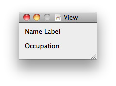
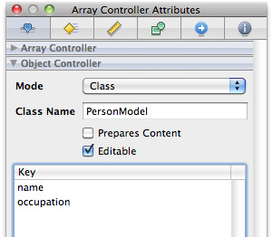
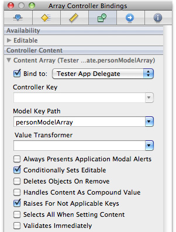
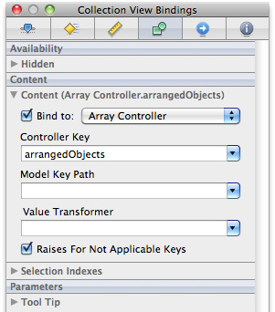
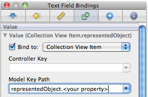
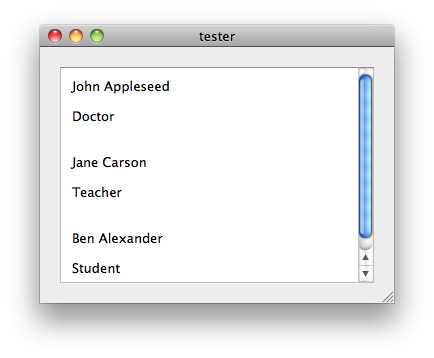

> 导航：[总目录](../../../README.md) · [文档](../../../_indexes/documentation.md) · [OS X Collection View 编程指南](About%20Collection%20Views.md)


[下一页](Document%20Revision%20History.md)[上一页](About%20Collection%20Views.md)

# 快速上手

本快速上手将带你快速而实用地了解 Collection View。Collection View 的主要目标是以有组织的方式在视觉上排列一组对象，其中每个对象都在更大的 Collection View 中获得属于自己的视图。

在使用 [NSCollectionView](https://developer.apple.com/documentation/appkit/nscollectionview) 类之前，你必须已经在 Xcode 中有一个现成的基于窗口的 Cocoa 应用。首先在应用中创建一个模型类，用于存储你希望展示的每个对象的全部数据。然后，在 Interface Builder 中向项目添加一个 Collection View 和一个数组控制器（array controller）。你还需要创建一个数组来存储希望展示的各个对象，并且为了确保一切保持同步，你需要在 Collection View、数组控制器和数组之间建立各种绑定（binding）。完成后，你的 Collection View 就会以有组织的方式展示出所有对象。

本教程假定你已基本了解 [Model-View-Controller](https://developer.apple.com/library/archive/documentation/General/Conceptual/DevPedia-CocoaCore/MVC.html#//apple_ref/doc/uid/TP40008195-CH32) 设计模式、[绑定（bindings）](https://developer.apple.com/library/archive/documentation/Cocoa/Conceptual/CocoaBindings/Concepts/WhatAreBindings.html#//apple_ref/doc/uid/20002372)以及[键值观察合规（key-value observing compliance）](https://developer.apple.com/library/archive/documentation/General/Conceptual/DevPedia-CocoaCore/KeyValueCoding.html#//apple_ref/doc/uid/TP40008195-CH25)。

1. 打开你基于窗口的 Cocoa 应用。
2. 创建一个用于存储每个对象数据的模型类。

   本教程使用一个简单的 `PersonModel` 类作为示例模型类。该类的每个实例包含两项数据：一个表示人名的字符串对象，以及另一个表示其职业的字符串。这两个变量都是属性（property），因此在头文件中声明，并在实现文件中合成（synthesize）。以下代码片段展示了一个简单的 `PersonModel` 类头文件的样子：

```objc
#import <Cocoa/Cocoa.h>

@interface PersonModel : NSObject {
    NSString * name;
    NSString * occupation;
}
@property(retain, readwrite) NSString * name;
@property(retain, readwrite) NSString * occupation;
@end
```

   以及实现文件：

```objc
#import "PersonModel.h"

@implementation PersonModel

@synthesize name;
@synthesize occupation;

-(void) dealloc {
    [name release];
    [occupation release];
    [super dealloc];
}
@end
```

   这个 `PersonModel` 类是简单模型对象的一个很好的例子。它封装了一组数据并提供访问接口，且符合 KVC 规范。同样，创建多个 `PersonModel` 类的实例也非常简单，每个实例都可以存储各自独有的数据并被单独访问。你并非一定要照搬这个示例类，但它是理解 Collection View 内部工作原理的一个良好起点。

1. 在 Interface Builder 中打开主窗口的 nib 文件。
2. 向应用窗口添加一个 `NSCollectionView` 对象，并将其调整到你想要的大小。

   注意，nib 中已自动添加了两个新条目：一个「Collection View Item」和一个新的 [NSView](https://developer.apple.com/documentation/appkit/nsview) 对象：

   - 「Collection View Item」是一个控制器，负责在 Collection View 的单元格与为视图提供数据的模型对象（即 `PersonModel` 对象）之间协调信息流。稍后你会对它进行配置。
   - 新视图代表 Collection View 中单个单元格的模板。你需要把这个视图配置成单元格在 Collection View 中最终呈现的样子。

     - 例如，要展示一个 `PersonModel` 对象，该视图需要包含两个文本标签，每个标签都要有足够的宽度来显示一个人的完整姓名和职业。它看起来可能像这样：

       
3. 把你需要的所有对象（文本标签、图像视图等）添加到新创建的视图中。把单元格调整为所需的大小。

   请记住，你要展示的是存储在模型类中的信息，所以在设计单元格布局时要牢记这一点。以 `PersonModel` 类为例，每个单元格包含两个文本标签（见上面的视图）：一个用于显示姓名字符串的标签，以及一个用于显示职业字符串的标签。

1. 向 nib 中添加一个 `ArrayController` 对象。

   在进行下一步之前，必须确保你的模型对象类已经完整，并且包含了你希望展示的所有数据。模型对象中的每个属性在下一步中都是必需的，因此在继续之前必须先有一个完整的模型对象。
2. 在 `ArrayController` 的属性检查器（Attributes Inspector）中，将其对象控制器的模式指定为「Class」，填入你的模型对象类的对应名称，并把模型中希望与 `NSCollectionView` 中每个视图相关联的属性添加到「Key」列表中。

   如果使用 `PersonModel` 类，数组控制器的属性检查器将如下所示：

   
3. 在 Xcode 中的控制器文件中（见下方说明），创建一个 [NSMutableArray](https://developer.apple.com/library/archive/documentation/LegacyTechnologies/WebObjects/WebObjects_3.5/Reference/Frameworks/ObjC/Foundation/Classes/NSArrayClassCluster/Description.html#//apple_ref/occ/cl/NSMutableArray) 对象，并像处理模型类中的数据那样把它设为一个属性。这个数组将用于存储你希望在 Collection View 中展示的所有对象。稍后，你将添加一些方法，以确保该数组符合 KVO 规范，并能与你的 Collection View 连接起来。

你需要把刚刚在 Xcode 中创建的数组属性绑定到 nib 文件中已有的 `ArrayController` 上。这样，你的 Collection View 就会被挂接起来，显示 `ArrayController` 当前所关联的内容。因此，每当 Xcode 控制器文件中的数组属性发生变化时，都会触发 Interface Builder 中 `ArrayController` 的变化，进而触发 Collection View 的变化，一切都会保持同步。接下来的步骤涉及绑定的使用，本文不做展开。有关绑定的更多信息，请参阅《Bindings Programming Guide》。

1. 首先，把控制器的数组属性挂接到 nib 中的 `ArrayController` 对象上。

   具体做法是：点击你的 `ArrayController` 对象，打开它的绑定检查器（Bindings Inspector），把它的 content array 绑定到你的控制器对象上。然后，将它的 model key path 指定为你数组的名称。它看起来应类似于：

   
2. 把你的 Collection View 绑定到数组控制器。

   选中你的 `NSCollectionView` 对象，打开「Bindings Inspector」窗口，在 content 部分把你的 Collection View 绑定到「Array Controller」选项。还必须将 Controller Key 指定为「arrangedObjects」。本质上，这让你的数组控制器可以告诉 Collection View 去显示数组控制器所管理的任何对象。

   

对于 Collection View Item 中的每个对象（即 [NSImageView](https://developer.apple.com/documentation/appkit/nsimageview) 对象、`NSTextLabel` 对象等），执行以下操作：

1. 选中它并打开其绑定检查器。
2. 将该子视图绑定到一个 collection view item，并通过把它的 Model Key Path 设置为 `representedObject.<你的属性>`，把子视图的 object 属性绑定到对应的模型属性。

   例如，你会把姓名标签绑定到模型键路径 `respresentedObject.name`。



只需再完成两步，你的 Collection View 就能运行起来了。第一，你需要让 Xcode 控制器类中的数组属性符合键值观察规范；第二，你需要创建一些要展示的数据。

1. 让你的数组符合 KVO 规范。

   在本例中，我们假定你把所有数据对象（`PeopleModel` 对象）存储在一个数组中。要让这个数组符合 KVO 规范，你需要向控制器类添加几个方法，以便其他对象（在本例中是你的 `ArrayController`）能在数组发生变化时收到通知。KVC 编程指南中列出了所需的方法组合清单，但如果你只是使用一个简单的 `NSMutableArray`，下面这组方法即可胜任：

```objc
-(void)insertObject:(PersonModel *)p inPersonModelArrayAtIndex:(NSUInteger)index {     [personModelArray insertObject:p atIndex:index]; }  -(void)removeObjectFromPersonModelArrayAtIndex:(NSUInteger)index {     [personModelArray removeObjectAtIndex:index]; }  -(void)setPersonModelArray:(NSMutableArray *)a {     personModelArray = a; }  -(NSArray*)personModelArray {     return personModelArray; }
```
2. 为你的 Collection View 创建一些要展示的数据。

   - 在你的控制器类中创建一个 `-(void)awakeFromNib` 方法，在其中初始化你希望放入 Collection View 的模型对象。
   - 同时，在该方法中创建一个 `NSMutableArray` 对象，用于临时存放所有这些数据。
   - 然后，把你的每个模型对象添加到新创建的数组中。
   - 完成后，使用 `(void)setPersonModelArray` 方法将你的数组属性设置为新填充的数组。设置数组会触发 Collection View 的更新。
   - 一段创建三个 person 对象并放入数组的示例代码可能如下所示：

```objc
- (void)awakeFromNib {          PersonModel * pm1 = [[PersonModel alloc] init];     pm1.name = @"John Appleseed";     pm1.occupation = @"Doctor";          PersonModel * pm2 = [[PersonModel alloc] init];     pm2.name = @"Jane Carson";     pm2.occupation = @"Teacher";          PersonModel * pm3 = [[PersonModel alloc] init];     pm3.name = @"Ben Alexander";     pm3.occupation = @"Student";          NSMutableArray * tempArray = [NSMutableArray arrayWithObjects:pm1, pm2, pm3, nil];     [self setPersonModelArray:tempArray];      }
```
   - 至此，你的 Collection View 应该已经运行起来，并以整齐有序的方式展示你的所有对象了。恭喜你完成了第一个 Collection View！
   - 如果遵循本教程中的 `PersonModel` 示例，你最终的界面看起来可能像这样：

     
   - 有关 KVO 合规的更多信息，请参阅《[键值观察编程指南](../../Cocoa/Key-Value%20Observing%20Programming%20Guide/Introduction%20to%20Key-Value%20Observing%20Programming%20Guide.md#apple-f4xwc4dqnrsv64tfmyxwi33df52wszbpgeydambqge3to2i)》。

本快速上手教程并未涉及 `NSCollectionView` 类所有强大而酷炫的功能。它还有诸如嵌入图像视图、将对象设置为可选中或不可选中并在选中时改变颜色、子视图交替变色、按字母顺序排列子视图等许多功能。既然你已经实现了一个可运行的简单 Collection View，自定义视图并添加这些功能应该会相当快。请参阅本编程指南中更详细的文章，开始探索 `NSCollectionView` 类的这些高级特性。同样，Collection View 的一些更高级的功能需要深入理解绑定。要进一步了解绑定，请参阅《[Cocoa 绑定编程主题](../../Cocoa/Cocoa%20Bindings%20Programming%20Topics/Introduction%20to%20Cocoa%20Bindings%20Programming%20Topics.md#apple-f4xwc4dqnrsv64tfmyxwi33df52wszbpgeydambqge3do2i)》。

[下一页](Document%20Revision%20History.md)[上一页](About%20Collection%20Views.md)
