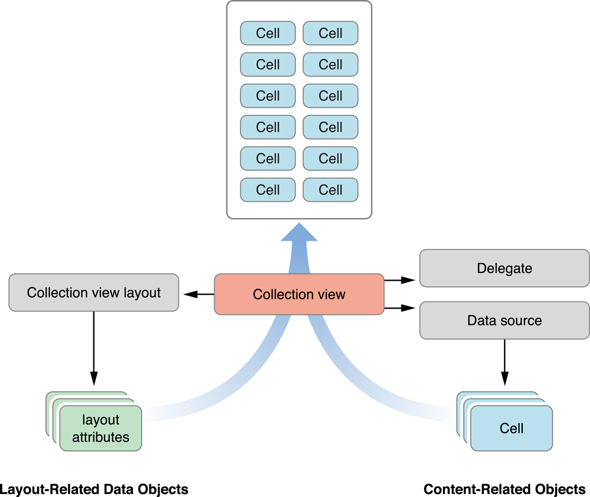
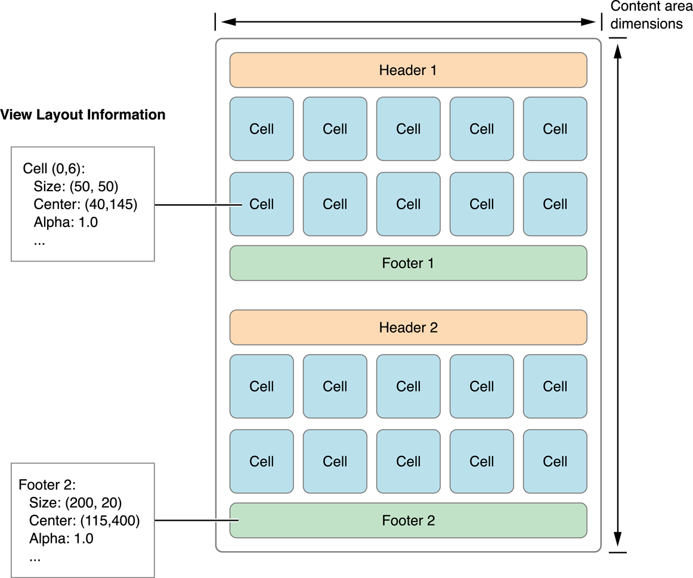

> 导航：[总目录](../../../README.md) · [文档](../../../_indexes/documentation.md) · [iOS Collection View 编程指南](About%20iOS%20Collection%20Views.md)

[下一页](Designing%20Your%20Data%20Source%20and%20Delegate.md)[上一页](About%20iOS%20Collection%20Views.md)

# Collection View 基础

为了在屏幕上呈现内容，collection view 需要与许多不同的对象协作。其中一些对象是自定义的，必须由你的应用提供。例如，你的应用必须提供一个数据源对象，告诉 collection view 有多少个项目需要显示。另一些对象则由 UIKit 提供，是 collection view 基本设计的一部分。

与 table view 一样，collection view 是面向数据的对象，其实现需要与你的应用对象协作。要理解你需要在代码中做些什么，需要一些关于 collection view 工作方式的背景知识。

Collection view 的设计把被呈现的数据与这些数据在屏幕上的排列和呈现方式分离开来。尽管你的应用全权负责管理要呈现的数据，但其可视呈现则由多个不同的对象共同管理。表 1-1 列出了 UIKit 中的 collection view 相关类，并按它们在实现 collection view 界面中扮演的角色进行组织。其中大多数类都设计为直接拿来使用、无需任何子类化，因此你通常只用很少的代码就能实现一个 collection view。而当你需要超出自带行为的功能时，可以通过子类化来提供这些行为。

__表 1-1__  实现 collection view 所用的类和协议

| 用途 | 类/协议 | 描述 |
| --- | --- | --- |
| 顶层包含与管理 | [UICollectionView](https://developer.apple.com/documentation/uikit/uicollectionview)  [UICollectionViewController](https://developer.apple.com/documentation/uikit/uicollectionviewcontroller) | `UICollectionView` 对象定义了 collection view 内容的可视区域。该类继承自 [UIScrollView](https://developer.apple.com/documentation/uikit/uiscrollview)，必要时可以包含一个很大的可滚动区域。该类还负责根据从布局对象收到的布局信息来呈现你的数据。  `UICollectionViewController` 对象为 collection view 提供 view controller 级别的管理支持。它的使用是可选的。 |
| 内容管理 | [UICollectionViewDataSource](https://developer.apple.com/documentation/uikit/uicollectionviewdatasource) 协议  [UICollectionViewDelegate](https://developer.apple.com/documentation/uikit/uicollectionviewdelegate) 协议 | _数据源对象_是与 collection view 关联的最重要的对象，也是你必须提供的对象。数据源管理 collection view 的内容，并创建呈现这些内容所需的视图。要实现数据源对象，你必须创建一个遵循 `UICollectionViewDataSource` [协议](https://developer.apple.com/library/archive/documentation/General/Conceptual/DevPedia-CocoaCore/Protocol.html#//apple_ref/doc/uid/TP40008195-CH45)的对象。  Collection view 的[委托](https://developer.apple.com/library/archive/documentation/General/Conceptual/DevPedia-CocoaCore/Delegation.html#//apple_ref/doc/uid/TP40008195-CH14)对象让你能够截获来自 collection view 的关键消息，并自定义视图的行为。例如，你可以用委托对象来跟踪 collection view 中项目的选中和高亮。与数据源对象不同，委托对象是可选的。  有关如何实现数据源和委托对象的信息，请参阅[设计数据源与委托](Designing%20Your%20Data%20Source%20and%20Delegate.md#apple-f4xwc4dqnrsv64tfmyxwi33df52wszbpkridimbqgezdgmzufvbuqnznknltc)。 |
| 呈现 | [UICollectionReusableView](https://developer.apple.com/documentation/uikit/uicollectionreusableview)  [UICollectionViewCell](https://developer.apple.com/documentation/uikit/uicollectionviewcell) | 所有显示在 collection view 中的视图都必须是 `UICollectionReusableView` 类的实例。该类支持 collection view 使用的回收机制。回收视图（而不是创建新视图）能从总体上提升性能，尤其在滚动过程中提升明显。  `UICollectionViewCell` 对象是一种特定类型的可复用视图，用于呈现你的主要数据项。 |
| 布局 | [UICollectionViewLayout](https://developer.apple.com/documentation/uikit/uicollectionviewlayout)  [UICollectionViewLayoutAttributes](https://developer.apple.com/documentation/uikit/uicollectionviewlayoutattributes)  [UICollectionViewUpdateItem](https://developer.apple.com/documentation/uikit/uicollectionviewupdateitem) | `UICollectionViewLayout` 的子类被称为_布局对象_，负责定义 collection view 内单元格和可复用视图的位置、大小和可视属性。  在布局过程中，布局对象会创建布局属性对象（`UICollectionViewLayoutAttributes` 类的实例），告诉 collection view 在何处以及如何显示单元格和可复用视图。  每当数据项在 collection view 中被插入、删除或移动时，布局对象都会收到 `UICollectionViewUpdateItem` 类的实例。你永远不需要自己创建该类的实例。  有关布局对象的更多信息，请参阅[布局对象控制可视呈现](#apple-f4xwc4dqnrsv64tfmyxwi33df52wszbpkridimbqgezdgmzufvbuqmrnknltcna)。 |
| 流式布局 | [UICollectionViewFlowLayout](https://developer.apple.com/documentation/uikit/uicollectionviewflowlayout)  [UICollectionViewDelegateFlowLayout](https://developer.apple.com/documentation/uikit/uicollectionviewdelegateflowlayout) 协议 | `UICollectionViewFlowLayout` 类是一个具体的布局对象，用于实现网格或其他基于行的布局。你可以直接使用该类，也可以与流式布局委托对象配合使用，后者允许你动态地自定义布局信息。 |

图 1-1 展示了与 collection view 关联的核心对象之间的关系。Collection view 从它的数据源那里获取要显示的单元格信息。数据源和委托对象是由你的应用提供的自定义对象，用于管理内容，包括单元格的选中和高亮。布局对象负责决定这些单元格的归属位置，并以一个或多个布局属性对象的形式把这些信息发送给 collection view。随后，collection view 把布局信息与实际的单元格（及其他视图）合并起来，形成最终的可视呈现。

__图 1-1__  合并内容与布局以形成最终呈现

创建 collection view 界面时，你首先要把一个 `UICollectionView` 对象添加到 storyboard 或 nib 文件中。可以把 collection view 想象成一个中心枢纽，其他所有对象都由它延伸出来。添加了该对象之后，你就可以开始配置任何相关对象，例如数据源或委托。所有配置都围绕 collection view 本身展开。例如，你永远不会在不创建 collection view 对象的情况下单独创建一个布局对象。

Collection view 采用视图回收机制来提升效率。当视图移出屏幕时，它们会被从视图中移除并放入复用队列，而不是被销毁。当新内容滚入屏幕时，视图会被从队列中取出并赋予新内容。为了支持这种回收与复用，collection view 显示的所有视图都必须继承自 [UICollectionReusableView](https://developer.apple.com/documentation/uikit/uicollectionreusableview) 类。

Collection view 支持三种不同类型的可复用视图，每种都有特定的用途：

- _单元格（cell）_呈现 collection view 的主要内容。单元格的职责是呈现数据源对象中单个项目的内容。每个单元格必须是 [UICollectionViewCell](https://developer.apple.com/documentation/uikit/uicollectionviewcell) 类的实例，你可以根据需要将其子类化以呈现你的内容。单元格对象内建了对管理自身选中和高亮状态的支持。不过要真正把高亮应用到单元格上，你必须编写一些自定义代码。有关实现单元格高亮/选中的信息，请参阅[管理选中与高亮的可视状态](Designing%20Your%20Data%20Source%20and%20Delegate.md#apple-f4xwc4dqnrsv64tfmyxwi33df52wszbpkridimbqgezdgmzufvbuqnznknltq)。
- _补充视图（supplementary view）_显示与某个 section 相关的信息。与单元格一样，补充视图也是数据驱动的。与单元格不同的是，补充视图不是必需的，其使用和摆放由所使用的布局对象控制。例如，流式布局支持以页眉和页脚作为可选的补充视图。
- _装饰视图（decoration view）_是完全归布局对象所有的视觉装饰，不与数据源对象中的任何数据绑定。例如，布局对象可以用装饰视图来实现自定义的背景外观。

与 table view 不同，collection view 不会对你的数据源所提供的单元格和补充视图强加任何特定的样式。相反，这些基本的可复用视图类是供你随意改造的空白画布。例如，你可以用它们构建小型视图层级、显示图像，甚至动态绘制内容。

你的数据源对象负责提供其关联 collection view 所使用的单元格和补充视图。但是，数据源从不直接创建视图。当被要求提供视图时，你的数据源会使用 collection view 的方法来取出（dequeue）所需类型的视图。取出过程总是会返回一个有效的视图——要么从复用队列中取回一个，要么使用你提供的类、nib 文件或 storyboard 创建一个新视图。

有关如何从数据源创建和配置视图的信息，请参阅[配置单元格与补充视图](Designing%20Your%20Data%20Source%20and%20Delegate.md#apple-f4xwc4dqnrsv64tfmyxwi33df52wszbpkridimbqgezdgmzufvbuqnznknltm)。

布局对象全权负责确定 collection view 内各个项目的摆放位置和视觉样式。尽管你的数据源对象提供视图和实际内容，但布局对象决定这些视图的大小、位置以及其他与外观相关的属性。这种职责分离使得在不改动应用所管理的任何数据对象的情况下动态更换布局成为可能。

Collection view 使用的布局过程与应用其余视图使用的布局过程相关，但彼此不同。换句话说，不要把布局对象所做的事情与用于在父视图内重新摆放子视图的 `layoutSubviews` 方法混为一谈。布局对象从不直接触碰它所管理的视图，因为它实际上并不拥有这些视图。相反，它生成描述 collection view 中单元格、补充视图和装饰视图的位置、大小和视觉外观的属性。然后，由 collection view 负责把这些属性应用到实际的视图对象上。

布局对象能以何种方式影响 collection view 中的视图是不设限的。布局对象可以移动某些视图而不动其他视图；可以只把视图移动一点点，也可以让它们在屏幕上随机移动；甚至可以完全不考虑周围视图的情况来重新摆放视图。例如，只要布局对象愿意，它可以把视图一层层叠起来。唯一的真正限制在于布局对象要能达到你希望应用具有的视觉风格。

图 1-2 展示了一个垂直滚动的流式布局如何排列它的单元格和补充视图。在垂直滚动的流式布局中，内容区域的宽度保持固定，高度则增长以容纳内容。为了计算内容区域，布局对象逐个放置视图和单元格，为每一个选择最合适的位置。在流式布局中，单元格和补充视图的尺寸通过属性指定——要么设置在布局对象上，要么通过委托提供。计算布局就是利用这些属性把每个视图摆放到位。

__图 1-2__  布局对象提供布局度量信息

布局对象控制的不只是视图的大小和位置。布局对象还可以指定其他与视图相关的属性，例如透明度、在 3D 空间中的变换，以及它相对于其他视图的上下遮挡关系（如果有的话）。这些属性让你能够创建更有趣的布局。例如，你可以把视图叠放在一起并改变它们的 z 轴顺序，从而做出一摞单元格的效果；也可以使用变换让视图绕任意轴旋转。

有关布局对象如何履行其对 collection view 职责的详细信息，请参阅[创建自定义布局](Creating%20Custom%20Layouts.md#apple-f4xwc4dqnrsv64tfmyxwi33df52wszbpkridimbqgezdgmzufvbuqnjnknltc)。

Collection view 在底层就内建了动画支持。当你插入（或删除）项目或 section 时，collection view 会自动为受变化影响的任何视图添加动画。例如，当你插入一个项目时，插入点之后的项目通常会被移位以为新项目腾出空间。Collection view 之所以能创建这些动画，是因为它能检测到各项目当前的位置，并能计算出插入发生之后它们的最终位置。于是，它就可以把每个项目从初始位置动画过渡到最终位置。

除了为插入、删除和移动操作添加动画之外，你还可以随时使布局失效（invalidate），强制它重新计算布局属性。使布局失效并不会直接为项目添加动画；当你使布局失效时，collection view 会把项目直接显示在它们新计算出的位置上，而不做动画。不过，在自定义布局中，你可以利用这一行为以固定的时间间隔重新摆放单元格，从而创造出动画效果。

[下一页](Designing%20Your%20Data%20Source%20and%20Delegate.md)[上一页](About%20iOS%20Collection%20Views.md)

