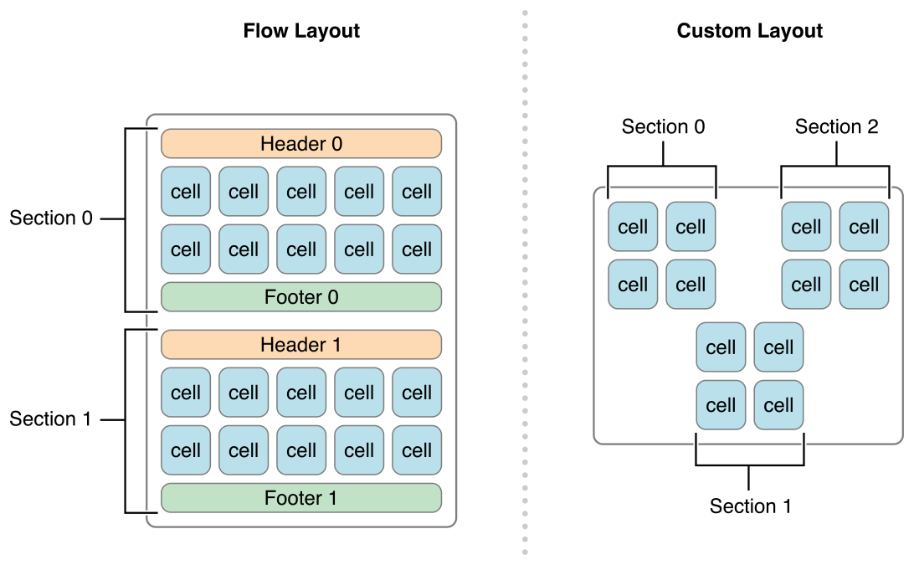
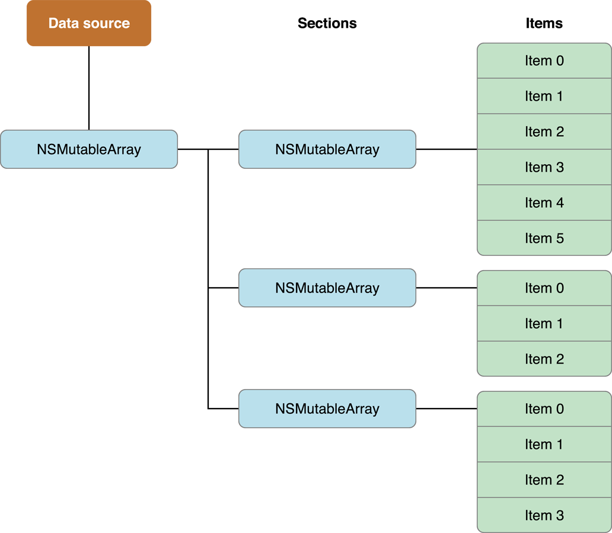
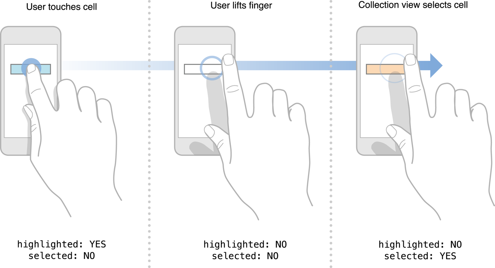

> 导航：[总目录](../../../README.md) · [文档](../../../_indexes/documentation.md) · [iOS Collection View 编程指南](About%20iOS%20Collection%20Views.md)


[下一页](Using%20the%20Flow%20Layout.md)[上一页](Collection%20View%20Basics.md)

# 设计数据源与委托

每个 collection view 都必须有一个数据源对象。__数据源对象__就是你的应用所显示内容的来源。它可以是来自你应用数据模型的对象，也可以是管理该 collection view 的 view controller。对数据源的唯一要求是：它必须能够提供 collection view 所需的信息，例如一共有多少个项目，以及显示这些项目时应该使用哪些视图。

__委托对象__是一个可选（但推荐）的对象，负责管理与内容呈现及交互相关的方方面面。尽管委托的主要职责是管理单元格的高亮和选中，但它也可以被扩展以提供更多信息。例如，流式布局扩展了基本的委托行为，用来自定义布局度量，比如单元格的尺寸和单元格之间的间距。

数据源对象负责管理你用 collection view 呈现的内容。数据源对象必须遵循 [UICollectionViewDataSource](https://developer.apple.com/documentation/uikit/uicollectionviewdatasource) 协议，该协议定义了你必须支持的基本行为和方法。数据源的职责是为 collection view 回答以下问题：

- Collection view 包含多少个 section？
- 对于给定的 section，其中包含多少个项目？
- 对于给定的 section 或项目，应该使用什么视图来显示对应的内容？

_section_ 和_项目（item）_是 collection view 内容的基本组织原则。一个 collection view 通常至少有一个 section，也可以包含更多。每个 section 又包含零个或多个项目。项目代表你想要呈现的主要内容，而 section 则把这些项目组织成逻辑分组。例如，一个照片应用可以用 section 来表示一个照片相册，或者同一天拍摄的一组照片。

Collection view 使用 [NSIndexPath](https://developer.apple.com/documentation/foundation/nsindexpath) 对象来引用它所包含的数据。在定位某个项目时，collection view 会使用布局对象提供给它的索引路径信息。对于项目，索引路径包含一个 section 编号和一个项目编号。对于补充视图和装饰视图，索引路径包含的是布局对象提供的任意值。附加在补充视图和装饰视图上的索引路径的具体含义取决于你的应用，不过第一个索引对应数据源中的某个特定 section。这些视图的索引路径更多是用于标识而非表达含义——标识当前正在处理的是哪一类中的哪一个视图。举例来说，如果你像在流式布局中那样用补充视图为各个 section 创建页眉和页脚，那么索引路径所提供的关键信息就是被引用的那个 section。

无论你在数据对象中如何组织 section 和项目，这些 section 和项目的可视呈现仍然由布局对象决定。不同的布局对象可能以截然不同的方式呈现 section 和项目数据，如图 2-1 所示。在这张图中，流式布局对象把各个 section 垂直排列，每个后继 section 位于前一个 section 之下。而自定义布局可以把各个 section 按非线性的方式摆放——这再次体现了布局与实际数据之间的分离。

__图 2-1__  Section 按布局对象的方式排列



高效的数据源会利用 section 和项目来帮助组织其底层数据对象。把数据组织成 section 和项目会让之后实现数据源方法容易得多。而且由于数据源方法会被频繁调用，你要确保这些方法的实现能够尽可能快地取回数据。

一个简单的方案（当然也不是唯一的方案）是让数据源使用一组嵌套数组，如图 2-2 所示。在这种结构中，顶层数组包含一个或多个数组，分别代表数据源的各个 section。每个 section 数组再包含该 section 的数据项。要在某个 section 中查找一个项目，只需取出它的 section 数组，然后从该数组中取出对应项目即可。这种组织方式便于管理中等规模的项目集合，并能按需取回单个项目。

__图 2-2__  用嵌套数组组织数据对象



设计数据结构时，你始终可以先从一组简单的数组开始，在需要时再迁移到更高效的结构。一般来说，你的数据对象不应该成为性能瓶颈。Collection view 通常只会在以下情况访问你的数据源：计算对象的总数，以及为当前屏幕上的元素获取视图。如果布局对象仅依赖来自你数据对象的数据，那么当数据源包含数千个对象时，性能可能会受到严重影响。

Collection view 向数据源提出的问题中，就包括它包含多少个 section 以及每个 section 包含多少个项目。当发生以下任一情况时，collection view 会要求你的数据源提供这些信息：

- Collection view 第一次显示。
- 你向 collection view 指派了另一个数据源对象。
- 你显式调用了 collection view 的 [reloadData](https://developer.apple.com/documentation/uikit/uicollectionview/1618078-reloaddata) 方法。
- Collection view 的委托通过 [performBatchUpdates:completion:](https://developer.apple.com/documentation/uikit/uicollectionview/1618045-performbatchupdates) 或任何移动、插入、删除方法执行了一个 block。

你通过 [numberOfSectionsInCollectionView:](https://developer.apple.com/documentation/uikit/uicollectionviewdatasource/1618023-numberofsections) 方法提供 section 的数量，通过 [collectionView:numberOfItemsInSection:](https://developer.apple.com/documentation/uikit/uicollectionviewdatasource/1618058-collectionview) 方法提供每个 section 中项目的数量。你必须实现 `collectionView:numberOfItemsInSection:` 方法，但如果你的 collection view 只有一个 section，实现 `numberOfSectionsInCollectionView:` 方法就是可选的。这两个方法都返回包含相应信息的整数值。

如果你按照[图 2-2](#apple-f4xwc4dqnrsv64tfmyxwi33df52wszbpkridimbqgezdgmzufvbuqnznknltcmi)所示的方式实现数据源，那么你的数据源方法的实现可以像清单 2-1 那样简单。在这段代码中，`_data` 变量是数据源的一个自定义成员变量，存储着 section 的顶层数组。取该数组的计数即可得到 section 的数量；取其中一个子数组的计数即可得到该 section 中项目的数量。（当然，你自己的代码应该做必要的错误检查，以确保返回的值是有效的。）

__清单 2-1__  提供 section 和项目的数量

```objc
- (NSInteger)numberOfSectionsInCollectionView:(UICollectionView*)collectionView {
    // _data 是一个类成员变量，每个 section 对应其中的一个数组。
    return [_data count];
}

- (NSInteger)collectionView:(UICollectionView*)collectionView numberOfItemsInSection:(NSInteger)section {
    NSArray* sectionArray = [_data objectAtIndex:section];
    return [sectionArray count];
}
```


数据源的另一项重要任务是提供 collection view 用来显示内容的视图。Collection view 并不跟踪你应用的内容。它只是接收你提供给它的视图，并把当前的布局信息应用到这些视图上。因此，视图所显示的一切内容都由你负责。

在你的数据源报告了它管理的 section 和项目数量之后，collection view 会要求布局对象为 collection view 的内容提供布局属性。在某个时刻，collection view 会要求布局对象提供某个特定矩形区域内（通常就是可视矩形区域）的元素列表。Collection view 用这个列表向你的数据源请求对应的单元格和补充视图。要提供这些单元格和补充视图，你的代码必须完成以下工作：

1. 把你的模板单元格和视图嵌入 storyboard 文件中。（或者，为每种受支持的单元格或视图注册一个类或 nib 文件。）
2. 在数据源中，当被请求时取出并配置相应的单元格或视图。

为了确保单元格和补充视图以尽可能高效的方式被使用，collection view 把创建这些对象的职责揽到了自己身上。每个 collection view 都维护着内部的队列，存放当前未使用的单元格和补充视图。你不需要自己创建对象，只要向 collection view 索取你想要的视图即可。如果复用队列中有等待复用的视图，collection view 会准备好它并快速返回给你。如果没有，collection view 会使用已注册的类或 nib 文件创建一个新视图并返回给你。因此，每次你取出一个单元格或视图时，得到的总是一个可以直接使用的对象。

复用标识符使得注册多种类型的单元格和多种类型的补充视图成为可能。_复用标识符_是一个字符串，用来区分你注册的各种单元格和视图类型。字符串的内容只与你的数据源对象相关。但当被请求提供视图或单元格时，你可以用传入的索引路径来判断可能需要哪种类型的视图或单元格，然后把相应的复用标识符传给取出（dequeue）方法。

你可以通过代码或者在应用的 storyboard 文件中配置 collection view 的单元格和视图。

__在 storyboard 中配置单元格和视图。__在 storyboard 中配置单元格和补充视图时，只需把对应项目拖到 collection view 上并在那里进行配置。这会在 collection view 与相应的单元格或视图之间建立关联。

- 对于单元格，从对象库中拖一个 Collection View Cell 放到你的 collection view 上。把单元格的自定义类和 collection reusable view 标识符设置为合适的值。
- 对于补充视图，从对象库中拖一个 Collection Reusable View 放到你的 collection view 上。把视图的自定义类和 collection reusable view 标识符设置为合适的值。

__通过代码配置单元格。__使用 [registerClass:forCellWithReuseIdentifier:](https://developer.apple.com/documentation/uikit/uicollectionview/1618089-register) 或 [registerNib:forCellWithReuseIdentifier:](https://developer.apple.com/documentation/uikit/uicollectionview/1618083-register) 方法把单元格与复用标识符关联起来。你可以在父 view controller 的初始化过程中调用这些方法。

__通过代码配置补充视图。__使用 [registerClass:forSupplementaryViewOfKind:withReuseIdentifier:](https://developer.apple.com/documentation/uikit/uicollectionview/1618103-register) 或 [registerNib:forSupplementaryViewOfKind:withReuseIdentifier:](https://developer.apple.com/documentation/uikit/uicollectionview/1618101-registernib) 方法把每种视图与复用标识符关联起来。你可以在父 view controller 的初始化过程中调用这些方法。

注册单元格只需要一个复用标识符，而补充视图则要求你额外指定一个称为_kind 字符串_的标识符。每个布局对象负责定义它所支持的补充视图的_kind_。例如，`UICollectionViewFlowLayout` 类支持两种补充视图：section 页眉视图和 section 页脚视图。为了标识这两种视图，它定义了字符串常量 [UICollectionElementKindSectionHeader](https://developer.apple.com/documentation/uikit/uicollectionelementkindsectionheader) 和 [UICollectionElementKindSectionFooter](https://developer.apple.com/documentation/uikit/uicollectionelementkindsectionfooter)。在布局过程中，布局对象会把 kind 字符串与该视图类型的其他布局属性放在一起。随后 collection view 会把这些信息传递给你的数据源。数据源再根据 kind 字符串和复用标识符两者来决定要取出并返回哪个视图对象。

注册是一次性的操作，必须在你尝试取出任何单元格或视图之前完成。注册之后，你可以按需取出任意数量的单元格或视图，而无需重新注册。不建议你在取出了一个或多个项目之后再更改注册信息。最好的做法是只注册一次单元格和视图，之后就不再改动。

你的数据源对象负责在 collection view 请求时提供单元格和补充视图。[UICollectionViewDataSource](https://developer.apple.com/documentation/uikit/uicollectionviewdatasource) 协议为此定义了两个方法：[collectionView:cellForItemAtIndexPath:](https://developer.apple.com/documentation/uikit/uicollectionviewdatasource/1618029-collectionview) 和 [collectionView:viewForSupplementaryElementOfKind:atIndexPath:](https://developer.apple.com/documentation/uikit/uicollectionviewdatasource/1618037-collectionview)。由于单元格是 collection view 的必需元素，你的数据源必须实现 `collectionView:cellForItemAtIndexPath:` 方法；而 `collectionView:viewForSupplementaryElementOfKind:atIndexPath:` 方法是可选的，取决于所使用的布局类型。在这两种情况下，你对这些方法的实现都遵循一个非常简单的模式：

1. 使用 [dequeueReusableCellWithReuseIdentifier:forIndexPath:](https://developer.apple.com/documentation/uikit/uicollectionview/1618063-dequeuereusablecell) 或 [dequeueReusableSupplementaryViewOfKind:withReuseIdentifier:forIndexPath:](https://developer.apple.com/documentation/uikit/uicollectionview/1618068-dequeuereusablesupplementaryview) 方法取出适当类型的单元格或视图。
2. 用指定索引路径处的数据配置视图。
3. 返回视图。

取出过程的设计目的就是把「必须自己创建单元格或视图」这一职责从你身上卸掉。只要你之前注册过某个单元格或视图，取出方法就保证永远不会返回 `nil`。如果复用队列中没有给定类型的单元格或视图，取出方法会直接使用你的 storyboard，或者使用你注册的类或 nib 文件创建一个。

取出过程返回给你的单元格应该处于初始干净的状态，可以随时用新数据进行配置。对于必须新建的单元格或视图，取出过程会通过常规流程创建并初始化它——也就是从 storyboard 或 nib 文件加载视图，或者创建一个新实例并用 [initWithFrame:](https://developer.apple.com/documentation/uikit/uiview/1622488-init) 方法初始化。相反，如果一个项目不是从零创建的，而是从复用队列中取回的，那么它可能已经包含了上一次使用时留下的数据。在这种情况下，取出方法会调用该项目的 [prepareForReuse](https://developer.apple.com/documentation/uikit/uicollectionreusableview/1620141-prepareforreuse) 方法，让它有机会把自己恢复到初始干净的状态。当你实现自定义单元格或视图类时，可以重写这个方法，把各个属性重置为默认值并执行任何额外的清理工作。

数据源取出视图之后，就用新数据配置该视图。你可以用传给数据源方法的索引路径找到相应的数据对象，然后把该对象的数据应用到视图上。配置完视图后，从方法中返回它，任务就完成了。清单 2-2 展示了一个如何配置单元格的简单示例。在取出单元格之后，该方法利用单元格的位置信息设置单元格的自定义标签，然后返回该单元格。

__清单 2-2__  配置自定义单元格

```objc
- (UICollectionViewCell *)collectionView:(UICollectionView *)collectionView
                  cellForItemAtIndexPath:(NSIndexPath *)indexPath {
   MyCustomCell* newCell = [self.collectionView dequeueReusableCellWithReuseIdentifier:MyCellID
                                                                          forIndexPath:indexPath];

   newCell.cellLabel.text = [NSString stringWithFormat:@"Section:%d, Item:%d", indexPath.section, indexPath.item];
   return newCell;
}
```


要插入、删除或移动单个 section 或项目，请按以下步骤操作：

1. 更新数据源对象中的数据。
2. 调用 collection view 的相应方法来插入或删除该 section 或项目。

关键在于：必须先更新数据源，然后再把任何变化通知给 collection view。Collection view 的方法假定你的数据源包含当前正确的数据。如果不是这样，collection view 可能会从你的数据源得到错误的项目集合，或者请求根本不存在的项目，从而导致应用崩溃。

当你以编程方式添加、删除或移动单个项目时，collection view 的方法会自动创建动画来反映这些变化。不过，如果你想把多个变化放在一起做动画，就必须把所有的插入、删除或移动调用放在一个 block 中，并把这个 block 传给 [performBatchUpdates:completion:](https://developer.apple.com/documentation/uikit/uicollectionview/1618045-performbatchupdates) 方法。批量更新过程会同时为你的所有变化添加动画，而且你可以在同一个 block 中自由混合插入、删除和移动项目的调用。

清单 2-3 展示了一个如何执行批量更新以删除当前选中项目的简单示例。传给 `performBatchUpdates:completion:` 方法的 block 首先调用一个自定义方法来更新数据源，然后告诉 collection view 删除这些项目。你提供的更新 block 和完成 block 都是同步执行的。

__清单 2-3__  删除选中的项目

```objc
[self.collectionView performBatchUpdates:^{
   NSArray* itemPaths = [self.collectionView indexPathsForSelectedItems];

   // 从数据源中删除这些项目。
   [self deleteItemsFromDataSourceAtIndexPaths:itemPaths];

   // 现在再从 collection view 中删除这些项目。
   [self.collectionView deleteItemsAtIndexPaths:itemPaths];
} completion:nil];
```


Collection view 默认支持单选，也可以配置为支持多选，或者完全禁用选择。Collection view 会检测其边界内的轻点，并相应地高亮或选中对应的单元格。在大多数情况下，collection view 只修改单元格的属性来表示它被选中或高亮；它不会改变你单元格的视觉外观，但有一个例外：如果单元格的 [selectedBackgroundView](https://developer.apple.com/documentation/uikit/uicollectionviewcell/1620138-selectedbackgroundview) 属性包含一个有效的视图，collection view 会在单元格被高亮或选中时显示该视图。

清单 2-4 展示的代码可以整合进你的自定义 collection view 单元格实现中，让单元格在高亮和选中状态下呈现不同的外观。当单元格首次加载，以及单元格既未高亮也未选中时，单元格的 [backgroundView](https://developer.apple.com/documentation/uikit/uicollectionviewcell/1620131-backgroundview) 属性始终是默认视图。每当单元格被高亮或选中时，[selectedBackgroundView](https://developer.apple.com/documentation/uikit/uicollectionviewcell/1620138-selectedbackgroundview) 属性会取代默认背景视图。在这个例子中，单元格的背景色会在被选中或高亮时从红色变为白色。

__清单 2-4__  设置背景视图以表示状态变化

```objc
UIView* backgroundView = [[UIView alloc] initWithFrame:self.bounds];
backgroundView.backgroundColor = [UIColor redColor];
self.backgroundView = backgroundView;

UIView* selectedBGView = [[UIView alloc] initWithFrame:self.bounds];
selectedBGView.backgroundColor = [UIColor whiteColor];
self.selectedBackgroundView = selectedBGView;
```

Collection view 的委托为 collection view 提供了以下方法来支持高亮和选中：

- [collectionView:shouldSelectItemAtIndexPath:](https://developer.apple.com/documentation/uikit/uicollectionviewdelegate/1618095-collectionview)
- [collectionView:shouldDeselectItemAtIndexPath:](https://developer.apple.com/documentation/uikit/uicollectionviewdelegate/1618067-collectionview)
- [collectionView:didSelectItemAtIndexPath:](https://developer.apple.com/documentation/uikit/uicollectionviewdelegate/1618032-collectionview)
- [collectionView:didDeselectItemAtIndexPath:](https://developer.apple.com/documentation/uikit/uicollectionviewdelegate/1618035-collectionview)
- [collectionView:shouldHighlightItemAtIndexPath:](https://developer.apple.com/documentation/uikit/uicollectionviewdelegate/1618070-collectionview)
- [collectionView:didHighlightItemAtIndexPath:](https://developer.apple.com/documentation/uikit/uicollectionviewdelegate/1618049-collectionview)
- [collectionView:didUnhighlightItemAtIndexPath:](https://developer.apple.com/documentation/uikit/uicollectionviewdelegate/1618027-collectionview)

这些方法为你提供了大量机会，把 collection view 的高亮/选中行为微调到完全符合你期望的效果。

例如，如果你倾向于自己绘制单元格的选中状态，可以把 `selectedBackgroundView` 属性保持为 `nil`，并通过委托对象对单元格应用任何视觉更改。你可以在 [collectionView:didSelectItemAtIndexPath:](https://developer.apple.com/documentation/uikit/uicollectionviewdelegate/1618032-collectionview) 方法中应用视觉更改，并在 `collectionView:didDeselectItemAtIndexPath:` 方法中移除它们。

如果你倾向于自己绘制高亮状态，可以重写 [collectionView:didHighlightItemAtIndexPath:](https://developer.apple.com/documentation/uikit/uicollectionviewdelegate/1618049-collectionview) 和 [collectionView:didUnhighlightItemAtIndexPath:](https://developer.apple.com/documentation/uikit/uicollectionviewdelegate/1618027-collectionview) 委托方法，用它们来应用你的高亮效果。如果你还在 `selectedBackgroundView` 属性中指定了视图，那么你应该把更改应用到单元格的 content view 上，以确保你的更改可见。清单 2-5 展示了一种利用 content view 背景色来改变高亮效果的简单方式。

__清单 2-5__  为单元格应用临时高亮

```objc
- (void)collectionView:(UICollectionView *)colView didHighlightItemAtIndexPath:(NSIndexPath *)indexPath {
    UICollectionViewCell* cell = [colView cellForItemAtIndexPath:indexPath];
    cell.contentView.backgroundColor = [UIColor blueColor];
}

- (void)collectionView:(UICollectionView *)colView didUnhighlightItemAtIndexPath:(NSIndexPath *)indexPath {
    UICollectionViewCell* cell = [colView cellForItemAtIndexPath:indexPath];
    cell.contentView.backgroundColor = nil;
}
```

单元格的高亮状态和选中状态之间有一个微妙但重要的区别。__高亮状态__是一种过渡状态，当用户的手指还触碰着设备时，你可以用它为单元格应用可见的高亮效果。只有当 collection view 正在追踪发生在单元格上的触摸事件时，该状态才会被置为 `YES`。当触摸事件结束时，高亮状态会恢复为 `NO`。相比之下，__选中状态__只有在一系列触摸事件结束之后才会改变——具体来说，是当这些触摸事件表明用户试图选中该单元格时。

图 2-3 展示了用户触摸一个未选中单元格时所发生的一系列步骤。最初的 touch-down 事件会让 collection view 把单元格的高亮状态改为 `YES`，不过这样做并不会自动改变单元格的外观。如果最后的 touch-up 事件发生在该单元格内，高亮状态会恢复为 `NO`，而 collection view 会把选中状态改为 `YES`。当用户改变选中状态时，collection view 会显示单元格 `selectedBackgroundView` 属性中的视图，但这是 collection view 对单元格所做的唯一视觉更改。任何其他的视觉更改都必须由你的委托对象来完成。

__图 2-3__  追踪单元格上的触摸



无论用户是在选中还是取消选中一个单元格，单元格的选中状态总是最后才改变的。轻点单元格总是首先导致单元格高亮状态的变化。只有当轻点序列结束、且该序列期间应用的所有高亮效果都被移除之后，单元格的选中状态才会改变。在设计单元格时，你应该确保高亮效果和选中状态的视觉外观不会以意想不到的方式相互冲突。

当用户在某个单元格上执行长按手势时，collection view 会尝试为该单元格显示一个编辑菜单。编辑菜单可用于对 collection view 中的单元格执行剪切、拷贝和粘贴操作。要显示编辑菜单，必须满足以下几个条件：

- 委托必须实现全部三个与处理操作相关的方法：

  [collectionView:shouldShowMenuForItemAtIndexPath:](https://developer.apple.com/documentation/uikit/uicollectionviewdelegate/1618010-collectionview)

  [collectionView:canPerformAction:forItemAtIndexPath:withSender:](https://developer.apple.com/documentation/uikit/uicollectionviewdelegate/1618051-collectionview)

  [collectionView:performAction:forItemAtIndexPath:withSender:](https://developer.apple.com/documentation/uikit/uicollectionviewdelegate/1618073-collectionview)
- 对于指定的单元格，`collectionView:shouldShowMenuForItemAtIndexPath:` 方法必须返回 `YES`。
- 对于至少一个期望的操作，`collectionView:canPerformAction:forItemAtIndexPath:withSender:` 方法必须返回 `YES`。Collection view 支持以下操作：

  `cut:`

  `copy:`

  `paste:`

如果满足了这些条件，并且用户从菜单中选择了某个操作，collection view 就会调用委托的 `collectionView:performAction:forItemAtIndexPath:withSender:` 方法，对指定项目执行该操作。

清单 2-6 展示了如何阻止某个菜单项出现。在这个例子中，[collectionView:canPerformAction:forItemAtIndexPath:withSender:](https://developer.apple.com/documentation/uikit/uicollectionviewdelegate/1618051-collectionview) 方法阻止了「剪切」菜单项出现在编辑菜单中，同时启用了「拷贝」和「粘贴」项，以便用户可以插入内容。

__清单 2-6__  选择性地禁用编辑菜单中的操作

```objc
- (BOOL)collectionView:(UICollectionView *)collectionView
        canPerformAction:(SEL)action
        forItemAtIndexPath:(NSIndexPath *)indexPath
        withSender:(id)sender {
   // 只支持单元格的拷贝和粘贴。
   if ([NSStringFromSelector(action) isEqualToString:@"copy:"]
      || [NSStringFromSelector(action) isEqualToString:@"paste:"])
      return YES;

   // 阻止所有其他操作。
   return NO;
}
```

有关使用粘贴板命令的更多信息，请参阅 _[Text Programming Guide for iOS](../../Strings%20Text%20Fonts/Text%20Programming%20Guide%20for%20iOS/About%20Text%20Handling%20in%20iOS.md#apple-f4xwc4dqnrsv64tfmyxwi33df52wszbpkridimbqga4tknbs)_。

在布局之间进行过渡最简单的方法是使用 [setCollectionViewLayout:animated:](https://developer.apple.com/documentation/uikit/uicollectionview/1618086-setcollectionviewlayout) 方法。不过，如果你需要控制过渡过程，或者希望它是交互式的，请使用 [UICollectionViewTransitionLayout](https://developer.apple.com/documentation/uikit/uicollectionviewtransitionlayout) 对象。

`UICollectionViewTransitionLayout` 类是一种特殊类型的布局，在过渡到新布局时会被安装为 collection view 的布局对象。借助过渡布局对象，你可以让对象沿非线性路径移动、使用不同的时序算法，或者根据传入的触摸事件移动。标准类提供的是到新布局的线性过渡，但与 [UICollectionViewLayout](https://developer.apple.com/documentation/uikit/uicollectionviewlayout) 类一样，`UICollectionViewTransitionLayout` 类也可以被子类化以创建任何想要的效果。为此，你需要实现与创建自定义布局时相同的方法，并让你的实现能够响应来自用户的输入——这些输入通常来自手势识别器。有关创建自定义布局对象的更多信息，请参阅[创建自定义布局](Creating%20Custom%20Layouts.md#apple-f4xwc4dqnrsv64tfmyxwi33df52wszbpkridimbqgezdgmzufvbuqnjnknltc)。

`UICollectionViewLayout` 类提供了几个用于跟踪布局间过渡的方法。`UICollectionViewTransitionLayout` 对象通过 [transitionProgress](https://developer.apple.com/documentation/uikit/uicollectionviewtransitionlayout/1622191-transitionprogress) 属性跟踪过渡的完成进度。在过渡进行期间，你的代码要周期性地更新这个属性，以指示过渡的完成百分比。例如，把 `UICollectionViewTransitionLayout` 类与手势识别器之类的对象（你可以用它实现在布局之间过渡）结合使用，就能创建交互式过渡。此外，如果你实现了自定义的过渡布局对象，`UICollectionViewTransitionLayout` 类还提供了两个方法来跟踪与你的布局相关的值：[updateValue:forAnimatedKey:](https://developer.apple.com/documentation/uikit/uicollectionviewtransitionlayout/1622194-updatevalue) 和 [valueForAnimatedKey:](https://developer.apple.com/documentation/uikit/uicollectionviewtransitionlayout/1622193-valueforanimatedkey) 方法。这些方法跟踪特殊的浮点值，你可以在过渡期间设置和更改这些值，以便向布局传达重要信息。例如，如果你用捏合手势在布局之间过渡，就可以用这些方法告诉过渡布局对象各个视图相互之间需要保持的偏移量。

在应用中加入 `UICollectionViewTransitionLayout` 对象的步骤如下：

1. 使用 [initWithCurrentLayout:nextLayout:](https://developer.apple.com/documentation/uikit/uicollectionviewtransitionlayout/1622189-init) 方法创建标准类或你自己自定义类的实例。
2. 通过周期性地修改 [transitionProgress](https://developer.apple.com/documentation/uikit/uicollectionviewtransitionlayout/1622191-transitionprogress) 属性来传达过渡的进度。更改过渡进度之后，别忘了用 collection view 的 [invalidateLayout](https://developer.apple.com/documentation/uikit/uicollectionviewlayout/1617728-invalidatelayout) 方法使布局失效。
3. 在 collection view 的委托中实现 [collectionView:transitionLayoutForOldLayout:newLayout:](https://developer.apple.com/documentation/uikit/uicollectionviewdelegate/1618100-collectionview) 方法，并返回你的过渡布局对象。
4. 可选地，使用 [updateValue:forAnimatedKey:](https://developer.apple.com/documentation/uikit/uicollectionviewtransitionlayout/1622194-updatevalue) 方法为你的布局修改相应的值，以指示与布局对象相关的值发生了变化。这种情况下的稳定值是 0。

[下一页](Using%20the%20Flow%20Layout.md)[上一页](Collection%20View%20Basics.md)

