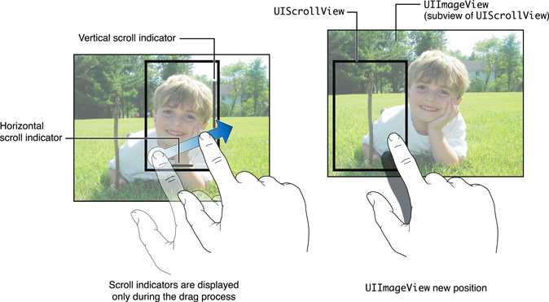

> 导航：[总目录](../../../README.md) · [文档](../../../_indexes/documentation.md)

[下一页](Creating%20and%20Configuring%20Scroll%20Views.md)

# 关于 Scroll View 编程

当需要展示和操作的内容无法在屏幕上完整显示时，iOS 应用中就会用到 Scroll View。Scroll View 主要有两个用途：

- 让用户拖动，以显示他们想看的那部分内容
- 让用户用捏合手势对显示的内容进行放大或缩小

下图展示了 `UIScrollView` 类的一种典型用法。其子视图是一个 `UIImageView`，里面装着一张男孩的图片。当用户在屏幕上拖动手指时，图片上的可视区域随之移动，并且如图所示，滚动指示器会显示出来。当用户抬起手指时，指示器随即消失。

`UIScrollView` 类提供以下功能：

- 滚动无法在屏幕上完整显示的内容
- 缩放内容，让你的应用支持标准的捏合手势来放大和缩小
- 限制每次只能滚动一屏内容（分页模式）

`UIScrollView` 类并没有为它所显示的内容定义任何专门的视图，它只是简单地滚动自己的子视图。之所以能采用这种简单的模型，是因为 iOS 上的 Scroll View 不需要额外的控件来触发滚动。

通过拖动或轻扫手势进行滚动，既不需要派生子类，也不需要委托（delegate）。除了需要用代码设置 `UIScrollView` 实例的内容尺寸之外，整个界面都可以在 Interface Builder 中创建和设计。

要添加基本的捏入和捏出缩放支持，Scroll View 就必须用到委托。委托类必须遵循 [UIScrollViewDelegate](https://developer.apple.com/documentation/uikit/uiscrollviewdelegate) 协议，并实现一个用于指定 Scroll View 中哪个子视图参与缩放的委托方法。你还必须指定最小放大倍数和最大放大倍数中的一个或两个。

如果你的应用需要支持双击放大、双指触摸缩小，以及简单的单指滚动和平移（在标准捏合手势之外），你就需要在内容视图中编写代码来实现这些功能。

如果你的应用需要支持双击放大、双指触摸缩小，以及简单的单指滚动和平移（在标准捏合手势之外），就要在内容视图中编写相应代码。

要支持分页模式，既不需要派生子类，也不需要委托。你只需指定内容尺寸并启用分页模式即可。大多数分页类应用只用三个子视图就能实现，从而节省内存空间并提升性能。

阅读本指南之前，请先阅读 _[App Programming Guide for iOS](https://developer.apple.com/library/archive/documentation/iPhone/Conceptual/iPhoneOSProgrammingGuide/Introduction/Introduction.html#//apple_ref/doc/uid/TP40007072)_，了解开发 iOS 应用的基本流程。你还可以阅读 _[View Controller Programming Guide for iOS](https://developer.apple.com/library/archive/featuredarticles/ViewControllerPGforiPhoneOS/index.html#//apple_ref/doc/uid/TP40007457)_，了解 View Controller 的通用知识——它们经常与 Scroll View 配合使用。

本指南余下的章节会带你逐步完成难度递增的任务，例如处理点按缩放技巧、理解委托的作用及其消息序列，以及在应用中嵌套 Scroll View。

下面这些示例代码工程对你自己实现 Table View 很有参考价值：

- _[Scrolling](../../../samplecode/Scrolling/Scrolling.md#apple-f4xwc4dqnrsv64tfmyxwi33df52wszbpirkfgnbqgaydqmbsgm)_ 演示了基本的滚动。
- _[PageControl: Using a Paginated UIScrollView](../../../samplecode/PageControl-%20Using%20a%20Paginated%20UIScrollView/PageControl-%20Using%20a%20Paginated%20UIScrollView.md#apple-f4xwc4dqnrsv64tfmyxwi33df52wszbpirkfgnbqgaydonzzgu)_ 演示了如何在分页模式下使用 Scroll View。
- _[ScrollViewSuite](../../../samplecode/ScrollViewSuite/ScrollViewSuite.md#apple-f4xwc4dqnrsv64tfmyxwi33df52wszbpirkfgnbqgaydqojqgq)_ 是一组示例工程。这些是较为进阶的例子，演示了点按滚动技巧以及其他相当高级的工程，包括用分块（tiling）方式以节省内存的形式显示大尺寸、高细节的图片。
[下一页](Creating%20and%20Configuring%20Scroll%20Views.md)

