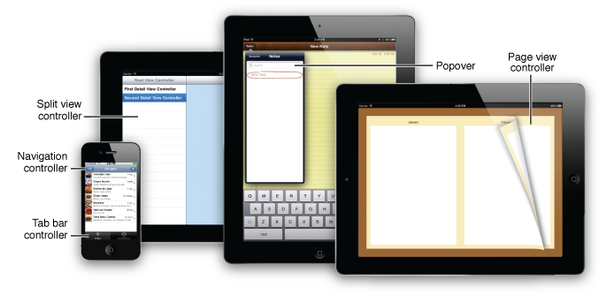

> 导航：[总目录](../../../README.md) · [文档](../../../_indexes/documentation.md)

[下一页](Navigation%20Controllers.md)

# 关于 View Controller

View Controller 负责呈现和管理一套视图层级。UIKit 框架包含了一批 View Controller 类，你可以用它们搭建出 iOS 中常见的各种用户交互范式。你可以把这些 View Controller 与自己需要编写的自定义 View Controller 搭配起来，构建 app 的用户界面。本文档介绍如何使用 UIKit 框架提供的这些 View Controller。

请先熟悉一下可以在 app 中使用的这些 View Controller。虽然你完全可以只用自定义 View Controller 构建整个 app，但使用系统提供的 View Controller 能减少你需要编写的代码量，也有助于保持一致的用户体验。

### Navigation Controller 管理由其他 View Controller 组成的栈

navigation controller 是 [UINavigationController](https://developer.apple.com/documentation/uikit/uinavigationcontroller) 类的实例，可以在 app 中直接按原样使用。内容有层次结构的 app 可以用 navigation controller 在各层内容之间导航。navigation controller 本身管理一个或多个自定义 View Controller 的显示，其中每个 View Controller 管理数据层级中某一特定层级的数据。navigation controller 还提供了相应的控件，用来指示当前在这个数据层级中所处的位置，以及沿层级向上返回。

### Tab Bar Controller 管理相互独立的 View Controller 集合

tab bar controller 是 [UITabBarController](https://developer.apple.com/documentation/uikit/uitabbarcontroller) 类的实例，可以在 app 中直接按原样使用。app 用 tab bar controller 管理多个彼此独立的界面，每个界面都可以由任意数量的自定义视图和 View Controller 组成。tab bar controller 还负责管理与标签栏视图的交互，用户点按标签栏即可切换当前选中的界面。例如，iPhone 和 iPod touch 上的 iPod app 就采用了标签栏界面，其中每个标签页代表一种查看用户音乐和媒体的方式。

### Page View Controller 以分页方式管理 View Controller 的显示

page view controller 是 [UIPageViewController](https://developer.apple.com/documentation/uikit/uipageviewcontroller) 类的实例，可以在 app 中直接按原样使用。app 可以用 page view controller 以分页的形式呈现内容。page view controller 本身管理一个或多个内容 View Controller 的显示，其中每个内容 View Controller 提供一页内容。page view controller 还提供了手势识别器，让用户可以在这些内容之间翻页导航。

### Split View Controller 管理两个信息窗格

split view controller 是 [UISplitViewController](https://developer.apple.com/documentation/uikit/uisplitviewcontroller) 类的实例，可以在 app 中直接按原样使用。app 可以用 split view controller 管理两个信息窗格，界面的这两个部分本身又各自由 View Controller 管理。这种界面与 navigation controller 类似，但它利用了 iPad 更大的屏幕尺寸，可以一次呈现更多内容。

### Popover 在浮动视图中呈现内容

[UIPopoverController](https://developer.apple.com/documentation/uikit/uipopovercontroller) 类与 app 中的 View Controller 协同工作，把内容呈现在一个浮动视图里。这种界面利用了 iPad 更大的屏幕尺寸，可以在大块内容的上下文中临时呈现一小部分内容。

### 组合 View Controller 可构建更复杂的界面

除了最简单的 app 之外，两个或更多 View Controller 协同工作是很常见的。navigation controller、tab bar controller 和 split view controller 总是要与其他 View Controller 配合使用，甚至你的自定义 View Controller 有时也需要呈现其他 View Controller。不过，有些 View Controller 的组合方式比另一些更合适。以合理的方式组合 View Controller，对于打造直观、易于导航的用户界面非常重要。

_[View Controller Programming Guide for iOS](https://developer.apple.com/library/archive/featuredarticles/ViewControllerPGforiPhoneOS/index.html#//apple_ref/doc/uid/TP40007457)_ 介绍了 iOS 上 View Controller 的设计模式和一般用法。

_[App Programming Guide for iOS](https://developer.apple.com/library/archive/documentation/iPhone/Conceptual/iPhoneOSProgrammingGuide/Introduction/Introduction.html#//apple_ref/doc/uid/TP40007072)_ 介绍了开发流程，并描述了核心架构。

_App Distribution Guide_ 介绍了配置、构建、调试和调优 app 并将其提交到 App Store 的各个步骤。

要了解如何设计 iOS app，请参阅 _iOS Human Interface Guidelines_。

要了解本文档所讨论的各个 View Controller 类，请参阅 _[UIKit Framework Reference](https://developer.apple.com/documentation/uikit)_。

[下一页](Navigation%20Controllers.md)

