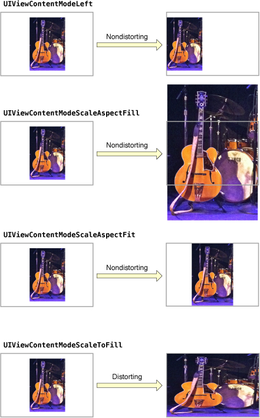
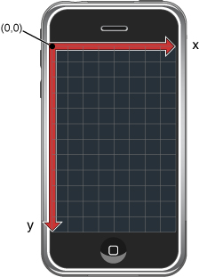
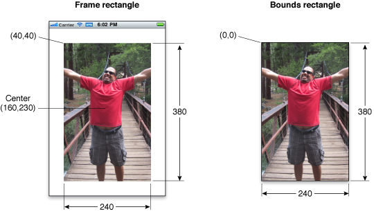
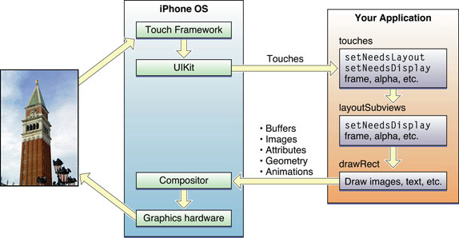

> 导航：[总目录](../../../README.md) · [文档](../../../_indexes/documentation.md) · [iOS 视图编程指南](About%20Windows%20and%20Views.md)

[下一页](Windows.md)[上一页](About%20Windows%20and%20Views.md)

# 视图与窗口架构

视图和窗口负责呈现应用的用户界面，并处理与该界面的交互。UIKit 和其他系统框架提供了大量视图，你几乎不需要做任何修改就能直接使用它们。如果某些地方需要以标准视图无法实现的方式呈现内容，你也可以定义自定义视图。

无论你使用系统视图还是创建自己的自定义视图，都需要理解 [UIView](https://developer.apple.com/documentation/uikit/uiview) 和 [UIWindow](https://developer.apple.com/documentation/uikit/uiwindow) 这两个类所提供的基础设施。这两个类提供了完善的机制来管理视图的布局与呈现。理解这些机制的工作方式非常重要，它能确保应用发生变化时，你的视图仍然表现得当。

在视觉层面上你想做的大多数事情，都是通过视图对象——也就是 [UIView](https://developer.apple.com/documentation/uikit/uiview) 类的实例——来完成的。一个视图对象在屏幕上定义了一块矩形区域，并处理该区域内的绘制和触摸事件。视图还可以充当其他视图的父级，协调这些视图的位置和尺寸。`UIView` 类承担了管理视图之间这类关系的绝大部分工作，但你也可以按需自定义其默认行为。

视图与 Core Animation 图层协同工作，共同完成视图内容的渲染和动画。UIKit 中的每个视图背后都有一个图层对象（通常是 [CALayer](https://developer.apple.com/documentation/quartzcore/calayer) 类的实例）作为支撑，该对象管理着视图的后备存储，并处理与视图相关的动画。你执行的大多数操作都应当通过 `UIView` 接口进行。不过，当你需要对视图的渲染或动画行为有更精细的控制时，也可以改为通过它的图层来操作。

要理解视图与图层之间的关系，看一个例子会很有帮助。图 1-1 展示了 _[ViewTransitions](../../../samplecode/ViewTransitions/ViewTransitions.md#apple-f4xwc4dqnrsv64tfmyxwi33df52wszbpirkfgnbqgaydonbrge)_ 示例应用的视图架构，以及它与底层 Core Animation 图层的关系。该应用中的视图包括：一个窗口（窗口本身也是视图）、一个充当容器视图的通用 `UIView` 对象、一个图像视图、一个用于显示控件的工具栏，以及一个栏按钮项（它本身不是视图，但内部管理着一个视图）。（真正的 _[ViewTransitions](../../../samplecode/ViewTransitions/ViewTransitions.md#apple-f4xwc4dqnrsv64tfmyxwi33df52wszbpirkfgnbqgaydonbrge)_ 示例应用还包含另一个用于实现过渡效果的图像视图。为简明起见，加之该视图通常处于隐藏状态，图 1-1 中并未将它画出。）每个视图都有一个与之对应的图层对象，可以通过该视图的 [layer](https://developer.apple.com/documentation/uikit/uiview/1622436-layer) 属性访问。（由于栏按钮项不是视图，你无法直接访问它的图层。）这些图层对象背后是 Core Animation 的渲染对象，最终则是用于管理屏幕上实际像素位的硬件缓冲区。

__图 1-1__  示例应用中的视图架构

!

使用 Core Animation 图层对象对性能有着重要影响。视图对象的实际绘制代码被调用的次数会尽可能少，而一旦调用，其结果就会被 Core Animation 缓存起来，并在之后尽可能地复用。复用已渲染的内容，免去了更新视图通常所需的昂贵绘制周期。这种内容复用在动画过程中尤为重要，因为现有内容可以直接被操控。这样的复用远比创建新内容开销小。

除了提供自身的内容之外，视图还可以充当其他视图的容器。当一个视图包含另一个视图时，二者之间就建立起了父子关系。这种关系中的下级视图称为 _子视图（subview）_，上级视图则称为 _父视图（superview）_。建立这类关系会同时影响应用的视觉外观和行为。

在视觉上，子视图的内容会遮住父视图内容的全部或一部分。如果子视图完全不透明，那么它所占据的区域会完全遮盖父视图的对应区域；如果子视图部分透明，则两个视图的内容会先混合，再显示到屏幕上。每个父视图都用一个有序数组保存自己的子视图，数组中的顺序同样会影响各个子视图的可见性。如果两个同级的子视图相互重叠，后添加（或被移动到子视图数组末尾）的那个会显示在另一个之上。

父视图与子视图的关系还会影响若干视图行为。改变父视图的尺寸会产生连锁反应，可能导致其所有子视图的尺寸和位置也随之改变。当你改变父视图的尺寸时，可以通过对各个子视图做适当配置来控制它们的调整尺寸行为。其他会影响子视图的改动还包括：隐藏父视图、修改父视图的 alpha（透明度），以及对父视图的坐标系施加数学变换。

视图在视图层级中的排布方式还决定了应用如何响应事件。当某个视图内部发生触摸时，系统会把携带触摸信息的事件对象直接发送给该视图处理。但如果该视图不处理这个触摸事件，它可以把事件对象沿着层级向上传给自己的父视图；如果父视图也不处理，就再传给它的父视图，如此沿响应者链一路向上。特定的视图还可以把事件对象传给中间的[响应者对象](https://developer.apple.com/library/archive/documentation/General/Conceptual/Devpedia-CocoaApp/Responder.html#//apple_ref/doc/uid/TP40009071-CH1)，例如某个 View Controller。如果没有任何对象处理该事件，它最终会到达应用对象，通常会被丢弃。

有关如何创建视图层级的更多信息，请参阅[创建和管理视图层级](Views.md#apple-f4xwc4dqnrsv64tfmyxwi33df52wszbpkridimbqga4tkmbtfvbuqnjnknltiny)。

[UIView](https://developer.apple.com/documentation/uikit/uiview) 类采用按需绘制的模型来呈现内容。当视图首次出现在屏幕上时，系统会要求它绘制自己的内容。系统会为这份内容拍下一张快照，并以该快照作为视图的视觉呈现。如果你从不改变视图的内容，视图的绘制代码可能就再也不会被调用了——涉及该视图的大多数操作都会复用这张快照图像。而一旦你确实改变了内容，就要通知系统该视图已发生变化，视图随后会重复“绘制视图并为新结果拍快照”的过程。

当视图的内容发生变化时，你不要直接去重绘这些变化，而应使用 [setNeedsDisplay](https://developer.apple.com/documentation/uikit/uiview/1622437-setneedsdisplay) 或 [setNeedsDisplayInRect:](https://developer.apple.com/documentation/uikit/uiview/1622587-setneedsdisplayinrect) 方法让视图失效。这些方法会告诉系统：该视图的内容已经改变，需要在下一次时机到来时重绘。系统会一直等到当前运行循环结束，才启动任何绘制操作。这段延迟给了你机会，让你可以一次性地使多个视图失效、在层级中添加或移除视图、隐藏视图、调整视图尺寸以及重新定位视图。你所做的全部改动随后会被同时反映出来。

到了真正渲染视图内容的时候，实际的绘制过程会因视图及其配置而异。系统视图通常会实现私有的绘制方法来渲染自身内容，同时也往往会暴露一些接口，供你配置视图的实际外观。对于自定义的 `UIView` 子类，你通常会重写视图的 [drawRect:](https://developer.apple.com/documentation/uikit/uiview/1622529-draw) 方法，并在该方法中绘制视图的内容。提供视图内容还有别的办法，比如直接设置底层图层的内容，但重写 `drawRect:` 方法是最常见的做法。

有关如何为自定义视图绘制内容的更多信息，请参阅[实现你的绘制代码](Views.md#apple-f4xwc4dqnrsv64tfmyxwi33df52wszbpkridimbqga4tkmbtfvbuqnjnknltg)。

每个视图都有一个内容模式（content mode），它控制着视图在几何属性发生变化时如何复用自己的内容，以及是否复用。视图首次显示时会照常渲染内容，结果被保存在一张底层位图中。此后，视图几何属性的变化并不总会导致这张位图被重新创建；究竟是把位图缩放以适配新的 bounds，还是干脆把它钉在视图的某个角或某条边上，取决于 [contentMode](https://developer.apple.com/documentation/uikit/uiview/1622619-contentmode) 属性的值。

只要你执行下列操作，视图的内容模式就会生效：

- 改变视图 [frame](https://developer.apple.com/documentation/uikit/uiview/1622621-frame) 或 [bounds](https://developer.apple.com/documentation/uikit/uiview/1622580-bounds) 矩形的宽度或高度。
- 把一个包含缩放因子的变换赋给视图的 [transform](https://developer.apple.com/documentation/uikit/uiview/1622459-transform) [属性](https://developer.apple.com/library/archive/documentation/General/Conceptual/DevPedia-CocoaCore/DeclaredProperty.html#//apple_ref/doc/uid/TP40008195-CH13)。

默认情况下，大多数视图的 `contentMode` 属性都被设置为 [UIViewContentModeScaleToFill](https://developer.apple.com/documentation/uikit/uiviewcontentmode/uiviewcontentmodescaletofill)，这会让视图的内容被缩放以适配新的 frame 尺寸。图 1-2 展示了几种可用内容模式的效果。从图中可以看到，并非所有内容模式都会把视图的 bounds 完全填满，而那些会填满的模式则可能让视图内容变形。

__图 1-2__  内容模式对比

内容模式很适合用来复用视图的内容，但如果你确实希望自定义视图在缩放和调整尺寸时重绘自己，也可以把内容模式设置为 [UIViewContentModeRedraw](https://developer.apple.com/documentation/uikit/uiview/contentmode/redraw)。把视图的内容模式设为该值，会强制系统在几何属性变化时调用视图的 `drawRect:` 方法。一般来说，你应尽量避免使用这个值，尤其绝不应该把它用在标准系统视图上。

有关可用内容模式的更多信息，请参阅 _[UIView 类参考](https://developer.apple.com/documentation/uikit/uiview)_。

你可以把视图的一部分指定为可拉伸区域，这样当视图尺寸变化时，只有可拉伸部分的内容会受到影响。可拉伸区域通常用于按钮或其他视图，这类视图的某一部分定义了可重复的图案。你指定的可拉伸区域可以只沿视图的一个轴拉伸，也可以沿两个轴同时拉伸。当然，沿两个轴拉伸视图时，视图的边缘也必须定义为可重复的图案，才能避免出现变形。图 1-3 展示了这种变形在视图中的表现：视图原有的每个像素的颜色都会被复制，用来填满放大后视图中的对应区域。

__图 1-3__  拉伸按钮的背景

!

你可以通过 [contentStretch](https://developer.apple.com/documentation/uikit/uiview/1622511-contentstretch) 属性指定视图的可拉伸区域。该属性接受一个矩形，其数值被归一化到 `0.0` 到 `1.0` 的范围内。拉伸视图时，系统会把这些归一化数值乘以视图当前的 bounds 和缩放因子，从而确定需要拉伸的是哪一个或哪几个像素。使用归一化数值的好处是：视图的 bounds 每次变化时，你都不必再去更新 `contentStretch` 属性。

视图的内容模式同样会影响可拉伸区域的使用方式。只有当内容模式会导致视图内容被缩放时，可拉伸区域才会派上用场。这意味着只有 [UIViewContentModeScaleToFill](https://developer.apple.com/documentation/uikit/uiviewcontentmode/uiviewcontentmodescaletofill)、[UIViewContentModeScaleAspectFit](https://developer.apple.com/documentation/uikit/uiviewcontentmode/uiviewcontentmodescaleaspectfit) 和 [UIViewContentModeScaleAspectFill](https://developer.apple.com/documentation/uikit/uiviewcontentmode/uiviewcontentmodescaleaspectfill) 这几种内容模式支持可拉伸视图。如果你指定的内容模式是把内容钉在某条边或某个角上（因而并不真正缩放内容），视图就会忽略可拉伸区域。

每个视图背后都有一个图层对象，好处之一就是许多与视图相关的变化都可以轻松地做成动画。动画是向用户传达信息的有效方式，在设计应用时应当始终把它纳入考虑。[UIView](https://developer.apple.com/documentation/uikit/uiview) 类的许多属性都是_可动画的（animatable）_——也就是说，系统半自动地支持把属性从一个值过渡到另一个值。要为这类可动画属性执行动画，你只需要做两件事：

1. 告诉 UIKit 你想执行一次动画。
2. 修改属性的值。

`UIView` 对象上可以做动画的属性包括以下这些：

- [frame](https://developer.apple.com/documentation/uikit/uiview/1622621-frame)——用它来为视图的位置和尺寸变化做动画。
- [bounds](https://developer.apple.com/documentation/uikit/uiview/1622580-bounds)——用它来为视图的尺寸变化做动画。
- [center](https://developer.apple.com/documentation/uikit/uiview/1622627-center)——用它来为视图的位置做动画。
- [transform](https://developer.apple.com/documentation/uikit/uiview/1622459-transform)——用它来旋转或缩放视图。
- [alpha](https://developer.apple.com/documentation/uikit/uiview/1622417-alpha)——用它来改变视图的透明度。
- [backgroundColor](https://developer.apple.com/documentation/uikit/uiview/1622591-backgroundcolor)——用它来改变视图的背景色。
- [contentStretch](https://developer.apple.com/documentation/uikit/uiview/1622511-contentstretch)——用它来改变视图内容的拉伸方式。

动画非常重要的一个场景，是从一组视图过渡到另一组视图。通常你会用一个 View Controller 来管理用户界面各部分之间重大切换所对应的动画。例如，对于需要从高层级信息导航到低层级信息的界面，你通常会用一个导航控制器来管理各级数据视图之间的过渡。不过，你也可以不借助 View Controller，直接用动画在两组视图之间创建过渡效果。当标准的 View Controller 动画达不到你想要的效果时，就可以这么做。

除了使用 UIKit 类创建动画之外，你还可以使用 Core Animation 图层来创建动画。下沉到图层层面，能让你对动画的时间控制和属性有更强的掌控力。

有关如何执行基于视图的动画的详细信息，请参阅[动画](Animations.md#apple-f4xwc4dqnrsv64tfmyxwi33df52wszbpkridimbqga4tkmbtfvbuqnrnknltc)。有关使用 Core Animation 创建动画的更多信息，请参阅 _[Core Animation 编程指南](../../Cocoa/Core%20Animation%20Programming%20Guide/About%20Core%20Animation.md#apple-f4xwc4dqnrsv64tfmyxwi33df52wszbpkridimbqga2dkmju)_ 和 _[Core Animation 实用手册](../../Graphics%20Imaging/Core%20Animation%20Cookbook/Core%20Animation%20Cookbook.md#apple-f4xwc4dqnrsv64tfmyxwi33df52wszbpkridimbqga2timbw)_。

UIKit 默认坐标系的原点位于左上角，两条坐标轴从原点分别向下和向右延伸。坐标值用浮点数表示，这样无论底层屏幕分辨率如何，都能精确地布局和定位内容。图 1-4 展示了这个坐标系相对于屏幕的样子。除了屏幕坐标系之外，窗口和视图还各自定义了自己的局部坐标系，让你可以相对于视图或窗口的原点（而非相对于屏幕）来指定坐标。

__图 1-4__  UIKit 中坐标系的方向

由于每个视图和窗口都定义了自己的局部坐标系，你需要随时清楚当前生效的是哪个坐标系。每当你向视图中绘制内容或改变它的几何属性时，都是相对于某个坐标系进行的。绘制时，你指定的坐标相对于视图自身的坐标系；改变几何属性时，你指定的坐标则相对于父视图的坐标系。`UIWindow` 和 `UIView` 类都提供了方法，帮助你在不同坐标系之间做转换。

视图对象用 `frame`、`bounds` 和 `center` 这三个[属性](https://developer.apple.com/library/archive/documentation/General/Conceptual/DevPedia-CocoaCore/DeclaredProperty.html#//apple_ref/doc/uid/TP40008195-CH13)来记录自己的尺寸和位置：

- [frame](https://developer.apple.com/documentation/uikit/uiview/1622621-frame) 属性保存的是 _frame 矩形_，它在父视图的坐标系中指定该视图的尺寸和位置。
- [bounds](https://developer.apple.com/documentation/uikit/uiview/1622580-bounds) 属性保存的是 _bounds 矩形_，它在视图自身的局部坐标系中指定该视图的尺寸（以及内容原点）。
- [center](https://developer.apple.com/documentation/uikit/uiview/1622627-center) 属性保存的是该视图在父视图坐标系中的已知中心点。

`center` 和 `frame` 属性主要用于操作当前视图的几何属性。例如，在构建视图层级或在运行时改变视图的位置或尺寸时，你会用到这两个属性。如果你只改变视图的位置（而不改变其尺寸），首选的做法是用 `center` 属性。`center` 属性的值始终有效，即使视图的变换中已经加入了缩放或旋转因子也是如此。`frame` 属性的值则不然：只要视图的变换不等于恒等变换，`frame` 的值就被视为无效。

`bounds` 属性主要在绘制时使用。bounds 矩形是用视图自身的局部坐标系来表示的，这个矩形的默认原点是 (0, 0)，尺寸与 frame 矩形的尺寸一致。你在这个矩形内部绘制的一切内容，都属于视图的可见内容。如果你改变了 bounds 矩形的原点，那么你在新矩形内部绘制的内容就成为视图的可见内容。

图 1-5 展示了一个图像视图的 frame 矩形与 bounds 矩形之间的关系。图中，该图像视图的左上角位于父视图坐标系中的点 (40, 40)，矩形尺寸为 240 x 380 点。而对于 bounds 矩形，原点是 (0, 0)，矩形尺寸同样是 240 x 380 点。

__图 1-5__  视图的 frame 与 bounds 之间的关系

虽然你可以独立地修改 `frame`、`bounds` 和 `center` 中的任意一个属性，但修改其中一个会按以下方式影响其他属性：

- 当你设置 `frame` 属性时，`bounds` 属性中的尺寸值会随之改变，以匹配 frame 矩形的新尺寸；`center` 属性的值同样会改变，以匹配 frame 矩形的新中心点。
- 当你设置 `center` 属性时，`frame` 中的原点值会相应改变。
- 当你设置 `bounds` 属性的尺寸时，`frame` 属性中的尺寸值会随之改变，以匹配 bounds 矩形的新尺寸。

默认情况下，视图的 frame 不会被裁剪到父视图的 frame 之内。因此，任何超出父视图 frame 范围的子视图都会被完整渲染出来。不过你可以改变这一行为：把父视图的 [clipsToBounds](https://developer.apple.com/documentation/uikit/uiview/1622415-clipstobounds) 属性设为 `YES` 即可。无论子视图在视觉上是否被裁剪，触摸事件始终会遵守目标视图的父视图的 bounds 矩形。换句话说，如果触摸发生在视图中超出其父视图 bounds 矩形的那部分区域，事件不会被投递给该视图。

坐标系变换提供了一种快速、便捷地改变视图（或其内容）的手段。_仿射变换（affine transform）_ 是一个数学矩阵，它规定了一个坐标系中的点如何映射到另一个坐标系中的点。你可以对整个视图施加仿射变换，从而改变视图相对于其父视图的尺寸、位置或方向；也可以在绘制代码中使用仿射变换，对单个渲染内容做同类型的操作。因此，仿射变换的施加方式取决于具体场景：

- 要修改整个视图，就修改视图 [transform](https://developer.apple.com/documentation/uikit/uiview/1622459-transform) [属性](https://developer.apple.com/library/archive/documentation/General/Conceptual/DevPedia-CocoaCore/DeclaredProperty.html#//apple_ref/doc/uid/TP40008195-CH13)中的仿射变换。
- 要修改视图 [drawRect:](https://developer.apple.com/documentation/uikit/uiview/1622529-draw) 方法中的特定内容，就修改与当前图形上下文关联的仿射变换。

通常，只有当你想实现动画时才会去修改视图的 `transform` 属性。例如，你可以用这个属性创建让视图绕自身中心点旋转的动画。但你不应该用它来对视图做永久性的改动，比如在父视图坐标空间中修改视图的位置或尺寸。这类改动应当改为修改视图的 frame 矩形。

在视图的 `drawRect:` 方法中，你会用仿射变换来定位和摆放打算绘制的图元。与其把某个对象的位置固定在视图中的某个坐标上，不如相对于一个固定点（通常是 (0, 0)）来创建每个对象，然后在绘制之前用一个变换把它定位到位——这样更简单。这么做的好处是：如果对象在视图中的位置发生变化，你只需要修改变换即可，这远比在新位置上重新创建对象更快、开销更小。你可以用 [CGContextGetCTM](https://developer.apple.com/documentation/coregraphics/1454691-cgcontextgetctm) 函数取得与图形上下文关联的仿射变换，并在绘制过程中用相关的 Core Graphics 函数来设置或修改这个变换。

_当前变换矩阵（current transformation matrix，CTM）_ 就是任一时刻正在生效的仿射变换。当你操作整个视图的几何属性时，CTM 就是存放在视图 [transform](https://developer.apple.com/documentation/uikit/uiview/1622459-transform) 属性中的那个仿射变换；而在 `drawRect:` 方法内部，CTM 则是与当前图形上下文关联的仿射变换。

每个子视图的坐标系都是建立在其祖先视图坐标系之上的。因此，当你修改某个视图的 `transform` 属性时，这一改动会同时影响该视图及其所有子视图。不过，这些改动只影响视图在屏幕上的最终渲染结果。由于每个视图都是相对于自身的 bounds 来绘制内容和布局子视图的，它在绘制和布局时可以忽略父视图的变换。

图 1-6 演示了两个不同的旋转因子在渲染时如何在视觉上叠加。在视图的 `drawRect:` 方法内部对一个形状施加 45 度旋转因子，会让该形状看起来旋转了 45 度；随后再对视图本身单独施加一个 45 度旋转因子，那么这个形状看起来就旋转了 90 度。相对于绘制它的那个视图而言，形状仍然只旋转了 45 度，只是视图自身的旋转让它看上去旋转得更多。

__图 1-6__  旋转视图及其内容

!

有关如何在运行时修改视图 transform 属性的信息，请参阅[平移、缩放和旋转视图](Views.md#apple-f4xwc4dqnrsv64tfmyxwi33df52wszbpkridimbqga4tkmbtfvbuqnjnknlti)。有关如何在绘制过程中用变换来定位内容的信息，请参阅 _[iOS 绘图与打印指南](../../Drawing%20and%20Printing%20Guide%20for%20iOS/About%20Drawing%20and%20Printing%20in%20iOS.md#apple-f4xwc4dqnrsv64tfmyxwi33df52wszbpkridimbqgeydcnjw)_。

在 iOS 中，所有坐标值和距离都用浮点数表示，其单位称为_点（point）_。一个点的可测量实际大小因设备而异，而且基本上无关紧要。关于点，你需要理解的要点是：它为绘制提供了一个固定的参照系。

表 1-1 列出了各类 iOS 设备在竖屏方向下的屏幕尺寸（以点为单位），先列宽度，后列高度。只要你按照这些屏幕尺寸来设计界面，你的视图就能在对应类型的设备上正确显示。

__表 1-1__  iOS 设备的屏幕尺寸

| 设备 | 屏幕尺寸（以点为单位） |
| --- | --- |
| 配备 4 英寸 Retina 显示屏的 iPhone 和 iPod touch 设备 | 320 x 568 |
| 其他 iPhone 和 iPod touch 设备 | 320 x 480 |
| iPad | 768 x 1024 |

每类设备所使用的这套以点为基础的度量体系，定义了所谓的_用户坐标空间（user coordinate space）_。这是你在几乎全部代码中都会用到的标准坐标空间。例如，当你操作视图的几何属性，或调用 Core Graphics 函数绘制视图内容时，用的都是点和用户坐标空间。尽管用户坐标空间中的坐标有时会直接映射到设备屏幕上的像素，但你绝不应该假定情况就是如此。相反，你应该始终牢记下面这一点：

- __一个点不一定就对应屏幕上的一个像素。__

在设备层面，你在视图中指定的所有坐标最终都必须被转换成像素。但用户坐标空间中的点到_设备坐标空间（device coordinate space）_中像素的映射，通常由系统负责处理。UIKit 和 Core Graphics 主要采用基于矢量的绘制模型，所有坐标值都用点来指定。因此，如果你用 Core Graphics 绘制一条曲线，无论底层屏幕的分辨率如何，你指定曲线所用的数值都是一样的。

当你需要处理图像或 OpenGL ES 之类其他基于像素的技术时，iOS 会帮你管理这些像素。对于以资源形式存放在应用包中的静态图像文件，iOS 定义了一套约定，用于指定不同像素密度下的图像，并加载与当前屏幕分辨率最匹配的那一份。视图也会提供当前缩放因子的信息，以便你手动调整任何基于像素的绘制代码，以适配更高分辨率的屏幕。在不同屏幕分辨率下处理基于像素的内容，其相关技术在 _[iOS 绘图与打印指南](../../Drawing%20and%20Printing%20Guide%20for%20iOS/About%20Drawing%20and%20Printing%20in%20iOS.md#apple-f4xwc4dqnrsv64tfmyxwi33df52wszbpkridimbqgeydcnjw)_ 的[在视图中支持高分辨率屏幕](https://developer.apple.com/library/archive/documentation/2DDrawing/Conceptual/DrawingPrintingiOS/SupportingHiResScreensInViews/SupportingHiResScreensInViews.html#//apple_ref/doc/uid/TP40010156-CH15)一节中有详细描述。

每当用户与你的用户界面交互，或者每当你自己的代码以编程方式改变了什么，UIKit 内部都会发生一系列复杂的事件来处理这次交互。在这个序列的特定环节上，UIKit 会回调到你的视图类，给它们代表应用作出响应的机会。理解这些回调点，对于理解视图在整个系统中所处的位置非常重要。图 1-7 展示了这一基本事件序列：它以用户触摸屏幕为起点，以图形系统作出响应、更新屏幕内容为终点。任何以编程方式发起的操作，也会经历同样的事件序列。

__图 1-7__  UIKit 与你的视图对象之间的交互

下面的步骤把[图 1-7](#apple-f4xwc4dqnrsv64tfmyxwi33df52wszbpkridimbqga4tkmbtfvbuqmrnknltgoa) 中的事件序列拆解得更细，说明每个阶段发生了什么，以及你可能希望应用如何作出反应。

1. 用户触摸屏幕。
2. 硬件把这次触摸事件报告给 UIKit 框架。
3. UIKit 框架把这次触摸打包成一个 [UIEvent](https://developer.apple.com/documentation/uikit/uievent) 对象，并分发给相应的视图。（关于 UIKit 如何把事件投递给你的视图，详见 _iOS 事件处理指南_。）
4. 你视图中的事件处理代码对该事件作出响应。例如，你的代码可能会：

   - 改变该视图或其子视图的[属性](https://developer.apple.com/library/archive/documentation/General/Conceptual/DevPedia-CocoaCore/ObjectModeling.html#//apple_ref/doc/uid/TP40008195-CH41)（frame、bounds、alpha 等）。
   - 调用 [setNeedsLayout](https://developer.apple.com/documentation/uikit/uiview/1622601-setneedslayout) 方法，把该视图（或其子视图）标记为需要更新布局。
   - 调用 [setNeedsDisplay](https://developer.apple.com/documentation/uikit/uiview/1622437-setneedsdisplay) 或 [setNeedsDisplayInRect:](https://developer.apple.com/documentation/uikit/uiview/1622587-setneedsdisplayinrect) 方法，把该视图（或其子视图）标记为需要重绘。
   - 就某项数据的变化通知某个[控制器](https://developer.apple.com/library/archive/documentation/General/Conceptual/DevPedia-CocoaCore/ControllerObject.html#//apple_ref/doc/uid/TP40008195-CH11)。

   当然，视图具体该做其中哪几件事、该调用哪些方法，由你自己决定。
5. 如果视图的几何属性因任何原因发生了变化，UIKit 会按照以下规则更新它的子视图：

   1. 如果你为视图配置了自动调整尺寸规则，UIKit 会依照这些规则调整每一个视图。有关自动调整尺寸规则如何工作的更多信息，请参阅[使用自动调整尺寸规则自动处理布局变化](Views.md#apple-f4xwc4dqnrsv64tfmyxwi33df52wszbpkridimbqga4tkmbtfvbuqnjnknltk)。
   2. 如果该视图实现了 [layoutSubviews](https://developer.apple.com/documentation/uikit/uiview/1622482-layoutsubviews) 方法，UIKit 就会调用它。

      你可以在自定义视图中[重写](https://developer.apple.com/library/archive/documentation/General/Conceptual/DevPedia-CocoaCore/MethodOverriding.html#//apple_ref/doc/uid/TP40008195-CH57)这个方法，用它来调整各个子视图的位置和尺寸。例如，一个提供大面积可滚动区域的视图，需要用若干子视图作为“图块”，而不是创建一个巨大的视图——那样的视图多半也放不进内存。在这个方法的实现中，该视图会把已经移出屏幕的子视图隐藏起来，或者把它们重新定位、用来绘制新露出的内容。作为这一过程的一部分，视图的布局代码还可以让任何需要重绘的视图失效。
6. 如果任何视图的任何部分被标记为需要重绘，UIKit 就会要求该视图重绘自己。

   对于显式定义了 [drawRect:](https://developer.apple.com/documentation/uikit/uiview/1622529-draw) 方法的自定义视图，UIKit 会调用该方法。你对这个方法的实现应当尽可能快地重绘视图的指定区域，除此之外什么都不做。此时不要再做额外的布局改动，也不要对应用的数据模型做其他修改。这个方法的用途就是更新视图的视觉内容。

   标准系统视图通常不实现 `drawRect:` 方法，而是在此时自行管理它们的绘制。
7. 所有更新过的视图会与应用中其余的可见内容合成在一起，然后送往图形硬件进行显示。
8. 图形硬件把渲染好的内容传送到屏幕上。

在上述这组步骤中，你自己的自定义视图主要的接入点是：

- 事件处理方法：

  - [touchesBegan:withEvent:](https://developer.apple.com/documentation/uikit/uiresponder/1621142-touchesbegan)
  - [touchesMoved:withEvent:](https://developer.apple.com/documentation/uikit/uiresponder/1621107-touchesmoved)
  - [touchesEnded:withEvent:](https://developer.apple.com/documentation/uikit/uiresponder/1621084-touchesended)
  - [touchesCancelled:withEvent:](https://developer.apple.com/documentation/uikit/uiresponder/1621116-touchescancelled)
- `layoutSubviews` 方法
- `drawRect:` 方法

这些是视图中最常被重写的方法，但你未必需要把它们全部重写。如果你使用手势识别器来处理事件，就不需要重写任何事件处理方法。同样，如果你的视图不包含子视图，或者它的尺寸不会变化，也就没有理由去重写 `layoutSubviews` 方法。最后，只有当视图的内容会在运行时发生变化，并且你使用 UIKit 或 Core Graphics 这类原生技术来绘制时，才需要用到 `drawRect:` 方法。

还要记住一点很重要：这些只是主要的接入点，并非全部。`UIView` 类中还有若干方法在设计上就是供子类重写的。你应该查阅 _[UIView 类参考](https://developer.apple.com/documentation/uikit/uiview)_ 中的方法说明，看看哪些方法适合在你的自定义实现中重写。

当你需要绘制标准系统视图无法提供的内容时，自定义视图很有用，但确保视图性能足够好是你的责任。UIKit 会竭尽所能优化与视图相关的行为，帮助你在自定义视图中获得良好性能。不过，你也可以参考下面这些建议来协助 UIKit 达成这一点。

在应用中，单个视图与 [View Controller](https://developer.apple.com/library/archive/documentation/General/Conceptual/DevPedia-CocoaCore/ControllerObject.html#//apple_ref/doc/uid/TP40008195-CH11) 之间很少是一对一的关系。View Controller 的职责是管理一个视图层级，而这个层级通常由多个视图组成，用来实现某个自成一体的功能。对于 iPhone 应用，每个视图层级通常会填满整个屏幕；而对于 iPad 应用，一个视图层级可能只占据屏幕的一部分。

在设计应用的用户界面时，认真考虑 View Controller 将扮演的角色很重要。View Controller 提供了许多重要行为，例如协调视图在屏幕上的呈现、协调把这些视图从屏幕上移除、响应低内存警告释放内存，以及响应界面方向变化旋转视图。绕开这些行为可能会让你的应用表现不正确，或者出现意料之外的行为。

有关 View Controller 及其在应用中所扮演角色的更多信息，请参阅 _[iOS View Controller 编程指南](https://developer.apple.com/library/archive/featuredarticles/ViewControllerPGforiPhoneOS/index.html#//apple_ref/doc/uid/TP40007457)_。

尽管自定义绘制有时是必需的，但它也是你应当尽量避免的事情。只有当现有的系统视图类无法提供你所需要的外观或能力时，才真的应该动手做自定义绘制。任何时候，只要你的内容可以用现有视图组合拼装出来，最好的选择就是把这些视图对象组合成一个自定义的视图层级。

内容模式能把重绘视图所花的时间降到最低。默认情况下，视图使用 [UIViewContentModeScaleToFill](https://developer.apple.com/documentation/uikit/uiviewcontentmode/uiviewcontentmodescaletofill) 内容模式，它会缩放视图已有的内容以适配视图的 frame 矩形。你可以按需修改这个模式，以不同方式调整内容，但应尽可能避免使用 [UIViewContentModeRedraw](https://developer.apple.com/documentation/uikit/uiview/contentmode/redraw) 内容模式。无论当前生效的是哪种内容模式，你都可以通过调用 [setNeedsDisplay](https://developer.apple.com/documentation/uikit/uiview/1622437-setneedsdisplay) 或 [setNeedsDisplayInRect:](https://developer.apple.com/documentation/uikit/uiview/1622587-setneedsdisplayinrect) 来强制视图重绘自身内容。

UIKit 会根据每个视图的 [opaque](https://developer.apple.com/documentation/uikit/uiview/1622622-isopaque) 属性来判断该视图能否对合成操作做优化。把自定义视图的这个属性设为 `YES`，等于告诉 UIKit 它不需要渲染你视图背后的任何内容。渲染量减少可以提升绘制代码的性能，一般来说值得提倡。当然，如果你把 `opaque` 属性设为 `YES`，你的视图就_必须_用完全不透明的内容把自己的 bounds 矩形填满。

滚动会在很短的时间内引发大量视图更新。如果你视图的绘制代码没有经过适当调优，视图的滚动性能可能会很迟钝。与其力求让视图内容在任何时刻都完美无瑕，不如考虑在滚动操作开始时改变视图的行为。例如，你可以在滚动进行期间临时降低渲染内容的质量，或者更换内容模式；等滚动停止后，再把视图恢复到之前的状态，并按需更新内容。

虽然从技术上讲，你可以给标准系统控件——也就是继承自 [UIControl](https://developer.apple.com/documentation/uikit/uicontrol) 的那些对象——添加子视图，但你绝不应该用这种方式来定制它们。支持定制的控件，都是通过控件类自身明确且有完整文档的接口来提供定制能力的。例如，`UIButton` 类就包含用于设置按钮标题和背景图像的方法。使用这些既定的定制入口，意味着你的代码始终能正确工作。而绕开这些方法，比如在按钮内部嵌入一个自定义的图像视图或标签，可能导致你的应用现在就表现异常，也可能在将来按钮的实现发生变化时出问题。

[下一页](Windows.md)[上一页](About%20Windows%20and%20Views.md)

