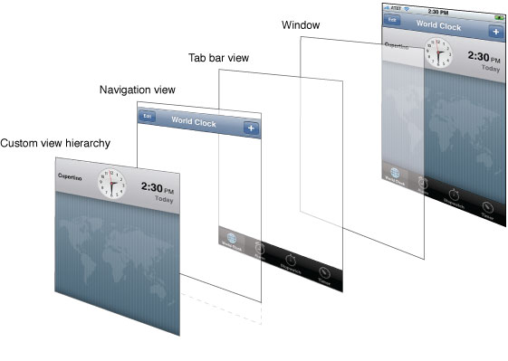
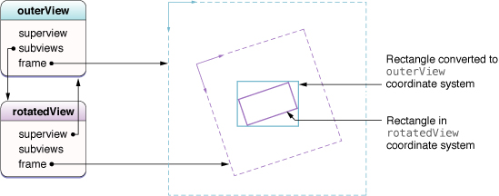
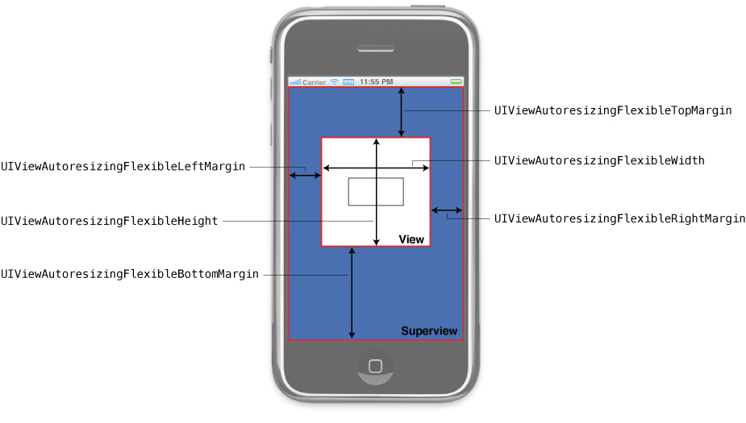

> 导航：[总目录](../../../README.md) · [文档](../../../_indexes/documentation.md) · [iOS 视图编程指南](About%20Windows%20and%20Views.md)


[下一页](Animations.md)[上一页](Windows.md)

# 视图

视图对象是应用与用户交互的主要途径，因此它们承担了很多职责。下面只是其中几项：

- 布局与子视图管理

  - 视图会定义自身相对于父视图的默认尺寸调整行为。
  - 视图可以管理一个子视图列表。
  - 视图可以按需覆盖其子视图的尺寸和位置。
  - 视图可以把自身坐标系中的点转换到其他视图或窗口的坐标系中。
- 绘制与动画

  - 视图在自己的矩形区域内绘制内容。
  - 视图的某些[属性](https://developer.apple.com/library/archive/documentation/General/Conceptual/DevPedia-CocoaCore/ObjectModeling.html#//apple_ref/doc/uid/TP40008195-CH41)可以通过动画过渡到新值。
- 事件处理

  - 视图可以接收触摸事件。
  - 视图参与响应者链。

本章重点介绍创建、管理和绘制视图的步骤，以及如何处理视图层级的布局与管理。关于如何在视图中处理触摸事件（以及其他事件），请参阅 _iOS 事件处理指南_。

你既可以通过代码创建视图，也可以使用 Interface Builder 创建视图；视图本身是自包含的对象，创建之后再把它们组装成视图层级来使用。

创建视图最简单的方式是用 Interface Builder 以图形化方式组装。在 Interface Builder 中，你可以往界面里添加视图、把这些视图组织成层级、配置每个视图的设置，并把与视图相关的行为连接到你的代码上。由于 Interface Builder 使用的是活的视图对象——也就是视图类的真实实例——所以设计时看到的效果就是运行时得到的效果。随后你把这些活的对象保存到 [nib 文件](https://developer.apple.com/library/archive/documentation/General/Conceptual/DevPedia-CocoaCore/NibFile.html#//apple_ref/doc/uid/TP40008195-CH34)中，这是一种能保存对象状态和配置的资源文件。

通常你创建 nib 文件是为了保存应用中某个 View Controller 的整个视图层级。nib 文件的顶层一般包含一个视图对象，代表该 View Controller 的视图。（View Controller 本身通常由 File's Owner 对象表示。）顶层视图的尺寸应当与目标设备相匹配，并包含所有需要展示的其他视图。用 nib 文件只保存 View Controller 视图层级中的一部分是很少见的做法。

在 View Controller 中使用 nib 文件时，你只需用 nib 文件的信息来初始化 View Controller 即可。View Controller 会在恰当的时机负责加载和卸载你的视图。但如果 nib 文件没有与某个 View Controller 关联，你可以使用 [NSBundle](https://developer.apple.com/library/archive/documentation/LegacyTechnologies/WebObjects/WebObjects_3.5/Reference/Frameworks/ObjC/Foundation/Classes/NSBundle/Description.html#//apple_ref/occ/cl/NSBundle) 或 [UINib](https://developer.apple.com/documentation/uikit/uinib) 对象手动加载 nib 文件的内容，它们会用 nib 文件中的数据重建你的视图对象。

关于如何使用 Interface Builder 创建和配置视图的更多信息，请参阅 _[Interface Builder 用户指南](../../Developer%20Tools/Interface%20Builder%20User%20Guide/Introduction.md#apple-f4xwc4dqnrsv64tfmyxwi33df52wszbpkridimbqga2tgnbu)_。关于 View Controller 如何加载和管理与之关联的 nib 文件，请参阅 _[iOS View Controller 编程指南](https://developer.apple.com/library/archive/featuredarticles/ViewControllerPGforiPhoneOS/index.html#//apple_ref/doc/uid/TP40007457)_ 中的“创建自定义内容 View Controller”。关于如何用代码从 nib 文件加载视图，请参阅 _[资源编程指南](../../Cocoa/Resource%20Programming%20Guide/About%20Resources.md#apple-f4xwc4dqnrsv64tfmyxwi33df52wszbpgeydambqga2tc2i)_ 中的 [Nib 文件](https://developer.apple.com/library/archive/documentation/Cocoa/Conceptual/LoadingResources/CocoaNibs/CocoaNibs.html#//apple_ref/doc/uid/10000051i-CH4)。

如果你更喜欢用代码创建视图，可以采用标准的[分配/初始化模式](https://developer.apple.com/library/archive/documentation/General/Conceptual/DevPedia-CocoaCore/ObjectCreation.html#//apple_ref/doc/uid/TP40008195-CH39)。视图的默认初始化方法是 [initWithFrame:](https://developer.apple.com/documentation/uikit/uiview/1622488-init)，它会设置视图相对于其（即将确立的）父视图的初始尺寸和位置。例如，要创建一个新的通用 `UIView` 对象，可以使用类似下面的代码：

```objc
CGRect  viewRect = CGRectMake(0, 0, 100, 100);
UIView* myView = [[UIView alloc] initWithFrame:viewRect];
```

创建视图之后，你必须把它添加到窗口（或窗口中的另一个视图）里，它才能显示出来。关于如何把视图添加到视图层级中，请参阅[添加和移除子视图](#apple-f4xwc4dqnrsv64tfmyxwi33df52wszbpkridimbqga4tkmbtfvbuqnjnknltcmi)。

[UIView](https://developer.apple.com/documentation/uikit/uiview) 类提供了若干[声明属性（declared property）](https://developer.apple.com/library/archive/documentation/General/Conceptual/DevPedia-CocoaCore/DeclaredProperty.html#//apple_ref/doc/uid/TP40008195-CH13)，用于控制视图的外观和行为。这些属性可以用来操作视图的尺寸和位置、视图的透明度、背景色以及渲染行为。所有这些属性都有合适的默认值，你可以在之后按需修改。其中很多属性也可以在 Interface Builder 的检查器窗口中配置。

表 3-1 列出了一些较为常用的属性（以及部分方法）并说明了它们的用途。相关的属性会放在一起列出，这样你就能看清影响视图某一方面时都有哪些选择。

__表 3-1__  几个关键视图属性的用途

| 属性 | 用途 |
| --- | --- |
| [alpha](https://developer.apple.com/documentation/uikit/uiview/1622417-alpha), [hidden](https://developer.apple.com/documentation/uikit/uiview/1622585-hidden), [opaque](https://developer.apple.com/documentation/uikit/uiview/1622622-isopaque) | 这些属性影响视图的不透明度。`alpha` 和 `hidden` 属性直接改变视图的不透明度。  `opaque` 属性告诉系统应该如何合成你的视图。如果视图的内容完全不透明、不会透出下层视图的任何内容，就把该属性设为 `YES`。把该属性设为 `YES` 可以省去不必要的合成操作，从而提升性能。 |
| [bounds](https://developer.apple.com/documentation/uikit/uiview/1622580-bounds), [frame](https://developer.apple.com/documentation/uikit/uiview/1622621-frame), [center](https://developer.apple.com/documentation/uikit/uiview/1622627-center), [transform](https://developer.apple.com/documentation/uikit/uiview/1622459-transform) | 这些属性影响视图的尺寸和位置。`center` 和 `frame` 属性表示视图相对于其父视图的位置，`frame` 还包含视图的尺寸。`bounds` 属性则在视图自身的坐标系中定义了视图的可见内容区域。  `transform` 属性用于以复杂的方式对整个视图做动画或移动。例如，你可以用变换来旋转或缩放视图。如果当前的变换不是恒等变换，`frame` 属性就是未定义的，应当忽略。  关于 `bounds`、`frame` 和 `center` 属性之间的关系，请参阅 [frame、bounds 和 center 属性之间的关系](View%20and%20Window%20Architecture.md#apple-f4xwc4dqnrsv64tfmyxwi33df52wszbpkridimbqga4tkmbtfvbuqmrnknltm)。关于变换如何影响视图，请参阅[坐标系变换](View%20and%20Window%20Architecture.md#apple-f4xwc4dqnrsv64tfmyxwi33df52wszbpkridimbqga4tkmbtfvbuqmrnknlto)。 |
| [autoresizingMask](https://developer.apple.com/documentation/uikit/uiview/1622559-autoresizingmask), [autoresizesSubviews](https://developer.apple.com/documentation/uikit/uiview/1622425-autoresizessubviews) | 这些属性影响视图及其子视图的自动调整尺寸行为。`autoresizingMask` 属性控制视图如何响应父视图 bounds 的变化。`autoresizesSubviews` 属性则控制当前视图的子视图是否会被调整尺寸。 |
| [contentMode](https://developer.apple.com/documentation/uikit/uiview/1622619-contentmode), [contentStretch](https://developer.apple.com/documentation/uikit/uiview/1622511-contentstretch), [contentScaleFactor](https://developer.apple.com/documentation/uikit/uiview/1622657-contentscalefactor) | 这些属性影响视图内部内容的渲染行为。`contentMode` 和 `contentStretch` 属性决定了当视图的宽度或高度发生变化时如何处理内容。`contentScaleFactor` 属性只在你需要为高分辨率屏幕定制视图绘制行为时才会用到。  关于内容模式如何影响视图的更多信息，请参阅[内容模式](View%20and%20Window%20Architecture.md#apple-f4xwc4dqnrsv64tfmyxwi33df52wszbpkridimbqga4tkmbtfvbuqmrnknlte)。关于内容拉伸矩形如何影响视图，请参阅[可拉伸视图](View%20and%20Window%20Architecture.md#apple-f4xwc4dqnrsv64tfmyxwi33df52wszbpkridimbqga4tkmbtfvbuqmrnknltcmy)。关于如何处理缩放因子，请参阅 _[iOS 绘图与打印指南](../../Drawing%20and%20Printing%20Guide%20for%20iOS/About%20Drawing%20and%20Printing%20in%20iOS.md#apple-f4xwc4dqnrsv64tfmyxwi33df52wszbpkridimbqgeydcnjw)_ 中的 [在视图中支持高分辨率屏幕](https://developer.apple.com/library/archive/documentation/2DDrawing/Conceptual/DrawingPrintingiOS/SupportingHiResScreensInViews/SupportingHiResScreensInViews.html#//apple_ref/doc/uid/TP40010156-CH15)。 |
| [gestureRecognizers](https://developer.apple.com/documentation/uikit/uiview/1622542-gesturerecognizers), [userInteractionEnabled](https://developer.apple.com/documentation/uikit/uiview/1622577-isuserinteractionenabled), [multipleTouchEnabled](https://developer.apple.com/documentation/uikit/uiview/1622519-ismultipletouchenabled), [exclusiveTouch](https://developer.apple.com/documentation/uikit/uiview/1622453-isexclusivetouch) | 这些属性影响视图如何处理触摸事件。`gestureRecognizers` 属性包含附加到该视图上的手势识别器，其余属性则控制视图支持哪些触摸事件。  关于如何在视图中响应事件，请参阅 _iOS 事件处理指南_。 |
| [backgroundColor](https://developer.apple.com/documentation/uikit/uiview/1622591-backgroundcolor), [subviews](https://developer.apple.com/documentation/uikit/uiview/1622614-subviews), [drawRect:](https://developer.apple.com/documentation/uikit/uiview/1622529-draw) 方法, [layer](https://developer.apple.com/documentation/uikit/uiview/1622436-layer), ([layerClass](https://developer.apple.com/documentation/uikit/uiview/1622626-layerclass) 方法) | 这些属性和方法帮助你管理视图的实际内容。对于简单的视图，你可以设置背景色并添加一个或多个子视图。`subviews` 属性本身是一个只读的子视图列表，但另有若干方法可用于添加和重排子视图。对于有自定义绘制行为的视图，你必须重写 `drawRect:` 方法。  要实现更高级的内容，你可以直接操作视图的 Core Animation `layer`。若要为视图指定完全不同类型的图层，则必须重写 `layerClass` 方法。 |

关于所有视图共有的基本属性，请参阅 _[UIView 类参考](https://developer.apple.com/documentation/uikit/uiview)_。关于某个视图特有的属性，请参阅该视图的参考文档。

`UIView` 类有一个 [tag](https://developer.apple.com/documentation/uikit/uiview/1622493-tag) 属性，你可以用一个整数值为单个视图对象打上标签。借助标签，你可以在视图层级中唯一地标识视图，并在运行时查找这些视图。（基于标签的查找比你自己遍历视图层级要快。）`tag` 属性的默认值是 `0`。

要查找带标签的视图，请使用 `UIView` 的 [viewWithTag:](https://developer.apple.com/documentation/uikit/uiview/1622429-viewwithtag) 方法。该方法会对接收者及其子视图执行深度优先搜索，不会搜索父视图或视图层级的其他部分。因此，从层级的根视图调用该方法会搜索层级中的所有视图，而从某个具体的子视图调用则只会搜索其中一部分视图。

管理视图层级是开发应用用户界面的关键环节。视图的组织方式既影响应用的视觉外观，也影响应用如何响应各种变化和事件。例如，视图层级中的父子关系决定了哪些对象可能会处理某个特定的触摸事件；同样，父子关系也决定了每个视图如何响应界面方向的变化。

图 3-1 展示了视图的层叠如何为应用营造出预期的视觉效果。以“时钟”应用为例，其视图层级由来自不同来源的视图混合而成。标签栏视图和导航视图是由标签栏控制器和导航控制器对象提供的特殊视图层级，用于管理整体用户界面中的一部分。这两条栏之间的所有内容都属于“时钟”应用自己提供的自定义视图层级。

__图 3-1__  时钟应用中的层叠视图



在 iOS 应用中构建视图层级有多种方式，包括在 Interface Builder 中以图形化方式构建，以及在代码中以编程方式构建。接下来的几节会介绍如何组装视图层级，以及组装完成后如何在层级中查找视图、如何在不同视图的坐标系之间做转换。

Interface Builder 是构建视图层级最方便的方式，因为你是以图形化方式组装视图的：既能看到视图之间的关系，也能确切看到这些视图在运行时的样子。使用 Interface Builder 时，你会把最终的视图层级保存到 [nib 文件](https://developer.apple.com/library/archive/documentation/General/Conceptual/DevPedia-CocoaCore/NibFile.html#//apple_ref/doc/uid/TP40008195-CH34)中，并在运行时需要相应视图时加载它。

如果你更倾向于用代码[创建](https://developer.apple.com/library/archive/documentation/General/Conceptual/DevPedia-CocoaCore/ObjectCreation.html#//apple_ref/doc/uid/TP40008195-CH39)视图，那就先创建并初始化它们，然后用下面这些方法把它们组织成层级：

- 要给父视图添加一个子视图，调用父视图的 [addSubview:](https://developer.apple.com/documentation/uikit/uiview/1622616-addsubview) 方法。该方法会把子视图加到父视图子视图列表的末尾。
- 要把子视图插入到父视图子视图列表的中间位置，调用父视图的任一 `insertSubview:...` 方法。把子视图插入到列表中间，视觉上会使该视图位于列表中排在它后面的所有视图之后。
- 要重排父视图中已有的子视图，调用父视图的 [bringSubviewToFront:](https://developer.apple.com/documentation/uikit/uiview/1622541-bringsubviewtofront)、[sendSubviewToBack:](https://developer.apple.com/documentation/uikit/uiview/1622618-sendsubviewtoback) 或 [exchangeSubviewAtIndex:withSubviewAtIndex:](https://developer.apple.com/documentation/uikit/uiview/1622448-exchangesubviewatindex) 方法。使用这些方法比先移除子视图再重新插入要快。
- 要把子视图从父视图中移除，调用子视图（而不是父视图）的 [removeFromSuperview](https://developer.apple.com/documentation/uikit/uiview/1622421-removefromsuperview) 方法。

给父视图添加子视图时，子视图当前的 frame 矩形决定了它在父视图中的初始位置。如果子视图的 frame 落在父视图可见 bounds 之外，默认情况下不会被裁剪。如果你希望子视图被裁剪到父视图的 bounds 之内，必须显式地把父视图的 [clipsToBounds](https://developer.apple.com/documentation/uikit/uiview/1622415-clipstobounds) 属性设为 `YES`。

向视图层级中添加子视图的常见位置之一，是 View Controller 的 [loadView](https://developer.apple.com/documentation/uikit/uiviewcontroller/1621454-loadview) 或 [viewDidLoad](https://developer.apple.com/documentation/uikit/uiviewcontroller/1621495-viewdidload) 方法。如果你是用代码构建视图，就把创建视图的代码放在 View Controller 的 `loadView` 方法里。无论视图是用代码创建的还是从 nib 文件加载的，你都可以在 `viewDidLoad` 方法中加入额外的视图配置代码。

清单 3-1 展示了示例应用 _[UIKit Catalog (iOS): Creating and Customizing UIKit Controls](https://developer.apple.com/library/archive/samplecode/UICatalog/Introduction/Intro.html#//apple_ref/doc/uid/DTS40007710)_ 中 `TransitionsViewController` 类的 `viewDidLoad` 方法。`TransitionsViewController` 类负责管理两个视图之间过渡时的动画。应用的初始视图层级（由一个根视图和一个工具栏组成）是从 nib 文件加载的，随后 `viewDidLoad` 方法中的代码创建了用于管理过渡的容器视图和图像视图。容器视图的作用是简化实现两个图像视图之间过渡动画所需的代码，它自身并没有实际内容。

__清单 3-1__  向已有的视图层级中添加视图

```objc
- (void)viewDidLoad
{
    [super viewDidLoad];

    self.title = NSLocalizedString(@"TransitionsTitle", @"");

    // 创建容器视图，我们将用它来做过渡动画（水平居中）
    CGRect frame = CGRectMake(round((self.view.bounds.size.width - kImageWidth) / 2.0),
                                                        kTopPlacement, kImageWidth, kImageHeight);
    self.containerView = [[[UIView alloc] initWithFrame:frame] autorelease];
    [self.view addSubview:self.containerView];

    // 容器视图可以在辅助功能中代表这些图像。
    [self.containerView setIsAccessibilityElement:YES];
    [self.containerView setAccessibilityLabel:NSLocalizedString(@"ImagesTitle", @"")];

    // 创建初始的图像视图
    frame = CGRectMake(0.0, 0.0, kImageWidth, kImageHeight);
    self.mainView = [[[UIImageView alloc] initWithFrame:frame] autorelease];
    self.mainView.image = [UIImage imageNamed:@"scene1.jpg"];
    [self.containerView addSubview:self.mainView];

    // 创建备选的图像视图（用于在两者之间过渡）
    CGRect imageFrame = CGRectMake(0.0, 0.0, kImageWidth, kImageHeight);
    self.flipToView = [[[UIImageView alloc] initWithFrame:imageFrame] autorelease];
    self.flipToView.image = [UIImage imageNamed:@"scene2.jpg"];
}
```

当你把一个子视图添加到另一个视图中时，UIKit 会同时通知父视图和子视图这一变化。如果你实现的是自定义视图，可以通过重写 [willMoveToSuperview:](https://developer.apple.com/documentation/uikit/uiview/1622629-willmove)、[willMoveToWindow:](https://developer.apple.com/documentation/uikit/uiview/1622563-willmove)、[willRemoveSubview:](https://developer.apple.com/documentation/uikit/uiview/1622647-willremovesubview)、[didAddSubview:](https://developer.apple.com/documentation/uikit/uiview/1622500-didaddsubview)、[didMoveToSuperview](https://developer.apple.com/documentation/uikit/uiview/1622433-didmovetosuperview) 或 [didMoveToWindow](https://developer.apple.com/documentation/uikit/uiview/1622527-didmovetowindow) 中的一个或多个方法来拦截这些通知。你可以利用这些通知更新与视图层级相关的状态信息，或执行额外的任务。

创建好视图层级之后，你可以用视图的 [superview](https://developer.apple.com/documentation/uikit/uiview/1622474-superview) 和 [subviews](https://developer.apple.com/documentation/uikit/uiview/1622614-subviews) 属性以编程方式在其中导航。每个视图的 [window](https://developer.apple.com/documentation/uikit/uiview/1622456-window) 属性保存着当前显示该视图的窗口（如果有的话）。由于视图层级中的根视图没有父视图，它的 `superview` 属性会被设为 `nil`。对于当前显示在屏幕上的视图来说，窗口对象就是视图层级的根视图。

要在视觉上隐藏一个视图，你可以把它的 [hidden](https://developer.apple.com/documentation/uikit/uiview/1622585-hidden) [属性](https://developer.apple.com/library/archive/documentation/General/Conceptual/DevPedia-CocoaCore/DeclaredProperty.html#//apple_ref/doc/uid/TP40008195-CH13)设为 `YES`，或者把它的 [alpha](https://developer.apple.com/documentation/uikit/uiview/1622417-alpha) 属性改为 `0.0`。被隐藏的视图不会收到系统发来的触摸事件，但它仍会参与自动调整尺寸以及与视图层级相关的其他布局操作。因此，隐藏视图往往是从视图层级中移除视图的一种便利替代方案，尤其是当你打算不久之后再次显示这些视图时。

如果你希望视图从可见变为隐藏（或反过来）的过程带有动画，就必须通过视图的 `alpha` 属性来实现。`hidden` 属性不是可动画属性，因此对它所做的任何修改都会立即生效。

在视图层级中定位视图有两种方式：

- 把相关视图的指针存放在合适的地方，比如拥有这些视图的 View Controller 中。
- 为每个视图的 [tag](https://developer.apple.com/documentation/uikit/uiview/1622493-tag) 属性指定一个唯一的整数，然后用 [viewWithTag:](https://developer.apple.com/documentation/uikit/uiview/1622429-viewwithtag) 方法来定位它。

保存相关视图的引用是最常见的定位方式，也让访问这些视图变得非常方便。如果你用 Interface Builder 创建视图，可以通过 [outlet](https://developer.apple.com/library/archive/documentation/General/Conceptual/Devpedia-CocoaApp/Outlet.html#//apple_ref/doc/uid/TP40009071-CH4) 把 nib 文件中的对象（包括代表管理控制器对象的 File's Owner 对象）相互连接起来。对于用代码创建的视图，你可以把它们的引用保存在私有成员变量中。无论用 outlet 还是私有成员变量，你都要负责按需保留这些视图，并在适当时候释放它们。确保对象被正确保留和释放的最佳办法是使用[声明属性](https://developer.apple.com/library/archive/documentation/General/Conceptual/DevPedia-CocoaCore/DeclaredProperty.html#//apple_ref/doc/uid/TP40008195-CH13)。

标签是减少硬编码依赖、支持更动态灵活方案的有效手段。你可以不保存视图指针，而是用标签来定位它。标签也是一种更持久的视图引用方式。例如，如果你想保存应用中当前可见的视图列表，只需把每个可见视图的标签写入文件即可。这比归档实际的视图对象要简单，尤其是在你只关心哪些视图当前可见的场景下。之后应用再次加载时，你重新创建视图，并用保存下来的标签列表设置每个视图的可见性，就能把视图层级恢复到之前的状态。

每个视图都关联着一个仿射变换，你可以用它来平移、缩放或旋转视图的内容。视图变换会改变视图最终渲染出来的外观，常用于实现滚动、动画或其他视觉效果。

`UIView` 的 [transform](https://developer.apple.com/documentation/uikit/uiview/1622459-transform) 属性包含一个 [CGAffineTransform](https://developer.apple.com/documentation/coregraphics/cgaffinetransform) 结构体，描述了要应用的变换。该属性默认为恒等变换，不会改变视图的外观。你可以随时给这个属性赋一个新的变换。例如，要把视图旋转 45 度，可以使用下面的代码：

```objc
// M_PI/4.0 是半圆的四分之一，也就是 45 度。
CGAffineTransform xform = CGAffineTransformMakeRotation(M_PI/4.0);
self.view.transform = xform;
```

把上面代码中的变换应用到某个视图上，会让该视图绕其中心点顺时针旋转。图 3-2 展示了把这个变换应用到应用中某个嵌入的图像视图上会是什么效果。

__图 3-2__  将视图旋转 45 度

!

给视图应用多个变换时，你把这些变换加入 `CGAffineTransform` 结构体的顺序很重要。先旋转再平移和先平移再旋转的结果并不相同。即使两种情况下旋转量和平移量完全一致，变换的先后顺序仍会影响最终结果。此外，你添加的任何变换都是相对于视图的中心点应用的。因此，施加一个旋转因子会让视图绕其中心点旋转；缩放视图会改变视图的宽高，但不会改变它的中心点。

关于创建和使用仿射变换的更多信息，请参阅 _[Quartz 2D 编程指南](../../Graphics%20Imaging/Quartz%202D%20Programming%20Guide/Introduction.md#apple-f4xwc4dqnrsv64tfmyxwi33df52wszbpkridgmbqgaytanrw)_ 中的 [Transforms](https://developer.apple.com/library/archive/documentation/GraphicsImaging/Conceptual/drawingwithquartz2d/dq_affine/dq_affine.html#//apple_ref/doc/uid/TP30001066-CH204)。

在很多场合下，尤其是在处理事件时，应用可能需要把坐标值从一个参照系转换到另一个参照系。例如，触摸事件报告的是每个触摸在窗口坐标系中的位置，但视图对象往往需要的是该位置在视图自身局部坐标系中的值。[UIView](https://developer.apple.com/documentation/uikit/uiview) 类定义了以下方法，用于在视图的局部坐标系与其他坐标系之间做转换：

- [convertPoint:fromView:](https://developer.apple.com/documentation/uikit/uiview/1622424-convert)
- [convertRect:fromView:](https://developer.apple.com/documentation/uikit/uiview/1622498-convert)
- [convertPoint:toView:](https://developer.apple.com/documentation/uikit/uiview/1622442-convertpoint)
- [convertRect:toView:](https://developer.apple.com/documentation/uikit/uiview/1622504-convert)

`convert...:fromView:` 系列方法把坐标从其他视图的坐标系转换到当前视图的局部坐标系（即 bounds 矩形）中。反过来，`convert...:toView:` 系列方法把坐标从当前视图的局部坐标系（bounds 矩形）转换到指定视图的坐标系中。如果你给这些方法中的任意一个传入 `nil` 作为参照视图，转换就会在包含该视图的窗口坐标系与视图坐标系之间进行。

除了 `UIView` 的转换方法之外，[UIWindow](https://developer.apple.com/documentation/uikit/uiwindow) 类也定义了几个转换方法。这些方法与 `UIView` 版本类似，只不过转换的对象不是视图的局部坐标系，而是窗口的坐标系。

- [convertPoint:fromWindow:](https://developer.apple.com/documentation/uikit/uiwindow/1621583-convert)
- [convertRect:fromWindow:](https://developer.apple.com/documentation/uikit/uiwindow/1621604-convertrect)
- [convertPoint:toWindow:](https://developer.apple.com/documentation/uikit/uiwindow/1621589-convertpoint)
- [convertRect:toWindow:](https://developer.apple.com/documentation/uikit/uiwindow/1621609-convert)

在旋转过的视图中转换坐标时，UIKit 假定你希望返回的矩形能反映源矩形所覆盖的屏幕区域，并据此转换矩形。图 3-3 举例说明了旋转如何导致矩形在转换过程中改变大小。图中外层的父视图包含一个经过旋转的子视图，把子视图坐标系中的一个矩形转换到父视图坐标系后，得到的矩形在物理尺寸上更大。这个更大的矩形实际上是 `outerView` 的 bounds 中能够完全包住旋转后矩形的最小矩形。

__图 3-3__  在旋转的视图中转换坐标值



每当视图的尺寸发生变化时，其子视图的尺寸和位置也必须相应调整。[UIView](https://developer.apple.com/documentation/uikit/uiview) 类同时支持视图层级中的自动布局和手动布局。采用自动布局时，你为每个视图设定好父视图尺寸变化时应遵循的规则，然后就完全不用再操心尺寸调整了；采用手动布局时，则由你按需手动调整视图的尺寸和位置。

当视图中发生下列任一事件时，都可能引发布局变化：

- 视图 bounds 矩形的尺寸发生变化。
- 界面方向发生变化，这通常会引起根视图 bounds 矩形的变化。
- 与视图图层关联的一组 Core Animation 子图层发生变化，需要重新布局。
- 你的应用调用视图的 [setNeedsLayout](https://developer.apple.com/documentation/uikit/uiview/1622601-setneedslayout) 或 [layoutIfNeeded](https://developer.apple.com/documentation/uikit/uiview/1622507-layoutifneeded) 方法强制触发布局。
- 你的应用调用视图底层图层对象的 [setNeedsLayout](https://developer.apple.com/documentation/quartzcore/calayer/1410946-setneedslayout) 方法强制触发布局。

当你改变一个视图的尺寸时，其中嵌入的子视图通常也需要改变位置和尺寸，以适应父视图的新尺寸。父视图的 [autoresizesSubviews](https://developer.apple.com/documentation/uikit/uiview/1622425-autoresizessubviews) [属性](https://developer.apple.com/library/archive/documentation/General/Conceptual/DevPedia-CocoaCore/DeclaredProperty.html#//apple_ref/doc/uid/TP40008195-CH13)决定了子视图是否会被调整尺寸。如果该属性设为 `YES`，视图就会依据每个子视图的 [autoresizingMask](https://developer.apple.com/documentation/uikit/uiview/1622559-autoresizingmask) 属性来决定如何调整该子视图的尺寸和位置。任何子视图的尺寸变化，又会对它自己嵌入的子视图触发同样的布局调整。

对视图层级中的每一个视图，把它的 `autoresizingMask` 属性设成合适的值，是处理自动布局变化的重要一环。表 3-2 列出了可以施加到某个视图上的自动调整尺寸选项，并说明了它们在布局操作中的效果。你可以用按位或运算符组合这些常量，或者直接相加，再赋给 `autoresizingMask` 属性。如果你用 Interface Builder 组装视图，则可以在 Autosizing 检查器中设置这些属性。

__表 3-2__  自动调整尺寸掩码常量

| 自动调整尺寸掩码 | 说明 |
| --- | --- |
| [UIViewAutoresizingNone](https://developer.apple.com/documentation/uikit/uiviewautoresizing/uiviewautoresizingnone) | 视图不做自动调整尺寸。（这是默认值。） |
| [UIViewAutoresizingFlexibleHeight](https://developer.apple.com/documentation/uikit/uiviewautoresizing/uiviewautoresizingflexibleheight) | 当父视图的高度变化时，视图的高度随之变化。如果不包含该常量，视图的高度保持不变。 |
| [UIViewAutoresizingFlexibleWidth](https://developer.apple.com/documentation/uikit/uiviewautoresizing/uiviewautoresizingflexiblewidth) | 当父视图的宽度变化时，视图的宽度随之变化。如果不包含该常量，视图的宽度保持不变。 |
| [UIViewAutoresizingFlexibleLeftMargin](https://developer.apple.com/documentation/uikit/uiviewautoresizing/uiviewautoresizingflexibleleftmargin) | 视图左边缘与父视图左边缘之间的距离会按需增大或缩小。如果不包含该常量，视图左边缘与父视图左边缘之间保持固定距离。 |
| [UIViewAutoresizingFlexibleRightMargin](https://developer.apple.com/documentation/uikit/uiview/autoresizingmask/1622662-flexiblerightmargin) | 视图右边缘与父视图右边缘之间的距离会按需增大或缩小。如果不包含该常量，视图右边缘与父视图右边缘之间保持固定距离。 |
| [UIViewAutoresizingFlexibleBottomMargin](https://developer.apple.com/documentation/uikit/uiviewautoresizing/uiviewautoresizingflexiblebottommargin) | 视图下边缘与父视图下边缘之间的距离会按需增大或缩小。如果不包含该常量，视图下边缘与父视图下边缘之间保持固定距离。 |
| [UIViewAutoresizingFlexibleTopMargin](https://developer.apple.com/documentation/uikit/uiviewautoresizing/uiviewautoresizingflexibletopmargin) | 视图上边缘与父视图上边缘之间的距离会按需增大或缩小。如果不包含该常量，视图上边缘与父视图上边缘之间保持固定距离。 |

图 3-4 以图示方式说明了自动调整尺寸掩码中的各个选项如何作用于视图。某个常量出现，表示视图在对应方面是弹性的，会随父视图 bounds 的变化而改变；某个常量缺席，则表示视图在该方面的布局是固定的。当你为某个视图在同一个轴向上配置了多个弹性特性时，UIKit 会把尺寸变化量在相应的空间之间平均分配。

__图 3-4__  视图自动调整尺寸掩码常量



配置自动调整尺寸规则最简单的办法，是使用 Interface Builder 尺寸检查器中的 Autosizing 控件。前面那张图中的弹性宽度和弹性高度常量，与 Autosizing 控件示意图中的宽度和高度指示器行为一致。不过边距指示器的行为和用法实际上是相反的：在 Interface Builder 中，边距指示器出现表示该边距尺寸固定，指示器缺席则表示该边距尺寸是弹性的。好在 Interface Builder 提供了动画演示，可以让你看到修改自动调整尺寸行为会对视图产生什么影响。

在所有受影响视图的自动调整尺寸规则都应用完毕之后，UIKit 会再回过头来，给每个视图一次机会对其父视图做必要的手动调整。关于如何手动管理视图布局的更多信息，请参阅[手动微调视图的布局](#apple-f4xwc4dqnrsv64tfmyxwi33df52wszbpkridimbqga4tkmbtfvbuqnjnknltioa)。

每当视图的尺寸发生变化，UIKit 会先应用该视图各子视图的自动调整尺寸行为，然后调用该视图的 [layoutSubviews](https://developer.apple.com/documentation/uikit/uiview/1622482-layoutsubviews) 方法，让它有机会做手动调整。当仅靠自动调整尺寸行为无法得到你想要的结果时，就可以在自定义视图中实现 `layoutSubviews` 方法。你对该方法的实现可以做下面这些事：

- 调整任意直接子视图的尺寸和位置。
- 添加或移除子视图，或者 Core Animation 图层。
- 调用子视图的 [setNeedsDisplay](https://developer.apple.com/documentation/uikit/uiview/1622437-setneedsdisplay) 或 [setNeedsDisplayInRect:](https://developer.apple.com/documentation/uikit/uiview/1622587-setneedsdisplayinrect) 方法，强制该子视图重绘。

应用手动布局子视图的一个常见场景，是实现一大片可滚动区域。由于用单个大视图来承载可滚动内容并不现实，应用通常会实现一个根视图，其中包含若干较小的瓦片视图，每个瓦片代表可滚动内容的一部分。滚动事件发生时，根视图调用自己的 [setNeedsLayout](https://developer.apple.com/documentation/uikit/uiview/1622601-setneedslayout) 方法来触发布局变化，随后它的 `layoutSubviews` 方法会根据滚动量重新摆放这些瓦片视图。当瓦片滚出视图的可见区域时，`layoutSubviews` 方法就把它们移到即将进入的那一侧，并在此过程中替换它们的内容。

编写布局代码时，务必用下面这些方式测试你的代码：

- 改变视图的方向，确认在所有受支持的界面方向下布局都正确。
- 确认你的代码能恰当响应状态栏高度的变化。通话进行中时状态栏高度会变大，用户结束通话后状态栏高度会变小。

关于自动调整尺寸行为如何影响视图的尺寸和位置，请参阅[使用自动调整尺寸规则自动处理布局变化](#apple-f4xwc4dqnrsv64tfmyxwi33df52wszbpkridimbqga4tkmbtfvbuqnjnknltk)。关于如何实现瓦片化的示例，请参阅 _[ScrollViewSuite](../../../samplecode/ScrollViewSuite/ScrollViewSuite.md#apple-f4xwc4dqnrsv64tfmyxwi33df52wszbpirkfgnbqgaydqojqgq)_ 示例代码。

应用在接收用户输入时，会随之调整自己的用户界面。应用可能会重排视图、改变视图的尺寸或位置、隐藏或显示视图，也可能加载一整套全新的视图。在 iOS 应用中，有若干位置和方式可以执行这类操作：

- 在 View Controller 中：

  - View Controller 必须先创建视图才能显示它们。它可以从 nib 文件加载视图，也可以用代码创建视图。当这些视图不再需要时，再由它负责释放。
  - 当设备方向改变时，View Controller 可能会调整视图的尺寸和位置以适应新方向。作为适配新方向的一部分，它可能会隐藏一些视图并显示另一些视图。
  - 当 View Controller 管理的是可编辑内容时，它可能会在进入和退出编辑模式时调整自己的视图层级。例如，它可能会添加额外的按钮和其他控件，方便编辑内容的各个方面；这可能还需要调整已有视图的尺寸，为这些额外控件腾出空间。
- 在动画 block 中：

  - 当你想在用户界面中的不同视图集合之间切换时，可以在动画 block 内隐藏一些视图、显示另一些视图。
  - 实现特效时，你可以用动画 block 修改视图的各种属性。例如，要让视图尺寸的变化带上动画，就修改它 frame 矩形的尺寸。
- 其他方式：

  - 当触摸事件或手势发生时，你的界面可能会加载一套新视图，或改变当前这套视图作为响应。关于事件处理的信息，请参阅 _iOS 事件处理指南_。
  - 当用户与滚动视图交互时，一大片可滚动区域可能会隐藏和显示瓦片子视图。关于如何支持可滚动内容的更多信息，请参阅 _[iOS 滚动视图编程指南](../Scroll%20View%20Programming%20Guide%20for%20iOS/About%20Scroll%20View%20Programming.md#apple-f4xwc4dqnrsv64tfmyxwi33df52wszbpkridimbqga4dcnzz)_。
  - 当键盘弹出时，你可能需要重新摆放或调整视图尺寸，避免它们被键盘遮住。关于如何与键盘交互，请参阅 _[iOS 文本编程指南](../../Strings%20Text%20Fonts/Text%20Programming%20Guide%20for%20iOS/About%20Text%20Handling%20in%20iOS.md#apple-f4xwc4dqnrsv64tfmyxwi33df52wszbpkridimbqga4tknbs)_。

View Controller 是发起视图变更的常见位置。由于 View Controller 管理着与所显示内容相关联的视图层级，它最终要为这些视图身上发生的一切负责。在加载视图或处理方向变化时，View Controller 可以添加新视图、隐藏或替换已有视图，并做出任意数量的改动，让视图为显示做好准备。如果你实现了对视图内容的编辑支持，`UIViewController` 中的 [setEditing:animated:](https://developer.apple.com/documentation/uikit/uiviewcontroller/1621378-setediting) 方法则为你提供了在普通视图与可编辑视图之间切换的落脚点。

动画 block 是发起视图相关变更的另一个常见位置。[UIView](https://developer.apple.com/documentation/uikit/uiview) 类内置的动画支持，让视图属性变化的动画化变得非常容易。你也可以用 [transitionWithView:duration:options:animations:completion:](https://developer.apple.com/documentation/uikit/uiview/1622574-transition) 或 [transitionFromView:toView:duration:options:completion:](https://developer.apple.com/documentation/uikit/uiview/1622562-transitionfromview) 方法，把整套视图换成新的一套。

关于视图动画和发起视图过渡的更多信息，请参阅[动画](Animations.md#apple-f4xwc4dqnrsv64tfmyxwi33df52wszbpkridimbqga4tkmbtfvbuqnrnknltc)。关于如何用 View Controller 管理视图相关行为的更多信息，请参阅 _[iOS View Controller 编程指南](https://developer.apple.com/library/archive/featuredarticles/ViewControllerPGforiPhoneOS/index.html#//apple_ref/doc/uid/TP40007457)_。

每个视图对象都有一个专属的 Core Animation 图层，负责管理视图内容在屏幕上的呈现与动画。虽然直接用视图对象就能做很多事，但你也可以按需直接操作对应的图层对象。视图的图层对象保存在视图的 [layer](https://developer.apple.com/documentation/uikit/uiview/1622436-layer) 属性中。

视图创建之后，与之关联的图层类型就不能再更改了。因此，每个视图都通过 [layerClass](https://developer.apple.com/documentation/uikit/uiview/1622626-layerclass) [类方法](https://developer.apple.com/library/archive/documentation/General/Conceptual/DevPedia-CocoaCore/ClassMethod.html#//apple_ref/doc/uid/TP40008195-CH8)来指定其图层对象的类。该方法的默认实现返回 [CALayer](https://developer.apple.com/documentation/quartzcore/calayer) 类，要改变这个值，唯一的办法就是派生子类、重写该方法并返回不同的值。你可以修改这个值来使用另一种图层。例如，如果你的视图用瓦片方式显示一大片可滚动区域，可能就会想用 [CATiledLayer](https://developer.apple.com/documentation/quartzcore/catiledlayer) 类作为视图的支撑图层。

[layerClass](https://developer.apple.com/documentation/uikit/uiview/1622626-layerclass) 方法的实现只需创建所需的 `Class` 对象并返回即可。例如，一个使用瓦片的视图，该方法的实现会是这样：

```objc
+ (Class)layerClass
{
    return [CATiledLayer class];
}
```

每个视图都会在初始化过程的早期调用自己的 `layerClass` 方法，并用返回的类来创建图层对象。此外，视图总是把自己指定为图层对象的[委托](https://developer.apple.com/library/archive/documentation/General/Conceptual/DevPedia-CocoaCore/Delegation.html#//apple_ref/doc/uid/TP40008195-CH14)。至此，视图便拥有了自己的图层，视图与图层之间的这种关系不能更改。你也不能把同一个视图指定为其他任何图层对象的委托。改变视图的所有权关系或委托关系会导致绘制问题，甚至可能让应用崩溃。

关于 Core Animation 提供的各类图层对象的更多信息，请参阅 _[Core Animation 参考文档集](https://developer.apple.com/documentation/quartzcore)_。

如果你更倾向于主要使用图层对象而不是视图，可以按需把自定义图层对象整合进视图层级中。自定义图层对象就是任何不被视图所拥有的 [CALayer](https://developer.apple.com/documentation/quartzcore/calayer) 实例。通常你会用代码创建自定义图层，并用 Core Animation 的相关例程把它们整合进来。自定义图层不会接收事件，也不参与响应者链，但它们会绘制自身，并按照 Core Animation 的规则响应父视图或父图层的尺寸变化。

清单 3-2 展示了某个 View Controller 中 `viewDidLoad` 方法的示例，它创建了一个自定义图层对象并添加到自己的根视图上。该图层用于显示一张带动画的静态图片。注意这里不是把图层添加到视图本身，而是添加到视图底层的图层上。

__清单 3-2__  向视图中添加自定义图层

```objc
- (void)viewDidLoad {
    [super viewDidLoad];

    // 创建图层。
    CALayer* myLayer = [[CALayer alloc] init];

    // 把图层的内容设为一张固定的图片，并把
    // 图层的尺寸设为与图片尺寸一致。
    UIImage layerContents = [[UIImage imageNamed:@"myImage"] retain];
    CGSize imageSize = layerContents.size;

    myLayer.bounds = CGRectMake(0, 0, imageSize.width, imageSize.height);
    myLayer = layerContents.CGImage;

    // 把图层添加到视图上。
    CALayer*    viewLayer = self.view.layer;
    [viewLayer addSublayer:myLayer];

    // 让图层在视图中居中。
    CGRect        viewBounds = backingView.bounds;
    myLayer.position = CGPointMake(CGRectGetMidX(viewBounds), CGRectGetMidY(viewBounds));

    // 释放图层，因为它已被视图的图层保留
    [myLayer release];
}
```

如果需要，你可以添加任意数量的子图层，并把它们组织成子图层层级。但归根结底，这些图层必须挂到某个视图的图层对象上。

关于如何直接操作图层的信息，请参阅 _[Core Animation 编程指南](../../Cocoa/Core%20Animation%20Programming%20Guide/About%20Core%20Animation.md#apple-f4xwc4dqnrsv64tfmyxwi33df52wszbpkridimbqga2dkmju)_。

如果标准的系统视图无法完全满足你的需求，你可以定义自定义视图。自定义视图让你完全掌控应用内容的外观，以及与这些内容的交互方式。

自定义视图的职责是呈现内容并管理与内容的交互。不过，成功实现一个自定义视图，涉及的远不止绘制和事件处理。下面的清单列出了实现自定义视图时你可以重写的较重要的方法（以及可以提供的行为）：

- 为你的视图定义合适的初始化方法：

  - 对于计划用代码创建的视图，重写 [initWithFrame:](https://developer.apple.com/documentation/uikit/uiview/1622488-init) 方法，或者定义一个自定义的初始化方法。
  - 对于计划从 nib 文件加载的视图，重写 [initWithCoder:](https://developer.apple.com/library/archive/documentation/LegacyTechnologies/WebObjects/WebObjects_3.5/Reference/Frameworks/ObjC/Foundation/Protocols/NSCoding/Description.html#//apple_ref/occ/intfm/NSCoding/initWithCoder:) 方法。用这个方法来初始化视图，让它进入一个已知状态。
- 实现 [dealloc](https://developer.apple.com/library/archive/documentation/LegacyTechnologies/WebObjects/WebObjects_3.5/Reference/Frameworks/ObjC/Foundation/Classes/NSObject/Description.html#//apple_ref/occ/instm/NSObject/dealloc) 方法，清理任何自定义数据。
- 要处理自定义绘制，重写 [drawRect:](https://developer.apple.com/documentation/uikit/uiview/1622529-draw) 方法并在其中完成绘制。
- 设置视图的 [autoresizingMask](https://developer.apple.com/documentation/uikit/uiview/1622559-autoresizingmask) 属性，定义它的自动调整尺寸行为。
- 如果你的视图类管理着一个或多个内建的子视图，则需要：

  - 在视图的初始化流程中创建这些子视图。
  - 在创建时设置每个子视图的 [autoresizingMask](https://developer.apple.com/documentation/uikit/uiview/1622559-autoresizingmask) 属性。
  - 如果这些子视图需要自定义布局，重写 [layoutSubviews](https://developer.apple.com/documentation/uikit/uiview/1622482-layoutsubviews) 方法并在其中实现布局代码。
- 要处理基于触摸的事件，则需要：

  - 用 [addGestureRecognizer:](https://developer.apple.com/documentation/uikit/uiview/1622496-addgesturerecognizer) 方法把合适的手势识别器附加到视图上。
  - 如果你想自己处理触摸，重写 [touchesBegan:withEvent:](https://developer.apple.com/documentation/uikit/uiresponder/1621142-touchesbegan)、[touchesMoved:withEvent:](https://developer.apple.com/documentation/uikit/uiresponder/1621107-touchesmoved)、[touchesEnded:withEvent:](https://developer.apple.com/documentation/uikit/uiresponder/1621084-touchesended) 和 [touchesCancelled:withEvent:](https://developer.apple.com/documentation/uikit/uiresponder/1621116-touchescancelled) 方法。（记住，无论你重写了其他哪些与触摸相关的方法，都应该始终重写 [touchesCancelled:withEvent:](https://developer.apple.com/documentation/uikit/uiresponder/1621116-touchescancelled) 方法。）
- 如果你希望视图的打印版本与屏幕版本不同，实现 [drawRect:forViewPrintFormatter:](https://developer.apple.com/documentation/uikit/uiview/1621844-drawrect) 方法。关于如何在视图中支持打印的详细信息，请参阅 _[iOS 绘图与打印指南](../../Drawing%20and%20Printing%20Guide%20for%20iOS/About%20Drawing%20and%20Printing%20in%20iOS.md#apple-f4xwc4dqnrsv64tfmyxwi33df52wszbpkridimbqgeydcnjw)_。

除了重写方法之外，别忘了利用视图现有的属性和方法也能做很多事。例如，[contentMode](https://developer.apple.com/documentation/uikit/uiview/1622619-contentmode) 和 [contentStretch](https://developer.apple.com/documentation/uikit/uiview/1622511-contentstretch) 属性可以改变视图最终渲染出来的外观，往往比你自己重绘内容更可取。除了 [UIView](https://developer.apple.com/documentation/uikit/uiview) 类本身，视图底层 [CALayer](https://developer.apple.com/documentation/quartzcore/calayer) 对象的很多方面也可以由你直接或间接地配置，你甚至可以改变图层对象本身的类。

关于视图类的方法和属性的更多信息，请参阅 _[UIView 类参考](https://developer.apple.com/documentation/uikit/uiview)_。

你定义的每一个新视图对象都应当包含一个自定义的 [initWithFrame:](https://developer.apple.com/documentation/uikit/uiview/1622488-init) [初始化方法](https://developer.apple.com/library/archive/documentation/General/Conceptual/DevPedia-CocoaCore/Initialization.html#//apple_ref/doc/uid/TP40008195-CH21)。该方法负责在创建时初始化这个类，并让视图对象进入一个已知状态。当你在代码中以编程方式创建视图实例时，用的就是这个方法。

清单 3-3 展示了一个标准 `initWithFrame:` 方法的骨架实现。该方法先调用继承来的实现，然后初始化类的实例变量和状态信息，最后返回初始化好的对象。按惯例先调用继承来的实现，是为了在出问题时能中止你自己的初始化代码并返回 `nil`。

__清单 3-3__  初始化视图子类

```objc
- (id)initWithFrame:(CGRect)aRect {
    self = [super initWithFrame:aRect];
    if (self) {
          // 设置视图的初始属性
          ...
       }
    return self;
}
```

如果你打算从 [nib 文件](https://developer.apple.com/library/archive/documentation/General/Conceptual/DevPedia-CocoaCore/NibFile.html#//apple_ref/doc/uid/TP40008195-CH34)加载自定义视图类的实例，要注意在 iOS 中，nib 加载代码并不会用 `initWithFrame:` 方法来实例化新的视图对象，而是使用 [NSCoding](https://developer.apple.com/library/archive/documentation/LegacyTechnologies/WebObjects/WebObjects_3.5/Reference/Frameworks/ObjC/Foundation/Protocols/NSCoding/Description.html#//apple_ref/occ/intf/NSCoding) [协议](https://developer.apple.com/library/archive/documentation/General/Conceptual/DevPedia-CocoaCore/Protocol.html#//apple_ref/doc/uid/TP40008195-CH45)中的 [initWithCoder:](https://developer.apple.com/library/archive/documentation/LegacyTechnologies/WebObjects/WebObjects_3.5/Reference/Frameworks/ObjC/Foundation/Protocols/NSCoding/Description.html#//apple_ref/occ/intfm/NSCoding/initWithCoder:) 方法。

即使你的视图采纳了 `NSCoding` 协议，Interface Builder 也并不了解视图的自定义属性，因此不会把这些属性编码进 nib 文件。于是，你自己的 `initWithCoder:` 方法应当尽可能执行初始化代码，让视图进入一个已知状态。你也可以在视图类中实现 [awakeFromNib](https://developer.apple.com/documentation/objectivec/nsobject/1402907-awakefromnib) 方法，用它来完成额外的初始化工作。

对于需要自定义绘制的视图，你需要重写 [drawRect:](https://developer.apple.com/documentation/uikit/uiview/1622529-draw) 方法并在其中绘制。自定义绘制只建议作为最后的手段：一般来说，如果能用其他视图来呈现内容，那样更好。

`drawRect:` 方法的实现应当只做一件事：绘制你的内容。这个方法不是更新应用数据结构或执行任何与绘制无关任务的地方。它应当配置好绘制环境、绘制内容，然后尽快退出。而且如果 `drawRect:` 方法可能被频繁调用，你就应当尽一切努力优化绘制代码，让每次调用时绘制的内容尽可能少。

在调用视图的 `drawRect:` 方法之前，UIKit 会为视图配置好基本的绘制环境。具体来说，它会创建一个图形上下文，并调整坐标系和裁剪区域，使之与视图的坐标系和可见 bounds 相匹配。因此，当你的 `drawRect:` 方法被调用时，你就可以直接用 UIKit、Core Graphics 等原生绘制技术开始绘制内容了。你可以用 [UIGraphicsGetCurrentContext](https://developer.apple.com/documentation/uikit/1623918-uigraphicsgetcurrentcontext) 函数取得当前图形上下文的指针。

清单 3-4 展示了一个简单的 `drawRect:` 方法实现，它在视图四周绘制了一圈 10 像素宽的红色边框。由于 UIKit 的绘制操作底层就是用 Core Graphics 实现的，你可以像这里一样混用两者的绘制调用，得到预期的效果。

__清单 3-4__  一个绘制方法

```objc
- (void)drawRect:(CGRect)rect {
    CGContextRef context = UIGraphicsGetCurrentContext();
    CGRect    myFrame = self.bounds;

    // 把线宽设为 10，并把矩形四边各向内收缩
    // 5 像素，以补偿加宽的线条。
    CGContextSetLineWidth(context, 10);
    CGRectInset(myFrame, 5, 5);

    [[UIColor redColor] set];
    UIRectFrame(myFrame);
}
```

如果你确定视图的绘制代码总是会用不透明的内容覆盖整个视图表面，就可以把视图的 [opaque](https://developer.apple.com/documentation/uikit/uiview/1622622-isopaque) [属性](https://developer.apple.com/library/archive/documentation/General/Conceptual/DevPedia-CocoaCore/DeclaredProperty.html#//apple_ref/doc/uid/TP40008195-CH13)设为 `YES` 来提升系统性能。当你把视图标记为不透明时，UIKit 会跳过绘制紧贴在该视图后面的内容。这不仅减少了绘制耗时，也把你的视图与其他内容合成所需的工作降到最低。不过，只有在你确定视图内容完全不透明时才应把该属性设为 `YES`。如果视图无法保证其内容始终不透明，就应当把该属性设为 `NO`。

另一种提升绘制性能（尤其是在滚动过程中）的办法，是把视图的 [clearsContextBeforeDrawing](https://developer.apple.com/documentation/uikit/uiview/1622449-clearscontextbeforedrawing) 属性设为 `NO`。当该属性为 `YES` 时，UIKit 会在调用你的 `drawRect:` 方法之前，自动用透明黑色填充待更新的区域。把该属性设为 `NO` 可以省掉这次填充操作的开销，但相应地，用内容填满传给 `drawRect:` 方法的更新矩形就成了你的应用自己的责任。

视图对象是[响应者对象](https://developer.apple.com/library/archive/documentation/General/Conceptual/Devpedia-CocoaApp/Responder.html#//apple_ref/doc/uid/TP40009071-CH1)——也就是 [UIResponder](https://developer.apple.com/documentation/uikit/uiresponder) 类的实例——因此有能力接收触摸事件。当触摸事件发生时，窗口会把相应的事件对象派发给触摸发生所在的视图。如果视图对某个事件不感兴趣，可以忽略它，也可以把它沿响应者链向上传递，交给其他对象处理。

除了直接处理触摸事件之外，视图还可以用手势识别器来检测轻点、轻扫、捏合等常见的触摸相关手势。追踪触摸事件、判断它们是否符合目标手势的判定标准，这些繁重工作都由手势识别器完成。你的应用不必自己追踪触摸事件，只需创建手势识别器、为它指定合适的目标对象和动作方法，再用 [addGestureRecognizer:](https://developer.apple.com/documentation/uikit/uiview/1622496-addgesturerecognizer) 方法把它安装到视图上即可。之后当相应手势发生时，手势识别器就会调用你的动作方法。

如果你更倾向于直接处理触摸事件，可以为视图实现下面这些方法，它们在 _iOS 事件处理指南_ 中有更详细的说明：

- [touchesBegan:withEvent:](https://developer.apple.com/documentation/uikit/uiresponder/1621142-touchesbegan)
- [touchesMoved:withEvent:](https://developer.apple.com/documentation/uikit/uiresponder/1621107-touchesmoved)
- [touchesEnded:withEvent:](https://developer.apple.com/documentation/uikit/uiresponder/1621084-touchesended)
- [touchesCancelled:withEvent:](https://developer.apple.com/documentation/uikit/uiresponder/1621116-touchescancelled)

视图的默认行为是一次只响应一个触摸。如果用户按下第二根手指，系统会忽略该触摸事件，不会上报给你的视图。如果你打算在视图的事件处理方法中追踪多指手势，就需要把视图的 [multipleTouchEnabled](https://developer.apple.com/documentation/uikit/uiview/1622519-ismultipletouchenabled) [属性](https://developer.apple.com/library/archive/documentation/General/Conceptual/DevPedia-CocoaCore/DeclaredProperty.html#//apple_ref/doc/uid/TP40008195-CH13)设为 `YES` 来启用多点触摸事件。

有些视图（比如标签和图像）一开始就完全禁用了事件处理。你可以通过修改视图 [userInteractionEnabled](https://developer.apple.com/documentation/uikit/uiview/1622577-isuserinteractionenabled) 属性的值，来控制视图能否接收触摸事件。例如，在某个耗时操作尚未完成时，你可以临时把该属性设为 `NO`，阻止用户操作视图的内容。要阻止事件到达你的任何视图，还可以使用 [UIApplication](https://developer.apple.com/documentation/uikit/uiapplication) 对象的 [beginIgnoringInteractionEvents](https://developer.apple.com/documentation/uikit/uiapplication/1623047-beginignoringinteractionevents) 和 [endIgnoringInteractionEvents](https://developer.apple.com/documentation/uikit/uiapplication/1622938-endignoringinteractionevents) 方法。这两个方法影响的是整个应用的事件投递，而不只是某一个视图。

在处理触摸事件时，UIKit 会用 `UIView` 的 [hitTest:withEvent:](https://developer.apple.com/documentation/uikit/uiview/1622469-hittest) 和 [pointInside:withEvent:](https://developer.apple.com/documentation/uikit/uiview/1622533-point) 方法来判断触摸事件是否发生在某个视图的 bounds 之内。虽然你很少需要重写这些方法，但确实可以通过重写它们为视图实现自定义的触摸行为。例如，你可以重写这些方法来阻止子视图处理触摸事件。

如果你的视图类[分配](https://developer.apple.com/library/archive/documentation/General/Conceptual/DevPedia-CocoaCore/ObjectCreation.html#//apple_ref/doc/uid/TP40008195-CH39)了内存、保存了自定义对象的引用，或持有在视图释放时必须一并[释放](https://developer.apple.com/library/archive/documentation/General/Conceptual/DevPedia-CocoaCore/MemoryManagement.html#//apple_ref/doc/uid/TP40008195-CH27)的资源，你就必须实现 [dealloc](https://developer.apple.com/library/archive/documentation/LegacyTechnologies/WebObjects/WebObjects_3.5/Reference/Frameworks/ObjC/Foundation/Classes/NSObject/Description.html#//apple_ref/occ/instm/NSObject/dealloc) 方法。当视图的保留计数降为零、该销毁视图时，系统就会调用 `dealloc` 方法。你对该方法的实现应当释放视图持有的所有对象和资源，然后调用继承来的实现，如清单 3-5 所示。你不应该用这个方法去做任何其他类型的工作。

__清单 3-5__  实现 `dealloc` 方法

```objc
- (void)dealloc {
    // 释放一个被保留的 UIColor 对象
    [color release];

    // 调用继承来的实现
    [super dealloc];
}
```

[下一页](Animations.md)[上一页](Windows.md)

