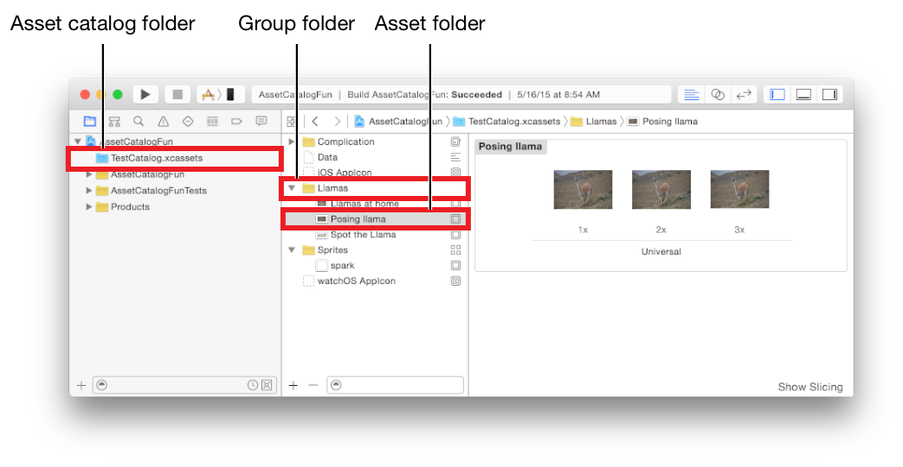

> 导航：[总目录](../../../README.md) · [documentation](../../../_indexes/documentation.md) · [Asset Catalog Format Reference](index.md)

## Folders

Figure 2-1 shows the three levels of folders.

__Figure 2-1__Asset catalog folders

- The __Asset catalog folder__ contains all the folders and files for one asset catalog.
- __Group folders__ contain asset folders and other group folders.
- __Asset folders__ contain the files for an individual asset.

Each folder can contain a `.json` file encoding the attributes for the catalog, group, or asset in that folder. For more information on the `.json` file, see [Contents.json File](Contents.md#apple-f4xwc4dqnrsv64tfmyxwi33df52wszbpkridimbqge2tcnzqfvbuqmzwfvjvomi) and [Table 5-2](AssetTypes.md#apple-f4xwc4dqnrsv64tfmyxwi33df52wszbpkridimbqge2tcnzqfvbuqmzqfvjvoni).

### Folder Names

The name and the type of an asset catalog item are encoded in the folder name. Each folder name contains the name of the catalog or asset, followed by a period (.), and then a type identifier:

- `<name-of-catalog-or-asset>.<type-of-item>`

Groups do not have a type identifier:

- `<name-of-group>`

### Unique Asset Names

For any target in an Xcode project, the fully qualified name of an asset must be unique across all the asset catalogs and across all asset types. For example, it is an error to have an image set folder in one asset catalog called `Llama.imageset` and an image set with the same name in the same catalog or in a different catalog that is part of the same target. Similarly, it is an error to have both an image set folder called `Llama.imageset` and an app icon folder called `Llama.appiconset` in the same catalog or in a different catalog that is part of the same target.

The full name includes the name of any group or sprite atlas folders that are marked as providing a namespace. For example, if the group folder `mammals` contains an image set `Llama.imageset`, the fully qualified name of the image set is `mammals/Llama`.

### General Folder Structure

The asset catalog folder is at the top level of the catalog. Inside the asset catalog folder is at least one asset folder. There may also be group folders.

The general folder structure for an asset catalog is:

- `<catalog-name>.xcassets`

  - `<asset-name>.<asset-type>`

    - `Asset files`
  - `<group-name>`

    - `Group contents`

As an example, the folders in the catalog shown in Figure 2-1 are:

- `TestCatalog.xcassets`

  - `Complication`
  - `Data.dataset`

    - `<Asset files>`
  - `iOS AppIcon.appiconset`

    - `<Asset files>`
  - `Llamas`

    - `Llamas at home.imageset`

      - `<Asset files>`
    - `Posing llamas.imageset`

      - `<Asset files>`
    - `Spot the Llama.imageset`

      - `<Asset files>`
  - `Sprites.spriteatlas`

    - `<Asset files>`
    - `Spark.imageset`

      - `<Asset files>`

[Format Overview](index.md#apple-f4xwc4dqnrsv64tfmyxwi33df52wszbpkridimbqge2tcnzqfvbuqmjyfvjvomi)

[Contents.json File](Contents.md#apple-f4xwc4dqnrsv64tfmyxwi33df52wszbpkridimbqge2tcnzqfvbuqmzwfvjvomi)
