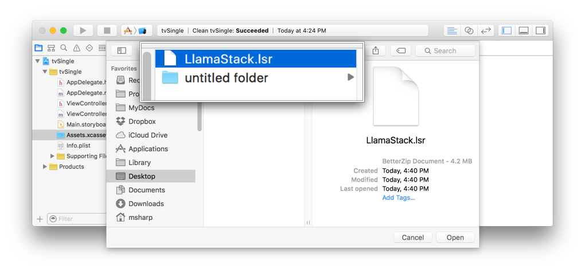
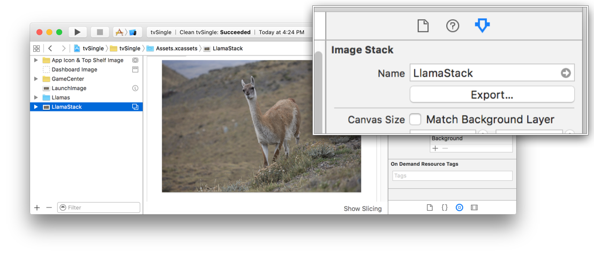

> 导航：[总目录](../../../README.md) · [documentation](../../../_indexes/documentation.md) · [Asset Catalog Format Reference](index.md)

## Importing and Exporting LSR Files

Share image stacks between Xcode projects using import and export from the asset catalog.

__To import a file in LSR format into an asset catalog:__

1. In the project navigator, select an asset catalog.
2. Choose Editor > Assets > Import.
3. In the dialog that appears, navigate to the directory containing the `.lsr` file to import.
4. Select the `.lsr` file, and click Open.

   The screenshot below shows selecting the file `LlamaStack.lsr`.

   

   The image stack is imported into your asset catalog. The name of the image stack is the same as the name of the `.lsr` file.

__To export an image stack as a file in LSR format:__

1. In the project navigator, select an asset catalog.
2. Open the utilities area for the workspace window by clicking the Show Utilities button ().
3. In the set list, select an image stack.
4. In the inspector bar, click the Attributes Inspector button ().

   The inspector for the image stack opens as shown below.

   
5. In the inspector, click the Export button.
6. In the dialog that appears, enter a name for the file, choose a location, and click Export.

   The image stack is saved as a `.lsr` file in the selected location. The base name of the file is the same as the name of the exported image stack.

[LSR Image Stack Layer](ImageStackLayerJSON.md#apple-f4xwc4dqnrsv64tfmyxwi33df52wszbpkridimbqge2tcnzqfvbuqnbyfvjvomi)
