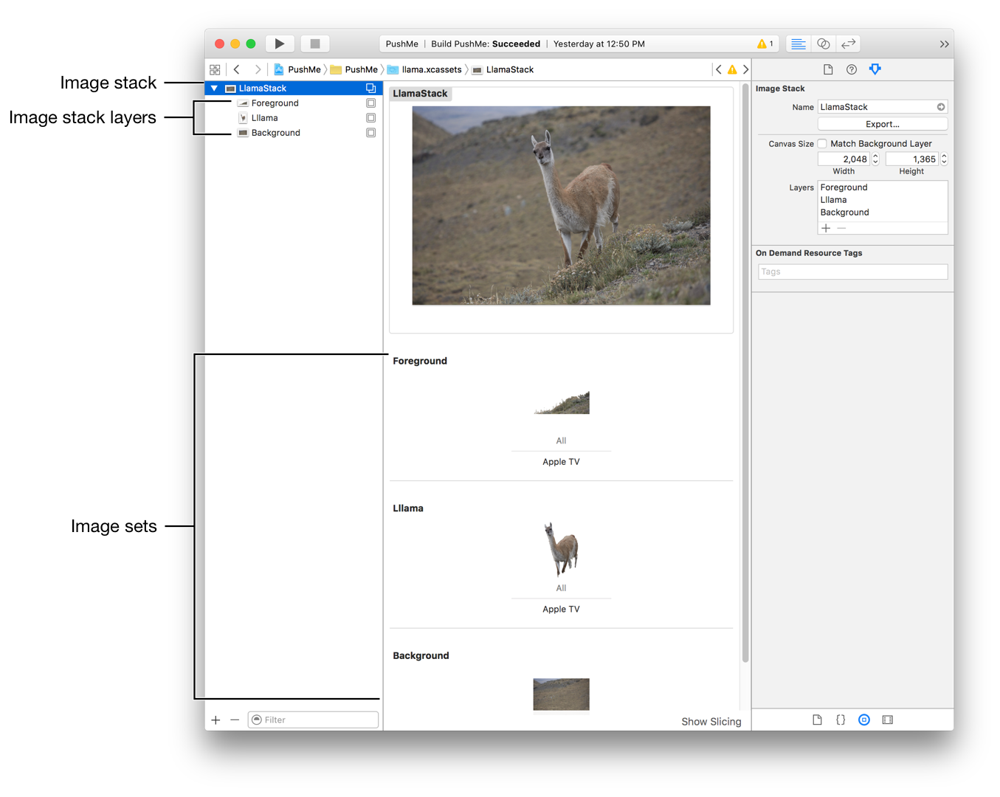

> 导航：[总目录](../../../README.md) · [documentation](../../../_indexes/documentation.md) · [Asset Catalog Format Reference](index.md)


## LSR Format Overview

The Layer Source Representation (_LSR_) format is used for importing image stacks into apps running on tvOS or into the asset catalog in Xcode. Image stacks can be exported from the asset catalog, the Parallax Previewer OS X app, and the Parallax Exporter Photoshop plug-in. For more information on the Parallax Previewer app and the Photoshop plug-in, see [Layered Images](https://developer.apple.com/tvos/human-interface-guidelines/icons-and-images/#layered-images) in the [Apple TV Human Interface Guidelines](https://developer.apple.com/tvos/human-interface-guidelines/).

__Figure 31-1__Image stack in the asset catalog


In an asset catalog, image stacks are composed of three asset types as shown in Figure 31-1. The LSR format contains all the information required to display an image stack. This includes the associated image stack layers and image sets. These are structured as a nested hierarchy with the image stack as the root.

- Image stack

  - Image stack layer 1

    - Image set for layer 1
  - Image stack layer 2

    - Image set for layer 2
  - …
  - Image stack layer _n_

    - Image set for layer _n_

The format of the elements corresponds closely to the asset catalog format for each type, including the use of a Contents.json file for attributes and folders for image stack layers and image sets.

- ```
  image-stack/
  ```
- ```
     Contents.JSON
  ```
- ```
         <image-stack-layer—name>.imagestacklayer/
  ```
- ```
        Contents.JSON
  ```
- ```
            <image-set—name>.imageset/
  ```
- ```
                   <image-name>.<image-type>
  ```
- ```
  <image-stack-layer—name>.imagestacklayer/
  ```
- ```
  …
  ```

At the top level is a folder for each of the image stack layers and a `Contents.JSON` file defining the attributes of the image stack. Inside each image stack layer folder is a folder for the image set and a `Contents.JSON` file defining the attributes of that layer. The image set folder contains an image file and a `Contents.JSON` file defining the attributes for the image set.

The syntax and structure of the `Contents.JSON` file are the same as the ones used in the asset catalog format. For more information, see the [Contents.json File](Contents.md#apple-f4xwc4dqnrsv64tfmyxwi33df52wszbpkridimbqge2tcnzqfvbuqmzwfvjvomi) chapter of this reference.

For information on the JSON for each type, see [LSR Image Stack](LSRTop-LevelJSON.md#apple-f4xwc4dqnrsv64tfmyxwi33df52wszbpkridimbqge2tcnzqfvbuqnbwfvjvomi), [LSR Image Stack Layer](ImageStackLayerJSON.md#apple-f4xwc4dqnrsv64tfmyxwi33df52wszbpkridimbqge2tcnzqfvbuqnbyfvjvomi), and [LSR Image Set](ImageSetJSON.md#apple-f4xwc4dqnrsv64tfmyxwi33df52wszbpkridimbqge2tcnzqfvbuqnbzfvjvomi) in this reference.

### LSR Filename

The name of an LSR file is the name of the image stack followed by the `.lsr` extension. Importing uses the base name of the file as the name of the image stack.

- `<image-stack-name>.lsr`

The name of the file can be changed at any time and has no effect on the contents.

[Watch Complications Type](WatchComplicationsType.md#apple-f4xwc4dqnrsv64tfmyxwi33df52wszbpkridimbqge2tcnzqfvbuqmzufvjvomi)

[LSR Image Set](ImageSetJSON.md#apple-f4xwc4dqnrsv64tfmyxwi33df52wszbpkridimbqge2tcnzqfvbuqnbzfvjvomi)
