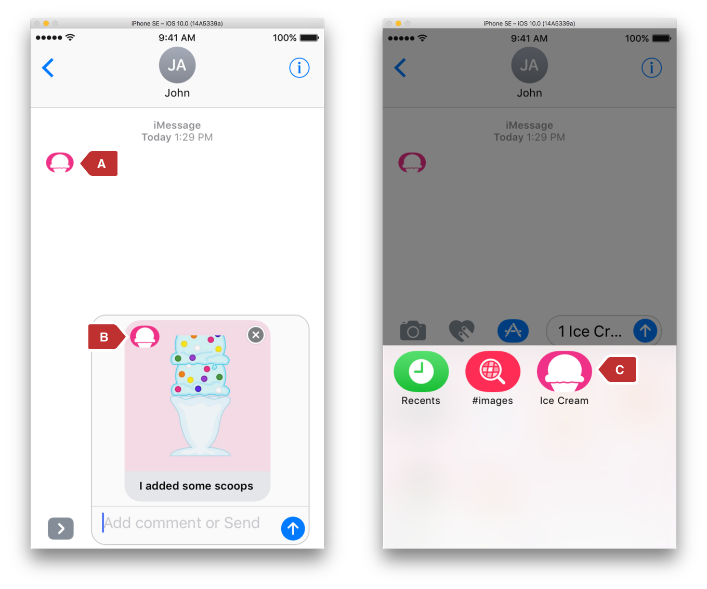

> 导航：[总目录](../../../README.md) · [documentation](../../../_indexes/documentation.md) · [Asset Catalog Format Reference](index.md)

## Messages Extension Icon Type

The application icons for a Messages extension.

### Extension

`.stickersiconset`

### Folder Contents

`.png` files for the icons for a Messages extension.

### Contents.json File

Metadata and attributes for the individual icon files as shown in (Table 22-1).

__Table 22-1__Messages icon tags

| Key | Type | Description |
| --- | --- | --- |
| `info` | Dictionary | Versioning information for the asset catalog. |
| `author` | String | The application that authored the asset catalog. |
| `version` | Number | The version of the asset catalog. |
| `images` | Array of dictionaries | Each dictionary in the array is one variant of the Messages extension icon. |
| `filename` | String | The name of the `.png` file containing the image. |
| `idiom` | Slot Component | The idiom of the icon. For the values, see [idiom](ImageSetType.md#apple-f4xwc4dqnrsv64tfmyxwi33df52wszbpkridimbqge2tcnzqfvbuqmrvfvjvomq) in [Image Set Type](ImageSetType.md#apple-f4xwc4dqnrsv64tfmyxwi33df52wszbpkridimbqge2tcnzqfvbuqmrvfvjvomi). |
| `size` | Slot Component | One of the sizes that matches the idiom for the icon. If the size is not valid, the image is ignored.  For the values, see [size](#apple-f4xwc4dqnrsv64tfmyxwi33df52wszbpkridimbqge2tcnzqfvbuqnjyfvjvomy) below. |
| `scale` | Slot Component | The scale of the icon. For the values, see [scale](ImageSetType.md#apple-f4xwc4dqnrsv64tfmyxwi33df52wszbpkridimbqge2tcnzqfvbuqmrvfvjvomy) in [Image Set Type](ImageSetType.md#apple-f4xwc4dqnrsv64tfmyxwi33df52wszbpkridimbqge2tcnzqfvbuqmrvfvjvomi). |
| `platform` | String | A specific platform type for images with an `idiom` of `universal`. |

### Values for Enumerated Tags

### idiom

See [idiom](ImageSetType.md#apple-f4xwc4dqnrsv64tfmyxwi33df52wszbpkridimbqge2tcnzqfvbuqmrvfvjvomq) in [Image Set Type](ImageSetType.md#apple-f4xwc4dqnrsv64tfmyxwi33df52wszbpkridimbqge2tcnzqfvbuqmrvfvjvomi).

### platform

Used for an image that is targeted for a specific platform when the `idiom` is `universal` Table 22-2. For example, an image that is targeted for all iOS devices but not for macOS, tvOS, or watchOS devices.

__Table 22-2__platform values

| Value | Description |
| --- | --- |
| ios | Devices running iOS, such as iPhone and iPad. |
| macos | Devices running macOS, such as MacBook Pro. |
| tvos | Devices running tvOS, such as Apple TV |
| watchos | Devices running watchOS, such as Apple Watch. |

### size

The size of the Messages app icon in points. Also see [Points Versus Pixels](../../Windows%20Views/View%20Programming%20Guide%20for%20iOS/View%20and%20Window%20Architecture.md#apple-f4xwc4dqnrsv64tfmyxwi33df52wszbpkridimbqga4tkmbtfvbuqmrnknltcni) (Table 6-2).

__Table 22-3__`size` values

| Value | Description |
| --- | --- |
| `29x29` | An iPhone or iPad settings icon. |
| `60x45` | A Messages extensions icon for iPhone indicated by "C" in Figure 22-1. |
| `67x50` | A Messages extensions icon for iPad indicated by "C" in Figure 22-1. |
| `74x55` | A Messages extensions icon for iPad Pro indicated by "C" in Figure 22-1. |
| `27x20` | A Messages breadcrumb icon indicated by "A" in Figure 22-1. |
| `32x24` | An icon used to identify the Messages app in individual messages indicated by "B" in Figure 22-1. |
| `1024x768` | An icon for the App store and Messages App store. |

__Figure 22-1__Messages icon sizes

### scale

See [scale](ImageSetType.md#apple-f4xwc4dqnrsv64tfmyxwi33df52wszbpkridimbqge2tcnzqfvbuqmrvfvjvomy) in [Image Set Type](ImageSetType.md#apple-f4xwc4dqnrsv64tfmyxwi33df52wszbpkridimbqge2tcnzqfvbuqmrvfvjvomi).

### Sample Contents.json File

1. `{`
2. `"images" : [{`
3. `"size" : "60x45",`
4. `"idiom" : "iPhone",`
5. `"filename" : "MyStickerPackIcon_60x45@2x.png",`
6. `"scale" : "2x"`
7. `},`
8. `{`
9. `"size" : "60x45",`
10. `"idiom" : "iPhone",`
11. `"filename" : "MyStickerPackIcon_60x45@3x.png",`
12. `"scale" : "3x"`
13. `},`
14. `{`
15. `"size" : "67x50",`
16. `"idiom" : "iPad",`
17. `"filename" : "MyStickerPackIcon_67x50@2x.png",`
18. `"scale" : "2x"`
19. `},`
20. `{`
21. `"size" : "74x55",`
22. `"idiom" : "iPad",`
23. `"filename" : "MyStickerPackIcon_74x55@2x.png",`
24. `"scale" : "2x"`
25. `},`
26. `{`
27. `"size" : "27x20",`
28. `"idiom" : "universal",`
29. `"filename" : "MyStickerPackIcon_27x20@2x.png",`
30. `"scale" : "2x"`
31. `"platform" : "ios"`
32. `},`
33. `{`
34. `"size" : "27x20",`
35. `"idiom" : "universal",`
36. `"filename" : "MyStickerPackIcon_27x20@3x.png",`
37. `"scale" : "3x"`
38. `"platform" : "ios"`
39. `},`
40. `{`
41. `"size" : "32x24",`
42. `"idiom" : "universal",`
43. `"filename" : "MyStickerPackIcon_32x24@3x.png",`
44. `"scale" : "3x"`
45. `"platform" : "ios"`
46. `},`
47. `{`
48. `"size" : "1024x768",`
49. `"idiom" : "ios-marketing",`
50. `"filename" : "MyStickerPackIcon_ios-marketing.png",`
51. `"scale" : "1x"`
52. `"platform" : "ios"`
53. `}],`
54. `"info" : {`
55. `"author" : "com.developerName",`
56. `"version" : 1`
57. `}`
58. `}`

[Launch Image Type](LaunchImageType.md#apple-f4xwc4dqnrsv64tfmyxwi33df52wszbpkridimbqge2tcnzqfvbuqmrwfvjvomi)

[Mipmap Type](MIPMapType.md#apple-f4xwc4dqnrsv64tfmyxwi33df52wszbpkridimbqge2tcnzqfvbuqnjxfvjvomi)
