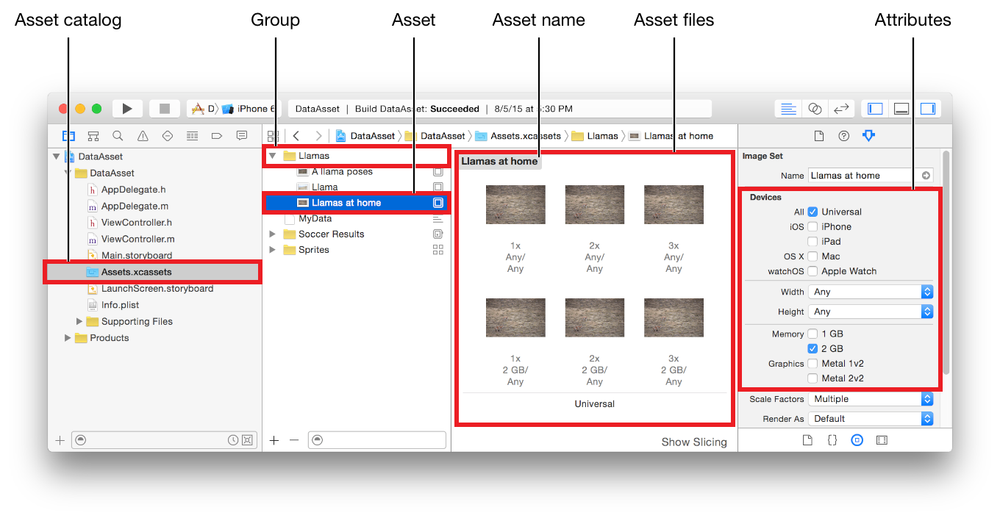

> 导航：[总目录](../../../README.md) · [documentation](../../../_indexes/documentation.md)

## Format Overview

Asset catalogs simplify access to app resources by mapping between named assets and one or more files targeted for different device attributes. Attributes include device characteristics, size classes, on-demand resources, and type-specific information. The attributes are used to choose the best file for app slicing variants, and at runtime to choose the right image for the current screen orientation.

For more information on asset catalogs, see [Asset catalogs](http://help.apple.com/xcode/mac/current/#/dev10510b1f7) in [Xcode Help](http://help.apple.com/xcode/mac/current/). For more information on app slicing, see App Thinning (iOS, watchOS).

### Asset Catalog Contents

The different kinds of elements in an asset catalog are shown in Figure 1-1.

__Figure 1-1__Asset catalog elements

The contents of an asset catalog include:

- __Groups.__ A group can contain one or more assets and one or more groups.
- __Assets.__ An asset is a set of files and the associated attributes for one named asset of a single type.

  - Asset __names__ are the developer-defined strings used to access the asset.
  - Asset __files__ are the resource or data files for a named asset.
- __Attributes.__ An attribute is a characteristic of a group, asset, or asset file.
- __Asset variations.__ An asset variation is a single sliced variant of one named asset that is based on the set of assigned attribute values. For more information on slicing, see Slicing (iOS).

### General Format

The contents of an asset catalog, mentioned in the previous section, are organized into these parts:

- __Folders.__ A folder can contain an asset and a group. The name of a folder containing an asset includes the name of the asset and the type of the asset. Group folder names do not have a type extension. The hierarchy of folders is used for the hierarchy of the asset catalog.
- __JSON files.__ A `.json` file contains the attributes for an asset, a group of assets, or the asset catalog.
- __Content files.__ A content file is a resource or data file for one variation of one asset.

[Folders](FolderStructure.md#apple-f4xwc4dqnrsv64tfmyxwi33df52wszbpkridimbqge2tcnzqfvbuqmztfvjvomi)
