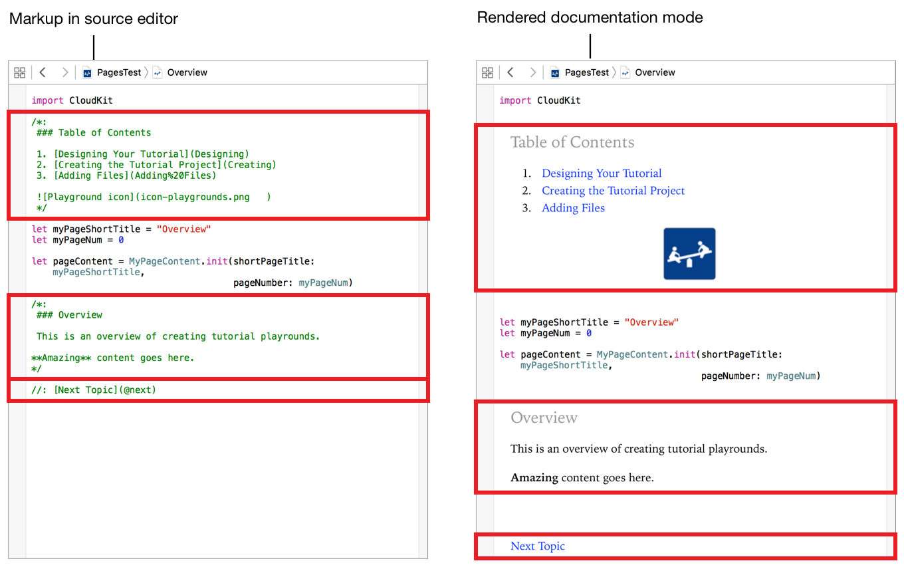
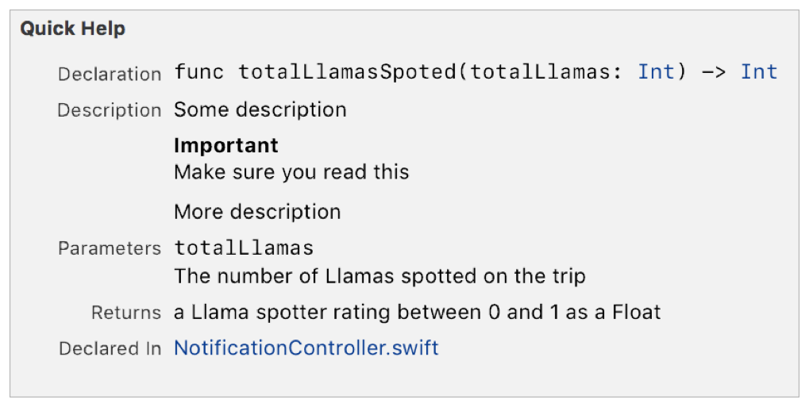

> 导航：[总目录](../../../README.md) · [documentation](../../../_indexes/documentation.md) · [Markup Formatting Reference](index.md)


## Adding Markup to Files

Markup delimiters appear inside special comment markers in `.playground` or `.swift` files.

__Single line__ comment markers contain one line of text containing markup delimiters.

- ```
  single line comment marker  markup formatted text
  ```

For example, the following markup displays a a link to the next page of a playground project in the rendered documentation for a playground as shown in Figure 3-1.

1. `//: [Next Topic](@next)`

__Figure 3-1__Single line comment example


__Block__ comment markers enclose one or more lines of text containing markup delimiters.

- ```
  block open comment marker
  ```
- ```
   markup formatted text
  ```
- ```
       …
  ```
- ```
   markup formatted text
  ```
- ```
  block close comment marker
  ```

For example, the following markup adds a parameters section to the Quick Help for a Swift method as shown in Figure 3-2.

1. `/**`
2. `- parameters:`
3. `- cubes: The cubes available for allocation`
4. `- people: The people that require cubes`
5. `*/`

__Figure 3-2__Block comment example


> [!NOTE]
> 

### Ordering of Rendered Content

Markup delimited content appears on the rendered page in the same order as it appears in the source editor.

### Ordering of Content in Playgrounds

Playground pages in rendered documentation mode show the rendered markup interspersed with other content.

Figure 3-3 shows two screenshots of the same playground. The raw markup is on the left and the rendered documentation is on the right. The red boxes show each of the markup delimiters and their corresponding rendered output. For example, the top box in each view of the page page shows the first block of markup that includes a first level heading, a numbered list, and an image. The next box shows a heading, a line of text, and then a line of text with a bolded word. The final box shows a single line comment that is a link to the next playground page.

The Swift content appears interspersed with the markup content. For example, the constant definition for `myPageShortTitle` is the first item below the first box in each view of the page.

__Figure 3-3__Order of rendered markup


### Ordering of Content in Quick Help

Quick Help groups the markup into different sections. The rendered content in each section appears in the same order as the unrendered markup.

For example, the the following markup generates the Quick Help shown in Figure 3-4.

1. `/**`
2. `Another description`
4. `- important: Make sure you read this`
5. `- returns: a Llama spotter rating between 0 and 1 as a Float`
6. `- parameter totalLlamas: The number of Llamas spotted on the trip`
8. `More description`
9. `*/`

__Figure 3-4__Quick Help sections


The markup in lines 2-4 and line 8 generates the `Description` section. The order of rendered elements in the section is the same as the order in the markup. The text from line 1 is shown at the top of the description, the important callout from line 4 is shown next, and then the text from line 8.

Line 6 generates the content in the `Parameters` section, even though it comes before the markup used for the final line of the description. Similarly, Line 5 generates the `Returns` section which comes after the parameters section.

For more information on using markup to generate Quick Help, see [Formatting Quick Help](SymbolDocumentation.md#apple-f4xwc4dqnrsv64tfmyxwi33df52wszbpkridimbqge3diojxfvbuqnjrfvjvomi).

[Markup Functionality](MarkupFunctionality.md#apple-f4xwc4dqnrsv64tfmyxwi33df52wszbpkridimbqge3diojxfvbuqnjufvjvomi)

[Markup Syntax](MarkupSyntax.md#apple-f4xwc4dqnrsv64tfmyxwi33df52wszbpkridimbqge3diojxfvbuqmjqguwvgvzr)
