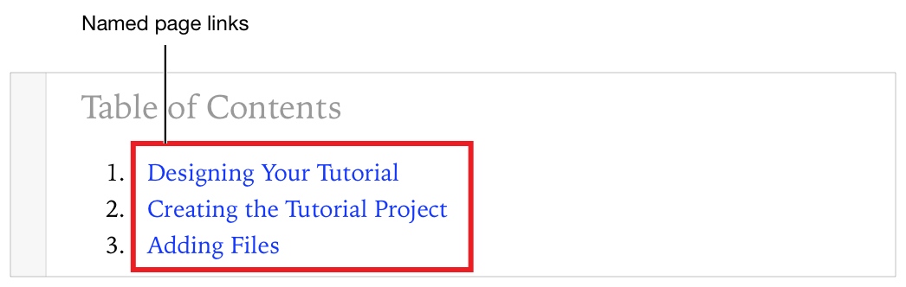

> 导航：[总目录](../../../README.md) · [documentation](../../../_indexes/documentation.md) · [Markup Formatting Reference](index.md)


## Named Page

Open a named page in the playground.

Selecting a link that points to the same playground page as the one containing the link has no effect.

For example, in the screenshot `Overview.playground` is the first page and `Adding Files.playground` is the last page.


Works with:

- ✓ Playgrounds
- Symbol documentation

### Syntax

- ```
  [link name](name of the playground document to open)
  ```

Replace spaces in the name of the playground page with the ASCII character code for space (`%20`).

### Example: Simple Named Page Link

The markup below is for a named page link that opens a playground page called `Adding Files.playground`.

1. `//: [Adding Files](Adding%20Files)`

The named page link is rendered as a link with the text "Adding Files" in rendered documentation, as shown in the screenshot.


### Example: Named Page Links in Context

You can use named page links to build a table of contents. Lines 4-6 below are links to different pages. Each link is an item in a numbered list.

1. `/*:`
2. `### Table of Contents`
4. `1. [Designing Your Tutorial](Designing)`
5. `2. [Creating the Tutorial Project](Creating)`
6. `3. [Adding Files](Adding%20Files)`
7. `*/`

In the screenshot below, line 4 of the markup renders as link to the file `Designing.playground` named "Designing Your Tutorial." Lines 5 and 6 render as list items two and three.



[Previous Page](PreviousPage.md#apple-f4xwc4dqnrsv64tfmyxwi33df52wszbpkridimbqge3diojxfvbuqmrrfvjvomi)

[Images](Images.md#apple-f4xwc4dqnrsv64tfmyxwi33df52wszbpkridimbqge3diojxfvbuqmjxfvjvomi)
