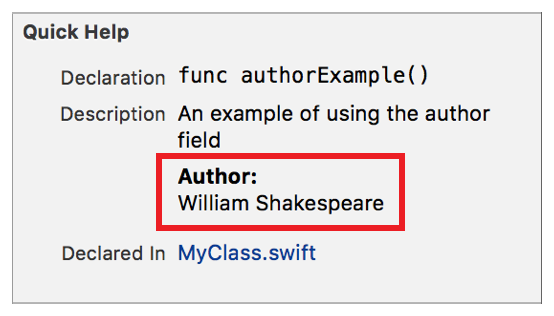

> 导航：[总目录](../../../README.md) · [documentation](../../../_indexes/documentation.md) · [Markup Formatting Reference](index.md)


## Author

Add an `Author` callout with a single name to the Quick Help for a symbol using the Author delimiter. Multiple `Author` callouts appear in the description section in the same order as they do in the markup

Use the callout to display the author of the code for a symbol.

Works with:

- Playgrounds
- ✓ Symbol documentation

### Syntax

- ```
  * | + | - Author: author name
  ```
- ```
  optional continuation of author name
  ```

The author name displayed in Quick Help is created as described in [Parameters Section](SymbolDocumentation.md#apple-f4xwc4dqnrsv64tfmyxwi33df52wszbpkridimbqge3diojxfvbuqnjrfvjvoni).

### Example

1. `/**`
2. `An example of using the author field`
4. `- Author: William Shakespeare`
5. `*/`



### Alternative

Use the [Authors](Authors.md#apple-f4xwc4dqnrsv64tfmyxwi33df52wszbpkridimbqge3diojxfvbuqmzrfvjvomi) delimiter to list multiple authors in one callout.

[Attention](Attention.md#apple-f4xwc4dqnrsv64tfmyxwi33df52wszbpkridimbqge3diojxfvbuqmrzfvjvomi)

[Authors](Authors.md#apple-f4xwc4dqnrsv64tfmyxwi33df52wszbpkridimbqge3diojxfvbuqmzrfvjvomi)
