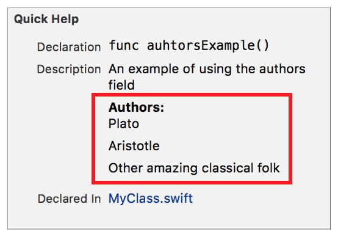

> 导航：[总目录](../../../README.md) · [documentation](../../../_indexes/documentation.md) · [Markup Formatting Reference](index.md)


## Authors

Add an `Authors` callout with a list of authors to the Quick Help for a symbol. The order of the authors in Quick Help is the same as the order they appear in the delimiter. Multiple Authors delimiters are added to Quick Help in the order that they appear in the markup.

Use the callout to display the authors of the code for a symbol.

Works with:

- Playgrounds
- ✓ Symbol documentation

### Syntax

- ```
  * | + | - Authors:
  ```
- ```
    author name
  ```
- ```
    optional continuation of author name
  ```
- ```

  ```
- ```
    author name
  ```
- ```
    optional continuation of author name
  ```
- ```
    …
  ```

The author names displayed in Quick Help are created as described in [Returns Section](SymbolDocumentation.md#apple-f4xwc4dqnrsv64tfmyxwi33df52wszbpkridimbqge3diojxfvbuqnjrfvjvonq).

> [!IMPORTANT]
> 

### Example

1. `/**`
2. `An example of using the authors callout`
4. `- Authors:`
5. `Plato`
7. `Aristotle`
9. `Other amazing`
10. `classical folk`
11. `*/`



### Alternative

Use the [Author](Author.md#apple-f4xwc4dqnrsv64tfmyxwi33df52wszbpkridimbqge3diojxfvbuqmzqfvjvomi) delimiter for a single author.

[Author](Author.md#apple-f4xwc4dqnrsv64tfmyxwi33df52wszbpkridimbqge3diojxfvbuqmzqfvjvomi)

[Bug](Bug.md#apple-f4xwc4dqnrsv64tfmyxwi33df52wszbpkridimbqge3diojxfvbuqmzsfvjvomi)
