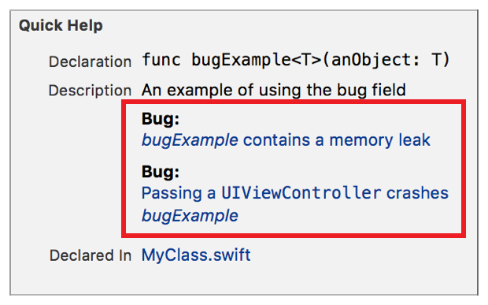

> 导航：[总目录](../../../README.md) · [documentation](../../../_indexes/documentation.md) · [Markup Formatting Reference](index.md)


## Bug

Adds a `Bug` callout to the Quick Help for a symbol using the Bug delimiter. Multiple `Bug` callouts appear in the description section in the same order as they do in the markup.

Use the callout to display a bug for a symbol.

Works with:

- Playgrounds
- ✓ Symbol documentation

### Syntax

- ```
  * | + | - Bug: description
  ```
- ```
  optional continuation of description
  ```

The description displayed in quick for the help bug callout is created as described in [Parameters Section](SymbolDocumentation.md#apple-f4xwc4dqnrsv64tfmyxwi33df52wszbpkridimbqge3diojxfvbuqnjrfvjvoni).

### Example

1. `/**`
2. `An example of using the bug field`
4. `- Bug:`
5. `[*bugExample* contains a memory leak](BugDB://problem/1367823)`
7. `- Bug:`
8. `` [Passing a `UIViewController` crashes *bugExample*](BugDB://problem/2274610) ``
9. `*/`



[Authors](Authors.md#apple-f4xwc4dqnrsv64tfmyxwi33df52wszbpkridimbqge3diojxfvbuqmzrfvjvomi)

[Complexity](Complexity.md#apple-f4xwc4dqnrsv64tfmyxwi33df52wszbpkridimbqge3diojxfvbuqmztfvjvomi)
