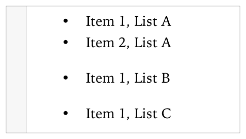
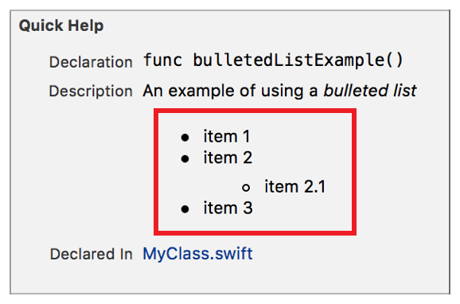

> 导航：[总目录](../../../README.md) · [documentation](../../../_indexes/documentation.md) · [Markup Formatting Reference](index.md)


## Bulleted Lists

Display text as a bulleted list.

Works with:

✓ Playgrounds

✓ Symbol documentation

### Syntax

Bulleted lists use an asterisk (`*`), plus sign (`+`), or hyphen (`-`) to delimit each item. There is at least one space between the delimiter and the item. The delimiter has no effect on the marker shown in the rendered text. Using a different delimiter starts a new list.

The number of spaces before an item delimiter indicates the level of the list. All first level items start with up to three spaces. Add four spaces or one tab for each additional level, to a maximum of three levels. For more information, see [Nesting Delimiters](MarkupSyntax.md#apple-f4xwc4dqnrsv64tfmyxwi33df52wszbpkridimbqge3diojxfvbuqmjqguwvgvzsgu).

List content separated by a single empty line renders as a paragraph. For more information, see [Multiline Elements](MarkupSyntax.md#apple-f4xwc4dqnrsv64tfmyxwi33df52wszbpkridimbqge3diojxfvbuqmjqguwvgvzrga).

- ```
  * | + | - string
  ```
- ```
          * | + | - string
  ```
- ```
                  * | + | - string
  ```

### Playground Example

The markup below changes the list delimiter and renders as three separate lists. Lines 2 and 3 are are rendered as list A in the srcreenshot. Line 4 renders as list B, and line 5 renders as list C.

1. `/*:`
2. `- Item 1, List A`
3. `- Item 2, List A`
4. `* Item 1, List B`
5. `+ Item 1, List C`
6. `*/`



### Quick Help Example

Lines 4-7 below mark the four items in a list with two levels. Line 6 is the indented list item. The screenshot shows how the list appears in Quick Help.

1. `/**`
2. `An example of using a *bulleted list*`
4. `* item 1`
5. `* item 2`
6. `* item 2.1`
7. `* item 3`
8. `*/`



[Horizontal Rules](HorizontalRules.md#apple-f4xwc4dqnrsv64tfmyxwi33df52wszbpkridimbqge3diojxfvbuqmjtfvjvomi)

[Numbered Lists](NumberedLists.md#apple-f4xwc4dqnrsv64tfmyxwi33df52wszbpkridimbqge3diojxfvbuqmjqfvjvomi)
