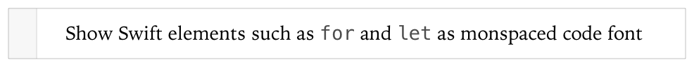
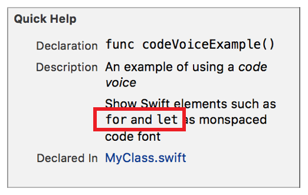

> 导航：[总目录](../../../README.md) · [documentation](../../../_indexes/documentation.md) · [Markup Formatting Reference](index.md)


## Code Voice

Render a span of text using the font for code voice.

Works with:

- ✓ Playgrounds
- ✓ Symbol documentation

### Syntax

Format a span of text as code by using a backquote (`` ` ``) before the first character of the span and after the last character of the span. The first and last characters cannot be spaces.

- ```
  `string`
  ```

### Playground Example

1. `` //: Show Swift elements such as `for` and `let` as monspaced code font ``



### Quick Help Example

1. `/**`
2. `An example of using a *code voice*`
4. `` Show Swift elements such as `for` and `let` as monspaced code font ``
5. `*/`



[Code Block](CodeBlocks.md#apple-f4xwc4dqnrsv64tfmyxwi33df52wszbpkridimbqge3diojxfvbuqmjsfvjvomi)

[Emphasis (Italics)](Emphasis%28Italics%29.md#apple-f4xwc4dqnrsv64tfmyxwi33df52wszbpkridimbqge3diojxfvbuqmjufvjvomi)
