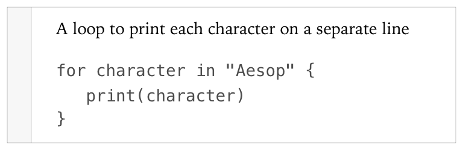
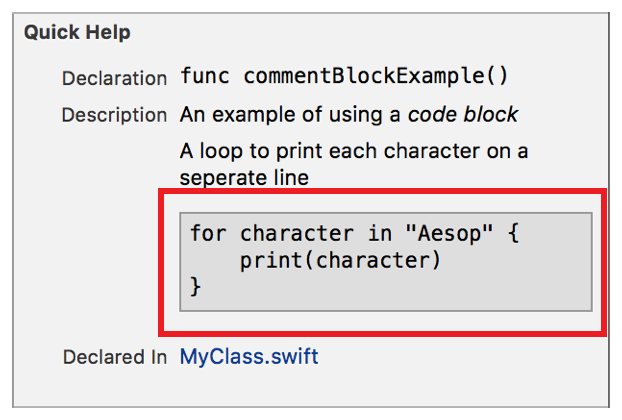

> 导航：[总目录](../../../README.md) · [documentation](../../../_indexes/documentation.md) · [Markup Formatting Reference](index.md)


## Code Block

Display the text as a block of code.

Works with:

- ✓ Playgrounds
- ✓ Symbol documentation

### Syntax

Start each line of a code block indented at least four spaces or one tab from the indent level for the current delimiter. For information on indent level, see [Quick Help Sections](SymbolDocumentation.md#apple-f4xwc4dqnrsv64tfmyxwi33df52wszbpkridimbqge3diojxfvbuqnjrfvjvomq). There are empty lines above and below the code block.

- ```
  …
  ```
- ```

  ```
- ```
          code line
  ```
- ```
          …
  ```
- ```

  ```
- ```
  …
  ```

### Alternate syntax for symbol documentation

Enter four backquotes (`` ` ``) on a line above and below the lines for the code block. The four backquotes start at the indent level for the current delimiter. For information on indent level, see [Quick Help Sections](SymbolDocumentation.md#apple-f4xwc4dqnrsv64tfmyxwi33df52wszbpkridimbqge3diojxfvbuqnjrfvjvomq).

- `````
  ````
  `````
- ```
  code line
  ```
- ```
  …
  ```
- `````
  ````
  `````

### Playground Example

Lines 3-5 in the markup below result in the code block shown in the screenshot.

1. `/*:`
2. `A loop to print each character on a seperate line`
4. `for character in "Aesop" {`
5. `println(character)`
6. `}`
7. `*/`



### Quick Help Example

Lines 5-7 in each of the comment blocks below result in the code block shown in screenshot.

1. `/**`
2. `An example of using a *code block*`
4. `A loop to print each character on a seperate line`
6. `for character in "Aesop" {`
7. `print(character)}`
8. `}`
9. `*/`

__Alternate syntax__

1. `/**`
2. `An example of using a *code block*`
4. `A loop to print each character on a seperate line`
5. ````` ```` `````
6. `for character in "Aesop" {`
7. `print(character)}`
8. `}`
9. ````` ```` `````
10. `*/`



[Numbered Lists](NumberedLists.md#apple-f4xwc4dqnrsv64tfmyxwi33df52wszbpkridimbqge3diojxfvbuqmjqfvjvomi)

[Code Voice](Code.md#apple-f4xwc4dqnrsv64tfmyxwi33df52wszbpkridimbqge3diojxfvbuqmjwfvjvomi)
