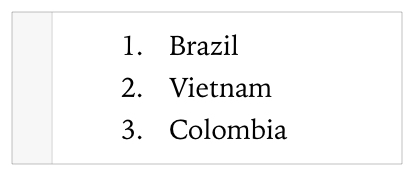

> 导航：[总目录](../../../README.md) · [documentation](../../../_indexes/documentation.md) · [Markup Formatting Reference](index.md)


## Block Comment

Add a block of markup using these special opening and closing comment markers.

Works with:

- ✓ Playgrounds
- ✓ Symbol documentation

### Playground Syntax

Use a forward slash (`/`) followed by an asterisk (`*`) and then a colon (`:`) for the opening comment. Use an asterisk followed by a forward slash for the closing comment.

- ```
  /*:
  ```
- ```
       line of text with optional markup
  ```
- ```
       …
  ```
- ```
       line of text with optional markup
  ```
- ```
   */
  ```

The lines in between the opening and closing comments can contain text, text and markup, or nothing. There is no limit to the number of lines.

Text on same line of the opening comment is ignored.

### Example

The following markup show a numbered list of the top three coffee producers of 2014.

1. `/*:`
2. `1. Brazil`
3. `2. Vietnam`
4. `3. Colombia`
5. `*/`



### Quick Help Syntax

Use a forward slash (`/`) followed by two asterisks (`*`) for the opening comment. Use an asterisk followed by a forward slash for the closing comment.

- ```
  /**
  ```
- ```
       line of text with optional markup
  ```
- ```
       …
  ```
- ```
       line of text with optional markup
  ```
- ```
   */
  ```

The lines in between the opening and closing delimiters can contain text, text and markup, or nothing. There is no limit to the number of lines.

The opening comment line can contain text that will be concatenated with the contents of the line below the delimiter. This is the only case where lines are concatenated.

### Example

The following markup documents the `cubes` and `people` parameters.

1. `/**`
2. `- parameters:`
3. `- cubes: The cubes available for allocation`
4. `- people: The people that require cubes`
5. `*/`


[Single Line Comment](SingleLineComment.md#apple-f4xwc4dqnrsv64tfmyxwi33df52wszbpkridimbqge3diojxfvbuqmjqgiwvgvzr)

[Headings](Headings.md#apple-f4xwc4dqnrsv64tfmyxwi33df52wszbpkridimbqge3diojxfvbuqobnknltc)
