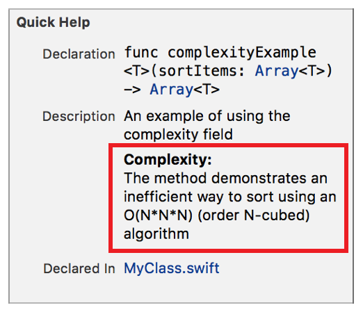

> 导航：[总目录](../../../README.md) · [documentation](../../../_indexes/documentation.md) · [Markup Formatting Reference](index.md)


## Complexity

Add a `Complexity` callout to the Quick Help for a symbol using the Complexity delimiter. Multiple `Complexity` callouts appear in the description section in the same order as they do in the markup.

Use the callout to display the algorithmic complexity of a method or function.

Works with:

- Playgrounds
- ✓ Symbol documentation

### Syntax

- ```
  * | + | - Complexity: description
  ```
- ```
  optional continuation of description
  ```

The description displayed in Quick Help for the complexity callout is created as described in [Parameters Section](SymbolDocumentation.md#apple-f4xwc4dqnrsv64tfmyxwi33df52wszbpkridimbqge3diojxfvbuqnjrfvjvoni).

### Example

1. `/**`
2. `An example of using the complexity field`
4. `- Complexity:`
5. `The method demonstrates an inefficient way to sort`
6. `using an O(N\*N\*N) (order N-cubed) algorithm`
7. `*/`



[Bug](Bug.md#apple-f4xwc4dqnrsv64tfmyxwi33df52wszbpkridimbqge3diojxfvbuqmzsfvjvomi)

[Copyright](Copyright.md#apple-f4xwc4dqnrsv64tfmyxwi33df52wszbpkridimbqge3diojxfvbuqmzufvjvomi)
