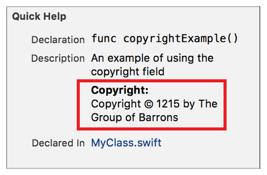

> 导航：[总目录](../../../README.md) · [documentation](../../../_indexes/documentation.md) · [Markup Formatting Reference](index.md)


## Copyright

Add a `Copyright` callout to the Quick Help for a symbol using the Copyright delimiter. Multiple `Copyright` callouts appear in the description section in the same order as they do in the markup.

Use the callout to display copyright information for a symbol.

Works with:

- Playgrounds
- ✓ Symbol documentation

### Syntax

- ```
  * | + | - Copyright: description
  ```
- ```
  optional continuation of description
  ```

The description displayed in Quick Help for the copyright callout is created as described in [Parameters Section](SymbolDocumentation.md#apple-f4xwc4dqnrsv64tfmyxwi33df52wszbpkridimbqge3diojxfvbuqnjrfvjvoni).

### Example

1. `/**`
2. `An example of using the copyright field`
4. `- Copyright: Copyright © 1215`
5. `by The Group of Barrons`
6. `*/`



[Complexity](Complexity.md#apple-f4xwc4dqnrsv64tfmyxwi33df52wszbpkridimbqge3diojxfvbuqmztfvjvomi)

[Custom Callout](CustomCallouts.md#apple-f4xwc4dqnrsv64tfmyxwi33df52wszbpkridimbqge3diojxfvbuqnjzfvjvomi)
