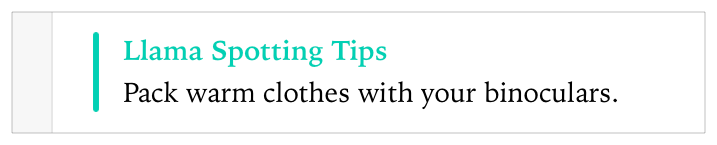

> 导航：[总目录](../../../README.md) · [documentation](../../../_indexes/documentation.md) · [Markup Formatting Reference](index.md)


## Custom Callout

Customize your playground for your audience by adding custom titles for your callouts.

Works with:

- ✓ Playgrounds
- Symbol documentation

### Syntax

- ```
  * | + | - Callout(custom title string): description
  ```
- ```
  optional continuation of description
  ```

### Example

Show a callout with the custom title "Try it out!".

1. `/*:`
2. `* Callout(Llama Spotting Tips):`
3. `Pack warm clothes with your binoculars.`
4. `*/`



[Copyright](Copyright.md#apple-f4xwc4dqnrsv64tfmyxwi33df52wszbpkridimbqge3diojxfvbuqmzufvjvomi)

[Date](Date.md#apple-f4xwc4dqnrsv64tfmyxwi33df52wszbpkridimbqge3diojxfvbuqmzvfvjvomi)
