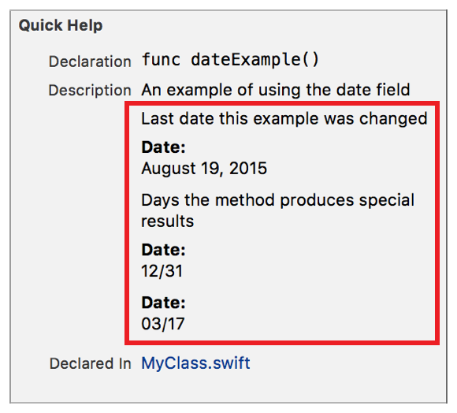

> 导航：[总目录](../../../README.md) · [documentation](../../../_indexes/documentation.md) · [Markup Formatting Reference](index.md)


## Date

Add a `Date` callout to the Quick Help for a symbol using the Date delimiter. Multiple `Date` callouts appear in the description section in the same order as they do in the markup.

Works with:

- Playgrounds
- ✓ Symbol documentation

### Syntax

- ```
  * | + | - Date: description
  ```
- ```
  optional continuation of description
  ```

The description displayed in Quick Help for the date callout is created as described in [Parameters Section](SymbolDocumentation.md#apple-f4xwc4dqnrsv64tfmyxwi33df52wszbpkridimbqge3diojxfvbuqnjrfvjvoni).

### Example

1. `/**`
2. `An example of using the date field`
4. `Last date this example was changed`
5. `- Date: August 19, 2015`
7. `Days the method produces special results`
8. `- Date: 12/31`
9. `- Date: 03/17`
10. `*/`



[Custom Callout](CustomCallouts.md#apple-f4xwc4dqnrsv64tfmyxwi33df52wszbpkridimbqge3diojxfvbuqnjzfvjvomi)

[Example](Example.md#apple-f4xwc4dqnrsv64tfmyxwi33df52wszbpkridimbqge3diojxfvbuqnjyfvjvomi)
