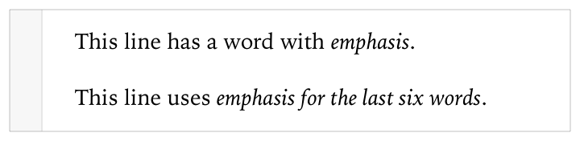
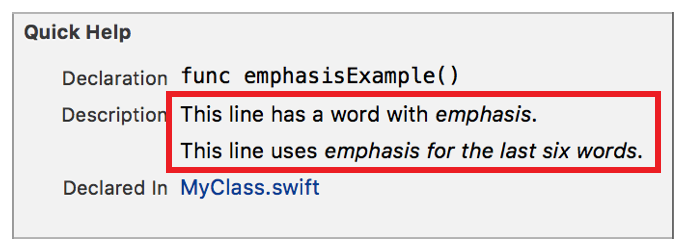

> 导航：[总目录](../../../README.md) · [documentation](../../../_indexes/documentation.md) · [Markup Formatting Reference](index.md)


## Emphasis (Italics)

Render a span of text using the font face for emphasis.

Works with:

- ✓ Playgrounds
- ✓ Symbol documentation

### Syntax

Add emphasis by using an asterisk (`*`) or underscore (`_`) before the first character of the span and after the last character of the span. The first and last characters cannot be spaces. Do not mix asterisks and underscores for the same element.

- ```
  *string*
  ```
- ```
  _string_
  ```

### Playground Example

1. `/*:`
2. `This line has a word with *emphasis*.`
4. `This line uses _emphasis for the last six words_.`
5. `*/`



### Quick Help Example

1. `/// This line has a word with *emphasis*.`
2. `///`
3. `/// This line uses _emphasis for the last six words_.`



[Code Voice](Code.md#apple-f4xwc4dqnrsv64tfmyxwi33df52wszbpkridimbqge3diojxfvbuqmjwfvjvomi)

[Strong (Bold)](Strong%28Bold%29.md#apple-f4xwc4dqnrsv64tfmyxwi33df52wszbpkridimbqge3diojxfvbuqmjvfvjvomi)
