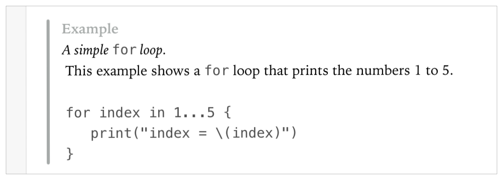

> 导航：[总目录](../../../README.md) · [documentation](../../../_indexes/documentation.md) · [Markup Formatting Reference](index.md)


## Example

Add an `Example` callout to a playground using the Example delimiter.

Works with:

- ✓ Playgrounds
- Symbol documentation

### Syntax

- ```
  * | + | - Example: description
  ```
- ```
  optional continuation of description
  ```

### Example

1. `/*:`
2. `` - Example: *A simple `for` loop.*\ ``
3. `` This example shows a `for` loop that prints the numbers 1 to 5.\ ``
4. `\`
5. `` `for index in 1...5 {`\ ``
6. `` `   print("index = \(index)")`\ ``
7. `` `}`} ``
8. `*/`



[Date](Date.md#apple-f4xwc4dqnrsv64tfmyxwi33df52wszbpkridimbqge3diojxfvbuqmzvfvjvomi)

[Experiment](Experiment.md#apple-f4xwc4dqnrsv64tfmyxwi33df52wszbpkridimbqge3diojxfvbuqmzwfvjvomi)
