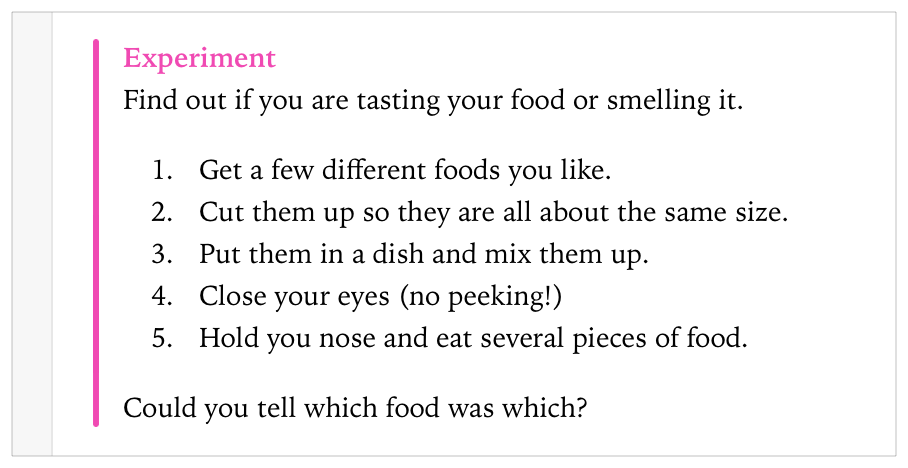
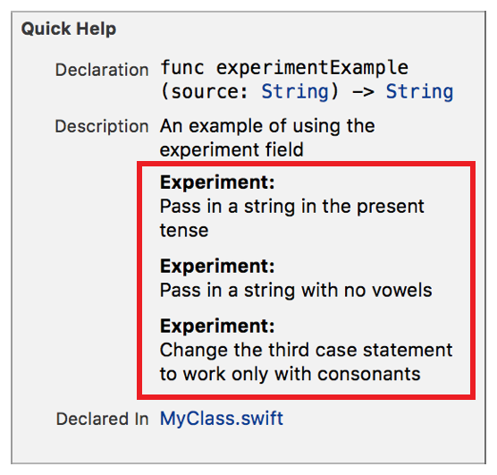

> 导航：[总目录](../../../README.md) · [documentation](../../../_indexes/documentation.md) · [Markup Formatting Reference](index.md)


## Experiment

Add an `Experiment` callout to a playground or to the Quick Help for a symbol using the Experiment delimiter. Multiple `Experiment` callouts appear in the description section in the same order as they do in the markup.

Provide a link to another playground page for complex experiments using the [Named Page](AnyPage.md#apple-f4xwc4dqnrsv64tfmyxwi33df52wszbpkridimbqge3diojxfvbuqmrsfvjvomi) delimiter.

Works with:

- ✓ Playgrounds
- ✓ Symbol documentation

### Syntax

- ```
  * | + | - Experiment: description
  ```
- ```
  optional continuation of description
  ```

The description displayed in Quick Help for the experiment callout is created as described in [Parameters Section](SymbolDocumentation.md#apple-f4xwc4dqnrsv64tfmyxwi33df52wszbpkridimbqge3diojxfvbuqnjrfvjvoni).

### Playground Example

The example below shows a simple step by step experiment.

1. `/*:`
2. `* Experiment:`
3. `Find out if you are tasting your food or smelling it.`
5. `1. Get a few different foods you like.`
6. `2. Cut them up so they are all about the same size.`
7. `3. Put them in a dish and mix them up.`
8. `4. Close your eyes (no peeking!)`
9. `5. Hold you nose and eat several pieces of food.`
11. `Could you tell which food was which?`
12. `*/`



### Quick Help Example

The markup below adds three experiments to Quick Help as shown in the screenshot.

1. `/**`
2. `An example of using the experiment field`
4. `- Experiment: Pass in a string in the present tense`
5. `- Experiment: Pass in a string with no vowels`
6. `- Experiment:`
7. `Change the third case statement to work only with consonants`
8. `*/`



[Example](Example.md#apple-f4xwc4dqnrsv64tfmyxwi33df52wszbpkridimbqge3diojxfvbuqnjyfvjvomi)

[Important](Important.md#apple-f4xwc4dqnrsv64tfmyxwi33df52wszbpkridimbqge3diojxfvbuqmzxfvjvomi)
