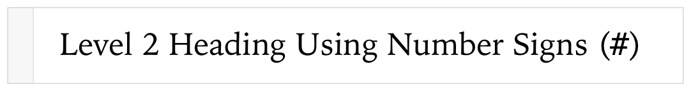
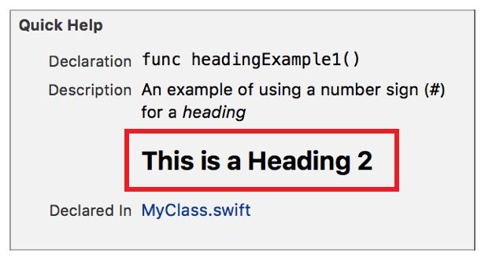
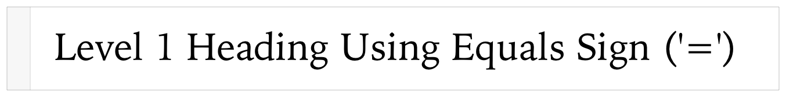
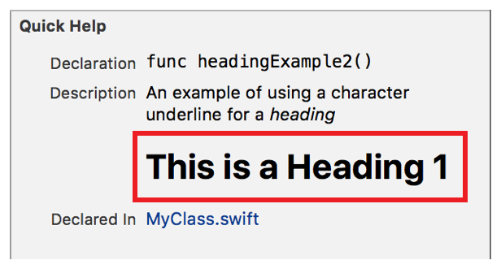

> 导航：[总目录](../../../README.md) · [documentation](../../../_indexes/documentation.md) · [Markup Formatting Reference](index.md)


## Headings

Display a line of text formatted as a heading.

Works with:

- ✓ Playgrounds
- ✓ Symbol documentation

### Syntax

Use number signs (`#`) to specify up to three levels of heading. There is at least one space between the number sign and the title string.

- ```
  # Heading 1 String
  ```
- ```
  ## Heading 2 String
  ```
- ```
  ### Heading 3 String
  ```

Alternatively, create level 1 and level 2 headings with an underline string.

- ```
  Heading 1 String
  ```
- ```
  =…
  ```

Underline heading 1 text with at least one equals sign (`=`).

- ```
  Heading 2 String
  ```
- ```
  -…
  ```

Underline heading 2 text with at least one equals sign (`–`).

### Example 1

Create a heading using a number sign.

### Playground Markup

1. `` //: ## Level 2 Heading Using Number Signs (`#`) ``



### Quick Help Markup

1. `/**`
2. `` An example of using a number sign (`#`) for a *heading* ``
4. `## This is a Heading 2`
5. `*/`



### Example 2

Create a heading using the equals sign for level 1, or the hyphen for sign for level 2. This example uses the same number of equal signs the number of characters in the heading string. Only one equals sign is required.

### Playground Markup

1. `//: Level 1 Heading Using Equals Sign ('=')`
2. `//: =`



### Quick Help Markup

1. `/**`
2. `An example of using a character underline for a *heading*`
4. `This is a Heading 1`
5. `===================`
6. `*/`



[Block Comment](ComentBlock.md#apple-f4xwc4dqnrsv64tfmyxwi33df52wszbpkridimbqge3diojxfvbuqmjqgmwvgvzr)

[Horizontal Rules](HorizontalRules.md#apple-f4xwc4dqnrsv64tfmyxwi33df52wszbpkridimbqge3diojxfvbuqmjtfvjvomi)
