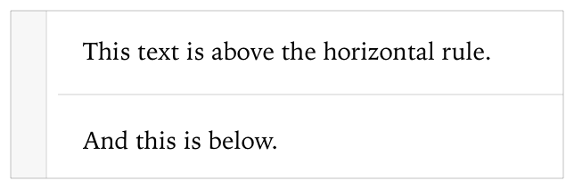
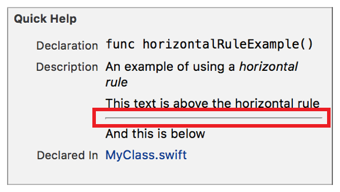

> 导航：[总目录](../../../README.md) · [documentation](../../../_indexes/documentation.md) · [Markup Formatting Reference](index.md)


## Horizontal Rules

Display a horizontal rule on the page.

Works with:

- ✓ Playgrounds
- ✓ Symbol documentation

### Syntax

Insert a horizontal rule by using three or more hyphens (`-`), asterisks (`*`), or underscores (`_`) on a line that is surrounded by empty lines. Each of the characters is the same for a horizontal rule. Whitespace between the characters is ignored.

- ```
  ---… | ***… | ___…
  ```
- ```
  ---… | ***… | ___…
  ```
- ```

  ```

### Playground Example

1. `/*:`
2. `This text is above the horizontal rule.`
3. `- - -`
4. `And this is below.`
5. `*/`



### Quick Help Example

1. `/**`
2. `An example of using a *horizontal rule*`
4. `This text is above the horizontal rule`
6. `* * * * *`
8. `And this is below`
9. `*/`



[Headings](Headings.md#apple-f4xwc4dqnrsv64tfmyxwi33df52wszbpkridimbqge3diojxfvbuqobnknltc)

[Bulleted Lists](BulletedLists.md#apple-f4xwc4dqnrsv64tfmyxwi33df52wszbpkridimbqge3diojxfvbuqojnknltc)
