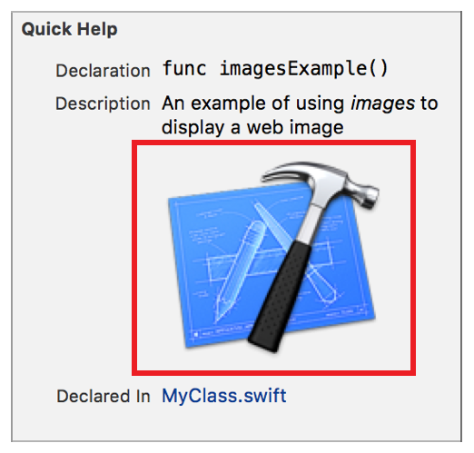

> 导航：[总目录](../../../README.md) · [documentation](../../../_indexes/documentation.md) · [Markup Formatting Reference](index.md)


## Images

Include inline images from your playground project.

Works with:

- ✓ Playgrounds
- ✓ Symbol documentation

Swift Playgrounds can only load image resources that are included in the Playground package; remote image URLs aren’t rendered. For information on adding images and other resource files to your playground, see [Add resources to a playground](http://help.apple.com/xcode/mac/current/#/dev5516dfe72) in [Xcode Help](http://help.apple.com/xcode/mac/current/).

### Syntax

- ```
  
  ```

- __Alternate text__ is displayed if the image is not loaded. Also used for accessibility.
- __URL__ is the address of the image to display.
- __Hover title__ (optional) is the text displayed when the pointer is hovering over the image. Also used for accessibility.

### Playground Image Example

A link to a playground resource with no hover text.

1. `//: `


### Quick Help Example

1. `/**`
2. `An example of using *images* to display a web image`
4. ``
6. `*/`



[Named Page](AnyPage.md#apple-f4xwc4dqnrsv64tfmyxwi33df52wszbpkridimbqge3diojxfvbuqmrsfvjvomi)

[Videos](InlineVideo.md#apple-f4xwc4dqnrsv64tfmyxwi33df52wszbpkridimbqge3diojxfvbuqojyfvjvomi)
