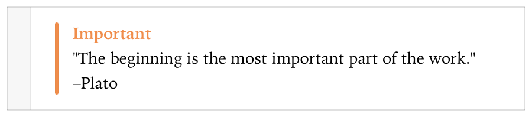
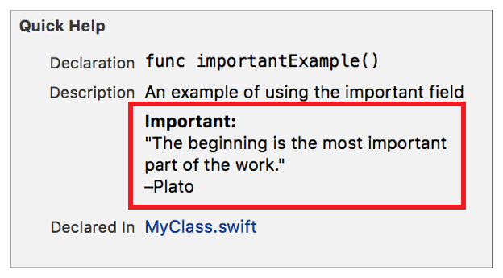

> 导航：[总目录](../../../README.md) · [documentation](../../../_indexes/documentation.md) · [Markup Formatting Reference](index.md)


## Important

Add an `Important` callout to a playground or to the Quick Help for a symbol using the Important delimiter. Multiple `Important` callouts in Quick Help appear in the description section in the same order as they do in the markup.

Use the callout to highlight information that can have adverse effects on the tasks a user is trying to accomplish.

Works with:

- ✓ Playgrounds
- ✓ Symbol documentation

### Syntax

- ```
  * | + | - Important: description
  ```
- ```
  optional continuation of description
  ```

The description displayed in Quick Help for the important callout is created as described in [Parameters Section](SymbolDocumentation.md#apple-f4xwc4dqnrsv64tfmyxwi33df52wszbpkridimbqge3diojxfvbuqnjrfvjvoni).

### Playground Example

1. `/*:`
2. `- Important:`
3. `"The beginning is the most important part of the work."`
4. `\`
5. `–Plato`
6. `*/`



### Quick Help Example

1. `/**`
2. `An example of using the important field`
4. `- Important:`
5. `"The beginning is the most important part of the work."`
6. `\`
7. `–Plato`
8. `*/`



[Experiment](Experiment.md#apple-f4xwc4dqnrsv64tfmyxwi33df52wszbpkridimbqge3diojxfvbuqmzwfvjvomi)

[Invariant](Invariant.md#apple-f4xwc4dqnrsv64tfmyxwi33df52wszbpkridimbqge3diojxfvbuqmzyfvjvomi)
