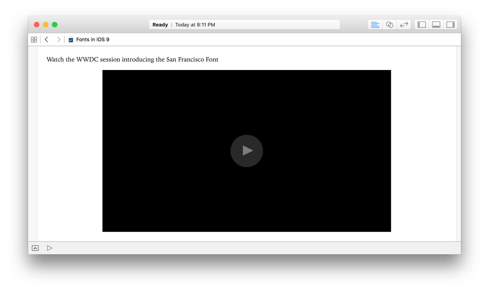
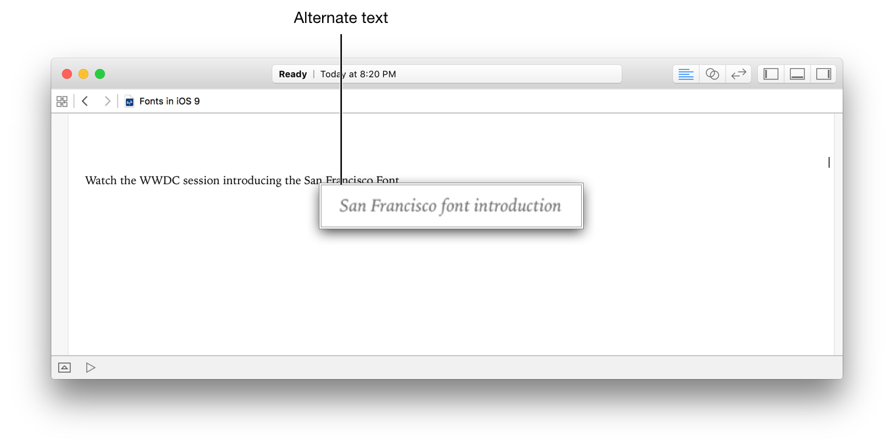
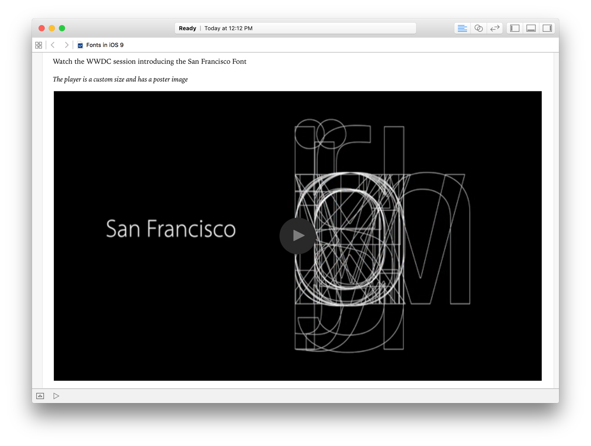

> 导航：[总目录](../../../README.md) · [documentation](../../../_indexes/documentation.md) · [Markup Formatting Reference](index.md)


## Videos

Display an inline video player for a specified file in the resources of the playground.

Swift Playgrounds can play videos at remote URLs as well as video resources that are included in the Playground package. However, any poster images must be included in the Playground package in order to be displayed. For information on adding videos and other resource files to your playground, see [Add resources to a playground](http://help.apple.com/xcode/mac/current/#/dev5516dfe72) in [Xcode Help](http://help.apple.com/xcode/mac/current/).

Works with:

- ✓ Playgrounds
- Symbol documentation

### Syntax

- ```
  
  ```

- __Alternate text__ (optional) displays when the pointer hovers over the video or if the video cannot be loaded. The text is also used for accessibility.
- __Video name__ specifies the video file in the playground resources.
- __Poster__ (optional) specifies an image file to use as the video's poster frame. If a poster image is not provided, an empty video player is shown.
- __Width__ (optional) specifies the width in points for the video player. The default value is `640` points.
- __Height__ (optional) specifies the height in points for the video player. The default value is `360` points.

> [!NOTE]
> 

### Example: Simple Inline Video Player

Display an inline video player for the file `new-fonts.mp4` and provide alternative text.

1. `//: Watch the WWDC session introducing the San Francisco Font`
2. `//: `

The following screenshot shows the inline video player defined by the markup in Example: Simple Inline Video Player:



The alternative text displays if the video file cannot be loaded, or if the video file cannot be found. For example, this screenshot changes the name of the video file to `nonexistent-file.mp4` in the markup in Example: Simple Inline Video Player:



### Example: Poster Frame and Custom Size

Display an inline video player with a custom width and height for the file `new-fonts.mp4` using the image `font-poster.png` as the poster frame.

1. `//: Watch the WWDC session introducing the San Francisco Font`
2. `//:`
3. `//: *The player is a custom size and has a poster image*`
4. `//: !`

This screenshot shows the larger inline video player with a custom poster image defined by the markup in Example: Poster Frame and Custom Size:



[Images](Images.md#apple-f4xwc4dqnrsv64tfmyxwi33df52wszbpkridimbqge3diojxfvbuqmjxfvjvomi)

[Attention](Attention.md#apple-f4xwc4dqnrsv64tfmyxwi33df52wszbpkridimbqge3diojxfvbuqmrzfvjvomi)
