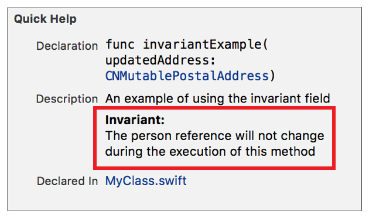

> 导航：[总目录](../../../README.md) · [documentation](../../../_indexes/documentation.md) · [Markup Formatting Reference](index.md)


## Invariant

Add an `Invariant` callout to the description of a symbol using the Invariant delimiter. Multiple `Invariant` callouts appear in the description section in the same order as they do in the markup.

Use the callout to display a condition that is guaranteed to be true during the execution of the documented symbol.

Works with:

- Playgrounds
- ✓ Symbol documentation

### Syntax

- ```
  * | + | - Invariant: description
  ```
- ```
  optional continuation of description
  ```

The description displayed in Quick Help for the invariant callout is created as described in [Parameters Section](SymbolDocumentation.md#apple-f4xwc4dqnrsv64tfmyxwi33df52wszbpkridimbqge3diojxfvbuqnjrfvjvoni).

### Example

1. `/**`
2. `An example of using the invariant field`
4. `- Invariant:`
5. `The person reference will not change during the execution of this method`
6. `*/`



[Important](Important.md#apple-f4xwc4dqnrsv64tfmyxwi33df52wszbpkridimbqge3diojxfvbuqmzxfvjvomi)

[Localization Key](LocalizationKey.md#apple-f4xwc4dqnrsv64tfmyxwi33df52wszbpkridimbqge3diojxfvbuqmjqg4wvgvzr)
