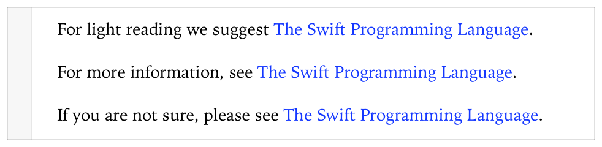
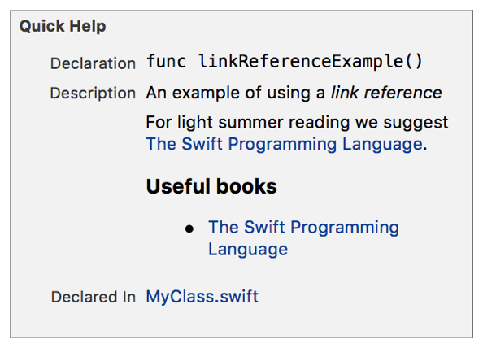

> 导航：[总目录](../../../README.md) · [documentation](../../../_indexes/documentation.md) · [Markup Formatting Reference](index.md)


## Link Reference

Add a named reference to a URL that can be used in multiple places.

Works with:

- ✓ Playgrounds
- ✓ Symbol documentation

### Syntax

- ```
  [text to display]: URL   "hover title"
  ```

The Link Reference statement sets the specified text as a reference to the specified URL with the specified hover title. The Link Reference statement is not appear in the rendered playground or in Quick Help.

- __Text to display__ is the text to display in the comment.
- __URL__ is the address to open when the link in the comment is clicked.
- __Hover title__ (optional) is the text displayed in a playground when the pointer is hovering over the image. It is also used for accessibility.

> [!NOTE]
> 

### Playground Example

1. `/*: Setup and use a link reference.`
2. `[The Swift Programming Language]: http://developer.apple.com/library/ios/documentation/Swift/Conceptual/Swift_Programming_Language/ "Some hover text"`
4. `For light reading we suggest [The Swift Programming Language].`
6. `For more information, see [The Swift Programming Language].`
8. `If you are not sure, please see [The Swift Programming Language].`
9. `*/`



### Quick Help Example

1. `/**`
2. `An example of using a *link reference*`
4. `[The Swift Programming Language]: http://developer.apple.com/library/ios/documentation/Swift/Conceptual/Swift_Programming_Language/ "Some hover text"`
6. `For light summer reading we suggest [The Swift Programming Language].`
8. `### Useful books`
9. `* [The Swift Programming Language]`
10. `*/`



[Links](Links.md#apple-f4xwc4dqnrsv64tfmyxwi33df52wszbpkridimbqge3diojxfvbuqmjyfvjvomi)

[Next Page](NextPage.md#apple-f4xwc4dqnrsv64tfmyxwi33df52wszbpkridimbqge3diojxfvbuqmrqfvjvomi)
