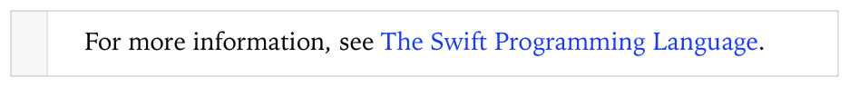

> 导航：[总目录](../../../README.md) · [documentation](../../../_indexes/documentation.md) · [Markup Formatting Reference](index.md)


## Links

Add a link to a text-based resource such as a web URL or email.

Works with:

- ✓ Playgrounds
- ✓ Symbol documentation

### Syntax

- ```
  [text to display](URL)
  ```

- __Text to display__ is the text to display in the comment. It is also used for accessiblity.
- __URL__ is the address to open when the link in the comment is clicked.

### Playground Example

1. `/*:`
2. `For more information, see [The Swift Programming Language.](http://developer.apple.com/library/ios/documentation/Swift/Conceptual/Swift_Programming_Language/)`
3. `*/`



### Quick Help Example

1. `/**`
2. `An example of using the seealso field`
4. `- seealso:`
5. [The Swift Standard Library Reference](https://developer.apple.com/library/prerelease/ios//documentation/General/Reference/SwiftStandardLibraryReference/index.html)
6. `*/`


### See Also

[Link Reference](LinkReference.md#apple-f4xwc4dqnrsv64tfmyxwi33df52wszbpkridimbqge3diojxfvbuqnjwfvjvomi)

[Strong (Bold)](Strong%28Bold%29.md#apple-f4xwc4dqnrsv64tfmyxwi33df52wszbpkridimbqge3diojxfvbuqmjvfvjvomi)

[Link Reference](LinkReference.md#apple-f4xwc4dqnrsv64tfmyxwi33df52wszbpkridimbqge3diojxfvbuqnjwfvjvomi)
