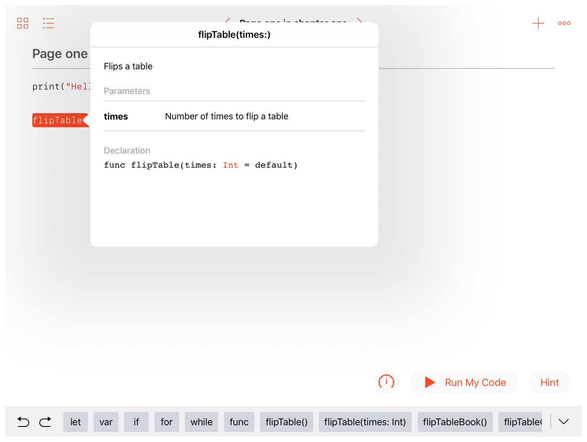
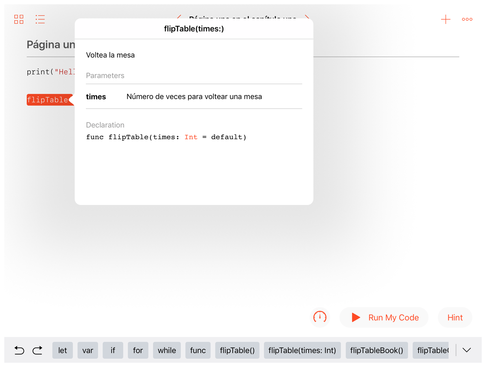

> 导航：[总目录](../../../README.md) · [documentation](../../../_indexes/documentation.md) · [Markup Formatting Reference](index.md)


## Localization Key

Add a `LocalizationKey` callout to allow Quick Help content in playgrounds to adapt to different languages.

Works with:

- ✓ Playgrounds
- Symbol documentation

### Syntax

- ```
  * | + | - LocalizationKey: symbol-localization-key
  ```

> [!NOTE]
> 

A `LocalizationKey` callout provides a unique identifier that maps to a corresponding key-value pair in the localized string resource. At runtime, the Quick Help content for the symbol is replaced by the value for this key in the localized string resource. If the localized string resource for a language doesn’t provide a corresponding key-value pair, the unlocalized content is used.

### Requirements

To enable Quick Help localization in a playground, provide a `QuickHelp.strings` file for each supported locale in the `PrivateResources` directory of the containing page, chapter, or book.

The `QuickHelp.strings` can be either a “plain text” strings file, or a property list.

A “plain text” strings file contains list of key-value pairs along with optional comments describing the purpose of each key-value pair. Key and value strings are separated by an equal sign (`=`), and the entire entry must be terminated with a semicolon character (`;`). By convention, comments are enclosed inside C-style comment delimiters (`/*` and `*/`) and are placed immediately before the entry they describe.

- ```
  /* Comment for translation */
  ```
- ```
  "Key"="Value";
  ```

A property list strings file contains a top-level dictionary containing keys with string values.

- ```
  <?xml version="1.0" encoding="UTF-8"?>
  ```
- ```
  <!DOCTYPE plist PUBLIC "-//Apple//DTD PLIST 1.0//EN" "http://www.apple.com/DTDs/PropertyList-1.0.dtd">
  ```
- ```
  <plist version="1.0">
  ```
- ```
  <dict>
  ```
- ```
  <key>Key</key>
  ```
- ```
  <string>Value</string>
  ```
- ```
  </dict>
  ```
- ```
  </plist>
  ```

For more information, see [String Resources](https://developer.apple.com/library/archive/documentation/Cocoa/Conceptual/LoadingResources/Strings/Strings.html#//apple_ref/doc/uid/10000051i-CH6) in _[Resource Programming Guide](../../Cocoa/Resource%20Programming%20Guide/About%20Resources.md#apple-f4xwc4dqnrsv64tfmyxwi33df52wszbpgeydambqga2tc2i)_.

### Playground Example

1. `/**`
2. `Flips a table`
3. `- Parameter times: Number of times to flip a table`
4. `- LocalizationKey: my-playground-flip-table`
5. `*/`
6. `func flipTable(times: Int = 1) {`
7. `let minTimes = max(times, 1)`
8. `for _ in 0 ..< minTimes {`
9. `print("(╯°□°)╯( ┻━┻") }`
10. `}`
11. `}`

__Listing 35-1__BookName.playgroundbook/PrivateResources/es.lproj/QuickHelp.strings

1. `<?xml version="1.0" encoding="UTF-8"?>`
2. `<!DOCTYPE plist PUBLIC "-//Apple//DTD PLIST 1.0//EN" "http://www.apple.com/DTDs/PropertyList-1.0.dtd">`
3. `<plist version="1.0">`
4. `<dict>`
5. `<key>my-playground-flip-table</key>`
6. `<string>Voltea la mesa`
7. `- Parameter times: Número de veces para voltear una mesa`
8. `</string>`
9. `</dict>`
10. `</plist>`

When Quick Help is consulted on a device set to a English-speaking locale, the original content is presented.



When Quick Help is consulted on a device set to a Spanish-speaking locale, the localized content is presented.



[Invariant](Invariant.md#apple-f4xwc4dqnrsv64tfmyxwi33df52wszbpkridimbqge3diojxfvbuqmzyfvjvomi)

[Note](Note.md#apple-f4xwc4dqnrsv64tfmyxwi33df52wszbpkridimbqge3diojxfvbuqmzzfvjvomi)
