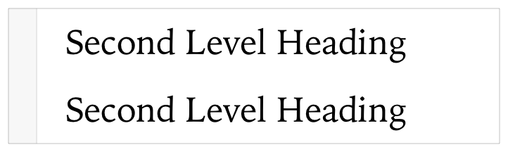
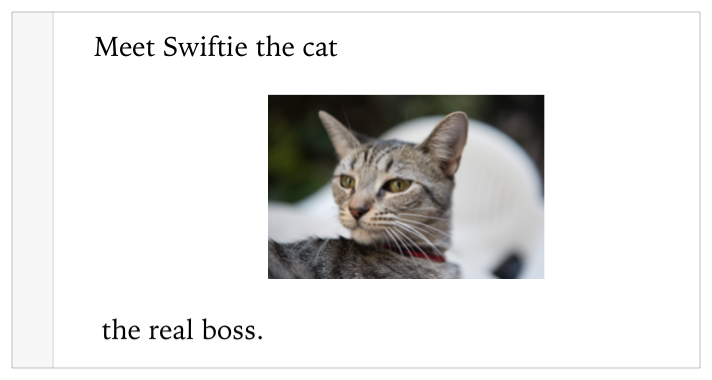
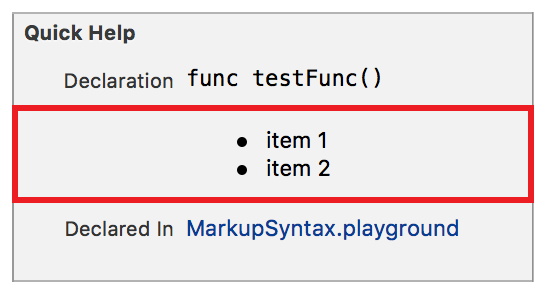
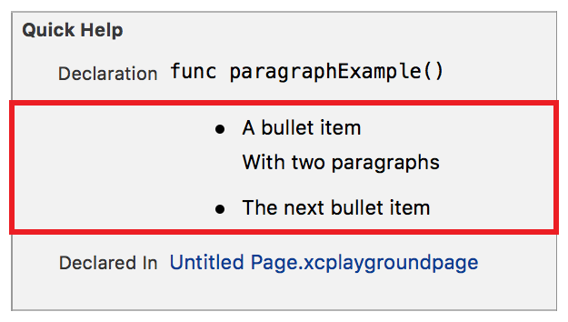
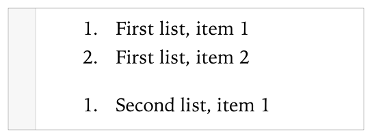
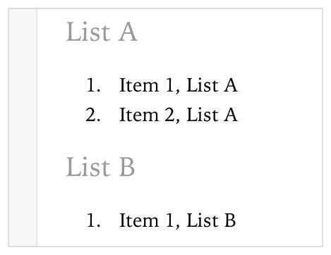
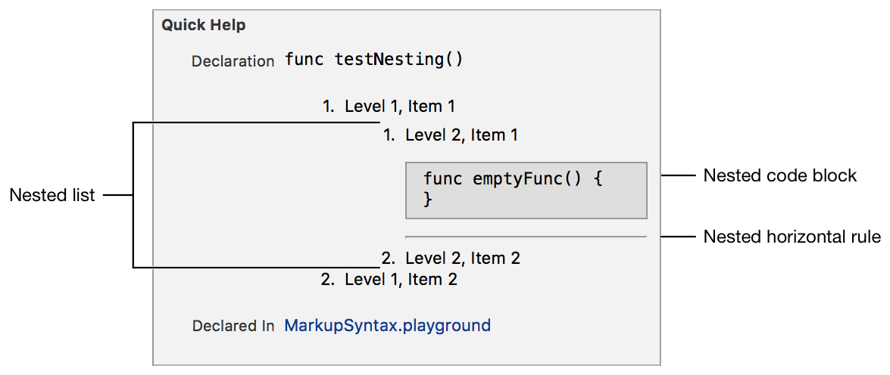
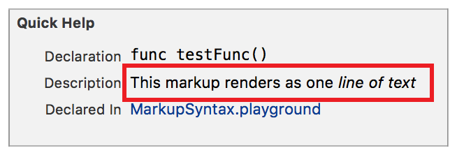
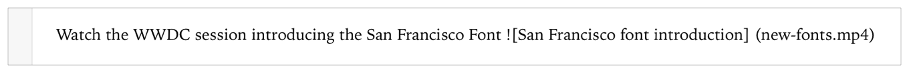

> 导航：[总目录](../../../README.md) · [documentation](../../../_indexes/documentation.md) · [Markup Formatting Reference](index.md)


## Markup Syntax

Markup uses simple Markdown-like character delimiter syntax with custom extensions. There are four types of elements:

- __Single line__ elements format a line of text such as creating a heading.
- __Multiline__ elements format multiple lines of text such as creating lists or callouts.
- __Span__ elements format a span of characters such as adding emphasis.
- __Link__ elements add text based links such as a `mailto`, or inline assets such as images.

### Single Line Elements

Single line elements use an opening delimiter, followed by at least one space and then the content.

- ```
  optional spacesdelimiter …content
  ```

Single line elements follow these rules:

- The delimiter is the first non-whitespace character on the line.
- There is at least one space between the delimiter and the content.
- Extra whitespace between the delimiter and content is ignored.
- The delimiter and all of the content are be terminated by a newlin.

For example, both of the following lines of markup render as the same second level heading as shown in Figure 4-1.

1. `//: ## Second Level Heading`
2. `//:   ##    Second Level Heading`

__Figure 4-1__Headings ignoring whitespace


> [!NOTE]
> 

### Link Elements

Link elements define a link name and a link target. The link name is entered between an opening square bracket (`[`) and a closing square bracket (`]`). Asset links start with an exclamation mark (`!`) before the opening square bracket. The target specification for the link element is usually between an opening parentheses (`(`) and a closing parentheses (`)`). [Link Reference](LinkReference.md#apple-f4xwc4dqnrsv64tfmyxwi33df52wszbpkridimbqge3diojxfvbuqnjwfvjvomi) delimiters use a colon (:) followed by the target specification instead of parentheses.

- ```
  optional link type character[link name](link target  link target options)
  ```

Link elements follow these rules:

- The link element can appear anywhere on a line.
- The delimiter and all of the content is on one line terminated by a newline.

### Example: A URL Link

The following markup renders as a link to `swift.org`. The link shows as clickable blue text in the rendered documentation, as shown in Figure 4-2.

1. `//: Find more information for [Swift](http://swift.org)`

__Figure 4-2__A text link


### Example: An Inline Image

This markup renders the image content of the link centered on the line after the word `cat`. The rest of the content is rendered on a line following the image as shown in Figure 4-3.

1. `//: Meet Swiftie the cat  the real boss.`

__Figure 4-3__An asset link


### Multiline Elements

Multiline elements such as lists and callouts use an opening delimiter, followed by at least one space and then the content. The block of content continues until meeting a termination condition.

- ```
  delimiter …line 1 content
  ```
- ```
  optional continuation of line 1
  ```
- ```
  optional newline
  ```
- ```
  optional content
  ```
- ```
      …
  ```
- ```
  termination condition
  ```

Multiline elements follow these rules:

- The delimiter is the first non-whitespace character on the line.
- There is at least one space between the delimiter and the content.
- Extra whitespace between the delimiter and content is ignored.
- A single newline followed by text wraps the text to the previous line.
- A single empty line followed by text inserts the text as a new paragraph.

The delimiter formats all text until one of the following termination conditions:

- Two or more consecutive empty lines
- A different line or multiline delimiter at the same level of nesting.

### Nesting Delimiters

The nesting level of a multiline element increases for each set of four spaces or each tab preceding the opening delimiter.

Use nesting to:

- Increase the indent level of a list
- Add nested single line elements such as headings or horizontal rules
- Add a [Code Block](CodeBlocks.md#apple-f4xwc4dqnrsv64tfmyxwi33df52wszbpkridimbqge3diojxfvbuqmjsfvjvomi)

To add contiguous lines of nesting, add the same number of initial spaces or tabs on each line that starts with a delimiter. Empty lines do not need to be indented.

### Example: A Simple Bulleted List

The following markup renders in Quick Help as a bulleted list with two items as shown in Figure 4-4.

1. `/**`
2. `* item 1`
3. `* item 2`
4. `*/`

__Figure 4-4__Simple bulleted list


### Example: Text Wrapping

The markup below renders as a single numbered list item as shown in Figure 4-5.

1. `/*:`
2. `1. This renders as`
3. `one line in`
4. `a numbered list`
5. `*/`

__Figure 4-5__Wrapping in a multiline element


### Example: Inserting a Paragraph

This markup renders Line 4 as the second paragraph in the first bullet point as shown in Figure 4-6. The content for every paragraph is indented to the same level as the containing delimiter.

1. `/**`
2. `* A bullet item`
4. `With two paragraphs`
6. `* The next bullet item`
7. `*/`

__Figure 4-6__Inserting a paragraph


### Example: Terminating a Callout Using Two Empty Lines

The markup below renders as two different lists as shown in Figure 4-7. The first list is terminated by the two consecutive empty lines on lines 4 and 5 of the markup.

1. `/*:`
2. `1. First list, item 1`
3. `1. First list, item 2`

6. `1. Second list, item 1`
7. `*/`

__Figure 4-7__Termination with empty lines


### Example: Terminating a List with a Different Delimiter

This markup renders as two different lists, each with its own heading as shown in Figure 4-8. The heading delimiter on line 5 terminates the first list.

1. `/*:`
2. `### List A`
3. `1. Item 1, List A`
4. `1. Item 2, List A`
5. `### List B`
6. `1. Item 1, List B`
7. `*/`

__Figure 4-8__Termination with a different delimiter


### Example: Nesting Delimiters

This markup contains three kinds of nesting as seen in Figure 4-9.

1. The nested list is a result of adding four spaces before the delimiters for each list item on lines 3 and 8.
2. The nested code block is a result of indenting lines 5 and 6 by twelve spaces, or two levels of indentation from the enclosing delimiter.
3. The nested horizontal rule is a result of indenting line 7 by eight spaces or one level of indentation from the enclosing delimiter. For more information on code blocks, see [Code Block](CodeBlocks.md#apple-f4xwc4dqnrsv64tfmyxwi33df52wszbpkridimbqge3diojxfvbuqmjsfvjvomi).

1. `/**`
2. `1. Level 1, Item 1`
3. `1. Level 2, Item 1`
5. `func emptyFunc() {`
6. `}`
7. `- - -`
8. `1. Level 2, Item 2`
9. `1. Level 1, Item 2`
10. `*/`

__Figure 4-9__Nesting


### Span Elements

Span elements use the same delimiter at the start and end of the character span.

- ```
  opening delimitercontentclosing delimiter
  ```

Span elements follow these rules:

- The opening delimiter can appear anywhere on a line.
- There is no space between the opening delimiter and the first character of the span.
- There is no space between the first character and the closing delimiter of the span.
- A single newline in the middle of a span is ignored and the text is wrapped to the first line.
- Span elements can be combined.

### Example: Ignoring Whitespace

The following markup results in one line of text as shown in Figure 4-10.

1. `/// This markup renders as one *line`
2. `/// of text*`

__Figure 4-10__Wrapping in a span element


### Example: Combining Elements

This markup shows adding the delimiters for a span of bold characters inside the delimiters for a span with emphasis. The rendered result adds both emphasis and bold to `inside other` as seen in Figure 4-11.

1. `//: Span elements *nest **inside other** span* elements`

__Figure 4-11__Combining span elements


### Ignoring Single Newlines

Single newlines inside most line and text formatting delimiters are ignored as is whitespace at the end of a line.

For example, the following code ignores the newline at the end of Line 1, resulting in a single line of text with the words _on one line_ rendered using the emphasis style. Adding whitespace at the end of the first line does not add spaces between the words _on_ and _one_.

1. `//: This will all render *on`
2. `//: one line*`

### Exception: Links

Markup for textual links and media assets is on a single line of text that ends in a newline. The delimiter and arguments are treated as plain text if they span multiple lines.

Delimiters for textual links begin with an open square bracket (`[`). Delimiters for media assets begin with an exclamation mark followed by an open square bracket (`![`).

For example, in the markup below the delimiter and arguments for specifying an inline video player span lines `2` and `3`. All three lines are treated as plain text and wrapped together into one rendered line of text as shown in Figure 4-12.

1. `//: Watch the WWDC session introducing the San Francisco Font`
2. `//: ![San Francisco font introduction]`
3. `//: (new-fonts.mp4)`

__Figure 4-12__Links don't wrap


Combining all the lines into one line shows the video player.

[Adding Markup to Files](AddingMarkup.md#apple-f4xwc4dqnrsv64tfmyxwi33df52wszbpkridimbqge3diojxfvbuqmjqgawvgvzr)

[Formatting Quick Help](SymbolDocumentation.md#apple-f4xwc4dqnrsv64tfmyxwi33df52wszbpkridimbqge3diojxfvbuqnjrfvjvomi)
