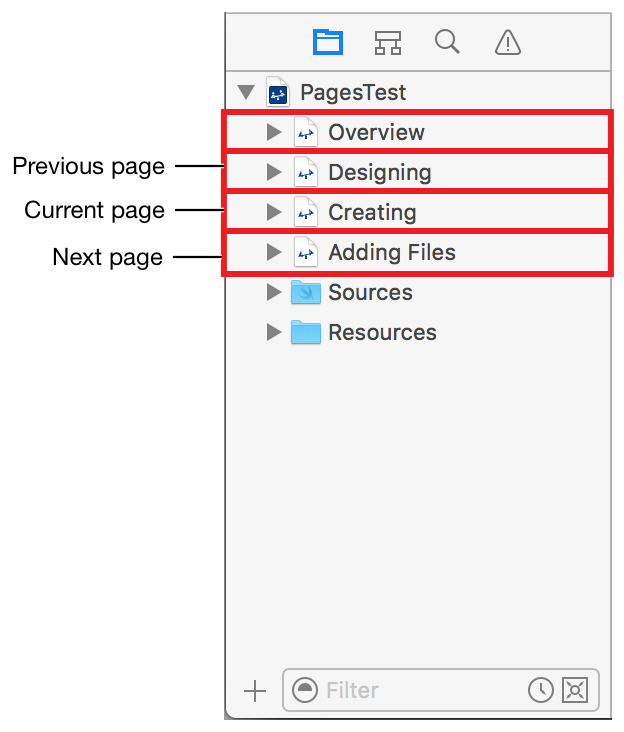

> 导航：[总目录](../../../README.md) · [documentation](../../../_indexes/documentation.md) · [Markup Formatting Reference](index.md)


## Next Page

Open the next page in the playground.

The next page is the playground page in the Xcode project navigator that is below the page containing the link. No page is opened if the link is in the last page.

For example, in the screenshot If `Creating.playground` is the playground page containing the link, then `Adding Files.playground` is the next page. `Overview.playground` is the first page and `Adding Files.playground` is the last page.



Works with:

- ✓ Playgrounds
- Symbol documentation

### Syntax

- ```
  [link name](@next)
  ```

### Example

1. `//: [Next Topic](@next)`


[Link Reference](LinkReference.md#apple-f4xwc4dqnrsv64tfmyxwi33df52wszbpkridimbqge3diojxfvbuqnjwfvjvomi)

[Previous Page](PreviousPage.md#apple-f4xwc4dqnrsv64tfmyxwi33df52wszbpkridimbqge3diojxfvbuqmrrfvjvomi)
