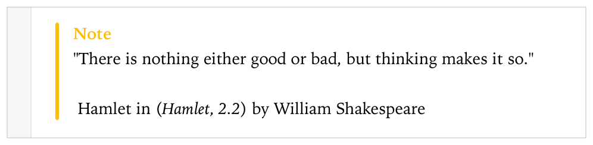
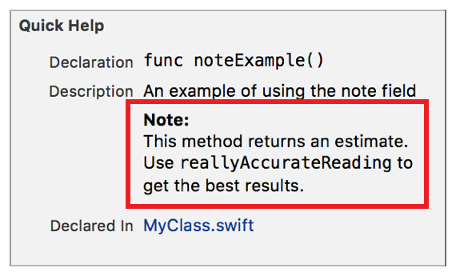

> 导航：[总目录](../../../README.md) · [documentation](../../../_indexes/documentation.md) · [Markup Formatting Reference](index.md)


## Note

Add a `Note` callout to a playground or to the Quick Help for a symbol using the Note delimiter. Multiple `Note` callouts in Quick Help appear in the description section in the same order as they do in the markup.

Works with:

- ✓ Playgrounds
- ✓ Symbol documentation

### Syntax

- ```
  * | + | - Note: description
  ```
- ```
  optional continuation of description
  ```

The description displayed in Quick Help for the note callout is created as described in [Parameters Section](SymbolDocumentation.md#apple-f4xwc4dqnrsv64tfmyxwi33df52wszbpkridimbqge3diojxfvbuqnjrfvjvoni).

### Playground Example

1. `/*:`
2. `- Note:`
3. `"There is nothing either good or bad, but thinking makes it so."`
4. `\`
5. `\`
6. `Hamlet in (*Hamlet, 2.2*) by William Shakespeare`
7. `*/`



### Quick Help Example

1. `/**`
2. `An example of using the note field`
4. `- Note:`
5. `This method returns an estimate.`
6. `` Use `reallyAccurateReading` to get the best results. ``
7. `*/`



[Localization Key](LocalizationKey.md#apple-f4xwc4dqnrsv64tfmyxwi33df52wszbpkridimbqge3diojxfvbuqmjqg4wvgvzr)

[Parameter](Parameter.md#apple-f4xwc4dqnrsv64tfmyxwi33df52wszbpkridimbqge3diojxfvbuqmryfvjvomi)
