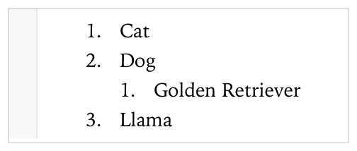
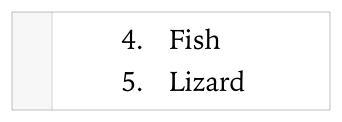
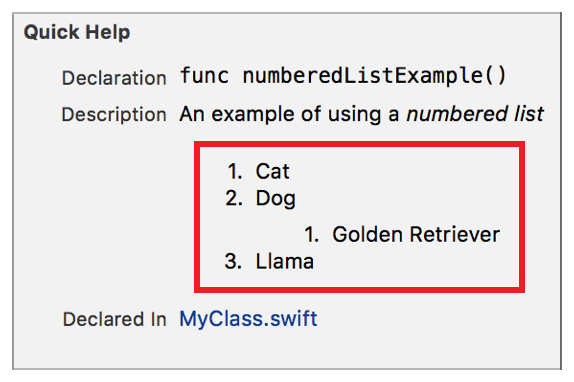

> 导航：[总目录](../../../README.md) · [documentation](../../../_indexes/documentation.md) · [Markup Formatting Reference](index.md)


## Numbered Lists

Display text in a numbered list.

> [!NOTE]
> 

### Syntax

Each item in a numbered list starts with one or more spaces, an integer followed by a period (`.`), and then the desired text. There is at least one space between the period and the item string.

The number of spaces before an item delimiter indicates the list level of the item. All first level items start with up to three spaces. Add four spaces or one tab for each additional level, to a maximum of three levels. For more information, see [Nesting Delimiters](MarkupSyntax.md#apple-f4xwc4dqnrsv64tfmyxwi33df52wszbpkridimbqge3diojxfvbuqmjqguwvgvzsgu).

The first item in a numbered list displays the number one (`1`), the second item displays the number two (2), and so on. It does not matter what number is used in the markup.

List content separated by a single empty line renders as a paragraph. For more information, see [Multiline Elements](MarkupSyntax.md#apple-f4xwc4dqnrsv64tfmyxwi33df52wszbpkridimbqge3diojxfvbuqmjqguwvgvzrga).

> [!NOTE]
> 

- ```
  integer. string
  ```
- ```
      integer. string
  ```
- ```
          integer. string
  ```

### Playground Numbered List

This markup creates a nested numbered list. The top level has three items. The numbers used in the markup numbered list delimiter do not matter except for the first item in a playground numbered list. For example, the markup for Dog uses a delimiter of `3.`, but the rendered number in the list is 2.

1. `/*:`
2. `1. Cat`
3. `3. Dog`
4. `1. Golden Retriever`
5. `2. Llama`
6. `*/`



### Changing the Starting Number

In line 2 of this markup, the number `4` is used for the delimiter of the first item of the numbered list. This changes the initial number for the rendered list as shown in the screenshot.

1. `/*:`
2. `4. Fish`
3. `5. Lizard`
4. `*/`



### Quick Help Numbered List

1. `/**`
2. `An example of using a *numbered list*`
4. `1. Cat`
5. `2. Dog`
6. `1. Golden Retriever`
7. `3. Llama`
8. `*/`



[Bulleted Lists](BulletedLists.md#apple-f4xwc4dqnrsv64tfmyxwi33df52wszbpkridimbqge3diojxfvbuqojnknltc)

[Code Block](CodeBlocks.md#apple-f4xwc4dqnrsv64tfmyxwi33df52wszbpkridimbqge3diojxfvbuqmjsfvjvomi)
