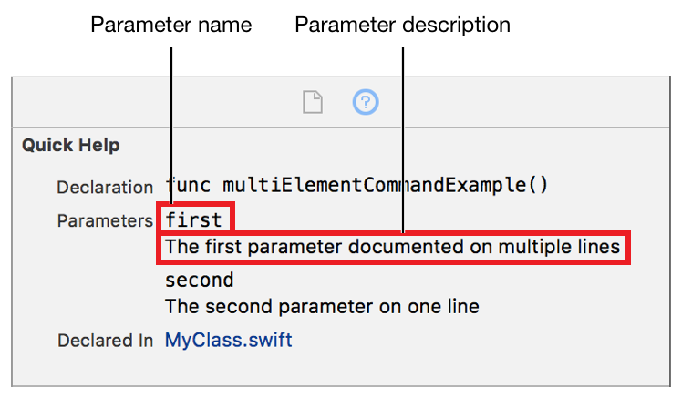
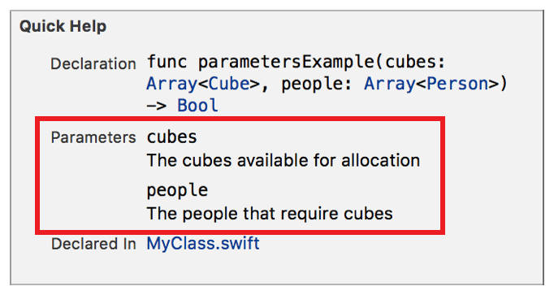

> 导航：[总目录](../../../README.md) · [documentation](../../../_indexes/documentation.md) · [Markup Formatting Reference](index.md)


## Parameters

Add a list of parameter names and descriptions to the `Parameters` section of Quick Help for a symbol. The order of the parameters in Quick Help is the same as the order they appear in the delimiter. Multiple Parameters delimiters are added to Quick Help in the order that they appear in the markup.

The `Parameters` section is only added to Quick Help if there is at least one Parameters or [Parameter](Parameter.md#apple-f4xwc4dqnrsv64tfmyxwi33df52wszbpkridimbqge3diojxfvbuqmryfvjvomi) delimiter in the markup for a symbol. The section contains entries for all the Parameters delimiters followed by entries for all the Parameter delimiters.

Works with:

- Playgrounds
- ✓ Symbol documentation

### Syntax

- ```
  * | + | - Parameters:
  ```
- ```
    * | + | - parameter name: description
  ```
- ```
      optional continuation of description
  ```
- ```
    * | + | - parameter name: description
  ```
- ```
      optional continuation of description
  ```
- ```
    …
  ```

The asterisk (`*`), plus sign (`+`), or hyphen (`-`) for each parameter name is indented 3 to 6 spaces from the first character of the Parameters delimiter. All the parameter names are indented to the same level.

`<parameter name>` is used for the parameter name in Quick Help. The description for a parameter is created as described in [Parameters Section](SymbolDocumentation.md#apple-f4xwc4dqnrsv64tfmyxwi33df52wszbpkridimbqge3diojxfvbuqnjrfvjvoni) of [Formatting Quick Help](SymbolDocumentation.md#apple-f4xwc4dqnrsv64tfmyxwi33df52wszbpkridimbqge3diojxfvbuqnjrfvjvomi).



### Example

1. `/**`
2. `- Parameters:`
3. `- cubes: The cubes available for allocation`
4. `- people: The people that require cubes`
5. `*/`



### Alternative

Use the [Parameter](Parameter.md#apple-f4xwc4dqnrsv64tfmyxwi33df52wszbpkridimbqge3diojxfvbuqmryfvjvomi) delimiter to add a single parameter.

[Parameter](Parameter.md#apple-f4xwc4dqnrsv64tfmyxwi33df52wszbpkridimbqge3diojxfvbuqmryfvjvomi)

[Postcondition](Postcondition.md#apple-f4xwc4dqnrsv64tfmyxwi33df52wszbpkridimbqge3diojxfvbuqnbqfvjvomi)
